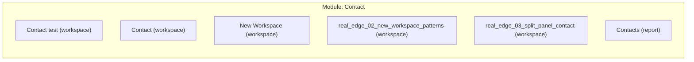
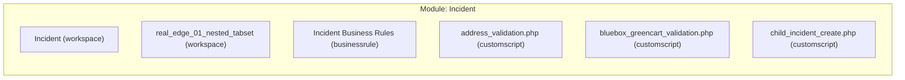
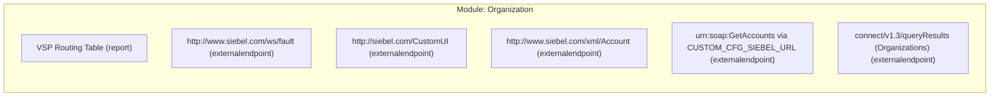

# Complete System Architecture & Component Mapping
**Generated**: 2026-08-07 13:05:16  
**Source Data Path**: `input`  

## Executive System Summary & Risk Overview

> [!NOTE]
> **System Mapping Overview**: Structured inventory of all parsed Oracle Service Cloud workspaces, analytics reports, CPM procedures, business rules, custom scripts, and external REST/SOAP integration endpoints.

| Component Category | Total Discovered Count | Status |
| :--- | :---: | :--- |
| Workspaces | 7 | Parsed & Mapped |
| Analytics Reports | 18 | Parsed & Mapped |
| Business Rules Sets | 1 (1207 Rules) | Parsed & Policy Mapped |
| CPM Procedures & Handlers | 8 | Parsed & Event Mapped |
| PHP Custom Scripts | 13 | Analyzed |
| BUI Add-Ins | 2 | Archive Extracted |
| Custom Objects & Entities | 6 | Schema Mapped |
| External Integration Endpoints | 17 | Endpoint Extracted |
| Orphaned Components | 8 | Audit Flagged |

> [!WARNING]
> **19 Unhandled Schema Element(s) Captured**: Raw XML elements/attributes present in source export were preserved via universal fallback handling.

| Component | Tag | Raw Snippet / Value |
|---|---|---|
| `Contact test` | `<Triggers>` | `<Triggers xmlns:dbaudit="http://www.rightnow.com/schemas/dbaudit"><Trigger Type="EditorLoaded"/></Tr` |
| `Contact test` | `<Triggers>` | `<Triggers xmlns:dbaudit="http://www.rightnow.com/schemas/dbaudit"><Trigger Type="EditorLoaded"/></Tr` |
| `Contact test` | `<Triggers>` | `<Triggers xmlns:dbaudit="http://www.rightnow.com/schemas/dbaudit"><Trigger Type="EditorLoaded"/></Tr` |
| `Contact test` | `<attr:LayoutLabelAlignment>` | `Right` |
| `Contact test` | `<attr:LayoutLabelPosition>` | `Left` |
| `Contact test` | `<attr:ReadOnlyOption>` | `OnNew:~any~;OnEdit:~any~` |
| `Contact test` | `<attr:DisableEmailIcon>` | `True` |
| `Contact test` | `<attr:HideReportCommands>` | `True` |
| `Contact test` | `<attr:Anchor>` | `Top, Left` |
| `Contact test` | `<attr:AutoSize>` | `False` |
| `Contact` | `<Triggers>` | `<Triggers xmlns:dbaudit="http://www.rightnow.com/schemas/dbaudit">                 <Trigger Type="Ed` |
| `Incident` | `<Triggers>` | `<Triggers xmlns:dbaudit="http://www.rightnow.com/schemas/dbaudit"><Trigger Type="EditorLoaded"/></Tr` |
| `Incident` | `<Triggers>` | `<Triggers xmlns:dbaudit="http://www.rightnow.com/schemas/dbaudit"><Trigger Type="EditorLoaded"/></Tr` |
| `Incident` | `<attr:CanUseStandardText>` | `True` |
| `real_edge_01_nested_tabset` | `<Triggers>` | `<Triggers xmlns:dbaudit="http://www.rightnow.com/schemas/dbaudit">                 <Trigger Type="Ed` |
| `real_edge_01_nested_tabset` | `<Triggers>` | `<Triggers xmlns:dbaudit="http://www.rightnow.com/schemas/dbaudit">                 <Trigger Type="Ed` |
| `real_edge_01_nested_tabset` | `<attr:CanUseStandardText>` | `True` |
| `real_edge_02_new_workspace_patterns` | `<Triggers>` | `<Triggers xmlns:dbaudit="http://www.rightnow.com/schemas/dbaudit">                 <Trigger Type="Ed` |
| `real_edge_03_split_panel_contact` | `<Triggers>` | `<Triggers xmlns:dbaudit="http://www.rightnow.com/schemas/dbaudit">                 <Trigger Type="Ed` |

> [!WARNING]
> **8 Orphaned Component(s) Flagged**: Custom scripts or components exist in dataset with zero active workspace or CPM bindings.

> [!IMPORTANT]
> **17 External HTTP Integration Endpoints Detected**: Outbound web calls to external REST/SOAP servers require security verification.

> [!TIP]
> **Optimization Recommendation**: Review orphaned scripts to reclaim workspace performance and audit outbound endpoints for TLS verification.

## Audit-Critical Orphaned Components

| Component Name / ID | Type | Associated Object | Linkage Count | Audit Risk Flag & Reason |
| :--- | :--- | :--- | :---: | :--- |
| `address_validation.php` | `CustomScript` | **General** | `0 in, 0 out` | `Not imported or called by any Workspace Rule, BUI Add-In, CPM, or Custom Script` |
| `bluebox_greencart_validation.php` | `CustomScript` | **General** | `0 in, 0 out` | `Not imported or called by any Workspace Rule, BUI Add-In, CPM, or Custom Script` |
| `callcheck.php` | `CustomScript` | **General** | `0 in, 0 out` | `Not imported or called by any Workspace Rule, BUI Add-In, CPM, or Custom Script` |
| `closing_notes.php` | `CustomScript` | **General** | `0 in, 0 out` | `Not imported or called by any Workspace Rule, BUI Add-In, CPM, or Custom Script` |
| `duplicate_contacts.php` | `CustomScript` | **General** | `0 in, 0 out` | `Not imported or called by any Workspace Rule, BUI Add-In, CPM, or Custom Script` |
| `duplicate_incidents.php` | `CustomScript` | **General** | `0 in, 0 out` | `Not imported or called by any Workspace Rule, BUI Add-In, CPM, or Custom Script` |
| `eventclock.php` | `CustomScript` | **General** | `0 in, 0 out` | `Not imported or called by any Workspace Rule, BUI Add-In, CPM, or Custom Script` |
| `sms_integration 1.php` | `CustomScript` | **General** | `0 in, 0 out` | `Not imported or called by any Workspace Rule, BUI Add-In, CPM, or Custom Script` |

## Consolidated Entity Module Inventory

### Entity Module: Contact (24 Mapped Components)

#### Module Flowchart: Contact

| Component ID / Name | Type | Dependencies (In -> Out) | Details & Execution Context |
| :--- | :--- | :---: | :--- |
| `Contact` | `object` | `0 in -> 49 out` | Primary OSVC Entity Module Schema Root |
| `Contact` | `workspace` | `2 in -> 4 out` | Bound Object: `Contact` | 9 fields, 5 tabs, 1 rules |
| `Contact test` | `workspace` | `3 in -> 8 out` | Bound Object: `Contact` | 0 fields, 6 tabs, 3 rules |
| `New Workspace` | `workspace` | `1 in -> 6 out` | Bound Object: `Contact` | 0 fields, 5 tabs, 0 rules |
| `real_edge_02_new_workspace_patterns` | `workspace` | `1 in -> 6 out` | Bound Object: `Contact` | 0 fields, 5 tabs, 1 rules |
| `real_edge_03_split_panel_contact` | `workspace` | `3 in -> 4 out` | Bound Object: `Contact` | 9 fields, 5 tabs, 1 rules |
| `Contacts` | `report` | `3 in -> 0 out` | Report AC_ID: `100008` | 13 columns, 0 tables joined |
| `contact_create` | `cpm` | `4 in -> 0 out` | Trigger: `Create` | Synchronous Execution | Entry: `ObjectProcedure::apply` |
| `contact_create_internal` | `cpm` | `5 in -> 0 out` | Trigger: `Create` | Synchronous Execution | Entry: `ObjectProcedure::apply` |
| `contact_update` | `cpm` | `5 in -> 0 out` | Trigger: `Update` | Synchronous Execution | Entry: `ObjectProcedure::apply` |
| `contact_update_internal` | `cpm` | `7 in -> 0 out` | Trigger: `Update` | Synchronous Execution | Entry: `ObjectProcedure::apply` |
| `ContactAsync` | `asynccpm` | `3 in -> 1 out` | Trigger: `Update` | Async Execution | Entry: `ObjectProcedure::apply` |
| `callcheck.php` | `customscript` | `0 in -> 0 out` | PHP Script: `callcheck.php` | 0 functions |
| `cityworksapicall.php` | `customscript` | `0 in -> 1 out` | PHP Script: `cityworksapicall.php` | 0 functions |
| `duplicate_contacts.php` | `customscript` | `3 in -> 0 out` | PHP Script: `duplicate_contacts.php` | 0 functions |
| `sms_integration 1.php` | `customscript` | `0 in -> 0 out` | PHP Script: `sms_integration 1.php` | 0 functions |
| `ContactOrgLookupBUIAddin` | `buiaddin` | `4 in -> 12 out` | BUI Extension: `ContactOrgLookupBUIAddin` | Entry: `init.html` | Reads: 10, Writes: 4 |
| `Contact.first_name` | `workspacefield` | `3 in -> 0 out` | Standard Field | Data Type: `Data Field` |
| `Contact.last_name` | `workspacefield` | `3 in -> 0 out` | Standard Field | Data Type: `Data Field` |
| `Contact.OrgId` | `workspacefield` | `3 in -> 0 out` | Standard Field | Data Type: `Data Field` |
| `Contact Business Rules` | `businessrule` | `2 in -> 2 out` | OSVC Component ID: `businessrule:contact business rules` |
| `http://209.91.135.228/api/listactivecalls/` | `externalendpoint` | `0 in -> 0 out` | OSVC Component ID: `externalendpoint:http://209.91.135.228/api/listactivecalls/` |
| `SOAP: RegisterContact` | `externalendpoint` | `3 in -> 0 out` | OSVC Component ID: `externalendpoint:soap: registercontact` |
| `urn:soap:RegisterContact via CUSTOM_CFG_SIEBEL_URL` | `externalendpoint` | `2 in -> 0 out` | OSVC Component ID: `externalendpoint:urn:soap:registercontact via custom_cfg_siebel_url` |

### Entity Module: General / Unassigned (32 Mapped Components)

#### Module Flowchart: General / Unassigned

```mermaid
flowchart LR
  subgraph MOD_General___Unassigned ["Module: General / Unassigned"]
    N_cpmmappings_mappings_xml["Mappings.xml (cpmmappings)"]
    N_externalendpoint_http___cloud_oracle_com_service["http://cloud.oracle.com/service (externalendpoint)"]
    N_externalendpoint_https___gcb_custhelp_com_cgi_bin_gcb_cfg_php_custom_gcb_flex_php["https://gcb.custhelp.com/cgi-bin/gcb.cfg/php/custom/gcb_flex.php (externalendpoint)"]
    N_externalendpoint_https___js_arcgis_com_4_20_["https://js.arcgis.com/4.20/ (externalendpoint)"]
    N_externalendpoint_https___ajax_googleapis_com_ajax_libs_jquery_3_4_1_jquery_min_js["https://ajax.googleapis.com/ajax/libs/jquery/3.4.1/jquery.min.js (externalendpoint)"]
    N_externalendpoint_https___js_arcgis_com_4_20_esri_themes_light_main_css["https://js.arcgis.com/4.20/esri/themes/light/main.css (externalendpoint)"]
  end
```

| Component ID / Name | Type | Dependencies (In -> Out) | Details & Execution Context |
| :--- | :--- | :---: | :--- |
| `Other` | `object` | `0 in -> 0 out` | Primary OSVC Entity Module Schema Root |
| `Unknown` | `object` | `0 in -> 2 out` | Primary OSVC Entity Module Schema Root |
| `Report 0` | `report` | `10 in -> 0 out` | Report AC_ID: `-` | 0 columns, 0 tables joined |
| `Report 100015` | `report` | `1 in -> 0 out` | Report AC_ID: `-` | 0 columns, 0 tables joined |
| `Report 100038` | `report` | `1 in -> 0 out` | Report AC_ID: `-` | 0 columns, 0 tables joined |
| `Report 10012` | `report` | `1 in -> 0 out` | Report AC_ID: `-` | 0 columns, 0 tables joined |
| `Report 100407` | `report` | `1 in -> 0 out` | Report AC_ID: `-` | 0 columns, 0 tables joined |
| `Report 125` | `report` | `2 in -> 0 out` | Report AC_ID: `-` | 0 columns, 0 tables joined |
| `Report 8001` | `report` | `3 in -> 0 out` | Report AC_ID: `-` | 0 columns, 0 tables joined |
| `Report 8010` | `report` | `2 in -> 0 out` | Report AC_ID: `-` | 0 columns, 0 tables joined |
| `Report 8012` | `report` | `2 in -> 0 out` | Report AC_ID: `-` | 0 columns, 0 tables joined |
| `Report 8014` | `report` | `4 in -> 0 out` | Report AC_ID: `-` | 0 columns, 0 tables joined |
| `Report 9011` | `report` | `2 in -> 0 out` | Report AC_ID: `-` | 0 columns, 0 tables joined |
| `Report 9016` | `report` | `2 in -> 0 out` | Report AC_ID: `-` | 0 columns, 0 tables joined |
| `Report 9018` | `report` | `2 in -> 0 out` | Report AC_ID: `-` | 0 columns, 0 tables joined |
| `Report 9029` | `report` | `4 in -> 0 out` | Report AC_ID: `-` | 0 columns, 0 tables joined |
| `Report 9041` | `report` | `2 in -> 0 out` | Report AC_ID: `-` | 0 columns, 0 tables joined |
| `Report 9050` | `report` | `3 in -> 0 out` | Report AC_ID: `-` | 0 columns, 0 tables joined |
| `../../AuthLibraryExtn/AuthLibraryExtn.js` | `customscript` | `2 in -> 0 out` | PHP Script: `../../AuthLibraryExtn/AuthLibraryExtn.js` | 0 functions |
| `gcb_flex.php` | `customscript` | `3 in -> 0 out` | PHP Script: `gcb_flex.php` | 0 functions |
| `include/init.phph` | `customscript` | `2 in -> 0 out` | PHP Script: `include/init.phph` | 0 functions |
| `connect/v1.3/analyticsReportResults (Report ID 100407)` | `externalendpoint` | `0 in -> 0 out` | OSVC Component ID: `externalendpoint:connect/v1.3/analyticsreportresults (report id 100407)` |
| `http://cloud.oracle.com/service` | `externalendpoint` | `3 in -> 0 out` | OSVC Component ID: `externalendpoint:http://cloud.oracle.com/service` |
| `https://ajax.googleapis.com/ajax/libs/jquery/3.4.1/jquery.min.js` | `externalendpoint` | `0 in -> 0 out` | OSVC Component ID: `externalendpoint:https://ajax.googleapis.com/ajax/libs/jquery/3.4.1/jquery.min.js` |
| `https://cdn.datatables.net/1.10.20/css/jquery.dataTables.css` | `externalendpoint` | `0 in -> 0 out` | OSVC Component ID: `externalendpoint:https://cdn.datatables.net/1.10.20/css/jquery.datatables.css` |
| `https://cdn.datatables.net/1.10.20/js/jquery.dataTables.js` | `externalendpoint` | `0 in -> 0 out` | OSVC Component ID: `externalendpoint:https://cdn.datatables.net/1.10.20/js/jquery.datatables.js` |
| `https://gcb.custhelp.com/cgi-bin/gcb.cfg/php/custom/gcb_flex.php` | `externalendpoint` | `0 in -> 0 out` | OSVC Component ID: `externalendpoint:https://gcb.custhelp.com/cgi-bin/gcb.cfg/php/custom/gcb_flex.php` |
| `https://js.arcgis.com/4.20/` | `externalendpoint` | `0 in -> 0 out` | OSVC Component ID: `externalendpoint:https://js.arcgis.com/4.20/` |
| `https://js.arcgis.com/4.20/esri/themes/light/main.css` | `externalendpoint` | `0 in -> 0 out` | OSVC Component ID: `externalendpoint:https://js.arcgis.com/4.20/esri/themes/light/main.css` |
| `https://use.fontawesome.com/releases/v5.1.1/css/all.css` | `externalendpoint` | `0 in -> 0 out` | OSVC Component ID: `externalendpoint:https://use.fontawesome.com/releases/v5.1.1/css/all.css` |
| `Mappings.xml` | `cpmmappings` | `1 in -> 6 out` | OSVC Component ID: `cpmmappings:mappings.xml` |
| `SOAP: GetAccounts` | `externalendpoint` | `1 in -> 0 out` | OSVC Component ID: `externalendpoint:soap: getaccounts` |

### Entity Module: Incident (24 Mapped Components)

#### Module Flowchart: Incident

| Component ID / Name | Type | Dependencies (In -> Out) | Details & Execution Context |
| :--- | :--- | :---: | :--- |
| `Incident` | `object` | `0 in -> 23 out` | Primary OSVC Entity Module Schema Root |
| `Incident` | `workspace` | `1 in -> 10 out` | Bound Object: `Incident` | 0 fields, 8 tabs, 2 rules |
| `real_edge_01_nested_tabset` | `workspace` | `1 in -> 9 out` | Bound Object: `Incident` | 0 fields, 7 tabs, 2 rules |
| `incident_back_in_stock_sync` | `cpm` | `4 in -> 0 out` | Trigger: `Create` | Synchronous Execution | Entry: `ObjectProcedure::apply` |
| `incident_create` | `cpm` | `3 in -> 0 out` | Trigger: `Create` | Synchronous Execution | Entry: `ObjectProcedure::apply` |
| `incident_routing` | `asynccpm` | `4 in -> 1 out` | Trigger: `Create, Update` | Async Execution | Entry: `ObjectProcedure::apply` |
| `address_validation.php` | `customscript` | `0 in -> 0 out` | PHP Script: `address_validation.php` | 0 functions |
| `bluebox_greencart_validation.php` | `customscript` | `0 in -> 0 out` | PHP Script: `bluebox_greencart_validation.php` | 0 functions |
| `child_incident_create.php` | `customscript` | `2 in -> 1 out` | PHP Script: `child_incident_create.php` | 0 functions |
| `closing_notes.php` | `customscript` | `0 in -> 0 out` | PHP Script: `closing_notes.php` | 0 functions |
| `duplicate_incidents.php` | `customscript` | `1 in -> 0 out` | PHP Script: `duplicate_incidents.php` | 0 functions |
| `eventclock.php` | `customscript` | `0 in -> 0 out` | PHP Script: `eventclock.php` | 0 functions |
| `SendToSiebelBUIAddin` | `buiaddin` | `1 in -> 5 out` | BUI Extension: `SendToSiebelBUIAddin` | Entry: `init.html` | Reads: 3, Writes: 1 |
| `Incident.c$org_id_temp` | `workspacefield` | `2 in -> 0 out` | Custom Field (c$) | Data Type: `Data Field` |
| `Incident.c$org_label_temp` | `workspacefield` | `2 in -> 0 out` | Custom Field (c$) | Data Type: `Data Field` |
| `Incident.c$siebel_sr_number` | `workspacefield` | `3 in -> 0 out` | Custom Field (c$) | Data Type: `Data Field` |
| `Incident.c_id` | `workspacefield` | `2 in -> 0 out` | Standard Field | Data Type: `Data Field` |
| `Incident.CId` | `workspacefield` | `2 in -> 0 out` | Standard Field | Data Type: `Data Field` |
| `Incident.CO$Org` | `workspacefield` | `2 in -> 0 out` | Standard Field | Data Type: `Data Field` |
| `Incident.Created` | `workspacefield` | `2 in -> 0 out` | Standard Field | Data Type: `Data Field` |
| `Incident.IId` | `workspacefield` | `3 in -> 0 out` | Standard Field | Data Type: `Data Field` |
| `Incident.source` | `workspacefield` | `2 in -> 0 out` | Standard Field | Data Type: `Data Field` |
| `/cc/ajaxCustom/addSrToSiebel` | `externalendpoint` | `0 in -> 0 out` | OSVC Component ID: `externalendpoint:/cc/ajaxcustom/addsrtosiebel` |
| `Incident Business Rules` | `businessrule` | `1 in -> 44 out` | OSVC Component ID: `businessrule:incident business rules` |

### Entity Module: Organization (7 Mapped Components)

#### Module Flowchart: Organization

| Component ID / Name | Type | Dependencies (In -> Out) | Details & Execution Context |
| :--- | :--- | :---: | :--- |
| `Organization` | `object` | `0 in -> 4 out` | Primary OSVC Entity Module Schema Root |
| `VSP Routing Table` | `report` | `1 in -> 0 out` | Report AC_ID: `122026` | 10 columns, 0 tables joined |
| `connect/v1.3/queryResults (Organizations)` | `externalendpoint` | `0 in -> 0 out` | OSVC Component ID: `externalendpoint:connect/v1.3/queryresults (organizations)` |
| `http://siebel.com/CustomUI` | `externalendpoint` | `0 in -> 0 out` | OSVC Component ID: `externalendpoint:http://siebel.com/customui` |
| `http://www.siebel.com/ws/fault` | `externalendpoint` | `0 in -> 0 out` | OSVC Component ID: `externalendpoint:http://www.siebel.com/ws/fault` |
| `http://www.siebel.com/xml/Account` | `externalendpoint` | `0 in -> 0 out` | OSVC Component ID: `externalendpoint:http://www.siebel.com/xml/account` |
| `urn:soap:GetAccounts via CUSTOM_CFG_SIEBEL_URL` | `externalendpoint` | `0 in -> 0 out` | OSVC Component ID: `externalendpoint:urn:soap:getaccounts via custom_cfg_siebel_url` |

### Entity Module: Test_Record (1 Mapped Components)

| Component ID / Name | Type | Dependencies (In -> Out) | Details & Execution Context |
| :--- | :--- | :---: | :--- |
| `Test_Record` | `object` | `0 in -> 0 out` | Primary OSVC Entity Module Schema Root |

## Workspaces & Field Mapping Matrix

### Workspace: Contact
- **Primary Object Binding**: **General / Unassigned**
- **Layout Summary**: 9 form fields used across 5 tabsets (1 rules)

| Field Name / ID | Custom Field (c$) | Parent Location / Tab | Dependencies |
| :--- | :---: | :--- | :---: |
| `Title` | No | Top-level Layout | `0 in -> 0 out` |
| `Name.First` | No | Top-level Layout | `0 in -> 0 out` |
| `Name.Last` | No | Top-level Layout | `0 in -> 0 out` |
| `Addr` | No | Top-level Layout | `0 in -> 0 out` |
| `PhOffice` | No | Top-level Layout | `0 in -> 0 out` |
| `C$CustomerId` | Yes (c$) | Top-level Layout | `0 in -> 0 out` |
| `Email` | No | Top-level Layout | `0 in -> 0 out` |
| `CtypeId` | No | Top-level Layout | `0 in -> 0 out` |
| `C$Gender` | Yes (c$) | Top-level Layout | `0 in -> 0 out` |

### Workspace: Contact test
- **Primary Object Binding**: **General / Unassigned**
- **Layout Summary**: 7 form fields used across 6 tabsets (3 rules)

| Field Name / ID | Custom Field (c$) | Parent Location / Tab | Dependencies |
| :--- | :---: | :--- | :---: |
| `Name.First` | No | Tab: Summary | `0 in -> 0 out` |
| `Name.Last` | No | Tab: Summary | `0 in -> 0 out` |
| `Email` | No | Tab: Summary | `0 in -> 0 out` |
| `OrgId` | No | Tab: Summary | `0 in -> 0 out` |
| `C$IsRegistered` | Yes (c$) | Tab: Summary | `0 in -> 0 out` |
| `Disabled` | No | Tab: Summary | `0 in -> 0 out` |
| `CId` | No | Tab: Summary | `0 in -> 0 out` |

### Workspace: Incident
- **Primary Object Binding**: **General / Unassigned**
- **Layout Summary**: 26 form fields used across 8 tabsets (2 rules)

| Field Name / ID | Custom Field (c$) | Parent Location / Tab | Dependencies |
| :--- | :---: | :--- | :---: |
| `ProdId` | No | Tab: Summary | `0 in -> 0 out` |
| `CId` | No | Tab: Summary | `0 in -> 0 out` |
| `Status.Id` | No | Tab: Summary | `0 in -> 0 out` |
| `Subject` | No | Tab: Summary | `0 in -> 0 out` |
| `ChanId` | No | Tab: Summary | `0 in -> 0 out` |
| `CatId` | No | Tab: Summary | `0 in -> 0 out` |
| `RefNo` | No | Tab: Summary | `0 in -> 0 out` |
| `Assigned` | No | Tab: Summary | `0 in -> 0 out` |
| `PhOffice` | No | Tab: Summary | `0 in -> 0 out` |
| `QueueId` | No | Tab: Summary | `0 in -> 0 out` |
| `C$Gender` | Yes (c$) | Tab: Summary | `0 in -> 0 out` |
| `Name.First` | No | Tab: Contacts | `0 in -> 0 out` |
| `Name.Last` | No | Tab: Contacts | `0 in -> 0 out` |
| `Email` | No | Tab: Contacts | `0 in -> 0 out` |
| `Addr` | No | Tab: Contacts | `0 in -> 0 out` |
| `PhOffice` | No | Tab: Contacts | `0 in -> 0 out` |
| `Login` | No | Tab: Contacts -> Tab: Contact Fields | `0 in -> 0 out` |
| `MaOptIn` | No | Tab: Contacts -> Tab: Contact Fields | `0 in -> 0 out` |
| `State` | No | Tab: Contacts -> Tab: Contact Fields | `0 in -> 0 out` |
| `MaMailType` | No | Tab: Contacts -> Tab: Contact Fields | `0 in -> 0 out` |
| `Source` | No | Tab: Contacts -> Tab: Contact Fields | `0 in -> 0 out` |
| `MailboxId` | No | Tab: Other Info | `0 in -> 0 out` |
| `InterfaceId` | No | Tab: Other Info | `0 in -> 0 out` |
| `SlaiId` | No | Tab: Other Info | `0 in -> 0 out` |
| `Source` | No | Tab: Other Info | `0 in -> 0 out` |
| `LangId` | No | Tab: Other Info | `0 in -> 0 out` |

### Workspace: New Workspace
- **Primary Object Binding**: **General / Unassigned**
- **Layout Summary**: 6 form fields used across 5 tabsets (0 rules)

| Field Name / ID | Custom Field (c$) | Parent Location / Tab | Dependencies |
| :--- | :---: | :--- | :---: |
| `C$AccountNumber` | Yes (c$) | Tab: Summary | `0 in -> 0 out` |
| `PhOffice` | No | Tab: Summary | `0 in -> 0 out` |
| `OrgId` | No | Tab: Summary | `0 in -> 0 out` |
| `Addr` | No | Tab: Summary | `0 in -> 0 out` |
| `C$Gender` | Yes (c$) | Tab: Summary | `0 in -> 0 out` |
| `Email` | No | Tab: Summary | `0 in -> 0 out` |

### Workspace: real_edge_01_nested_tabset
- **Primary Object Binding**: **General / Unassigned**
- **Layout Summary**: 25 form fields used across 7 tabsets (2 rules)

| Field Name / ID | Custom Field (c$) | Parent Location / Tab | Dependencies |
| :--- | :---: | :--- | :---: |
| `ProdId` | No | Tab: Summary | `0 in -> 0 out` |
| `CId` | No | Tab: Summary | `0 in -> 0 out` |
| `Status.Id` | No | Tab: Summary | `0 in -> 0 out` |
| `Subject` | No | Tab: Summary | `0 in -> 0 out` |
| `ChanId` | No | Tab: Summary | `0 in -> 0 out` |
| `CatId` | No | Tab: Summary | `0 in -> 0 out` |
| `Assigned` | No | Tab: Summary | `0 in -> 0 out` |
| `PhOffice` | No | Tab: Summary | `0 in -> 0 out` |
| `QueueId` | No | Tab: Summary | `0 in -> 0 out` |
| `C$Gender` | Yes (c$) | Tab: Summary | `0 in -> 0 out` |
| `Name.First` | No | Tab: Contacts | `0 in -> 0 out` |
| `Name.Last` | No | Tab: Contacts | `0 in -> 0 out` |
| `Email` | No | Tab: Contacts | `0 in -> 0 out` |
| `Addr` | No | Tab: Contacts | `0 in -> 0 out` |
| `PhOffice` | No | Tab: Contacts | `0 in -> 0 out` |
| `Login` | No | Tab: Contacts -> Tab: Contact Fields | `0 in -> 0 out` |
| `MaOptIn` | No | Tab: Contacts -> Tab: Contact Fields | `0 in -> 0 out` |
| `State` | No | Tab: Contacts -> Tab: Contact Fields | `0 in -> 0 out` |
| `MaMailType` | No | Tab: Contacts -> Tab: Contact Fields | `0 in -> 0 out` |
| `Source` | No | Tab: Contacts -> Tab: Contact Fields | `0 in -> 0 out` |
| `MailboxId` | No | Tab: Other Info | `0 in -> 0 out` |
| `InterfaceId` | No | Tab: Other Info | `0 in -> 0 out` |
| `SlaiId` | No | Tab: Other Info | `0 in -> 0 out` |
| `Source` | No | Tab: Other Info | `0 in -> 0 out` |
| `LangId` | No | Tab: Other Info | `0 in -> 0 out` |

### Workspace: real_edge_02_new_workspace_patterns
- **Primary Object Binding**: **General / Unassigned**
- **Layout Summary**: 6 form fields used across 5 tabsets (1 rules)

| Field Name / ID | Custom Field (c$) | Parent Location / Tab | Dependencies |
| :--- | :---: | :--- | :---: |
| `C$AccountNumber` | Yes (c$) | Tab: Summary | `0 in -> 0 out` |
| `PhOffice` | No | Tab: Summary | `0 in -> 0 out` |
| `OrgId` | No | Tab: Summary | `0 in -> 0 out` |
| `Addr` | No | Tab: Summary | `0 in -> 0 out` |
| `C$Gender` | Yes (c$) | Tab: Summary | `0 in -> 0 out` |
| `Email` | No | Tab: Summary | `0 in -> 0 out` |

### Workspace: real_edge_03_split_panel_contact
- **Primary Object Binding**: **General / Unassigned**
- **Layout Summary**: 9 form fields used across 5 tabsets (1 rules)

| Field Name / ID | Custom Field (c$) | Parent Location / Tab | Dependencies |
| :--- | :---: | :--- | :---: |
| `Title` | No | Top-level Layout | `0 in -> 0 out` |
| `Name.First` | No | Top-level Layout | `0 in -> 0 out` |
| `Name.Last` | No | Top-level Layout | `0 in -> 0 out` |
| `Addr` | No | Top-level Layout | `0 in -> 0 out` |
| `PhOffice` | No | Top-level Layout | `0 in -> 0 out` |
| `C$CustomerId` | Yes (c$) | Top-level Layout | `0 in -> 0 out` |
| `Email` | No | Top-level Layout | `0 in -> 0 out` |
| `CtypeId` | No | Top-level Layout | `0 in -> 0 out` |
| `C$Gender` | Yes (c$) | Top-level Layout | `0 in -> 0 out` |

## CPM Event Handlers & Procedures Matrix

| CPM Handler / XML | Object Binding | Event Trigger | Execution Mode | Entry Point Method | Dependencies |
| :--- | :--- | :--- | :--- | :--- | :---: |
| `Mappings.xml` | **General / Unassigned** | `Event Handler` | Synchronous Execution | `ObjectProcedure::apply` | `0 in -> 0 out` |
| `ContactAsync` | **General / Unassigned** | `Update` | Async Execution | `ObjectProcedure::apply` | `3 in -> 1 out` |
| `contact_create` | **General / Unassigned** | `Create` | Synchronous Execution | `ObjectProcedure::apply` | `4 in -> 0 out` |
| `contact_create_internal` | **General / Unassigned** | `Create` | Synchronous Execution | `ObjectProcedure::apply` | `5 in -> 0 out` |
| `contact_update` | **General / Unassigned** | `Update` | Synchronous Execution | `ObjectProcedure::apply` | `5 in -> 0 out` |
| `contact_update_internal` | **General / Unassigned** | `Update` | Synchronous Execution | `ObjectProcedure::apply` | `7 in -> 0 out` |
| `incident_back_in_stock_sync` | **General / Unassigned** | `Create` | Synchronous Execution | `ObjectProcedure::apply` | `4 in -> 0 out` |
| `incident_create` | **General / Unassigned** | `Create` | Synchronous Execution | `ObjectProcedure::apply` | `3 in -> 0 out` |
| `incident_routing` | **General / Unassigned** | `Create, Update` | Async Execution | `ObjectProcedure::apply` | `4 in -> 1 out` |

## Consolidated Integration Endpoints Catalog

| Target Endpoint URL | Source Component / File | HTTP / Protocol Context | Extracted Code Snippet / Detail |
| :--- | :--- | :--- | :--- |
| `http://cloud.oracle.com/service` | `Unknown Script` | `REST API / HTTP Call` | cURL Outbound Request |
| `https://gcb.custhelp.com/cgi-bin/gcb.cfg/php/custom/gcb_flex.php` | `Unknown Script` | `REST API / HTTP Call` | cURL Outbound Request |
| `http://www.siebel.com/ws/fault` | `Unknown Script` | `REST API / HTTP Call` | cURL Outbound Request |
| `urn:soap:RegisterContact via CUSTOM_CFG_SIEBEL_URL` | `Unknown Script` | `REST API / HTTP Call` | cURL Outbound Request |
| `http://siebel.com/CustomUI` | `Unknown Script` | `REST API / HTTP Call` | cURL Outbound Request |
| `http://www.siebel.com/xml/Account` | `Unknown Script` | `REST API / HTTP Call` | cURL Outbound Request |
| `urn:soap:GetAccounts via CUSTOM_CFG_SIEBEL_URL` | `Unknown Script` | `REST API / HTTP Call` | cURL Outbound Request |
| `https://js.arcgis.com/4.20/` | `Unknown Script` | `REST API / HTTP Call` | cURL Outbound Request |
| `https://ajax.googleapis.com/ajax/libs/jquery/3.4.1/jquery.min.js` | `Unknown Script` | `REST API / HTTP Call` | cURL Outbound Request |
| `https://js.arcgis.com/4.20/esri/themes/light/main.css` | `Unknown Script` | `REST API / HTTP Call` | cURL Outbound Request |
| `http://209.91.135.228/api/listactivecalls/` | `Unknown Script` | `REST API / HTTP Call` | cURL Outbound Request |
| `https://cdn.datatables.net/1.10.20/js/jquery.dataTables.js` | `Unknown Script` | `REST API / HTTP Call` | cURL Outbound Request |
| `https://use.fontawesome.com/releases/v5.1.1/css/all.css` | `Unknown Script` | `REST API / HTTP Call` | cURL Outbound Request |
| `https://cdn.datatables.net/1.10.20/css/jquery.dataTables.css` | `Unknown Script` | `REST API / HTTP Call` | cURL Outbound Request |
| `connect/v1.3/analyticsReportResults (Report ID 100407)` | `Unknown Script` | `REST API / HTTP Call` | cURL Outbound Request |
| `connect/v1.3/queryResults (Organizations)` | `Unknown Script` | `REST API / HTTP Call` | cURL Outbound Request |
| `/cc/ajaxCustom/addSrToSiebel` | `Unknown Script` | `REST API / HTTP Call` | cURL Outbound Request |

## System Component Mappings & Linkages Matrix

### Workspaces Inventory Linkages

| Source Component | Relationship / Linkage Type | Target Component | Details / Context |
| :--- | :--- | :--- | :--- |
| **Workspace: Contact** | `Linkage` | `CustomScript: gcb_flex.php` | Cross-Component Mapping |
| **Workspace: Contact** | `Linkage` | `Report 9029` | Cross-Component Mapping |
| **Workspace: Contact** | `Linkage` | `Report 9050` | Cross-Component Mapping |
| **Workspace: Contact test** | `Linkage` | `ExternalEndpoint: http://cloud.oracle.com/service` | Cross-Component Mapping |
| **Workspace: Contact test** | `Linkage` | `Report 100015` | Cross-Component Mapping |
| **Workspace: Contact test** | `Linkage` | `Report 100038` | Cross-Component Mapping |
| **Workspace: Contact test** | `Linkage` | `Report 10012` | Cross-Component Mapping |
| **Workspace: Contact test** | `Linkage` | `Report 8001` | Cross-Component Mapping |
| **Workspace: Contact test** | `Linkage` | `Report 9050` | Cross-Component Mapping |
| **Workspace: Incident** | `Linkage` | `CustomScript: gcb_flex.php` | Cross-Component Mapping |
| **Workspace: Incident** | `Linkage` | `Report 125` | Cross-Component Mapping |
| **Workspace: Incident** | `Linkage` | `Report 8010` | Cross-Component Mapping |
| **Workspace: Incident** | `Linkage` | `Report 8014` | Cross-Component Mapping |
| **Workspace: Incident** | `Linkage` | `Report 9011` | Cross-Component Mapping |
| **Workspace: Incident** | `Linkage` | `Report 9018` | Cross-Component Mapping |
| **Workspace: Incident** | `Linkage` | `Report 9029` | Cross-Component Mapping |
| **Workspace: Incident** | `Linkage` | `Report 9041` | Cross-Component Mapping |
| **Workspace: New Workspace** | `Linkage` | `ExternalEndpoint: http://cloud.oracle.com/service` | Cross-Component Mapping |
| **Workspace: New Workspace** | `Linkage` | `Report 8001` | Cross-Component Mapping |
| **Workspace: New Workspace** | `Linkage` | `Report 8012` | Cross-Component Mapping |
| **Workspace: New Workspace** | `Linkage` | `Report 9016` | Cross-Component Mapping |
| **Workspace: real_edge_01_nested_tabset** | `Linkage` | `Report 125` | Cross-Component Mapping |
| **Workspace: real_edge_01_nested_tabset** | `Linkage` | `Report 8010` | Cross-Component Mapping |
| **Workspace: real_edge_01_nested_tabset** | `Linkage` | `Report 8014` | Cross-Component Mapping |
| **Workspace: real_edge_01_nested_tabset** | `Linkage` | `Report 9011` | Cross-Component Mapping |
| **Workspace: real_edge_01_nested_tabset** | `Linkage` | `Report 9018` | Cross-Component Mapping |
| **Workspace: real_edge_01_nested_tabset** | `Linkage` | `Report 9029` | Cross-Component Mapping |
| **Workspace: real_edge_01_nested_tabset** | `Linkage` | `Report 9041` | Cross-Component Mapping |
| **Workspace: real_edge_02_new_workspace_patterns** | `Linkage` | `ExternalEndpoint: http://cloud.oracle.com/service` | Cross-Component Mapping |
| **Workspace: real_edge_02_new_workspace_patterns** | `Linkage` | `Report 8001` | Cross-Component Mapping |
| **Workspace: real_edge_02_new_workspace_patterns** | `Linkage` | `Report 8012` | Cross-Component Mapping |
| **Workspace: real_edge_02_new_workspace_patterns** | `Linkage` | `Report 9016` | Cross-Component Mapping |
| **Workspace: real_edge_03_split_panel_contact** | `Linkage` | `CustomScript: gcb_flex.php` | Cross-Component Mapping |
| **Workspace: real_edge_03_split_panel_contact** | `Linkage` | `Report 9029` | Cross-Component Mapping |
| **Workspace: real_edge_03_split_panel_contact** | `Linkage` | `Report 9050` | Cross-Component Mapping |

### CPM Event Procedures Linkages

| Source Component | Relationship / Linkage Type | Target Component | Details / Context |
| :--- | :--- | :--- | :--- |
| **CPM: ContactAsync** | `Linkage` | `ConfigSetting: CUSTOM_CFG_SIEBEL_PASSWORD` | Cross-Component Mapping |
| **CPM: ContactAsync** | `Linkage` | `ConfigSetting: CUSTOM_CFG_SIEBEL_URL` | Cross-Component Mapping |
| **CPM: ContactAsync** | `Linkage` | `ConfigSetting: CUSTOM_CFG_SIEBEL_USERNAME` | Cross-Component Mapping |
| **CPM: ContactAsync** | `Linkage` | `ConfigSetting: CUSTOM_CFG_WEB_SERVICE_ERROR_EMAIL` | Cross-Component Mapping |
| **CPM: ContactAsync** | `Linkage` | `ExternalEndpoint: SOAP: RegisterContact` | Cross-Component Mapping |
| **CPM: ContactAsync** | `Linkage` | `OSVCObject: Contact` | Cross-Component Mapping |
| **CPM: contact_create** | `Linkage` | `OSVCObject: Contact` | Cross-Component Mapping |
| **CPM: contact_create_internal** | `Linkage` | `OSVCObject: Contact` | Cross-Component Mapping |
| **CPM: contact_update** | `Linkage` | `CustomField: c$org_id_temp` | Cross-Component Mapping |
| **CPM: contact_update** | `Linkage` | `OSVCObject: Contact` | Cross-Component Mapping |
| **CPM: contact_update_internal** | `Linkage` | `CustomField: c$org_id_temp` | Cross-Component Mapping |
| **CPM: contact_update_internal** | `Linkage` | `OSVCObject: Contact` | Cross-Component Mapping |
| **CPM: incident_back_in_stock_sync** | `Linkage` | `CustomField: c$oos_status` | Cross-Component Mapping |
| **CPM: incident_back_in_stock_sync** | `Linkage` | `OSVCObject: Incident` | Cross-Component Mapping |
| **CPM: incident_create** | `Linkage` | `CustomField: c$change_request_type` | Cross-Component Mapping |
| **CPM: incident_create** | `Linkage` | `CustomField: c$customer_email_address` | Cross-Component Mapping |
| **CPM: incident_create** | `Linkage` | `CustomField: c$customer_name` | Cross-Component Mapping |
| **CPM: incident_create** | `Linkage` | `CustomField: c$customer_phone` | Cross-Component Mapping |
| **CPM: incident_create** | `Linkage` | `CustomField: c$drug_code` | Cross-Component Mapping |
| **CPM: incident_create** | `Linkage` | `CustomField: c$drug_distributor` | Cross-Component Mapping |
| **CPM: incident_create** | `Linkage` | `CustomField: c$drug_dosage` | Cross-Component Mapping |
| **CPM: incident_create** | `Linkage` | `CustomField: c$drug_name` | Cross-Component Mapping |
| **CPM: incident_create** | `Linkage` | `CustomField: c$drug_part_number` | Cross-Component Mapping |
| **CPM: incident_create** | `Linkage` | `CustomField: c$incident_type` | Cross-Component Mapping |
| **CPM: incident_create** | `Linkage` | `CustomField: c$move_type` | Cross-Component Mapping |
| **CPM: incident_create** | `Linkage` | `CustomField: c$mp_type` | Cross-Component Mapping |
| **CPM: incident_create** | `Linkage` | `CustomField: c$new_vpn_setup` | Cross-Component Mapping |
| **CPM: incident_create** | `Linkage` | `CustomField: c$org_id_temp` | Cross-Component Mapping |
| **CPM: incident_create** | `Linkage` | `CustomField: c$testing_type` | Cross-Component Mapping |
| **CPM: incident_create** | `Linkage` | `CustomField: c$token` | Cross-Component Mapping |
| **CPM: incident_create** | `Linkage` | `CustomField: c$user_profile` | Cross-Component Mapping |
| **CPM: incident_create** | `Linkage` | `CustomField: c$user_request_type` | Cross-Component Mapping |
| **CPM: incident_create** | `Linkage` | `OSVCObject: Incident` | Cross-Component Mapping |
| **CPM: incident_routing** | `Linkage` | `ConfigSetting: CUSTOM_CFG_MAILBOX_ACCOUNT_MANAGEMENT` | Cross-Component Mapping |
| **CPM: incident_routing** | `Linkage` | `ConfigSetting: CUSTOM_CFG_MAILBOX_TECH_SUPPORT` | Cross-Component Mapping |
| **CPM: incident_routing** | `Linkage` | `ConfigSetting: CUSTOM_CFG_SIEBEL_PASSWORD` | Cross-Component Mapping |
| **CPM: incident_routing** | `Linkage` | `ConfigSetting: CUSTOM_CFG_SIEBEL_URL` | Cross-Component Mapping |
| **CPM: incident_routing** | `Linkage` | `ConfigSetting: CUSTOM_CFG_SIEBEL_USERNAME` | Cross-Component Mapping |
| **CPM: incident_routing** | `Linkage` | `CustomField: c$change_request_type` | Cross-Component Mapping |
| **CPM: incident_routing** | `Linkage` | `CustomField: c$customer_number` | Cross-Component Mapping |
| **CPM: incident_routing** | `Linkage` | `CustomField: c$force_update` | Cross-Component Mapping |
| **CPM: incident_routing** | `Linkage` | `CustomField: c$incident_routing_outcome` | Cross-Component Mapping |
| **CPM: incident_routing** | `Linkage` | `CustomField: c$incident_type` | Cross-Component Mapping |
| **CPM: incident_routing** | `Linkage` | `CustomField: c$is_admin` | Cross-Component Mapping |
| **CPM: incident_routing** | `Linkage` | `CustomField: c$is_manual` | Cross-Component Mapping |
| **CPM: incident_routing** | `Linkage` | `CustomField: c$no_chat` | Cross-Component Mapping |
| **CPM: incident_routing** | `Linkage` | `CustomField: c$org_id_temp` | Cross-Component Mapping |
| **CPM: incident_routing** | `Linkage` | `CustomField: c$org_label_temp` | Cross-Component Mapping |
| **CPM: incident_routing** | `Linkage` | `CustomField: c$siebel_status` | Cross-Component Mapping |
| **CPM: incident_routing** | `Linkage` | `CustomField: c$sp_system_type` | Cross-Component Mapping |
| **CPM: incident_routing** | `Linkage` | `CustomField: c$type_name` | Cross-Component Mapping |
| **CPM: incident_routing** | `Linkage` | `ExternalEndpoint: SOAP: GetAccounts` | Cross-Component Mapping |
| **CPM: incident_routing** | `Linkage` | `OSVCObject: Incident` | Cross-Component Mapping |
| **CPMMappings: Mappings.xml** | `Linkage` | `CPM: contact_create` | Cross-Component Mapping |
| **CPMMappings: Mappings.xml** | `Linkage` | `CPM: contact_create_internal` | Cross-Component Mapping |
| **CPMMappings: Mappings.xml** | `Linkage` | `CPM: contact_update` | Cross-Component Mapping |
| **CPMMappings: Mappings.xml** | `Linkage` | `CPM: contact_update_internal` | Cross-Component Mapping |
| **CPMMappings: Mappings.xml** | `Linkage` | `CPM: incident_back_in_stock_sync` | Cross-Component Mapping |
| **CPMMappings: Mappings.xml** | `Linkage` | `CPM: incident_create` | Cross-Component Mapping |

### BUI Add-Ins & Extensions Linkages

| Source Component | Relationship / Linkage Type | Target Component | Details / Context |
| :--- | :--- | :--- | :--- |
| **BUIAddin: ContactOrgLookupBUIAddin** | `Linkage` | `CustomScript: ../../AuthLibraryExtn/AuthLibraryExtn.js` | Cross-Component Mapping |
| **BUIAddin: ContactOrgLookupBUIAddin** | `Linkage` | `Report 100407` | Cross-Component Mapping |
| **BUIAddin: ContactOrgLookupBUIAddin** | `Linkage` | `WorkspaceField: Contact.OrgId` | Cross-Component Mapping |
| **BUIAddin: ContactOrgLookupBUIAddin** | `Linkage` | `WorkspaceField: Contact.first_name` | Cross-Component Mapping |
| **BUIAddin: ContactOrgLookupBUIAddin** | `Linkage` | `WorkspaceField: Contact.last_name` | Cross-Component Mapping |
| **BUIAddin: ContactOrgLookupBUIAddin** | `Linkage` | `WorkspaceField: Incident.CId` | Cross-Component Mapping |
| **BUIAddin: ContactOrgLookupBUIAddin** | `Linkage` | `WorkspaceField: Incident.CO$Org` | Cross-Component Mapping |
| **BUIAddin: ContactOrgLookupBUIAddin** | `Linkage` | `WorkspaceField: Incident.IId` | Cross-Component Mapping |
| **BUIAddin: ContactOrgLookupBUIAddin** | `Linkage` | `WorkspaceField: Incident.c$org_id_temp` | Cross-Component Mapping |
| **BUIAddin: ContactOrgLookupBUIAddin** | `Linkage` | `WorkspaceField: Incident.c$org_label_temp` | Cross-Component Mapping |
| **BUIAddin: ContactOrgLookupBUIAddin** | `Linkage` | `WorkspaceField: Incident.c_id` | Cross-Component Mapping |
| **BUIAddin: ContactOrgLookupBUIAddin** | `Linkage` | `WorkspaceField: Incident.source` | Cross-Component Mapping |
| **BUIAddin: SendToSiebelBUIAddin** | `Linkage` | `CustomScript: ../../AuthLibraryExtn/AuthLibraryExtn.js` | Cross-Component Mapping |
| **BUIAddin: SendToSiebelBUIAddin** | `Linkage` | `WorkspaceField: Incident.Created` | Cross-Component Mapping |
| **BUIAddin: SendToSiebelBUIAddin** | `Linkage` | `WorkspaceField: Incident.IId` | Cross-Component Mapping |
| **BUIAddin: SendToSiebelBUIAddin** | `Linkage` | `WorkspaceField: Incident.c$siebel_sr_number` | Cross-Component Mapping |

### Custom PHP Procedural Scripts Linkages

| Source Component | Relationship / Linkage Type | Target Component | Details / Context |
| :--- | :--- | :--- | :--- |
| **CustomScript: child_incident_create.php** | `Linkage` | `CustomScript: include/init.phph` | Cross-Component Mapping |
| **CustomScript: cityworksapicall.php** | `Linkage` | `CustomScript: include/init.phph` | Cross-Component Mapping |

### Other Cross-Component Linkages Linkages

| Source Component | Relationship / Linkage Type | Target Component | Details / Context |
| :--- | :--- | :--- | :--- |
| **BusinessRule: Contact Business Rules** | `Linkage` | `CPM: inc_cancelOrderProcessStart` | Cross-Component Mapping |
| **BusinessRule: Contact Business Rules** | `Linkage` | `CPM: ocr_get_fax_number` | Cross-Component Mapping |
| **BusinessRule: Incident Business Rules** | `Linkage` | `CPM: IncidentFCR` | Cross-Component Mapping |
| **BusinessRule: Incident Business Rules** | `Linkage` | `CPM: dedup_rx_incidents_sync` | Cross-Component Mapping |
| **BusinessRule: Incident Business Rules** | `Linkage` | `CPM: gbl_con_region_assoc` | Cross-Component Mapping |
| **BusinessRule: Incident Business Rules** | `Linkage` | `CPM: inc_b2b_entity_status_update` | Cross-Component Mapping |
| **BusinessRule: Incident Business Rules** | `Linkage` | `CPM: inc_cancelOrderProcessStart` | Cross-Component Mapping |
| **BusinessRule: Incident Business Rules** | `Linkage` | `CPM: inc_customer_routing` | Cross-Component Mapping |
| **BusinessRule: Incident Business Rules** | `Linkage` | `CPM: inc_genesys_conv_SendAdminMsg` | Cross-Component Mapping |
| **BusinessRule: Incident Business Rules** | `Linkage` | `CPM: inc_genesys_conv_createUpdate` | Cross-Component Mapping |
| **BusinessRule: Incident Business Rules** | `Linkage` | `CPM: inc_kyrios_shipper_request` | Cross-Component Mapping |
| **BusinessRule: Incident Business Rules** | `Linkage` | `CPM: inc_notif_rx_pet_not_found_v2` | Cross-Component Mapping |
| **BusinessRule: Incident Business Rules** | `Linkage` | `CPM: inc_notif_rx_pickup_script` | Cross-Component Mapping |
| **BusinessRule: Incident Business Rules** | `Linkage` | `CPM: inc_notif_rx_vet_see_pet` | Cross-Component Mapping |
| **BusinessRule: Incident Business Rules** | `Linkage` | `CPM: inc_notif_vd_warn_48hr` | Cross-Component Mapping |
| **BusinessRule: Incident Business Rules** | `Linkage` | `CPM: inc_notif_vd_warn_contact_vet` | Cross-Component Mapping |
| **BusinessRule: Incident Business Rules** | `Linkage` | `CPM: inc_om_status_update_retry` | Cross-Component Mapping |
| **BusinessRule: Incident Business Rules** | `Linkage` | `CPM: inc_pro_sync_dispo_to_status` | Cross-Component Mapping |
| **BusinessRule: Incident Business Rules** | `Linkage` | `CPM: inc_releaseOrderProcessStart` | Cross-Component Mapping |
| **BusinessRule: Incident Business Rules** | `Linkage` | `CPM: inc_resolveBlockProcessStart` | Cross-Component Mapping |
| **BusinessRule: Incident Business Rules** | `Linkage` | `CPM: inc_send_refax` | Cross-Component Mapping |
| **BusinessRule: Incident Business Rules** | `Linkage` | `CPM: inc_send_rxs_to_clinic` | Cross-Component Mapping |
| **BusinessRule: Incident Business Rules** | `Linkage` | `CPM: inc_sync_contact` | Cross-Component Mapping |
| **BusinessRule: Incident Business Rules** | `Linkage` | `CPM: inc_sync_rhapsody_task` | Cross-Component Mapping |
| **BusinessRule: Incident Business Rules** | `Linkage` | `CPM: inc_vet_diet_cancellation` | Cross-Component Mapping |
| **BusinessRule: Incident Business Rules** | `Linkage` | `CPM: incident_Rx_cancel` | Cross-Component Mapping |
| **BusinessRule: Incident Business Rules** | `Linkage` | `CPM: incident_Rx_cancel_v2` | Cross-Component Mapping |
| **BusinessRule: Incident Business Rules** | `Linkage` | `CPM: incident_back_in_stock_sync` | Cross-Component Mapping |
| **BusinessRule: Incident Business Rules** | `Linkage` | `CPM: incident_get_order_number` | Cross-Component Mapping |
| **BusinessRule: Incident Business Rules** | `Linkage` | `CPM: incident_rxm_transmission` | Cross-Component Mapping |
| **BusinessRule: Incident Business Rules** | `Linkage` | `CPM: incident_set_parent_child` | Cross-Component Mapping |
| **BusinessRule: Incident Business Rules** | `Linkage` | `CPM: incident_verify_parent_close` | Cross-Component Mapping |
| **BusinessRule: Incident Business Rules** | `Linkage` | `CPM: object_detail_logging_inc` | Cross-Component Mapping |
| **BusinessRule: Incident Business Rules** | `Linkage` | `CPM: ocr_get_fax_number` | Cross-Component Mapping |
| **BusinessRule: Incident Business Rules** | `Linkage` | `CPM: petscription_link_auth_sync` | Cross-Component Mapping |
| **BusinessRule: Incident Business Rules** | `Linkage` | `CPM: post_askavet_chat_notification` | Cross-Component Mapping |
| **BusinessRule: Incident Business Rules** | `Linkage` | `CPM: rx_notification_3_day_reminder` | Cross-Component Mapping |
| **BusinessRule: Incident Business Rules** | `Linkage` | `CPM: rx_notification_7_day_reminder` | Cross-Component Mapping |
| **BusinessRule: Incident Business Rules** | `Linkage` | `CPM: vsp_inc_autoresponse` | Cross-Component Mapping |
| **BusinessRule: Incident Business Rules** | `Linkage` | `CPM: vsp_inc_csat_email` | Cross-Component Mapping |
| **BusinessRule: Incident Business Rules** | `Linkage` | `CPM: vsp_inc_depricated_autorespond` | Cross-Component Mapping |
| **BusinessRule: Incident Business Rules** | `Linkage` | `CPM: vsp_inc_esclation_email` | Cross-Component Mapping |
| **BusinessRule: Incident Business Rules** | `Linkage` | `CPM: vsp_inc_post_reopen` | Cross-Component Mapping |
| **BusinessRule: Incident Business Rules** | `Linkage` | `CPM: vsp_inc_reopen` | Cross-Component Mapping |
| **BusinessRule: Incident Business Rules** | `Linkage` | `CPM: vsp_inc_router` | Cross-Component Mapping |
| **BusinessRule: Incident Business Rules** | `Linkage` | `CPM: vsp_inc_unassigned` | Cross-Component Mapping |
| **Report 100008 (Contacts)** | `Linkage` | `OSVCObject: contacts` | Cross-Component Mapping |
| **Report 100008 (Contacts)** | `Linkage` | `OSVCObject: sla_instances` | Cross-Component Mapping |
| **Report 100008 (Contacts)** | `Linkage` | `OSVCObject: sss_users` | Cross-Component Mapping |
| **Report 122026 (VSP Routing Table)** | `Linkage` | `OSVCObject: VSP$RoutingTable` | Cross-Component Mapping |

