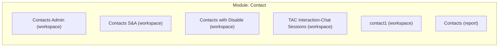
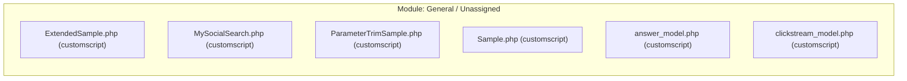
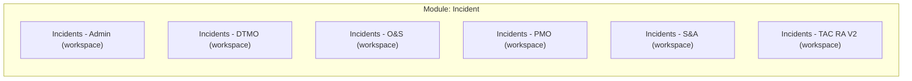
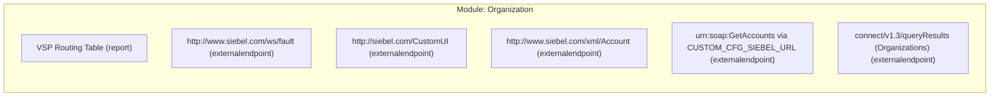

# Complete System Architecture & Component Mapping
**Generated**: 2026-08-11 17:00:27  
**Source Data Path**: `input`  

## Executive System Summary & Risk Overview

> [!NOTE]
> **System Mapping Overview**: Structured inventory of all parsed Oracle Service Cloud workspaces, analytics reports, CPM procedures, business rules, custom scripts, and external REST/SOAP integration endpoints.

| Component Category | Total Discovered Count | Status |
| :--- | :---: | :--- |
| Workspaces | 12 | Parsed & Mapped |
| Analytics Reports | 24 | Parsed & Mapped |
| Business Rules Sets | 3 (1525 Rules) | Parsed & Policy Mapped |
| CPM Procedures & Handlers | 8 | Parsed & Event Mapped |
| PHP Custom Scripts | 29 | Analyzed |
| BUI Add-Ins | 2 | Archive Extracted |
| Custom Objects & Entities | 18 | Schema Mapped |
| External Integration Endpoints | 18 | Endpoint Extracted |
| Orphaned Components | 12 | Audit Flagged |

> [!WARNING]
> **200 Unhandled Schema Element(s) Captured**: Raw XML elements/attributes present in source export were preserved via universal fallback handling.

| Component | Tag | Raw Snippet / Value |
|---|---|---|
| `Contacts Admin` | `<attr:Increment>` | `1` |
| `Contacts S&A` | `<attr:Increment>` | `1` |
| `Contacts S&A` | `<attr:Increment>` | `1` |
| `Contacts S&A` | `<attr:Increment>` | `1` |
| `Contacts with Disable` | `<attr:Increment>` | `1` |
| `Contacts with Disable` | `<attr:Increment>` | `1` |
| `Incidents - Admin` | `<Hyperlink>` | `<Hyperlink xmlns:dbaudit="http://www.rightnow.com/schemas/dbaudit" Row="0" Column="0" Text="Link"/>` |
| `Incidents - Admin` | `<attr:ScrollBars>` | `Vertical` |
| `Incidents - Admin` | `<attr:Increment>` | `1` |
| `Incidents - Admin` | `<attr:Increment>` | `1` |
| `Incidents - Admin` | `<attr:Increment>` | `1` |
| `Incidents - Admin` | `<attr:Increment>` | `1` |
| `Incidents - Admin` | `<attr:Increment>` | `1` |
| `Incidents - Admin` | `<attr:Increment>` | `1` |
| `Incidents - Admin` | `<attr:Increment>` | `1` |
| `Incidents - Admin` | `<attr:Increment>` | `1` |
| `Incidents - Admin` | `<attr:Increment>` | `1` |
| `Incidents - Admin` | `<attr:Increment>` | `1` |
| `Incidents - Admin` | `<attr:Increment>` | `1` |
| `Incidents - Admin` | `<attr:Increment>` | `1` |
| `Incidents - Admin` | `<attr:ScrollBars>` | `Vertical` |
| `Incidents - Admin` | `<attr:Increment>` | `1` |
| `Incidents - Admin` | `<attr:Increment>` | `1` |
| `Incidents - Admin` | `<attr:Increment>` | `1` |
| `Incidents - Admin` | `<attr:HideOptionsButton>` | `True` |
| `Incidents - Admin` | `<attr:NewRecordsInSeparateWorkgroup>` | `False` |
| `Incidents - Admin` | `<attr:OpenRecordsInSeparateWorkgroup>` | `False` |
| `Incidents - Admin` | `<attr:DeleteRecordsImmediately>` | `False` |
| `Incidents - Admin` | `<attr:HiddenOption>` | `OnNew:~any~;OnEdit:~any~` |
| `Incidents - DTMO` | `<attr:ScrollBars>` | `Vertical` |
| `Incidents - DTMO` | `<attr:Increment>` | `1` |
| `Incidents - DTMO` | `<attr:Increment>` | `1` |
| `Incidents - DTMO` | `<attr:Increment>` | `1` |
| `Incidents - DTMO` | `<attr:Increment>` | `1` |
| `Incidents - DTMO` | `<attr:Increment>` | `1` |
| `Incidents - DTMO` | `<attr:Increment>` | `1` |
| `Incidents - DTMO` | `<attr:Increment>` | `1` |
| `Incidents - DTMO` | `<attr:Increment>` | `1` |
| `Incidents - DTMO` | `<attr:Increment>` | `1` |
| `Incidents - DTMO` | `<attr:Increment>` | `1` |
| `Incidents - DTMO` | `<attr:Increment>` | `1` |
| `Incidents - DTMO` | `<attr:ScrollBars>` | `Vertical` |
| `Incidents - DTMO` | `<attr:Increment>` | `1` |
| `Incidents - DTMO` | `<attr:Increment>` | `1` |
| `Incidents - DTMO` | `<attr:Increment>` | `1` |
| `Incidents - DTMO` | `<attr:Increment>` | `1` |
| `Incidents - DTMO` | `<attr:ScrollBars>` | `Vertical` |
| `Incidents - DTMO` | `<attr:HiddenOption>` | `OnNew:~any~;OnEdit:~any~` |
| `Incidents - DTMO` | `<attr:HiddenOption>` | `OnNew:~any~;OnEdit:~any~` |
| `Incidents - DTMO` | `<attr:HiddenOption>` | `OnNew:~any~;OnEdit:~any~` |
| `Incidents - DTMO` | `<attr:HiddenOption>` | `OnNew:~any~;OnEdit:~any~` |
| `Incidents - O&S` | `<attr:ScrollBars>` | `Vertical` |
| `Incidents - O&S` | `<attr:Increment>` | `1` |
| `Incidents - O&S` | `<attr:Increment>` | `1` |
| `Incidents - O&S` | `<attr:Increment>` | `1` |
| `Incidents - O&S` | `<attr:Increment>` | `1` |
| `Incidents - O&S` | `<attr:Increment>` | `1` |
| `Incidents - O&S` | `<attr:Increment>` | `1` |
| `Incidents - O&S` | `<attr:Increment>` | `1` |
| `Incidents - O&S` | `<attr:Increment>` | `1` |
| `Incidents - O&S` | `<attr:Increment>` | `1` |
| `Incidents - O&S` | `<attr:Increment>` | `1` |
| `Incidents - O&S` | `<attr:ScrollBars>` | `Vertical` |
| `Incidents - O&S` | `<attr:Increment>` | `1` |
| `Incidents - O&S` | `<attr:Increment>` | `1` |
| `Incidents - O&S` | `<attr:Increment>` | `1` |
| `Incidents - O&S` | `<attr:Increment>` | `1` |
| `Incidents - O&S` | `<attr:Increment>` | `1` |
| `Incidents - PMO` | `<attr:ScrollBars>` | `Vertical` |
| `Incidents - PMO` | `<attr:Increment>` | `1` |
| `Incidents - PMO` | `<attr:Increment>` | `1` |
| `Incidents - PMO` | `<attr:Increment>` | `1` |
| `Incidents - PMO` | `<attr:Increment>` | `1` |
| `Incidents - PMO` | `<attr:Increment>` | `1` |
| `Incidents - PMO` | `<attr:Increment>` | `1` |
| `Incidents - PMO` | `<attr:Increment>` | `1` |
| `Incidents - PMO` | `<attr:Increment>` | `1` |
| `Incidents - PMO` | `<attr:ScrollBars>` | `Vertical` |
| `Incidents - PMO` | `<attr:Increment>` | `1` |
| `Incidents - PMO` | `<attr:Increment>` | `1` |
| `Incidents - PMO` | `<attr:Increment>` | `1` |
| `Incidents - PMO` | `<attr:Increment>` | `1` |
| `Incidents - PMO` | `<attr:Increment>` | `1` |
| `Incidents - S&A` | `<attr:ScrollBars>` | `Vertical` |
| `Incidents - S&A` | `<attr:Increment>` | `1` |
| `Incidents - S&A` | `<attr:Increment>` | `1` |
| `Incidents - S&A` | `<attr:Increment>` | `1` |
| `Incidents - TAC RA V2` | `<attr:ScrollBars>` | `Vertical` |
| `Incidents - TAC RA V2` | `<attr:Increment>` | `1` |
| `Incidents - TAC RA V2` | `<attr:ScrollBars>` | `Vertical` |
| `Incidents - TAC RA V2` | `<attr:Increment>` | `1` |
| `Incidents - TAC RA V2` | `<attr:Increment>` | `1` |
| `Incidents - TAC RA V2` | `<attr:Increment>` | `1` |
| `Incidents-TAC-BUI-new` | `<SplitterPanel>` | `<SplitterPanel xmlns:dbaudit="http://www.rightnow.com/schemas/dbaudit" Row="0" Column="0" SplitterOr` |
| `Incidents-TAC-BUI-new` | `<SplitPanel1>` | `<SplitPanel1 xmlns:dbaudit="http://www.rightnow.com/schemas/dbaudit"><Table ColumnCount="1" RowCount` |
| `Incidents-TAC-BUI-new` | `<SplitPanel2>` | `<SplitPanel2 xmlns:dbaudit="http://www.rightnow.com/schemas/dbaudit"><Table ColumnCount="3" RowCount` |
| `Incidents-TAC-BUI-new` | `<attr:LayoutLabelPosition>` | `Inside` |
| `Incidents-TAC-BUI-new` | `<attr:LayoutLabelPosition>` | `Inside` |
| `Incidents-TAC-BUI-new` | `<attr:LayoutLabelPosition>` | `Inside` |
| `Incidents-TAC-BUI-new` | `<attr:LayoutLabelPosition>` | `Inside` |
| `Incidents-TAC-BUI-new` | `<attr:Increment>` | `1` |
| `Incidents-TAC-BUI-new` | `<attr:LayoutLabelPosition>` | `Inside` |
| `Incidents-TAC-BUI-new` | `<attr:LayoutLabelPosition>` | `Inside` |
| `Incidents-TAC-BUI-new` | `<attr:LayoutLabelPosition>` | `Inside` |
| `Incidents-TAC-BUI-new` | `<attr:LayoutLabelPosition>` | `Inside` |
| `Incidents-TAC-BUI-new` | `<attr:LayoutLabelPosition>` | `Inside` |
| `Incidents-TAC-BUI-new` | `<attr:LayoutLabelPosition>` | `Inside` |
| `Incidents-TAC-BUI-new` | `<attr:Increment>` | `1` |
| `Incidents-TAC-BUI-new` | `<attr:LayoutLabelPosition>` | `Inside` |
| `Incidents-TAC-BUI-new` | `<attr:LayoutLabelPosition>` | `Inside` |
| `Incidents-TAC-BUI-new` | `<attr:LayoutLabelPosition>` | `Inside` |
| `Incidents-TAC-BUI-new` | `<attr:LayoutLabelPosition>` | `Inside` |
| `Incidents-TAC-BUI-new` | `<attr:LayoutLabelPosition>` | `Inside` |
| `Incidents-TAC-BUI-new` | `<attr:LayoutLabelPosition>` | `Inside` |
| `Incidents-TAC-BUI-new` | `<attr:LayoutLabelPosition>` | `Inside` |
| `Incidents-TAC-BUI-new` | `<attr:LayoutLabelPosition>` | `Inside` |
| `Incidents-TAC-BUI-new` | `<attr:LayoutLabelPosition>` | `Inside` |
| `Incidents-TAC-BUI-new` | `<attr:LayoutLabelPosition>` | `Inside` |
| `Incidents-TAC-BUI-new` | `<attr:LayoutLabelPosition>` | `Inside` |
| `Incidents-TAC-BUI-new` | `<attr:LayoutLabelPosition>` | `Inside` |
| `Incidents-TAC-BUI-new` | `<attr:LayoutLabelPosition>` | `Inside` |
| `Incidents-TAC-BUI-new` | `<attr:LayoutLabelPosition>` | `Inside` |
| `Incidents-TAC-BUI-new` | `<attr:LayoutLabelPosition>` | `Inside` |
| `Incidents-TAC-BUI-new` | `<attr:LayoutLabelPosition>` | `Inside` |
| `Incidents-TAC-BUI-new` | `<attr:LayoutLabelPosition>` | `Inside` |
| `Incidents-TAC-BUI-new` | `<attr:LayoutLabelPosition>` | `Inside` |
| `Incidents-TAC-BUI-new` | `<attr:LayoutLabelPosition>` | `Inside` |
| `Incidents-TAC-BUI-new` | `<attr:LayoutLabelPosition>` | `Inside` |
| `Incidents-TAC-BUI-new` | `<attr:LayoutLabelPosition>` | `Inside` |
| `Incidents-TAC-BUI-new` | `<attr:HideOptionsButton>` | `True` |
| `Incidents-TAC-BUI-new` | `<attr:Increment>` | `1` |
| `Incidents-TAC-BUI-new` | `<attr:Increment>` | `1` |
| `Incidents-TAC-BUI-new` | `<attr:Increment>` | `1` |
| `Incidents-TAC-BUI-new` | `<attr:Increment>` | `1` |
| `Incidents-TAC-BUI-new` | `<attr:Increment>` | `1` |
| `Incidents-TAC-BUI-new` | `<attr:Increment>` | `1` |
| `Incidents-TAC-BUI-new` | `<attr:Increment>` | `1` |
| `Incidents-TAC-BUI-new` | `<attr:Increment>` | `1` |
| `Incidents-TAC-BUI-new` | `<attr:Increment>` | `1` |
| `Incidents-TAC-BUI-new` | `<attr:Increment>` | `1` |
| `Incidents-TAC-BUI-new` | `<attr:ScrollBars>` | `Vertical` |
| `Incidents-TAC-BUI-new` | `<attr:Increment>` | `1` |
| `Incidents-TAC-BUI-new` | `<attr:ScrollBars>` | `Vertical` |
| `Incidents-TAC-BUI-new` | `<attr:ScrollBars>` | `Vertical` |
| `Incidents-TAC-BUI-new` | `<attr:LayoutLabelPosition>` | `Inside` |
| `Incidents-TAC-BUI-new` | `<attr:LayoutLabelPosition>` | `Inside` |
| `Incidents-TAC-BUI-new` | `<attr:LayoutLabelPosition>` | `Inside` |
| `Incidents-TAC-BUI-new` | `<attr:LayoutLabelPosition>` | `Inside` |
| `Incidents-TAC-BUI-new` | `<attr:LayoutLabelPosition>` | `Inside` |
| `Incidents-TAC-BUI-new` | `<attr:LayoutLabelPosition>` | `Inside` |
| `Incidents-TAC-BUI-new` | `<attr:LayoutLabelPosition>` | `Inside` |
| `Incidents-TAC-BUI-new` | `<attr:LayoutLabelPosition>` | `Inside` |
| `Incidents-TAC-BUI-new` | `<attr:LayoutLabelPosition>` | `Inside` |
| `Incidents-TAC-BUI-new` | `<attr:LayoutLabelPosition>` | `Inside` |
| `Incidents-TAC-BUI-new` | `<attr:LayoutLabelPosition>` | `Inside` |
| `Incidents-TAC-BUI-new` | `<attr:Increment>` | `1` |
| `Incidents-TAC-BUI-new` | `<attr:LayoutLabelPosition>` | `Inside` |
| `Incidents-TAC-BUI-new` | `<attr:Increment>` | `1` |
| `Incidents-TAC-BUI-new` | `<attr:LayoutLabelPosition>` | `Inside` |
| `Incidents-TAC-BUI-new` | `<attr:LayoutLabelPosition>` | `Inside` |
| `TAC Interaction-Chat Sessions` | `<Options>` | `<Options xmlns:dbaudit="http://www.rightnow.com/schemas/dbaudit"><Chat><CreateIncAtBegin>Yes</Create` |
| `TAC Interaction-Chat Sessions` | `<attr:KBReportId>` | `104201` |
| `TAC Interaction-Chat Sessions` | `<attr:HiddenOption>` | `OnNew:~any~;OnEdit:~any~` |
| `TAC Interaction-Chat Sessions` | `<attr:HiddenOption>` | `OnNew:~any~;OnEdit:~any~` |
| `TAC Interaction-Chat Sessions` | `<attr:SetFixedHeight>` | `False` |
| `TAC Interaction-Chat Sessions` | `<attr:Height>` | `237` |
| `TAC Interaction-Chat Sessions` | `<attr:LayoutLabelPosition>` | `Inside` |
| `TAC Interaction-Chat Sessions` | `<attr:LayoutLabelPosition>` | `Inside` |
| `TAC Interaction-Chat Sessions` | `<attr:LayoutLabelPosition>` | `Inside` |
| `TAC Interaction-Chat Sessions` | `<attr:LayoutLabelPosition>` | `Inside` |
| `TAC Interaction-Chat Sessions` | `<attr:LayoutLabelPosition>` | `Inside` |
| `TAC Interaction-Chat Sessions` | `<attr:LayoutLabelPosition>` | `Inside` |
| `TAC Interaction-Chat Sessions` | `<attr:LayoutLabelPosition>` | `Inside` |
| `TAC Interaction-Chat Sessions` | `<attr:LayoutLabelPosition>` | `Inside` |
| `TAC Interaction-Chat Sessions` | `<attr:LayoutLabelPosition>` | `Inside` |
| `TAC Interaction-Chat Sessions` | `<attr:LayoutLabelPosition>` | `Inside` |
| `TAC Interaction-Chat Sessions` | `<attr:LayoutLabelPosition>` | `Inside` |
| `TAC Interaction-Chat Sessions` | `<attr:LayoutLabelPosition>` | `Inside` |
| `TAC Interaction-Chat Sessions` | `<attr:LayoutLabelPosition>` | `Inside` |
| `TAC Interaction-Chat Sessions` | `<attr:LayoutLabelPosition>` | `Inside` |
| `TAC Interaction-Chat Sessions` | `<attr:LayoutLabelPosition>` | `Inside` |
| `TAC Interaction-Chat Sessions` | `<attr:LayoutLabelPosition>` | `Inside` |
| `TAC Interaction-Chat Sessions` | `<attr:LayoutLabelPosition>` | `Inside` |
| `TAC Interaction-Chat Sessions` | `<attr:LayoutLabelPosition>` | `Inside` |
| `TAC Interaction-Chat Sessions` | `<attr:LayoutLabelPosition>` | `Inside` |
| `TAC Interaction-Chat Sessions` | `<attr:Increment>` | `1` |
| `TAC Interaction-Chat Sessions` | `<attr:LayoutLabelPosition>` | `Inside` |
| `TAC Interaction-Chat Sessions` | `<attr:LayoutLabelPosition>` | `Inside` |
| `TAC Interaction-Chat Sessions` | `<attr:LayoutLabelPosition>` | `Inside` |
| `TAC Interaction-Chat Sessions` | `<attr:LayoutLabelPosition>` | `Inside` |
| `TAC Interaction-Chat Sessions` | `<attr:LayoutLabelPosition>` | `Inside` |
| `TAC Interaction-Chat Sessions` | `<attr:ScrollBars>` | `Vertical` |
| `TAC Interaction-Chat Sessions` | `<attr:LayoutLabelPosition>` | `Inside` |
| `TAC Interaction-Chat Sessions` | `<attr:Increment>` | `1` |
| `TAC Interaction-Chat Sessions` | `<attr:LayoutLabelPosition>` | `Inside` |
| `TAC Interaction-Chat Sessions` | `<attr:LayoutLabelPosition>` | `Inside` |
| `TAC Interaction-Chat Sessions` | `<attr:LayoutLabelPosition>` | `Inside` |
| `TAC Interaction-Chat Sessions` | `<attr:LayoutLabelPosition>` | `Inside` |
| `TAC Interaction-Chat Sessions` | `<attr:LayoutLabelPosition>` | `Inside` |
| `TAC Interaction-Chat Sessions` | `<attr:LayoutLabelPosition>` | `Inside` |

> [!WARNING]
> **12 Orphaned Component(s) Flagged**: Custom scripts or components exist in dataset with zero active workspace or CPM bindings.

> [!IMPORTANT]
> **18 External HTTP Integration Endpoints Detected**: Outbound web calls to external REST/SOAP servers require security verification.

> [!TIP]
> **Optimization Recommendation**: Review orphaned scripts to reclaim workspace performance and audit outbound endpoints for TLS verification.

## Audit-Critical Orphaned Components

| Component Name / ID | Type | Associated Object | Linkage Count | Audit Risk Flag & Reason |
| :--- | :--- | :--- | :---: | :--- |
| `ExtendedSample.php` | `CustomScript` | **General** | `0 in, 0 out` | `Not imported or called by any Workspace Rule, BUI Add-In, CPM, or Custom Script` |
| `MySocialSearch.php` | `CustomScript` | **General** | `0 in, 0 out` | `Not imported or called by any Workspace Rule, BUI Add-In, CPM, or Custom Script` |
| `ParameterTrimSample.php` | `CustomScript` | **General** | `0 in, 0 out` | `Not imported or called by any Workspace Rule, BUI Add-In, CPM, or Custom Script` |
| `Sample.php` | `CustomScript` | **General** | `0 in, 0 out` | `Not imported or called by any Workspace Rule, BUI Add-In, CPM, or Custom Script` |
| `answer_model.php` | `CustomScript` | **General** | `0 in, 0 out` | `Not imported or called by any Workspace Rule, BUI Add-In, CPM, or Custom Script` |
| `clickstream_model.php` | `CustomScript` | **General** | `0 in, 0 out` | `Not imported or called by any Workspace Rule, BUI Add-In, CPM, or Custom Script` |
| `contact_model.php` | `CustomScript` | **General** | `0 in, 0 out` | `Not imported or called by any Workspace Rule, BUI Add-In, CPM, or Custom Script` |
| `customChat.php` | `CustomScript` | **General** | `0 in, 0 out` | `Not imported or called by any Workspace Rule, BUI Add-In, CPM, or Custom Script` |
| `customfield_model.php` | `CustomScript` | **General** | `0 in, 0 out` | `Not imported or called by any Workspace Rule, BUI Add-In, CPM, or Custom Script` |
| `incident_model.php` | `CustomScript` | **General** | `0 in, 0 out` | `Not imported or called by any Workspace Rule, BUI Add-In, CPM, or Custom Script` |
| `report_model.php` | `CustomScript` | **General** | `0 in, 0 out` | `Not imported or called by any Workspace Rule, BUI Add-In, CPM, or Custom Script` |
| `sample_model.php` | `CustomScript` | **General** | `0 in, 0 out` | `Not imported or called by any Workspace Rule, BUI Add-In, CPM, or Custom Script` |

## Consolidated Entity Module Inventory

### Entity Module: Adsn (1 Mapped Components)

| Component ID / Name | Type | Dependencies (In -> Out) | Details & Execution Context |
| :--- | :--- | :---: | :--- |
| `ADSN` | `object` | `0 in -> 0 out` | Primary OSVC Entity Module Schema Root |

### Entity Module: Airport (1 Mapped Components)

| Component ID / Name | Type | Dependencies (In -> Out) | Details & Execution Context |
| :--- | :--- | :---: | :--- |
| `Airport` | `object` | `0 in -> 0 out` | Primary OSVC Entity Module Schema Root |

### Entity Module: Contact (30 Mapped Components)

#### Module Flowchart: Contact

| Component ID / Name | Type | Dependencies (In -> Out) | Details & Execution Context |
| :--- | :--- | :---: | :--- |
| `Contact` | `object` | `0 in -> 40 out` | Primary OSVC Entity Module Schema Root |
| `contact1` | `workspace` | `2 in -> 11 out` | Bound Object: `Contact` | 0 fields, 9 tabs, 1 rules |
| `Contacts Admin` | `workspace` | `3 in -> 9 out` | Bound Object: `Contact` | 0 fields, 9 tabs, 0 rules |
| `Contacts S&A` | `workspace` | `3 in -> 2 out` | Bound Object: `Contact` | 0 fields, 3 tabs, 0 rules |
| `Contacts with Disable` | `workspace` | `3 in -> 9 out` | Bound Object: `Contact` | 0 fields, 9 tabs, 1 rules |
| `TAC Interaction-Chat Sessions` | `workspace` | `1 in -> 3 out` | Bound Object: `Contact` | 31 fields, 3 tabs, 23 rules |
| `Contacts` | `report` | `3 in -> 0 out` | Report AC_ID: `100008` | 13 columns, 0 tables joined |
| `contact_create` | `cpm` | `4 in -> 1 out` | Trigger: `Create` | Synchronous Execution | Entry: `ObjectProcedure::apply` |
| `contact_create_internal` | `cpm` | `4 in -> 0 out` | Trigger: `Create` | Synchronous Execution | Entry: `ObjectProcedure::apply` |
| `contact_update` | `cpm` | `4 in -> 1 out` | Trigger: `Update` | Synchronous Execution | Entry: `ObjectProcedure::apply` |
| `contact_update_internal` | `cpm` | `5 in -> 0 out` | Trigger: `Update` | Synchronous Execution | Entry: `ObjectProcedure::apply` |
| `ContactAsync` | `asynccpm` | `4 in -> 1 out` | Trigger: `Update` | Async Execution | Entry: `ObjectProcedure::apply` |
| `answerfeedback_model.php` | `customscript` | `0 in -> 0 out` | PHP Script: `answerfeedback_model.php` | 0 functions |
| `callcheck.php` | `customscript` | `0 in -> 0 out` | PHP Script: `callcheck.php` | 0 functions |
| `cityworksapicall.php` | `customscript` | `0 in -> 1 out` | PHP Script: `cityworksapicall.php` | 0 functions |
| `contact_model.php` | `customscript` | `1 in -> 0 out` | PHP Script: `contact_model.php` | 0 functions |
| `daily_dupe_detection_0584.php` | `customscript` | `0 in -> 1 out` | PHP Script: `daily_dupe_detection_0584.php` | 0 functions |
| `dupe_detection_8366.php` | `customscript` | `0 in -> 1 out` | PHP Script: `dupe_detection_8366.php` | 0 functions |
| `duplicate_contacts.php` | `customscript` | `4 in -> 1 out` | PHP Script: `duplicate_contacts.php` | 0 functions |
| `sms_integration 1.php` | `customscript` | `0 in -> 0 out` | PHP Script: `sms_integration 1.php` | 0 functions |
| `ContactOrgLookupBUIAddin` | `buiaddin` | `4 in -> 10 out` | BUI Extension: `ContactOrgLookupBUIAddin` | Entry: `init.html` | Reads: 6, Writes: 5 |
| `Contact.CId` | `workspacefield` | `2 in -> 0 out` | Standard Field | Data Type: `Data Field` |
| `Contact.CustomFields.c$org_id_temp` | `workspacefield` | `2 in -> 0 out` | Custom Field (c$) | Data Type: `Data Field` |
| `Contact.Email` | `workspacefield` | `2 in -> 0 out` | Standard Field | Data Type: `Data Field` |
| `Contact Business Rules` | `businessrule` | `1 in -> 6 out` | OSVC Component ID: `businessrule:contact business rules` |
| `http://209.91.135.228/api/listactivecalls/` | `externalendpoint` | `0 in -> 0 out` | OSVC Component ID: `externalendpoint:http://209.91.135.228/api/listactivecalls/` |
| `https://siebel.enterprise.com/ContactSyncService` | `externalendpoint` | `2 in -> 0 out` | OSVC Component ID: `externalendpoint:https://siebel.enterprise.com/contactsyncservice` |
| `https://siebel.enterprise.com/ContactUpdateService` | `externalendpoint` | `1 in -> 0 out` | OSVC Component ID: `externalendpoint:https://siebel.enterprise.com/contactupdateservice` |
| `SOAP: RegisterContact` | `externalendpoint` | `2 in -> 0 out` | OSVC Component ID: `externalendpoint:soap: registercontact` |
| `urn:soap:RegisterContact via CUSTOM_CFG_SIEBEL_URL` | `externalendpoint` | `1 in -> 0 out` | OSVC Component ID: `externalendpoint:urn:soap:registercontact via custom_cfg_siebel_url` |

### Entity Module: Cta (1 Mapped Components)

| Component ID / Name | Type | Dependencies (In -> Out) | Details & Execution Context |
| :--- | :--- | :---: | :--- |
| `CTA` | `object` | `0 in -> 1 out` | Primary OSVC Entity Module Schema Root |

### Entity Module: Cto (1 Mapped Components)

| Component ID / Name | Type | Dependencies (In -> Out) | Details & Execution Context |
| :--- | :--- | :---: | :--- |
| `CTO` | `object` | `0 in -> 1 out` | Primary OSVC Entity Module Schema Root |

### Entity Module: Dmm (1 Mapped Components)

| Component ID / Name | Type | Dependencies (In -> Out) | Details & Execution Context |
| :--- | :--- | :---: | :--- |
| `DMM` | `object` | `0 in -> 0 out` | Primary OSVC Entity Module Schema Root |

### Entity Module: General / Unassigned (48 Mapped Components)

#### Module Flowchart: General / Unassigned

| Component ID / Name | Type | Dependencies (In -> Out) | Details & Execution Context |
| :--- | :--- | :---: | :--- |
| `Other` | `object` | `0 in -> 0 out` | Primary OSVC Entity Module Schema Root |
| `Unknown` | `object` | `0 in -> 2 out` | Primary OSVC Entity Module Schema Root |
| `Report 0` | `report` | `8 in -> 0 out` | Report AC_ID: `-` | 0 columns, 0 tables joined |
| `Report 10009` | `report` | `3 in -> 0 out` | Report AC_ID: `-` | 0 columns, 0 tables joined |
| `Report 10012` | `report` | `3 in -> 0 out` | Report AC_ID: `-` | 0 columns, 0 tables joined |
| `Report 100407` | `report` | `1 in -> 0 out` | Report AC_ID: `-` | 0 columns, 0 tables joined |
| `Report 101245` | `report` | `1 in -> 0 out` | Report AC_ID: `-` | 0 columns, 0 tables joined |
| `Report 102408` | `report` | `2 in -> 0 out` | Report AC_ID: `-` | 0 columns, 0 tables joined |
| `Report 103889` | `report` | `2 in -> 0 out` | Report AC_ID: `-` | 0 columns, 0 tables joined |
| `Report 104201` | `report` | `2 in -> 0 out` | Report AC_ID: `-` | 0 columns, 0 tables joined |
| `Report 105353` | `report` | `2 in -> 0 out` | Report AC_ID: `-` | 0 columns, 0 tables joined |
| `Report 125` | `report` | `1 in -> 0 out` | Report AC_ID: `-` | 0 columns, 0 tables joined |
| `Report 8000` | `report` | `9 in -> 0 out` | Report AC_ID: `-` | 0 columns, 0 tables joined |
| `Report 8001` | `report` | `1 in -> 0 out` | Report AC_ID: `-` | 0 columns, 0 tables joined |
| `Report 8010` | `report` | `5 in -> 0 out` | Report AC_ID: `-` | 0 columns, 0 tables joined |
| `Report 8012` | `report` | `3 in -> 0 out` | Report AC_ID: `-` | 0 columns, 0 tables joined |
| `Report 8014` | `report` | `2 in -> 0 out` | Report AC_ID: `-` | 0 columns, 0 tables joined |
| `Report 9011` | `report` | `6 in -> 0 out` | Report AC_ID: `-` | 0 columns, 0 tables joined |
| `Report 9016` | `report` | `3 in -> 0 out` | Report AC_ID: `-` | 0 columns, 0 tables joined |
| `Report 9018` | `report` | `5 in -> 0 out` | Report AC_ID: `-` | 0 columns, 0 tables joined |
| `Report 9029` | `report` | `2 in -> 0 out` | Report AC_ID: `-` | 0 columns, 0 tables joined |
| `Report 9030` | `report` | `3 in -> 0 out` | Report AC_ID: `-` | 0 columns, 0 tables joined |
| `Report 9041` | `report` | `6 in -> 0 out` | Report AC_ID: `-` | 0 columns, 0 tables joined |
| `Report 9050` | `report` | `3 in -> 0 out` | Report AC_ID: `-` | 0 columns, 0 tables joined |
| `../../AuthLibraryExtn/AuthLibraryExtn.js` | `customscript` | `2 in -> 0 out` | PHP Script: `../../AuthLibraryExtn/AuthLibraryExtn.js` | 0 functions |
| `answer_model.php` | `customscript` | `0 in -> 0 out` | PHP Script: `answer_model.php` | 0 functions |
| `clickstream_model.php` | `customscript` | `0 in -> 0 out` | PHP Script: `clickstream_model.php` | 0 functions |
| `customChat.php` | `customscript` | `0 in -> 0 out` | PHP Script: `customChat.php` | 0 functions |
| `customfield_model.php` | `customscript` | `0 in -> 0 out` | PHP Script: `customfield_model.php` | 0 functions |
| `ExtendedSample.php` | `customscript` | `0 in -> 0 out` | PHP Script: `ExtendedSample.php` | 0 functions |
| `header.inc.php` | `customscript` | `2 in -> 0 out` | PHP Script: `header.inc.php` | 0 functions |
| `header.inc_4778.php` | `customscript` | `0 in -> 0 out` | PHP Script: `header.inc_4778.php` | 0 functions |
| `include/init.phph` | `customscript` | `2 in -> 0 out` | PHP Script: `include/init.phph` | 0 functions |
| `MySocialSearch.php` | `customscript` | `0 in -> 0 out` | PHP Script: `MySocialSearch.php` | 0 functions |
| `ParameterTrimSample.php` | `customscript` | `0 in -> 0 out` | PHP Script: `ParameterTrimSample.php` | 0 functions |
| `report_model.php` | `customscript` | `0 in -> 0 out` | PHP Script: `report_model.php` | 0 functions |
| `Sample.php` | `customscript` | `0 in -> 0 out` | PHP Script: `Sample.php` | 0 functions |
| `sample_model.php` | `customscript` | `0 in -> 0 out` | PHP Script: `sample_model.php` | 0 functions |
| `connect/v1.3/analyticsReportResults (Report ID 100407)` | `externalendpoint` | `0 in -> 0 out` | OSVC Component ID: `externalendpoint:connect/v1.3/analyticsreportresults (report id 100407)` |
| `https://ajax.googleapis.com/ajax/libs/jquery/3.4.1/jquery.min.js` | `externalendpoint` | `0 in -> 0 out` | OSVC Component ID: `externalendpoint:https://ajax.googleapis.com/ajax/libs/jquery/3.4.1/jquery.min.js` |
| `https://cdn.datatables.net/1.10.20/css/jquery.dataTables.css` | `externalendpoint` | `0 in -> 0 out` | OSVC Component ID: `externalendpoint:https://cdn.datatables.net/1.10.20/css/jquery.datatables.css` |
| `https://cdn.datatables.net/1.10.20/js/jquery.dataTables.js` | `externalendpoint` | `0 in -> 0 out` | OSVC Component ID: `externalendpoint:https://cdn.datatables.net/1.10.20/js/jquery.datatables.js` |
| `https://js.arcgis.com/4.20/` | `externalendpoint` | `0 in -> 0 out` | OSVC Component ID: `externalendpoint:https://js.arcgis.com/4.20/` |
| `https://js.arcgis.com/4.20/esri/themes/light/main.css` | `externalendpoint` | `0 in -> 0 out` | OSVC Component ID: `externalendpoint:https://js.arcgis.com/4.20/esri/themes/light/main.css` |
| `https://use.fontawesome.com/releases/v5.1.1/css/all.css` | `externalendpoint` | `0 in -> 0 out` | OSVC Component ID: `externalendpoint:https://use.fontawesome.com/releases/v5.1.1/css/all.css` |
| `Mappings.xml` | `cpmmappings` | `1 in -> 6 out` | OSVC Component ID: `cpmmappings:mappings.xml` |
| `SOAP: GetAccounts` | `externalendpoint` | `1 in -> 0 out` | OSVC Component ID: `externalendpoint:soap: getaccounts` |
| `www.rightnow.com` | `externalendpoint` | `1 in -> 0 out` | OSVC Component ID: `externalendpoint:www.rightnow.com` |

### Entity Module: Incident (28 Mapped Components)

#### Module Flowchart: Incident

| Component ID / Name | Type | Dependencies (In -> Out) | Details & Execution Context |
| :--- | :--- | :---: | :--- |
| `Incident` | `object` | `1 in -> 13 out` | Primary OSVC Entity Module Schema Root |
| `Incidents - Admin` | `workspace` | `2 in -> 7 out` | Bound Object: `Incident` | 0 fields, 11 tabs, 11 rules |
| `Incidents - DTMO` | `workspace` | `2 in -> 7 out` | Bound Object: `Incident` | 0 fields, 15 tabs, 9 rules |
| `Incidents - O&S` | `workspace` | `2 in -> 6 out` | Bound Object: `Incident` | 0 fields, 8 tabs, 2 rules |
| `Incidents - PMO` | `workspace` | `2 in -> 7 out` | Bound Object: `Incident` | 0 fields, 8 tabs, 22 rules |
| `Incidents - S&A` | `workspace` | `2 in -> 0 out` | Bound Object: `Incident` | 0 fields, 2 tabs, 0 rules |
| `Incidents - TAC RA V2` | `workspace` | `2 in -> 7 out` | Bound Object: `Incident` | 0 fields, 11 tabs, 0 rules |
| `Incidents-TAC-BUI-new` | `workspace` | `2 in -> 5 out` | Bound Object: `Incident` | 14 fields, 14 tabs, 62 rules |
| `incident_back_in_stock_sync` | `cpm` | `4 in -> 0 out` | Trigger: `Create` | Synchronous Execution | Entry: `ObjectProcedure::apply` |
| `incident_create` | `cpm` | `3 in -> 0 out` | Trigger: `Create` | Synchronous Execution | Entry: `ObjectProcedure::apply` |
| `incident_routing` | `asynccpm` | `4 in -> 1 out` | Trigger: `Create, Update` | Async Execution | Entry: `ObjectProcedure::apply` |
| `address_validation.php` | `customscript` | `2 in -> 0 out` | PHP Script: `address_validation.php` | 0 functions |
| `bluebox_greencart_validation.php` | `customscript` | `0 in -> 0 out` | PHP Script: `bluebox_greencart_validation.php` | 0 functions |
| `child_incident_create.php` | `customscript` | `2 in -> 1 out` | PHP Script: `child_incident_create.php` | 0 functions |
| `closing_notes.php` | `customscript` | `0 in -> 0 out` | PHP Script: `closing_notes.php` | 0 functions |
| `duplicate_incidents.php` | `customscript` | `1 in -> 0 out` | PHP Script: `duplicate_incidents.php` | 0 functions |
| `eventclock.php` | `customscript` | `0 in -> 0 out` | PHP Script: `eventclock.php` | 0 functions |
| `incident_model.php` | `customscript` | `1 in -> 0 out` | PHP Script: `incident_model.php` | 0 functions |
| `SendToSiebelBUIAddin` | `buiaddin` | `1 in -> 5 out` | BUI Extension: `SendToSiebelBUIAddin` | Entry: `init.html` | Reads: 3, Writes: 1 |
| `Incident.c$org_id_temp` | `workspacefield` | `2 in -> 0 out` | Custom Field (c$) | Data Type: `Data Field` |
| `Incident.c$org_label_temp` | `workspacefield` | `2 in -> 0 out` | Custom Field (c$) | Data Type: `Data Field` |
| `Incident.c$siebel_sr_number` | `workspacefield` | `3 in -> 0 out` | Custom Field (c$) | Data Type: `Data Field` |
| `Incident.CId` | `workspacefield` | `2 in -> 0 out` | Standard Field | Data Type: `Data Field` |
| `Incident.CO$Org` | `workspacefield` | `2 in -> 0 out` | Standard Field | Data Type: `Data Field` |
| `Incident.Created` | `workspacefield` | `2 in -> 0 out` | Standard Field | Data Type: `Data Field` |
| `Incident.IId` | `workspacefield` | `2 in -> 0 out` | Standard Field | Data Type: `Data Field` |
| `/cc/ajaxCustom/addSrToSiebel` | `externalendpoint` | `0 in -> 0 out` | OSVC Component ID: `externalendpoint:/cc/ajaxcustom/addsrtosiebel` |
| `Incident Business Rules` | `businessrule` | `1 in -> 44 out` | OSVC Component ID: `businessrule:incident business rules` |

### Entity Module: Interaction (1 Mapped Components)

| Component ID / Name | Type | Dependencies (In -> Out) | Details & Execution Context |
| :--- | :--- | :---: | :--- |
| `Interaction` | `object` | `0 in -> 1 out` | Primary OSVC Entity Module Schema Root |

### Entity Module: Lodging_locations (1 Mapped Components)

| Component ID / Name | Type | Dependencies (In -> Out) | Details & Execution Context |
| :--- | :--- | :---: | :--- |
| `Lodging_Locations` | `object` | `0 in -> 0 out` | Primary OSVC Entity Module Schema Root |

### Entity Module: Meps (1 Mapped Components)

| Component ID / Name | Type | Dependencies (In -> Out) | Details & Execution Context |
| :--- | :--- | :---: | :--- |
| `MEPS` | `object` | `0 in -> 0 out` | Primary OSVC Entity Module Schema Root |

### Entity Module: Nci (1 Mapped Components)

| Component ID / Name | Type | Dependencies (In -> Out) | Details & Execution Context |
| :--- | :--- | :---: | :--- |
| `nci` | `object` | `0 in -> 22 out` | Primary OSVC Entity Module Schema Root |

### Entity Module: Organization (7 Mapped Components)

#### Module Flowchart: Organization

| Component ID / Name | Type | Dependencies (In -> Out) | Details & Execution Context |
| :--- | :--- | :---: | :--- |
| `Organization` | `object` | `0 in -> 2 out` | Primary OSVC Entity Module Schema Root |
| `VSP Routing Table` | `report` | `1 in -> 0 out` | Report AC_ID: `122026` | 10 columns, 0 tables joined |
| `connect/v1.3/queryResults (Organizations)` | `externalendpoint` | `0 in -> 0 out` | OSVC Component ID: `externalendpoint:connect/v1.3/queryresults (organizations)` |
| `http://siebel.com/CustomUI` | `externalendpoint` | `0 in -> 0 out` | OSVC Component ID: `externalendpoint:http://siebel.com/customui` |
| `http://www.siebel.com/ws/fault` | `externalendpoint` | `0 in -> 0 out` | OSVC Component ID: `externalendpoint:http://www.siebel.com/ws/fault` |
| `http://www.siebel.com/xml/Account` | `externalendpoint` | `0 in -> 0 out` | OSVC Component ID: `externalendpoint:http://www.siebel.com/xml/account` |
| `urn:soap:GetAccounts via CUSTOM_CFG_SIEBEL_URL` | `externalendpoint` | `0 in -> 0 out` | OSVC Component ID: `externalendpoint:urn:soap:getaccounts via custom_cfg_siebel_url` |

### Entity Module: Rtc (1 Mapped Components)

| Component ID / Name | Type | Dependencies (In -> Out) | Details & Execution Context |
| :--- | :--- | :---: | :--- |
| `RTC` | `object` | `0 in -> 0 out` | Primary OSVC Entity Module Schema Root |

### Entity Module: Sim (1 Mapped Components)

| Component ID / Name | Type | Dependencies (In -> Out) | Details & Execution Context |
| :--- | :--- | :---: | :--- |
| `SIM` | `object` | `0 in -> 0 out` | Primary OSVC Entity Module Schema Root |

### Entity Module: Test_Record (1 Mapped Components)

| Component ID / Name | Type | Dependencies (In -> Out) | Details & Execution Context |
| :--- | :--- | :---: | :--- |
| `Test_Record` | `object` | `0 in -> 0 out` | Primary OSVC Entity Module Schema Root |

### Entity Module: Uso (1 Mapped Components)

| Component ID / Name | Type | Dependencies (In -> Out) | Details & Execution Context |
| :--- | :--- | :---: | :--- |
| `USO` | `object` | `0 in -> 0 out` | Primary OSVC Entity Module Schema Root |

## Workspaces & Field Mapping Matrix

### Workspace: Contacts Admin
- **Primary Object Binding**: **General / Unassigned**
- **Layout Summary**: 25 form fields used across 9 tabsets (0 rules)

| Field Name / ID | Custom Field (c$) | Parent Location / Tab | Dependencies |
| :--- | :---: | :--- | :---: |
| `Name.Last` | No | Tab: Summary | `0 in -> 0 out` |
| `Name.First` | No | Tab: Summary | `0 in -> 0 out` |
| `C$ContactId` | Yes (c$) | Tab: Summary | `0 in -> 0 out` |
| `C$ServiceAgency` | Yes (c$) | Tab: Summary | `0 in -> 0 out` |
| `C$SsnLastFour` | Yes (c$) | Tab: Summary | `0 in -> 0 out` |
| `C$ClientSite` | Yes (c$) | Tab: Summary | `0 in -> 0 out` |
| `Email` | No | Tab: Summary | `0 in -> 0 out` |
| `C$Role` | Yes (c$) | Tab: Summary | `0 in -> 0 out` |
| `PhOffice` | No | Tab: Summary | `0 in -> 0 out` |
| `C$PhoneExt` | Yes (c$) | Tab: Summary | `0 in -> 0 out` |
| `C$DsnPhone` | Yes (c$) | Tab: Summary | `0 in -> 0 out` |
| `C$DsnPhoneExt` | Yes (c$) | Tab: Summary | `0 in -> 0 out` |
| `C$International` | Yes (c$) | Tab: Summary | `0 in -> 0 out` |
| `C$IntPhoneExt` | Yes (c$) | Tab: Summary | `0 in -> 0 out` |
| `Addr` | No | Tab: Summary | `0 in -> 0 out` |
| `C$EmailNotification` | Yes (c$) | Tab: Summary | `0 in -> 0 out` |
| `C$OrganizationCode` | Yes (c$) | Tab: Summary | `0 in -> 0 out` |
| `Login` | No | Tab: Summary | `0 in -> 0 out` |
| `Disabled` | No | Tab: Summary | `0 in -> 0 out` |
| `MaOptIn` | No | Tab: Summary | `0 in -> 0 out` |
| `C$CsnOptIn` | Yes (c$) | Tab: Summary | `0 in -> 0 out` |
| `SurveyOptIn` | No | Tab: Summary | `0 in -> 0 out` |
| `CtypeId` | No | Tab: Summary | `0 in -> 0 out` |
| `C$Vip` | Yes (c$) | Tab: Summary | `0 in -> 0 out` |
| `C$ReservistLocation` | Yes (c$) | Tab: Summary | `0 in -> 0 out` |

### Workspace: Contacts S&A
- **Primary Object Binding**: **General / Unassigned**
- **Layout Summary**: 16 form fields used across 3 tabsets (0 rules)

| Field Name / ID | Custom Field (c$) | Parent Location / Tab | Dependencies |
| :--- | :---: | :--- | :---: |
| `Name.Last` | No | Tab: Summary | `0 in -> 0 out` |
| `Name.First` | No | Tab: Summary | `0 in -> 0 out` |
| `C$SsnLastFour` | Yes (c$) | Tab: Summary | `0 in -> 0 out` |
| `C$ServiceAgency` | Yes (c$) | Tab: Summary | `0 in -> 0 out` |
| `Email` | No | Tab: Summary | `0 in -> 0 out` |
| `C$ClientSite` | Yes (c$) | Tab: Summary | `0 in -> 0 out` |
| `PhOffice` | No | Tab: Summary | `0 in -> 0 out` |
| `C$Ext` | Yes (c$) | Tab: Summary | `0 in -> 0 out` |
| `C$International` | Yes (c$) | Tab: Summary | `0 in -> 0 out` |
| `C$Dsn` | Yes (c$) | Tab: Summary | `0 in -> 0 out` |
| `Addr` | No | Tab: Summary | `0 in -> 0 out` |
| `C$Role` | Yes (c$) | Tab: Summary | `0 in -> 0 out` |
| `Updated` | No | Tab: Summary | `0 in -> 0 out` |
| `Created` | No | Tab: Summary | `0 in -> 0 out` |
| `C$RankPrimary` | Yes (c$) | Tab: Summary | `0 in -> 0 out` |
| `C$RankSecondary` | Yes (c$) | Tab: Summary | `0 in -> 0 out` |

### Workspace: Contacts with Disable
- **Primary Object Binding**: **General / Unassigned**
- **Layout Summary**: 23 form fields used across 9 tabsets (1 rules)

| Field Name / ID | Custom Field (c$) | Parent Location / Tab | Dependencies |
| :--- | :---: | :--- | :---: |
| `Name.Last` | No | Tab: Summary | `0 in -> 0 out` |
| `Name.First` | No | Tab: Summary | `0 in -> 0 out` |
| `C$ContactId` | Yes (c$) | Tab: Summary | `0 in -> 0 out` |
| `C$ServiceAgency` | Yes (c$) | Tab: Summary | `0 in -> 0 out` |
| `C$SsnLastFour` | Yes (c$) | Tab: Summary | `0 in -> 0 out` |
| `C$ClientSite` | Yes (c$) | Tab: Summary | `0 in -> 0 out` |
| `Email` | No | Tab: Summary | `0 in -> 0 out` |
| `C$Role` | Yes (c$) | Tab: Summary | `0 in -> 0 out` |
| `PhOffice` | No | Tab: Summary | `0 in -> 0 out` |
| `C$Ext` | Yes (c$) | Tab: Summary | `0 in -> 0 out` |
| `C$DsnPhone` | Yes (c$) | Tab: Summary | `0 in -> 0 out` |
| `C$DsnPhoneExt` | Yes (c$) | Tab: Summary | `0 in -> 0 out` |
| `C$International` | Yes (c$) | Tab: Summary | `0 in -> 0 out` |
| `C$IntPhoneExt` | Yes (c$) | Tab: Summary | `0 in -> 0 out` |
| `Disabled` | No | Tab: Summary | `0 in -> 0 out` |
| `CtypeId` | No | Tab: Summary | `0 in -> 0 out` |
| `Addr` | No | Tab: Summary | `0 in -> 0 out` |
| `C$Vip` | Yes (c$) | Tab: Summary | `0 in -> 0 out` |
| `C$OrganizationCode` | Yes (c$) | Tab: Summary | `0 in -> 0 out` |
| `C$EmailNotification` | Yes (c$) | Tab: Summary | `0 in -> 0 out` |
| `MaOptIn` | No | Tab: Summary | `0 in -> 0 out` |
| `Login` | No | Tab: Summary | `0 in -> 0 out` |
| `C$CsnOptIn` | Yes (c$) | Tab: Summary | `0 in -> 0 out` |

### Workspace: Incidents - Admin
- **Primary Object Binding**: **General / Unassigned**
- **Layout Summary**: 134 form fields used across 11 tabsets (11 rules)

| Field Name / ID | Custom Field (c$) | Parent Location / Tab | Dependencies |
| :--- | :---: | :--- | :---: |
| `CId` | No | Tab: Summary | `0 in -> 0 out` |
| `ProdId` | No | Tab: Summary | `0 in -> 0 out` |
| `RefNo` | No | Tab: Summary | `0 in -> 0 out` |
| `SeverityId` | No | Tab: Summary | `0 in -> 0 out` |
| `Subject` | No | Tab: Summary | `0 in -> 0 out` |
| `Status.Id` | No | Tab: Summary | `0 in -> 0 out` |
| `C$Ecd` | Yes (c$) | Tab: Summary | `0 in -> 0 out` |
| `C$Score` | Yes (c$) | Tab: Summary | `0 in -> 0 out` |
| `C$Priority` | Yes (c$) | Tab: Summary | `0 in -> 0 out` |
| `C$SimsScore` | Yes (c$) | Tab: Summary | `0 in -> 0 out` |
| `C$Environmentjira` | Yes (c$) | Tab: Summary | `0 in -> 0 out` |
| `C$IssueType` | Yes (c$) | Tab: Summary | `0 in -> 0 out` |
| `C$TravelerFirstName` | Yes (c$) | Tab: Summary | `0 in -> 0 out` |
| `Assigned` | No | Tab: Summary | `0 in -> 0 out` |
| `C$TravelerLastName` | Yes (c$) | Tab: Summary | `0 in -> 0 out` |
| `QueueId` | No | Tab: Summary | `0 in -> 0 out` |
| `C$TravelerSsnLast4` | Yes (c$) | Tab: Summary | `0 in -> 0 out` |
| `C$LeaveInQueue` | Yes (c$) | Tab: Summary | `0 in -> 0 out` |
| `Created` | No | Tab: Summary | `0 in -> 0 out` |
| `C$DocumentName` | Yes (c$) | Tab: Summary | `0 in -> 0 out` |
| `C$RankPrimary` | Yes (c$) | Tab: Summary | `0 in -> 0 out` |
| `C$DocumentType` | Yes (c$) | Tab: Summary | `0 in -> 0 out` |
| `C$RankSecondary` | Yes (c$) | Tab: Summary | `0 in -> 0 out` |
| `C$Tanum` | Yes (c$) | Tab: Summary | `0 in -> 0 out` |
| `Email` | No | Tab: Summary | `0 in -> 0 out` |
| `DispId` | No | Tab: Summary | `0 in -> 0 out` |
| `Source` | No | Tab: Details | `0 in -> 0 out` |
| `C$IncidentServiceAgency` | Yes (c$) | Tab: Details | `0 in -> 0 out` |
| `C$CbaAcctLabel` | Yes (c$) | Tab: Details | `0 in -> 0 out` |
| `C$CrCp` | Yes (c$) | Tab: Details | `0 in -> 0 out` |
| `C$TicketDueDate` | Yes (c$) | Tab: Details | `0 in -> 0 out` |
| `C$IncidentSite` | Yes (c$) | Tab: Details | `0 in -> 0 out` |
| `C$CbaNum` | Yes (c$) | Tab: Details | `0 in -> 0 out` |
| `C$Etic` | Yes (c$) | Tab: Details | `0 in -> 0 out` |
| `Updated` | No | Tab: Details | `0 in -> 0 out` |
| `C$Dts` | Yes (c$) | Tab: Details | `0 in -> 0 out` |
| `Closed` | No | Tab: Details | `0 in -> 0 out` |
| `C$OrganizationCode` | Yes (c$) | Tab: Details | `0 in -> 0 out` |
| `C$InvoiceNum` | Yes (c$) | Tab: Details | `0 in -> 0 out` |
| `C$SprP` | Yes (c$) | Tab: Details | `0 in -> 0 out` |
| `C$ReOpened` | Yes (c$) | Tab: Details | `0 in -> 0 out` |
| `C$TravelDate` | Yes (c$) | Tab: Details | `0 in -> 0 out` |
| `C$PpaStartDate` | Yes (c$) | Tab: Details | `0 in -> 0 out` |
| `C$SprS` | Yes (c$) | Tab: Details | `0 in -> 0 out` |
| `C$Gds` | Yes (c$) | Tab: Details | `0 in -> 0 out` |
| `C$TicketNum` | Yes (c$) | Tab: Details | `0 in -> 0 out` |
| `C$CbaRefNo` | Yes (c$) | Tab: Details | `0 in -> 0 out` |
| `C$SprA` | Yes (c$) | Tab: Details | `0 in -> 0 out` |
| `C$Pcc` | Yes (c$) | Tab: Details | `0 in -> 0 out` |
| `C$Reservist` | Yes (c$) | Tab: Details | `0 in -> 0 out` |
| `C$CbaAmount` | Yes (c$) | Tab: Details | `0 in -> 0 out` |
| `C$SprI` | Yes (c$) | Tab: Details | `0 in -> 0 out` |
| `C$Pnr` | Yes (c$) | Tab: Details | `0 in -> 0 out` |
| `C$CbaAccount` | Yes (c$) | Tab: Details | `0 in -> 0 out` |
| `C$SprClosed` | Yes (c$) | Tab: Details | `0 in -> 0 out` |
| `C$PiiCopy` | Yes (c$) | Tab: Details | `0 in -> 0 out` |
| `C$Escalated` | Yes (c$) | Tab: Details | `0 in -> 0 out` |
| `C$CbaRefund` | Yes (c$) | Tab: Details | `0 in -> 0 out` |
| `C$Cir` | Yes (c$) | Tab: Details | `0 in -> 0 out` |
| `C$Pl9Actions` | Yes (c$) | Tab: Details | `0 in -> 0 out` |
| `C$EscalatedDtmo` | Yes (c$) | Tab: Details | `0 in -> 0 out` |
| `C$CbaSuspendDate` | Yes (c$) | Tab: Details | `0 in -> 0 out` |
| `C$CirNumber` | Yes (c$) | Tab: Details | `0 in -> 0 out` |
| `C$UsabilityIssue` | Yes (c$) | Tab: Details | `0 in -> 0 out` |
| `C$DeEscalated` | Yes (c$) | Tab: Details | `0 in -> 0 out` |
| `C$CbaExceptions` | Yes (c$) | Tab: Details | `0 in -> 0 out` |
| `C$ScrP` | Yes (c$) | Tab: Details | `0 in -> 0 out` |
| `C$RelatedTicket` | Yes (c$) | Tab: Details | `0 in -> 0 out` |
| `C$ResponseDueDate` | Yes (c$) | Tab: Details | `0 in -> 0 out` |
| `C$InitialResponseDate` | Yes (c$) | Tab: Details | `0 in -> 0 out` |
| `C$ScrS` | Yes (c$) | Tab: Details | `0 in -> 0 out` |
| `C$AngryCaller` | Yes (c$) | Tab: Details | `0 in -> 0 out` |
| `C$Response` | Yes (c$) | Tab: Details | `0 in -> 0 out` |
| `C$EscalatedPmo` | Yes (c$) | Tab: Details | `0 in -> 0 out` |
| `C$PptNumber` | Yes (c$) | Tab: Details | `0 in -> 0 out` |
| `C$UdfXml` | Yes (c$) | Tab: Details | `0 in -> 0 out` |
| `C$EscalatedOands` | Yes (c$) | Tab: Details | `0 in -> 0 out` |
| `C$FirstCallResolution` | Yes (c$) | Tab: Details | `0 in -> 0 out` |
| `C$PptClosed` | Yes (c$) | Tab: Details | `0 in -> 0 out` |
| `C$WorkaroundExists` | Yes (c$) | Tab: Details | `0 in -> 0 out` |
| `C$Denied` | Yes (c$) | Tab: Details | `0 in -> 0 out` |
| `EiCust` | No | Tab: Details | `0 in -> 0 out` |
| `EiStaff` | No | Tab: Details | `0 in -> 0 out` |
| `C$Notes` | Yes (c$) | Tab: Details | `0 in -> 0 out` |
| `C$IncidentType` | Yes (c$) | Tab: Details | `0 in -> 0 out` |
| `C$Spr` | Yes (c$) | Tab: Details | `0 in -> 0 out` |
| `C$Scr` | Yes (c$) | Tab: Details | `0 in -> 0 out` |
| `C$ChatEmail` | Yes (c$) | Tab: Details | `0 in -> 0 out` |
| `C$ChatFirstName` | Yes (c$) | Tab: Details | `0 in -> 0 out` |
| `C$ChatLastName` | Yes (c$) | Tab: Details | `0 in -> 0 out` |
| `C$ChatIp` | Yes (c$) | Tab: Details | `0 in -> 0 out` |
| `C$ChatBrowser` | Yes (c$) | Tab: Details | `0 in -> 0 out` |
| `Name.Last` | No | Tab: Contacts | `0 in -> 0 out` |
| `Name.First` | No | Tab: Contacts | `0 in -> 0 out` |
| `Email` | No | Tab: Contacts | `0 in -> 0 out` |
| `C$SsnLastFour` | Yes (c$) | Tab: Contacts | `0 in -> 0 out` |
| `PhOffice` | No | Tab: Contacts | `0 in -> 0 out` |
| `C$Ext` | Yes (c$) | Tab: Contacts | `0 in -> 0 out` |
| `C$DsnPhone` | Yes (c$) | Tab: Contacts | `0 in -> 0 out` |
| `C$DsnPhoneExt` | Yes (c$) | Tab: Contacts | `0 in -> 0 out` |
| `C$International` | Yes (c$) | Tab: Contacts | `0 in -> 0 out` |
| `C$IntPhoneExt` | Yes (c$) | Tab: Contacts | `0 in -> 0 out` |
| `C$OrganizationCode` | Yes (c$) | Tab: Contacts | `0 in -> 0 out` |
| `C$ServiceAgency` | Yes (c$) | Tab: Contacts | `0 in -> 0 out` |
| `C$ClientSite` | Yes (c$) | Tab: Contacts | `0 in -> 0 out` |
| `C$EmailNotification` | Yes (c$) | Tab: Contacts | `0 in -> 0 out` |
| `Login` | No | Tab: Contacts -> Tab: Contact Fields | `0 in -> 0 out` |
| `MaOptIn` | No | Tab: Contacts -> Tab: Contact Fields | `0 in -> 0 out` |
| `State` | No | Tab: Contacts -> Tab: Contact Fields | `0 in -> 0 out` |
| `MaMailType` | No | Tab: Contacts -> Tab: Contact Fields | `0 in -> 0 out` |
| `Source` | No | Tab: Contacts -> Tab: Contact Fields | `0 in -> 0 out` |
| `C$GrpLdrLastName` | Yes (c$) | Tab: Ra Details | `0 in -> 0 out` |
| `C$RaProblemType` | Yes (c$) | Tab: Ra Details | `0 in -> 0 out` |
| `C$Bus` | Yes (c$) | Tab: Ra Details | `0 in -> 0 out` |
| `C$GrpLdrFirstName` | Yes (c$) | Tab: Ra Details | `0 in -> 0 out` |
| `C$ProblemDetail` | Yes (c$) | Tab: Ra Details | `0 in -> 0 out` |
| `C$MealsProvided` | Yes (c$) | Tab: Ra Details | `0 in -> 0 out` |
| `C$IncidentLocation` | Yes (c$) | Tab: Ra Details | `0 in -> 0 out` |
| `C$Result` | Yes (c$) | Tab: Ra Details | `0 in -> 0 out` |
| `C$RaLodging` | Yes (c$) | Tab: Ra Details | `0 in -> 0 out` |
| `C$Meps` | Yes (c$) | Tab: Ra Details | `0 in -> 0 out` |
| `C$HotelName` | Yes (c$) | Tab: Ra Details | `0 in -> 0 out` |
| `C$RaMeal` | Yes (c$) | Tab: Ra Details | `0 in -> 0 out` |
| `C$DestinationBase` | Yes (c$) | Tab: Ra Details | `0 in -> 0 out` |
| `C$HotelRoomPhNum` | Yes (c$) | Tab: Ra Details | `0 in -> 0 out` |
| `C$RaOther` | Yes (c$) | Tab: Ra Details | `0 in -> 0 out` |
| `C$Pax` | Yes (c$) | Tab: Ra Details | `0 in -> 0 out` |
| `C$RaPoc` | Yes (c$) | Tab: Ra Details | `0 in -> 0 out` |
| `C$PhoneNumber` | Yes (c$) | Tab: Ra Details | `0 in -> 0 out` |
| `C$To` | Yes (c$) | Tab: Ra Details | `0 in -> 0 out` |
| `C$RaPocDetails` | Yes (c$) | Tab: Ra Details | `0 in -> 0 out` |
| `C$From` | Yes (c$) | Tab: Ra Details | `0 in -> 0 out` |
| `C$GovccApproval` | Yes (c$) | Tab: Ra Details | `0 in -> 0 out` |
| `C$LodgingProvided` | Yes (c$) | Tab: Ra Details | `0 in -> 0 out` |

### Workspace: Incidents - DTMO
- **Primary Object Binding**: **General / Unassigned**
- **Layout Summary**: 120 form fields used across 15 tabsets (9 rules)

| Field Name / ID | Custom Field (c$) | Parent Location / Tab | Dependencies |
| :--- | :---: | :--- | :---: |
| `CId` | No | Tab: Summary | `0 in -> 0 out` |
| `ProdId` | No | Tab: Summary | `0 in -> 0 out` |
| `RefNo` | No | Tab: Summary | `0 in -> 0 out` |
| `SeverityId` | No | Tab: Summary | `0 in -> 0 out` |
| `Subject` | No | Tab: Summary | `0 in -> 0 out` |
| `Status.Id` | No | Tab: Summary | `0 in -> 0 out` |
| `C$Ecd` | Yes (c$) | Tab: Summary | `0 in -> 0 out` |
| `C$Score` | Yes (c$) | Tab: Summary | `0 in -> 0 out` |
| `C$Priority` | Yes (c$) | Tab: Summary | `0 in -> 0 out` |
| `C$SimsScore` | Yes (c$) | Tab: Summary | `0 in -> 0 out` |
| `C$Environmentjira` | Yes (c$) | Tab: Summary | `0 in -> 0 out` |
| `C$IssueType` | Yes (c$) | Tab: Summary | `0 in -> 0 out` |
| `C$TravelerFirstName` | Yes (c$) | Tab: Summary | `0 in -> 0 out` |
| `Assigned` | No | Tab: Summary | `0 in -> 0 out` |
| `C$TravelerLastName` | Yes (c$) | Tab: Summary | `0 in -> 0 out` |
| `QueueId` | No | Tab: Summary | `0 in -> 0 out` |
| `C$TravelerSsnLast4` | Yes (c$) | Tab: Summary | `0 in -> 0 out` |
| `C$LeaveInQueue` | Yes (c$) | Tab: Summary | `0 in -> 0 out` |
| `Created` | No | Tab: Summary | `0 in -> 0 out` |
| `C$DocumentName` | Yes (c$) | Tab: Summary | `0 in -> 0 out` |
| `C$RankPrimary` | Yes (c$) | Tab: Summary | `0 in -> 0 out` |
| `C$DocumentType` | Yes (c$) | Tab: Summary | `0 in -> 0 out` |
| `C$RankSecondary` | Yes (c$) | Tab: Summary | `0 in -> 0 out` |
| `C$Tanum` | Yes (c$) | Tab: Summary | `0 in -> 0 out` |
| `Email` | No | Tab: Summary | `0 in -> 0 out` |
| `DispId` | No | Tab: Summary | `0 in -> 0 out` |
| `Source` | No | Tab: Details | `0 in -> 0 out` |
| `C$IncidentServiceAgency` | Yes (c$) | Tab: Details | `0 in -> 0 out` |
| `C$CbaAcctLabel` | Yes (c$) | Tab: Details | `0 in -> 0 out` |
| `C$CrCp` | Yes (c$) | Tab: Details | `0 in -> 0 out` |
| `C$TicketDueDate` | Yes (c$) | Tab: Details | `0 in -> 0 out` |
| `C$IncidentSite` | Yes (c$) | Tab: Details | `0 in -> 0 out` |
| `C$CbaNum` | Yes (c$) | Tab: Details | `0 in -> 0 out` |
| `C$Etic` | Yes (c$) | Tab: Details | `0 in -> 0 out` |
| `Closed` | No | Tab: Details | `0 in -> 0 out` |
| `C$OrganizationCode` | Yes (c$) | Tab: Details | `0 in -> 0 out` |
| `C$InvoiceNum` | Yes (c$) | Tab: Details | `0 in -> 0 out` |
| `C$SprP` | Yes (c$) | Tab: Details | `0 in -> 0 out` |
| `C$Gds` | Yes (c$) | Tab: Details | `0 in -> 0 out` |
| `C$DeEscalated` | Yes (c$) | Tab: Details | `0 in -> 0 out` |
| `C$PpaStartDate` | Yes (c$) | Tab: Details | `0 in -> 0 out` |
| `C$SprS` | Yes (c$) | Tab: Details | `0 in -> 0 out` |
| `C$Pcc` | Yes (c$) | Tab: Details | `0 in -> 0 out` |
| `C$Denied` | Yes (c$) | Tab: Details | `0 in -> 0 out` |
| `C$CbaRefNo` | Yes (c$) | Tab: Details | `0 in -> 0 out` |
| `C$SprA` | Yes (c$) | Tab: Details | `0 in -> 0 out` |
| `C$Pnr` | Yes (c$) | Tab: Details | `0 in -> 0 out` |
| `C$CbaAmount` | Yes (c$) | Tab: Details | `0 in -> 0 out` |
| `C$SprI` | Yes (c$) | Tab: Details | `0 in -> 0 out` |
| `C$PiiCopy` | Yes (c$) | Tab: Details | `0 in -> 0 out` |
| `C$Reservist` | Yes (c$) | Tab: Details | `0 in -> 0 out` |
| `C$CbaAccount` | Yes (c$) | Tab: Details | `0 in -> 0 out` |
| `C$SprClosed` | Yes (c$) | Tab: Details | `0 in -> 0 out` |
| `C$Pl9Actions` | Yes (c$) | Tab: Details | `0 in -> 0 out` |
| `C$TravelDate` | Yes (c$) | Tab: Details | `0 in -> 0 out` |
| `C$CbaRefund` | Yes (c$) | Tab: Details | `0 in -> 0 out` |
| `C$Cir` | Yes (c$) | Tab: Details | `0 in -> 0 out` |
| `C$UsabilityIssue` | Yes (c$) | Tab: Details | `0 in -> 0 out` |
| `C$TicketNum` | Yes (c$) | Tab: Details | `0 in -> 0 out` |
| `C$CbaSuspendDate` | Yes (c$) | Tab: Details | `0 in -> 0 out` |
| `C$CirNumber` | Yes (c$) | Tab: Details | `0 in -> 0 out` |
| `C$RelatedTicket` | Yes (c$) | Tab: Details | `0 in -> 0 out` |
| `C$UdfXml` | Yes (c$) | Tab: Details | `0 in -> 0 out` |
| `C$CbaExceptions` | Yes (c$) | Tab: Details | `0 in -> 0 out` |
| `C$ScrP` | Yes (c$) | Tab: Details | `0 in -> 0 out` |
| `C$AngryCaller` | Yes (c$) | Tab: Details | `0 in -> 0 out` |
| `C$WorkaroundExists` | Yes (c$) | Tab: Details | `0 in -> 0 out` |
| `EiCust` | No | Tab: Details | `0 in -> 0 out` |
| `C$ScrS` | Yes (c$) | Tab: Details | `0 in -> 0 out` |
| `C$FirstCallResolution` | Yes (c$) | Tab: Details | `0 in -> 0 out` |
| `EiStaff` | No | Tab: Details | `0 in -> 0 out` |
| `C$PptNumber` | Yes (c$) | Tab: Details | `0 in -> 0 out` |
| `C$Notes` | Yes (c$) | Tab: Details | `0 in -> 0 out` |
| `C$Scr` | Yes (c$) | Tab: Details | `0 in -> 0 out` |
| `C$Spr` | Yes (c$) | Tab: Details | `0 in -> 0 out` |
| `C$PptClosed` | Yes (c$) | Tab: Details | `0 in -> 0 out` |
| `C$IncidentType` | Yes (c$) | Tab: Details | `0 in -> 0 out` |
| `Name.Last` | No | Tab: Contacts | `0 in -> 0 out` |
| `Name.First` | No | Tab: Contacts | `0 in -> 0 out` |
| `Email` | No | Tab: Contacts | `0 in -> 0 out` |
| `C$SsnLastFour` | Yes (c$) | Tab: Contacts | `0 in -> 0 out` |
| `PhOffice` | No | Tab: Contacts | `0 in -> 0 out` |
| `C$Ext` | Yes (c$) | Tab: Contacts | `0 in -> 0 out` |
| `C$International` | Yes (c$) | Tab: Contacts | `0 in -> 0 out` |
| `C$Dsn` | Yes (c$) | Tab: Contacts | `0 in -> 0 out` |
| `C$OrganizationCode` | Yes (c$) | Tab: Contacts | `0 in -> 0 out` |
| `C$ServiceAgency` | Yes (c$) | Tab: Contacts | `0 in -> 0 out` |
| `C$ClientSite` | Yes (c$) | Tab: Contacts | `0 in -> 0 out` |
| `C$EmailNotification` | Yes (c$) | Tab: Contacts | `0 in -> 0 out` |
| `Login` | No | Tab: Contacts -> Tab: Contact Fields | `0 in -> 0 out` |
| `MaOptIn` | No | Tab: Contacts -> Tab: Contact Fields | `0 in -> 0 out` |
| `State` | No | Tab: Contacts -> Tab: Contact Fields | `0 in -> 0 out` |
| `MaMailType` | No | Tab: Contacts -> Tab: Contact Fields | `0 in -> 0 out` |
| `Source` | No | Tab: Contacts -> Tab: Contact Fields | `0 in -> 0 out` |
| `C$GrpLdrLastName` | Yes (c$) | Tab: Ra Details | `0 in -> 0 out` |
| `C$RaProblemType` | Yes (c$) | Tab: Ra Details | `0 in -> 0 out` |
| `C$GovccApproval` | Yes (c$) | Tab: Ra Details | `0 in -> 0 out` |
| `C$GrpLdrFirstName` | Yes (c$) | Tab: Ra Details | `0 in -> 0 out` |
| `C$ProblemDetail` | Yes (c$) | Tab: Ra Details | `0 in -> 0 out` |
| `C$HotelName` | Yes (c$) | Tab: Ra Details | `0 in -> 0 out` |
| `C$IncidentLocation` | Yes (c$) | Tab: Ra Details | `0 in -> 0 out` |
| `C$Result` | Yes (c$) | Tab: Ra Details | `0 in -> 0 out` |
| `C$HotelRoomPhNum` | Yes (c$) | Tab: Ra Details | `0 in -> 0 out` |
| `C$DestinationBase` | Yes (c$) | Tab: Ra Details | `0 in -> 0 out` |
| `C$FinancialAssist` | Yes (c$) | Tab: Ra Details | `0 in -> 0 out` |
| `C$HotelConfNum` | Yes (c$) | Tab: Ra Details | `0 in -> 0 out` |
| `C$Meps` | Yes (c$) | Tab: Ra Details | `0 in -> 0 out` |
| `C$LodgingProvided` | Yes (c$) | Tab: Ra Details | `0 in -> 0 out` |
| `C$From` | Yes (c$) | Tab: Ra Details | `0 in -> 0 out` |
| `C$Pax` | Yes (c$) | Tab: Ra Details | `0 in -> 0 out` |
| `C$MealsProvided` | Yes (c$) | Tab: Ra Details | `0 in -> 0 out` |
| `C$To` | Yes (c$) | Tab: Ra Details | `0 in -> 0 out` |
| `C$Shipper` | Yes (c$) | Tab: Ra Details | `0 in -> 0 out` |
| `C$Bus` | Yes (c$) | Tab: Ra Details | `0 in -> 0 out` |
| `C$RaLodging` | Yes (c$) | Tab: Ra Details | `0 in -> 0 out` |
| `C$PhoneNumber` | Yes (c$) | Tab: Ra Details | `0 in -> 0 out` |
| `C$RaPocDetails` | Yes (c$) | Tab: Ra Details | `0 in -> 0 out` |
| `C$RaMeal` | Yes (c$) | Tab: Ra Details | `0 in -> 0 out` |
| `C$RaOther` | Yes (c$) | Tab: Ra Details | `0 in -> 0 out` |
| `C$Names` | Yes (c$) | Tab: Ra Details | `0 in -> 0 out` |

### Workspace: Incidents - O&S
- **Primary Object Binding**: **General / Unassigned**
- **Layout Summary**: 105 form fields used across 8 tabsets (2 rules)

| Field Name / ID | Custom Field (c$) | Parent Location / Tab | Dependencies |
| :--- | :---: | :--- | :---: |
| `CId` | No | Tab: Summary | `0 in -> 0 out` |
| `ProdId` | No | Tab: Summary | `0 in -> 0 out` |
| `RefNo` | No | Tab: Summary | `0 in -> 0 out` |
| `SeverityId` | No | Tab: Summary | `0 in -> 0 out` |
| `Subject` | No | Tab: Summary | `0 in -> 0 out` |
| `Status.Id` | No | Tab: Summary | `0 in -> 0 out` |
| `C$Ecd` | Yes (c$) | Tab: Summary | `0 in -> 0 out` |
| `C$Score` | Yes (c$) | Tab: Summary | `0 in -> 0 out` |
| `C$Etic` | Yes (c$) | Tab: Summary | `0 in -> 0 out` |
| `C$SimsScore` | Yes (c$) | Tab: Summary | `0 in -> 0 out` |
| `C$SprI` | Yes (c$) | Tab: Summary | `0 in -> 0 out` |
| `C$SprP` | Yes (c$) | Tab: Summary | `0 in -> 0 out` |
| `C$SprA` | Yes (c$) | Tab: Summary | `0 in -> 0 out` |
| `C$SprS` | Yes (c$) | Tab: Summary | `0 in -> 0 out` |
| `C$TravelerFirstName` | Yes (c$) | Tab: Summary | `0 in -> 0 out` |
| `C$FirstCallResolution` | Yes (c$) | Tab: Summary | `0 in -> 0 out` |
| `C$TravelerLastName` | Yes (c$) | Tab: Summary | `0 in -> 0 out` |
| `Assigned` | No | Tab: Summary | `0 in -> 0 out` |
| `C$TravelerSsnLast4` | Yes (c$) | Tab: Summary | `0 in -> 0 out` |
| `QueueId` | No | Tab: Summary | `0 in -> 0 out` |
| `Created` | No | Tab: Summary | `0 in -> 0 out` |
| `C$DocumentName` | Yes (c$) | Tab: Summary | `0 in -> 0 out` |
| `C$RankPrimary` | Yes (c$) | Tab: Summary | `0 in -> 0 out` |
| `C$TravelDate` | Yes (c$) | Tab: Summary | `0 in -> 0 out` |
| `C$RankSecondary` | Yes (c$) | Tab: Summary | `0 in -> 0 out` |
| `C$DocumentType` | Yes (c$) | Tab: Summary | `0 in -> 0 out` |
| `DispId` | No | Tab: Summary | `0 in -> 0 out` |
| `C$Tanum` | Yes (c$) | Tab: Summary | `0 in -> 0 out` |
| `Source` | No | Tab: Details | `0 in -> 0 out` |
| `C$IncidentServiceAgency` | Yes (c$) | Tab: Details | `0 in -> 0 out` |
| `C$CbaAcctLabel` | Yes (c$) | Tab: Details | `0 in -> 0 out` |
| `C$CrCp` | Yes (c$) | Tab: Details | `0 in -> 0 out` |
| `C$TicketDueDate` | Yes (c$) | Tab: Details | `0 in -> 0 out` |
| `C$IncidentSite` | Yes (c$) | Tab: Details | `0 in -> 0 out` |
| `C$CbaNum` | Yes (c$) | Tab: Details | `0 in -> 0 out` |
| `C$Cir` | Yes (c$) | Tab: Details | `0 in -> 0 out` |
| `Closed` | No | Tab: Details | `0 in -> 0 out` |
| `C$OrganizationCode` | Yes (c$) | Tab: Details | `0 in -> 0 out` |
| `C$InvoiceNum` | Yes (c$) | Tab: Details | `0 in -> 0 out` |
| `C$CirNumber` | Yes (c$) | Tab: Details | `0 in -> 0 out` |
| `C$Version` | Yes (c$) | Tab: Details | `0 in -> 0 out` |
| `C$Gds` | Yes (c$) | Tab: Details | `0 in -> 0 out` |
| `C$PpaStartDate` | Yes (c$) | Tab: Details | `0 in -> 0 out` |
| `C$ScrP` | Yes (c$) | Tab: Details | `0 in -> 0 out` |
| `C$Environment` | Yes (c$) | Tab: Details | `0 in -> 0 out` |
| `C$Pcc` | Yes (c$) | Tab: Details | `0 in -> 0 out` |
| `C$CbaRefNo` | Yes (c$) | Tab: Details | `0 in -> 0 out` |
| `C$ScrS` | Yes (c$) | Tab: Details | `0 in -> 0 out` |
| `C$IncidentType` | Yes (c$) | Tab: Details | `0 in -> 0 out` |
| `C$Pnr` | Yes (c$) | Tab: Details | `0 in -> 0 out` |
| `C$CbaAmount` | Yes (c$) | Tab: Details | `0 in -> 0 out` |
| `C$UsabilityIssue` | Yes (c$) | Tab: Details | `0 in -> 0 out` |
| `C$TmsRequest` | Yes (c$) | Tab: Details | `0 in -> 0 out` |
| `C$Pl9Actions` | Yes (c$) | Tab: Details | `0 in -> 0 out` |
| `C$CbaAccount` | Yes (c$) | Tab: Details | `0 in -> 0 out` |
| `C$RelatedTicket` | Yes (c$) | Tab: Details | `0 in -> 0 out` |
| `C$WorkaroundExists` | Yes (c$) | Tab: Details | `0 in -> 0 out` |
| `C$TicketNum` | Yes (c$) | Tab: Details | `0 in -> 0 out` |
| `C$CbaRefund` | Yes (c$) | Tab: Details | `0 in -> 0 out` |
| `C$AngryCaller` | Yes (c$) | Tab: Details | `0 in -> 0 out` |
| `C$UdfXml` | Yes (c$) | Tab: Details | `0 in -> 0 out` |
| `C$CbaSuspendDate` | Yes (c$) | Tab: Details | `0 in -> 0 out` |
| `C$Scr` | Yes (c$) | Tab: Details | `0 in -> 0 out` |
| `C$Notes` | Yes (c$) | Tab: Details | `0 in -> 0 out` |
| `C$CbaExceptions` | Yes (c$) | Tab: Details | `0 in -> 0 out` |
| `C$Spr` | Yes (c$) | Tab: Details | `0 in -> 0 out` |
| `EiCust` | No | Tab: Details | `0 in -> 0 out` |
| `EiStaff` | No | Tab: Details | `0 in -> 0 out` |
| `Name.Last` | No | Tab: Contacts | `0 in -> 0 out` |
| `Name.First` | No | Tab: Contacts | `0 in -> 0 out` |
| `Email` | No | Tab: Contacts | `0 in -> 0 out` |
| `C$SsnLastFour` | Yes (c$) | Tab: Contacts | `0 in -> 0 out` |
| `PhOffice` | No | Tab: Contacts | `0 in -> 0 out` |
| `C$Ext` | Yes (c$) | Tab: Contacts | `0 in -> 0 out` |
| `C$International` | Yes (c$) | Tab: Contacts | `0 in -> 0 out` |
| `C$Dsn` | Yes (c$) | Tab: Contacts | `0 in -> 0 out` |
| `C$OrganizationCode` | Yes (c$) | Tab: Contacts | `0 in -> 0 out` |
| `C$ServiceAgency` | Yes (c$) | Tab: Contacts | `0 in -> 0 out` |
| `C$ClientSite` | Yes (c$) | Tab: Contacts | `0 in -> 0 out` |
| `C$EmailNotification` | Yes (c$) | Tab: Contacts | `0 in -> 0 out` |
| `Login` | No | Tab: Contacts -> Tab: Contact Fields | `0 in -> 0 out` |
| `MaOptIn` | No | Tab: Contacts -> Tab: Contact Fields | `0 in -> 0 out` |
| `State` | No | Tab: Contacts -> Tab: Contact Fields | `0 in -> 0 out` |
| `MaMailType` | No | Tab: Contacts -> Tab: Contact Fields | `0 in -> 0 out` |
| `Source` | No | Tab: Contacts -> Tab: Contact Fields | `0 in -> 0 out` |
| `C$GrpLdrLastName` | Yes (c$) | Tab: Ra Details | `0 in -> 0 out` |
| `C$ProblemDetail` | Yes (c$) | Tab: Ra Details | `0 in -> 0 out` |
| `C$Bus` | Yes (c$) | Tab: Ra Details | `0 in -> 0 out` |
| `C$GrpLdrFirstName` | Yes (c$) | Tab: Ra Details | `0 in -> 0 out` |
| `C$Result` | Yes (c$) | Tab: Ra Details | `0 in -> 0 out` |
| `C$RaLodging` | Yes (c$) | Tab: Ra Details | `0 in -> 0 out` |
| `C$IncidentLocation` | Yes (c$) | Tab: Ra Details | `0 in -> 0 out` |
| `C$HotelName` | Yes (c$) | Tab: Ra Details | `0 in -> 0 out` |
| `C$RaMeal` | Yes (c$) | Tab: Ra Details | `0 in -> 0 out` |
| `C$Meps` | Yes (c$) | Tab: Ra Details | `0 in -> 0 out` |
| `C$HotelRoomPhNum` | Yes (c$) | Tab: Ra Details | `0 in -> 0 out` |
| `C$RaOther` | Yes (c$) | Tab: Ra Details | `0 in -> 0 out` |
| `C$DestinationBase` | Yes (c$) | Tab: Ra Details | `0 in -> 0 out` |
| `C$RaPoc` | Yes (c$) | Tab: Ra Details | `0 in -> 0 out` |
| `C$Pax` | Yes (c$) | Tab: Ra Details | `0 in -> 0 out` |
| `C$From` | Yes (c$) | Tab: Ra Details | `0 in -> 0 out` |
| `C$RaPocDetails` | Yes (c$) | Tab: Ra Details | `0 in -> 0 out` |
| `C$PhoneNumber` | Yes (c$) | Tab: Ra Details | `0 in -> 0 out` |
| `C$To` | Yes (c$) | Tab: Ra Details | `0 in -> 0 out` |
| `C$GovccApproval` | Yes (c$) | Tab: Ra Details | `0 in -> 0 out` |

### Workspace: Incidents - PMO
- **Primary Object Binding**: **General / Unassigned**
- **Layout Summary**: 105 form fields used across 8 tabsets (22 rules)

| Field Name / ID | Custom Field (c$) | Parent Location / Tab | Dependencies |
| :--- | :---: | :--- | :---: |
| `CId` | No | Tab: Summary | `0 in -> 0 out` |
| `Status.Id` | No | Tab: Summary | `0 in -> 0 out` |
| `Subject` | No | Tab: Summary | `0 in -> 0 out` |
| `ProdId` | No | Tab: Summary | `0 in -> 0 out` |
| `C$Ecd` | Yes (c$) | Tab: Summary | `0 in -> 0 out` |
| `C$TravelerFirstName` | Yes (c$) | Tab: Summary | `0 in -> 0 out` |
| `C$DocumentType` | Yes (c$) | Tab: Summary | `0 in -> 0 out` |
| `C$TravelerLastName` | Yes (c$) | Tab: Summary | `0 in -> 0 out` |
| `C$DocumentName` | Yes (c$) | Tab: Summary | `0 in -> 0 out` |
| `C$TravelerSsnLast4` | Yes (c$) | Tab: Summary | `0 in -> 0 out` |
| `C$Tanum` | Yes (c$) | Tab: Summary | `0 in -> 0 out` |
| `C$Reservist` | Yes (c$) | Tab: Summary | `0 in -> 0 out` |
| `C$TravelDate` | Yes (c$) | Tab: Summary | `0 in -> 0 out` |
| `QueueId` | No | Tab: Summary | `0 in -> 0 out` |
| `SeverityId` | No | Tab: Summary | `0 in -> 0 out` |
| `Assigned` | No | Tab: Summary | `0 in -> 0 out` |
| `DispId` | No | Tab: Summary | `0 in -> 0 out` |
| `RefNo` | No | Tab: Summary | `0 in -> 0 out` |
| `C$RankPrimary` | Yes (c$) | Tab: Summary | `0 in -> 0 out` |
| `Created` | No | Tab: Summary | `0 in -> 0 out` |
| `C$RankSecondary` | Yes (c$) | Tab: Summary | `0 in -> 0 out` |
| `Source` | No | Tab: Details | `0 in -> 0 out` |
| `C$IncidentServiceAgency` | Yes (c$) | Tab: Details | `0 in -> 0 out` |
| `C$CbaAcctLabel` | Yes (c$) | Tab: Details | `0 in -> 0 out` |
| `C$CrCp` | Yes (c$) | Tab: Details | `0 in -> 0 out` |
| `C$TicketDueDate` | Yes (c$) | Tab: Details | `0 in -> 0 out` |
| `C$IncidentSite` | Yes (c$) | Tab: Details | `0 in -> 0 out` |
| `C$CbaNum` | Yes (c$) | Tab: Details | `0 in -> 0 out` |
| `C$Etic` | Yes (c$) | Tab: Details | `0 in -> 0 out` |
| `Closed` | No | Tab: Details | `0 in -> 0 out` |
| `C$OrganizationCode` | Yes (c$) | Tab: Details | `0 in -> 0 out` |
| `C$InvoiceNum` | Yes (c$) | Tab: Details | `0 in -> 0 out` |
| `C$SprP` | Yes (c$) | Tab: Details | `0 in -> 0 out` |
| `C$Version` | Yes (c$) | Tab: Details | `0 in -> 0 out` |
| `C$Gds` | Yes (c$) | Tab: Details | `0 in -> 0 out` |
| `C$PpaStartDate` | Yes (c$) | Tab: Details | `0 in -> 0 out` |
| `C$SprS` | Yes (c$) | Tab: Details | `0 in -> 0 out` |
| `C$Environment` | Yes (c$) | Tab: Details | `0 in -> 0 out` |
| `C$Pcc` | Yes (c$) | Tab: Details | `0 in -> 0 out` |
| `C$CbaRefNo` | Yes (c$) | Tab: Details | `0 in -> 0 out` |
| `C$SprA` | Yes (c$) | Tab: Details | `0 in -> 0 out` |
| `C$IncidentType` | Yes (c$) | Tab: Details | `0 in -> 0 out` |
| `C$Pnr` | Yes (c$) | Tab: Details | `0 in -> 0 out` |
| `C$CbaAmount` | Yes (c$) | Tab: Details | `0 in -> 0 out` |
| `C$SprI` | Yes (c$) | Tab: Details | `0 in -> 0 out` |
| `C$TmsRequest` | Yes (c$) | Tab: Details | `0 in -> 0 out` |
| `C$PiiCopy` | Yes (c$) | Tab: Details | `0 in -> 0 out` |
| `C$CbaAccount` | Yes (c$) | Tab: Details | `0 in -> 0 out` |
| `C$SprClosed` | Yes (c$) | Tab: Details | `0 in -> 0 out` |
| `C$WorkaroundExists` | Yes (c$) | Tab: Details | `0 in -> 0 out` |
| `C$Pl9Actions` | Yes (c$) | Tab: Details | `0 in -> 0 out` |
| `C$CbaRefund` | Yes (c$) | Tab: Details | `0 in -> 0 out` |
| `C$Cir` | Yes (c$) | Tab: Details | `0 in -> 0 out` |
| `C$CbaSuspendDate` | Yes (c$) | Tab: Details | `0 in -> 0 out` |
| `C$CirNumber` | Yes (c$) | Tab: Details | `0 in -> 0 out` |
| `C$CbaExceptions` | Yes (c$) | Tab: Details | `0 in -> 0 out` |
| `C$ScrP` | Yes (c$) | Tab: Details | `0 in -> 0 out` |
| `C$Notes` | Yes (c$) | Tab: Details | `0 in -> 0 out` |
| `C$TicketNum` | Yes (c$) | Tab: Details | `0 in -> 0 out` |
| `C$ScrS` | Yes (c$) | Tab: Details | `0 in -> 0 out` |
| `C$UdfXml` | Yes (c$) | Tab: Details | `0 in -> 0 out` |
| `C$UsabilityIssue` | Yes (c$) | Tab: Details | `0 in -> 0 out` |
| `EiCust` | No | Tab: Details | `0 in -> 0 out` |
| `C$RelatedTicket` | Yes (c$) | Tab: Details | `0 in -> 0 out` |
| `EiStaff` | No | Tab: Details | `0 in -> 0 out` |
| `C$AngryCaller` | Yes (c$) | Tab: Details | `0 in -> 0 out` |
| `C$Spr` | Yes (c$) | Tab: Details | `0 in -> 0 out` |
| `C$Scr` | Yes (c$) | Tab: Details | `0 in -> 0 out` |
| `Name.Last` | No | Tab: Contacts | `0 in -> 0 out` |
| `Name.First` | No | Tab: Contacts | `0 in -> 0 out` |
| `Email` | No | Tab: Contacts | `0 in -> 0 out` |
| `C$SsnLastFour` | Yes (c$) | Tab: Contacts | `0 in -> 0 out` |
| `PhOffice` | No | Tab: Contacts | `0 in -> 0 out` |
| `C$Ext` | Yes (c$) | Tab: Contacts | `0 in -> 0 out` |
| `C$International` | Yes (c$) | Tab: Contacts | `0 in -> 0 out` |
| `C$Dsn` | Yes (c$) | Tab: Contacts | `0 in -> 0 out` |
| `C$OrganizationCode` | Yes (c$) | Tab: Contacts | `0 in -> 0 out` |
| `C$ServiceAgency` | Yes (c$) | Tab: Contacts | `0 in -> 0 out` |
| `C$ClientSite` | Yes (c$) | Tab: Contacts | `0 in -> 0 out` |
| `C$EmailNotification` | Yes (c$) | Tab: Contacts | `0 in -> 0 out` |
| `Login` | No | Tab: Contacts -> Tab: Contact Fields | `0 in -> 0 out` |
| `MaOptIn` | No | Tab: Contacts -> Tab: Contact Fields | `0 in -> 0 out` |
| `State` | No | Tab: Contacts -> Tab: Contact Fields | `0 in -> 0 out` |
| `MaMailType` | No | Tab: Contacts -> Tab: Contact Fields | `0 in -> 0 out` |
| `Source` | No | Tab: Contacts -> Tab: Contact Fields | `0 in -> 0 out` |
| `C$GrpLdrLastName` | Yes (c$) | Tab: Ra Details | `0 in -> 0 out` |
| `C$ProblemDetail` | Yes (c$) | Tab: Ra Details | `0 in -> 0 out` |
| `C$GovccApproval` | Yes (c$) | Tab: Ra Details | `0 in -> 0 out` |
| `C$GrpLdrFirstName` | Yes (c$) | Tab: Ra Details | `0 in -> 0 out` |
| `C$Result` | Yes (c$) | Tab: Ra Details | `0 in -> 0 out` |
| `C$Bus` | Yes (c$) | Tab: Ra Details | `0 in -> 0 out` |
| `C$IncidentLocation` | Yes (c$) | Tab: Ra Details | `0 in -> 0 out` |
| `C$HotelName` | Yes (c$) | Tab: Ra Details | `0 in -> 0 out` |
| `C$RaLodging` | Yes (c$) | Tab: Ra Details | `0 in -> 0 out` |
| `C$Meps` | Yes (c$) | Tab: Ra Details | `0 in -> 0 out` |
| `C$HotelRoomPhNum` | Yes (c$) | Tab: Ra Details | `0 in -> 0 out` |
| `C$RaMeal` | Yes (c$) | Tab: Ra Details | `0 in -> 0 out` |
| `C$DestinationBase` | Yes (c$) | Tab: Ra Details | `0 in -> 0 out` |
| `C$RaOther` | Yes (c$) | Tab: Ra Details | `0 in -> 0 out` |
| `C$Pax` | Yes (c$) | Tab: Ra Details | `0 in -> 0 out` |
| `C$From` | Yes (c$) | Tab: Ra Details | `0 in -> 0 out` |
| `C$RaPoc` | Yes (c$) | Tab: Ra Details | `0 in -> 0 out` |
| `C$PhoneNumber` | Yes (c$) | Tab: Ra Details | `0 in -> 0 out` |
| `C$To` | Yes (c$) | Tab: Ra Details | `0 in -> 0 out` |
| `C$RaPocDetails` | Yes (c$) | Tab: Ra Details | `0 in -> 0 out` |

### Workspace: Incidents - S&A
- **Primary Object Binding**: **General / Unassigned**
- **Layout Summary**: 22 form fields used across 2 tabsets (0 rules)

| Field Name / ID | Custom Field (c$) | Parent Location / Tab | Dependencies |
| :--- | :---: | :--- | :---: |
| `Name.First` | No | Tab: Summary | `0 in -> 0 out` |
| `Name.Last` | No | Tab: Summary | `0 in -> 0 out` |
| `RefNo` | No | Tab: Summary | `0 in -> 0 out` |
| `ProdId` | No | Tab: Summary | `0 in -> 0 out` |
| `Subject` | No | Tab: Summary | `0 in -> 0 out` |
| `SeverityId` | No | Tab: Summary | `0 in -> 0 out` |
| `C$TravelerFirstName` | Yes (c$) | Tab: Summary | `0 in -> 0 out` |
| `Assigned` | No | Tab: Summary | `0 in -> 0 out` |
| `C$TravelerLastName` | Yes (c$) | Tab: Summary | `0 in -> 0 out` |
| `C$DocumentName` | Yes (c$) | Tab: Summary | `0 in -> 0 out` |
| `C$TravelerSsnLast4` | Yes (c$) | Tab: Summary | `0 in -> 0 out` |
| `C$DocumentType` | Yes (c$) | Tab: Summary | `0 in -> 0 out` |
| `Created` | No | Tab: Summary | `0 in -> 0 out` |
| `C$Tanum` | Yes (c$) | Tab: Summary | `0 in -> 0 out` |
| `Updated` | No | Tab: Summary | `0 in -> 0 out` |
| `C$FirstCallResolution` | Yes (c$) | Tab: Summary | `0 in -> 0 out` |
| `Closed` | No | Tab: Summary | `0 in -> 0 out` |
| `C$Spr` | Yes (c$) | Tab: Summary | `0 in -> 0 out` |
| `C$TicketDueDate` | Yes (c$) | Tab: Summary | `0 in -> 0 out` |
| `C$SprP` | Yes (c$) | Tab: Summary | `0 in -> 0 out` |
| `C$SprA` | Yes (c$) | Tab: Summary | `0 in -> 0 out` |
| `C$SprS` | Yes (c$) | Tab: Summary | `0 in -> 0 out` |

### Workspace: Incidents - TAC RA V2
- **Primary Object Binding**: **General / Unassigned**
- **Layout Summary**: 63 form fields used across 11 tabsets (0 rules)

| Field Name / ID | Custom Field (c$) | Parent Location / Tab | Dependencies |
| :--- | :---: | :--- | :---: |
| `C$GrpLdrLastName` | Yes (c$) | Tab: Summary | `0 in -> 0 out` |
| `C$RaProblemType` | Yes (c$) | Tab: Summary | `0 in -> 0 out` |
| `C$GovccApproval` | Yes (c$) | Tab: Summary | `0 in -> 0 out` |
| `C$GrpLdrFirstName` | Yes (c$) | Tab: Summary | `0 in -> 0 out` |
| `C$ProblemDetail` | Yes (c$) | Tab: Summary | `0 in -> 0 out` |
| `C$HotelName` | Yes (c$) | Tab: Summary | `0 in -> 0 out` |
| `C$IncidentLocation` | Yes (c$) | Tab: Summary | `0 in -> 0 out` |
| `C$Result` | Yes (c$) | Tab: Summary | `0 in -> 0 out` |
| `C$HotelRoomPhNum` | Yes (c$) | Tab: Summary | `0 in -> 0 out` |
| `C$Meps` | Yes (c$) | Tab: Summary | `0 in -> 0 out` |
| `Subject` | No | Tab: Summary | `0 in -> 0 out` |
| `C$HotelConfNum` | Yes (c$) | Tab: Summary | `0 in -> 0 out` |
| `C$DestinationBase` | Yes (c$) | Tab: Summary | `0 in -> 0 out` |
| `C$FinancialAssist` | Yes (c$) | Tab: Summary | `0 in -> 0 out` |
| `C$From` | Yes (c$) | Tab: Summary | `0 in -> 0 out` |
| `C$Pax` | Yes (c$) | Tab: Summary | `0 in -> 0 out` |
| `C$LodgingProvided` | Yes (c$) | Tab: Summary | `0 in -> 0 out` |
| `C$To` | Yes (c$) | Tab: Summary | `0 in -> 0 out` |
| `C$PhoneNumber` | Yes (c$) | Tab: Summary | `0 in -> 0 out` |
| `C$MealsProvided` | Yes (c$) | Tab: Summary | `0 in -> 0 out` |
| `C$RaLodging` | Yes (c$) | Tab: Summary | `0 in -> 0 out` |
| `C$Shipper` | Yes (c$) | Tab: Summary | `0 in -> 0 out` |
| `C$Bus` | Yes (c$) | Tab: Summary | `0 in -> 0 out` |
| `C$RaMeal` | Yes (c$) | Tab: Summary | `0 in -> 0 out` |
| `Status.Id` | No | Tab: Summary | `0 in -> 0 out` |
| `C$RaOther` | Yes (c$) | Tab: Summary | `0 in -> 0 out` |
| `C$Names` | Yes (c$) | Tab: Summary | `0 in -> 0 out` |
| `C$RaPocDetails` | Yes (c$) | Tab: Summary | `0 in -> 0 out` |
| `CId` | No | Tab: Ticket Details | `0 in -> 0 out` |
| `ProdId` | No | Tab: Ticket Details | `0 in -> 0 out` |
| `SeverityId` | No | Tab: Ticket Details | `0 in -> 0 out` |
| `RefNo` | No | Tab: Ticket Details | `0 in -> 0 out` |
| `DispId` | No | Tab: Ticket Details | `0 in -> 0 out` |
| `Assigned` | No | Tab: Ticket Details | `0 in -> 0 out` |
| `QueueId` | No | Tab: Ticket Details | `0 in -> 0 out` |
| `Created` | No | Tab: Ticket Details | `0 in -> 0 out` |
| `C$Tanum` | Yes (c$) | Tab: Ticket Details | `0 in -> 0 out` |
| `C$FirstCallResolution` | Yes (c$) | Tab: Ticket Details | `0 in -> 0 out` |
| `C$TravelerLastName` | Yes (c$) | Tab: Ticket Details | `0 in -> 0 out` |
| `EiStaff` | No | Tab: Ticket Details | `0 in -> 0 out` |
| `C$DocumentName` | Yes (c$) | Tab: Ticket Details | `0 in -> 0 out` |
| `C$TravelerFirstName` | Yes (c$) | Tab: Ticket Details | `0 in -> 0 out` |
| `EiCust` | No | Tab: Ticket Details | `0 in -> 0 out` |
| `C$DocumentType` | Yes (c$) | Tab: Ticket Details | `0 in -> 0 out` |
| `C$TravelerSsnLast4` | Yes (c$) | Tab: Ticket Details | `0 in -> 0 out` |
| `C$TmsRequest` | Yes (c$) | Tab: Ticket Details | `0 in -> 0 out` |
| `Name.Last` | No | Tab: Contacts | `0 in -> 0 out` |
| `Name.First` | No | Tab: Contacts | `0 in -> 0 out` |
| `Email` | No | Tab: Contacts | `0 in -> 0 out` |
| `C$SsnLastFour` | Yes (c$) | Tab: Contacts | `0 in -> 0 out` |
| `PhOffice` | No | Tab: Contacts | `0 in -> 0 out` |
| `C$Ext` | Yes (c$) | Tab: Contacts | `0 in -> 0 out` |
| `C$International` | Yes (c$) | Tab: Contacts | `0 in -> 0 out` |
| `C$Dsn` | Yes (c$) | Tab: Contacts | `0 in -> 0 out` |
| `C$OrganizationCode` | Yes (c$) | Tab: Contacts | `0 in -> 0 out` |
| `C$ServiceAgency` | Yes (c$) | Tab: Contacts | `0 in -> 0 out` |
| `C$IncidentSite` | Yes (c$) | Tab: Contacts | `0 in -> 0 out` |
| `C$EmailNotification` | Yes (c$) | Tab: Contacts | `0 in -> 0 out` |
| `Login` | No | Tab: Contacts -> Tab: Contact Fields | `0 in -> 0 out` |
| `MaOptIn` | No | Tab: Contacts -> Tab: Contact Fields | `0 in -> 0 out` |
| `State` | No | Tab: Contacts -> Tab: Contact Fields | `0 in -> 0 out` |
| `MaMailType` | No | Tab: Contacts -> Tab: Contact Fields | `0 in -> 0 out` |
| `Source` | No | Tab: Contacts -> Tab: Contact Fields | `0 in -> 0 out` |

### Workspace: Incidents-TAC-BUI-new
- **Primary Object Binding**: **General / Unassigned**
- **Layout Summary**: 129 form fields used across 14 tabsets (62 rules)

| Field Name / ID | Custom Field (c$) | Parent Location / Tab | Dependencies |
| :--- | :---: | :--- | :---: |
| `Subject` | No | Top-level Layout | `0 in -> 0 out` |
| `Status.Id` | No | Top-level Layout | `0 in -> 0 out` |
| `ProdId` | No | Top-level Layout | `0 in -> 0 out` |
| `Assigned` | No | Top-level Layout | `0 in -> 0 out` |
| `QueueId` | No | Top-level Layout | `0 in -> 0 out` |
| `RefNo` | No | Top-level Layout | `0 in -> 0 out` |
| `Created` | No | Top-level Layout | `0 in -> 0 out` |
| `C$LeaveInQueue` | Yes (c$) | Top-level Layout | `0 in -> 0 out` |
| `DispId` | No | Top-level Layout | `0 in -> 0 out` |
| `SeverityId` | No | Top-level Layout | `0 in -> 0 out` |
| `C$SimsScore` | Yes (c$) | Top-level Layout | `0 in -> 0 out` |
| `C$Score` | Yes (c$) | Top-level Layout | `0 in -> 0 out` |
| `C$PptType` | Yes (c$) | Top-level Layout | `0 in -> 0 out` |
| `C$Ctl` | Yes (c$) | Top-level Layout | `0 in -> 0 out` |
| `CId` | No | Tab: Contact Information | `0 in -> 0 out` |
| `Name.Last` | No | Tab: Contact Information | `0 in -> 0 out` |
| `Name.First` | No | Tab: Contact Information | `0 in -> 0 out` |
| `C$SsnLastFour` | Yes (c$) | Tab: Contact Information | `0 in -> 0 out` |
| `Email` | No | Tab: Contact Information | `0 in -> 0 out` |
| `C$EmailNotification` | Yes (c$) | Tab: Contact Information | `0 in -> 0 out` |
| `MaMailType` | No | Tab: Contact Information | `0 in -> 0 out` |
| `Login` | No | Tab: Contact Information | `0 in -> 0 out` |
| `PhOffice` | No | Tab: Contact Information | `0 in -> 0 out` |
| `C$Ext` | Yes (c$) | Tab: Contact Information | `0 in -> 0 out` |
| `C$DsnPhone` | Yes (c$) | Tab: Contact Information | `0 in -> 0 out` |
| `C$DsnPhoneExt` | Yes (c$) | Tab: Contact Information | `0 in -> 0 out` |
| `C$International` | Yes (c$) | Tab: Contact Information | `0 in -> 0 out` |
| `C$IntPhoneExt` | Yes (c$) | Tab: Contact Information | `0 in -> 0 out` |
| `C$OrganizationCode` | Yes (c$) | Tab: Contact Information | `0 in -> 0 out` |
| `C$ServiceAgency` | Yes (c$) | Tab: Contact Information | `0 in -> 0 out` |
| `C$ClientSite` | Yes (c$) | Tab: Contact Information | `0 in -> 0 out` |
| `MaOptIn` | No | Tab: Contact Information | `0 in -> 0 out` |
| `Source` | No | Tab: Contact Information | `0 in -> 0 out` |
| `State` | No | Tab: Contact Information | `0 in -> 0 out` |
| `C$OrganizationCode` | Yes (c$) | Tab: Traveler Info | `0 in -> 0 out` |
| `C$TravelerFirstName` | Yes (c$) | Tab: Traveler Info | `0 in -> 0 out` |
| `C$TravelerLastName` | Yes (c$) | Tab: Traveler Info | `0 in -> 0 out` |
| `C$TravelerSsnLast4` | Yes (c$) | Tab: Traveler Info | `0 in -> 0 out` |
| `C$TravelDate` | Yes (c$) | Tab: Traveler Info | `0 in -> 0 out` |
| `C$Tanum` | Yes (c$) | Tab: Traveler Info | `0 in -> 0 out` |
| `C$RankPrimary` | Yes (c$) | Tab: Traveler Info | `0 in -> 0 out` |
| `C$RankSecondary` | Yes (c$) | Tab: Traveler Info | `0 in -> 0 out` |
| `C$DocumentType` | Yes (c$) | Tab: Traveler Info | `0 in -> 0 out` |
| `C$DocumentName` | Yes (c$) | Tab: Traveler Info | `0 in -> 0 out` |
| `C$Reservist` | Yes (c$) | Tab: Traveler Info | `0 in -> 0 out` |
| `Source` | No | Tab: Details | `0 in -> 0 out` |
| `C$ChatFirstName` | Yes (c$) | Tab: Details | `0 in -> 0 out` |
| `C$CbaAcctLabel` | Yes (c$) | Tab: Details | `0 in -> 0 out` |
| `C$PptNumber` | Yes (c$) | Tab: Details | `0 in -> 0 out` |
| `C$PiiCopy` | Yes (c$) | Tab: Details | `0 in -> 0 out` |
| `C$ChatLastName` | Yes (c$) | Tab: Details | `0 in -> 0 out` |
| `C$CbaNum` | Yes (c$) | Tab: Details | `0 in -> 0 out` |
| `C$PptClosed` | Yes (c$) | Tab: Details | `0 in -> 0 out` |
| `C$Gds` | Yes (c$) | Tab: Details | `0 in -> 0 out` |
| `C$ChatEmail` | Yes (c$) | Tab: Details | `0 in -> 0 out` |
| `C$Dts` | Yes (c$) | Tab: Details | `0 in -> 0 out` |
| `C$Pcc` | Yes (c$) | Tab: Details | `0 in -> 0 out` |
| `C$ChatPhoneNumber` | Yes (c$) | Tab: Details | `0 in -> 0 out` |
| `C$InvoiceNum` | Yes (c$) | Tab: Details | `0 in -> 0 out` |
| `C$SprClosed` | Yes (c$) | Tab: Details | `0 in -> 0 out` |
| `C$Pnr` | Yes (c$) | Tab: Details | `0 in -> 0 out` |
| `C$PpaStartDate` | Yes (c$) | Tab: Details | `0 in -> 0 out` |
| `C$ScrP` | Yes (c$) | Tab: Details | `0 in -> 0 out` |
| `C$Pl9Actions` | Yes (c$) | Tab: Details | `0 in -> 0 out` |
| `C$ChatIp` | Yes (c$) | Tab: Details | `0 in -> 0 out` |
| `C$CbaRefNo` | Yes (c$) | Tab: Details | `0 in -> 0 out` |
| `C$CrCp` | Yes (c$) | Tab: Details | `0 in -> 0 out` |
| `C$RelatedTicket` | Yes (c$) | Tab: Details | `0 in -> 0 out` |
| `C$ChatBrowser` | Yes (c$) | Tab: Details | `0 in -> 0 out` |
| `C$CbaAmount` | Yes (c$) | Tab: Details | `0 in -> 0 out` |
| `C$Etic` | Yes (c$) | Tab: Details | `0 in -> 0 out` |
| `C$TicketDueDate` | Yes (c$) | Tab: Details | `0 in -> 0 out` |
| `C$ChatOs` | Yes (c$) | Tab: Details | `0 in -> 0 out` |
| `C$CbaAccount` | Yes (c$) | Tab: Details | `0 in -> 0 out` |
| `C$SprP` | Yes (c$) | Tab: Details | `0 in -> 0 out` |
| `Closed` | No | Tab: Details | `0 in -> 0 out` |
| `C$IncidentServiceAgency` | Yes (c$) | Tab: Details | `0 in -> 0 out` |
| `C$CbaRefund` | Yes (c$) | Tab: Details | `0 in -> 0 out` |
| `C$SprA` | Yes (c$) | Tab: Details | `0 in -> 0 out` |
| `C$AngryCaller` | Yes (c$) | Tab: Details | `0 in -> 0 out` |
| `C$IncidentSite` | Yes (c$) | Tab: Details | `0 in -> 0 out` |
| `C$CbaSuspendDate` | Yes (c$) | Tab: Details | `0 in -> 0 out` |
| `C$SprS` | Yes (c$) | Tab: Details | `0 in -> 0 out` |
| `C$WorkaroundExists` | Yes (c$) | Tab: Details | `0 in -> 0 out` |
| `C$Cir` | Yes (c$) | Tab: Details | `0 in -> 0 out` |
| `C$CbaExceptions` | Yes (c$) | Tab: Details | `0 in -> 0 out` |
| `C$SprI` | Yes (c$) | Tab: Details | `0 in -> 0 out` |
| `C$IncidentType` | Yes (c$) | Tab: Details | `0 in -> 0 out` |
| `C$CirNumber` | Yes (c$) | Tab: Details | `0 in -> 0 out` |
| `C$TicketNum` | Yes (c$) | Tab: Details | `0 in -> 0 out` |
| `C$ScrS` | Yes (c$) | Tab: Details | `0 in -> 0 out` |
| `C$UsabilityIssue` | Yes (c$) | Tab: Details | `0 in -> 0 out` |
| `C$UdfXml` | Yes (c$) | Tab: Details | `0 in -> 0 out` |
| `C$Spr` | Yes (c$) | Tab: Details | `0 in -> 0 out` |
| `C$Scr` | Yes (c$) | Tab: Details | `0 in -> 0 out` |
| `C$Notes` | Yes (c$) | Tab: Details | `0 in -> 0 out` |
| `EiCust` | No | Tab: Details | `0 in -> 0 out` |
| `EiStaff` | No | Tab: Details | `0 in -> 0 out` |
| `C$TravelerLastName` | Yes (c$) | Tab: R A Details | `0 in -> 0 out` |
| `C$IghtchatProblem` | Yes (c$) | Tab: R A Details | `0 in -> 0 out` |
| `C$GovccApproval` | Yes (c$) | Tab: R A Details | `0 in -> 0 out` |
| `C$TravelerFirstName` | Yes (c$) | Tab: R A Details | `0 in -> 0 out` |
| `C$PhoneNumber` | Yes (c$) | Tab: R A Details | `0 in -> 0 out` |
| `C$HotelName` | Yes (c$) | Tab: R A Details | `0 in -> 0 out` |
| `C$RaChatEmail` | Yes (c$) | Tab: R A Details | `0 in -> 0 out` |
| `C$Shipper` | Yes (c$) | Tab: R A Details | `0 in -> 0 out` |
| `C$HotelRoomPhNum` | Yes (c$) | Tab: R A Details | `0 in -> 0 out` |
| `C$Pax` | Yes (c$) | Tab: R A Details | `0 in -> 0 out` |
| `C$Result` | Yes (c$) | Tab: R A Details | `0 in -> 0 out` |
| `C$HotelConfNum` | Yes (c$) | Tab: R A Details | `0 in -> 0 out` |
| `C$IncidentLocation` | Yes (c$) | Tab: R A Details | `0 in -> 0 out` |
| `C$FinancialAssist` | Yes (c$) | Tab: R A Details | `0 in -> 0 out` |
| `C$From` | Yes (c$) | Tab: R A Details | `0 in -> 0 out` |
| `C$DestinationBase` | Yes (c$) | Tab: R A Details | `0 in -> 0 out` |
| `C$Bus` | Yes (c$) | Tab: R A Details | `0 in -> 0 out` |
| `C$To` | Yes (c$) | Tab: R A Details | `0 in -> 0 out` |
| `C$Meps` | Yes (c$) | Tab: R A Details | `0 in -> 0 out` |
| `C$LodgingProvided` | Yes (c$) | Tab: R A Details | `0 in -> 0 out` |
| `C$RaLodging` | Yes (c$) | Tab: R A Details | `0 in -> 0 out` |
| `C$GrpLdrLastName` | Yes (c$) | Tab: R A Details | `0 in -> 0 out` |
| `C$MealsProvided` | Yes (c$) | Tab: R A Details | `0 in -> 0 out` |
| `C$RaMeal` | Yes (c$) | Tab: R A Details | `0 in -> 0 out` |
| `C$GrpLdrFirstName` | Yes (c$) | Tab: R A Details | `0 in -> 0 out` |
| `C$RaPocDetails` | Yes (c$) | Tab: R A Details | `0 in -> 0 out` |
| `C$RaOther` | Yes (c$) | Tab: R A Details | `0 in -> 0 out` |
| `C$BriefDiscripton` | Yes (c$) | Tab: R A Details | `0 in -> 0 out` |
| `C$RaProblemType` | Yes (c$) | Tab: R A Details | `0 in -> 0 out` |
| `C$ProblemDetail` | Yes (c$) | Tab: R A Details | `0 in -> 0 out` |
| `C$Names` | Yes (c$) | Tab: R A Details | `0 in -> 0 out` |

### Workspace: TAC Interaction-Chat Sessions
- **Primary Object Binding**: **General / Unassigned**
- **Layout Summary**: 31 form fields used across 3 tabsets (23 rules)

| Field Name / ID | Custom Field (c$) | Parent Location / Tab | Dependencies |
| :--- | :---: | :--- | :---: |
| `CId` | No | Top-level Layout | `0 in -> 0 out` |
| `C$ChatFirstName` | Yes (c$) | Top-level Layout | `0 in -> 0 out` |
| `C$ChatLastName` | Yes (c$) | Top-level Layout | `0 in -> 0 out` |
| `RefNo` | No | Top-level Layout | `0 in -> 0 out` |
| `C$ChatEmail` | Yes (c$) | Top-level Layout | `0 in -> 0 out` |
| `C$ChatPhoneNumber` | Yes (c$) | Top-level Layout | `0 in -> 0 out` |
| `C$TravelerSsnLast4` | Yes (c$) | Top-level Layout | `0 in -> 0 out` |
| `ChatId` | No | Top-level Layout | `0 in -> 0 out` |
| `Email` | No | Top-level Layout | `0 in -> 0 out` |
| `Name.First` | No | Top-level Layout | `0 in -> 0 out` |
| `Name.Last` | No | Top-level Layout | `0 in -> 0 out` |
| `C$OrganizationCode` | Yes (c$) | Top-level Layout | `0 in -> 0 out` |
| `C$DocumentName` | Yes (c$) | Top-level Layout | `0 in -> 0 out` |
| `C$ChatIssues` | Yes (c$) | Top-level Layout | `0 in -> 0 out` |
| `C$Pnr` | Yes (c$) | Top-level Layout | `0 in -> 0 out` |
| `Status.Id` | No | Top-level Layout | `0 in -> 0 out` |
| `C$Tanum` | Yes (c$) | Top-level Layout | `0 in -> 0 out` |
| `C$TravelDate` | Yes (c$) | Top-level Layout | `0 in -> 0 out` |
| `C$ScrP` | Yes (c$) | Top-level Layout | `0 in -> 0 out` |
| `ProdId` | No | Top-level Layout | `0 in -> 0 out` |
| `C$Gds` | Yes (c$) | Top-level Layout | `0 in -> 0 out` |
| `C$Pcc` | Yes (c$) | Top-level Layout | `0 in -> 0 out` |
| `UserBrowser` | No | Top-level Layout | `0 in -> 0 out` |
| `Subject` | No | Top-level Layout | `0 in -> 0 out` |
| `C$Dts` | Yes (c$) | Top-level Layout | `0 in -> 0 out` |
| `C$PptNumber` | Yes (c$) | Top-level Layout | `0 in -> 0 out` |
| `UserOs` | No | Top-level Layout | `0 in -> 0 out` |
| `Assigned` | No | Top-level Layout | `0 in -> 0 out` |
| `QueueId` | No | Top-level Layout | `0 in -> 0 out` |
| `C$LeaveInQueue` | Yes (c$) | Top-level Layout | `0 in -> 0 out` |
| `UserIpaddr` | No | Top-level Layout | `0 in -> 0 out` |

### Workspace: contact1
- **Primary Object Binding**: **General / Unassigned**
- **Layout Summary**: 17 form fields used across 9 tabsets (1 rules)

| Field Name / ID | Custom Field (c$) | Parent Location / Tab | Dependencies |
| :--- | :---: | :--- | :---: |
| `Name.First` | No | Tab: Summary | `0 in -> 0 out` |
| `State` | No | Tab: Summary | `0 in -> 0 out` |
| `Name.Last` | No | Tab: Summary | `0 in -> 0 out` |
| `OrgId` | No | Tab: Summary | `0 in -> 0 out` |
| `Email` | No | Tab: Summary | `0 in -> 0 out` |
| `SalesAcctId` | No | Tab: Summary | `0 in -> 0 out` |
| `PhOffice` | No | Tab: Summary | `0 in -> 0 out` |
| `C$PhoneExt` | Yes (c$) | Tab: Summary | `0 in -> 0 out` |
| `C$DsnPhone` | Yes (c$) | Tab: Summary | `0 in -> 0 out` |
| `C$DsnPhoneExt` | Yes (c$) | Tab: Summary | `0 in -> 0 out` |
| `C$International` | Yes (c$) | Tab: Summary | `0 in -> 0 out` |
| `C$IntPhoneExt` | Yes (c$) | Tab: Summary | `0 in -> 0 out` |
| `Addr` | No | Tab: Summary | `0 in -> 0 out` |
| `Title` | No | Tab: Summary | `0 in -> 0 out` |
| `CtypeId` | No | Tab: Summary | `0 in -> 0 out` |
| `Login` | No | Tab: Summary | `0 in -> 0 out` |
| `MaOptIn` | No | Tab: Summary | `0 in -> 0 out` |

## CPM Event Handlers & Procedures Matrix

| CPM Handler / XML | Object Binding | Event Trigger | Execution Mode | Entry Point Method | Dependencies |
| :--- | :--- | :--- | :--- | :--- | :---: |
| `Mappings.xml` | **General / Unassigned** | `Event Handler` | Synchronous Execution | `ObjectProcedure::apply` | `0 in -> 0 out` |
| `ContactAsync` | **General / Unassigned** | `Update` | Async Execution | `ObjectProcedure::apply` | `4 in -> 1 out` |
| `contact_create` | **General / Unassigned** | `Create` | Synchronous Execution | `ObjectProcedure::apply` | `4 in -> 1 out` |
| `contact_create_internal` | **General / Unassigned** | `Create` | Synchronous Execution | `ObjectProcedure::apply` | `4 in -> 0 out` |
| `contact_update` | **General / Unassigned** | `Update` | Synchronous Execution | `ObjectProcedure::apply` | `4 in -> 1 out` |
| `contact_update_internal` | **General / Unassigned** | `Update` | Synchronous Execution | `ObjectProcedure::apply` | `5 in -> 0 out` |
| `incident_back_in_stock_sync` | **General / Unassigned** | `Create` | Synchronous Execution | `ObjectProcedure::apply` | `4 in -> 0 out` |
| `incident_create` | **General / Unassigned** | `Create` | Synchronous Execution | `ObjectProcedure::apply` | `3 in -> 0 out` |
| `incident_routing` | **General / Unassigned** | `Create, Update` | Async Execution | `ObjectProcedure::apply` | `4 in -> 1 out` |

## Consolidated Integration Endpoints Catalog

| Target Endpoint URL | Source Component / File | HTTP / Protocol Context | Extracted Code Snippet / Detail |
| :--- | :--- | :--- | :--- |
| `www.rightnow.com` | `Unknown Script` | `REST API / HTTP Call` | cURL Outbound Request |
| `http://www.siebel.com/ws/fault` | `Unknown Script` | `REST API / HTTP Call` | cURL Outbound Request |
| `urn:soap:RegisterContact via CUSTOM_CFG_SIEBEL_URL` | `Unknown Script` | `REST API / HTTP Call` | cURL Outbound Request |
| `https://siebel.enterprise.com/ContactSyncService` | `Unknown Script` | `REST API / HTTP Call` | cURL Outbound Request |
| `https://siebel.enterprise.com/ContactUpdateService` | `Unknown Script` | `REST API / HTTP Call` | cURL Outbound Request |
| `http://siebel.com/CustomUI` | `Unknown Script` | `REST API / HTTP Call` | cURL Outbound Request |
| `http://www.siebel.com/xml/Account` | `Unknown Script` | `REST API / HTTP Call` | cURL Outbound Request |
| `urn:soap:GetAccounts via CUSTOM_CFG_SIEBEL_URL` | `Unknown Script` | `REST API / HTTP Call` | cURL Outbound Request |
| `https://js.arcgis.com/4.20/` | `Unknown Script` | `REST API / HTTP Call` | cURL Outbound Request |
| `https://js.arcgis.com/4.20/esri/themes/light/main.css` | `Unknown Script` | `REST API / HTTP Call` | cURL Outbound Request |
| `https://ajax.googleapis.com/ajax/libs/jquery/3.4.1/jquery.min.js` | `Unknown Script` | `REST API / HTTP Call` | cURL Outbound Request |
| `http://209.91.135.228/api/listactivecalls/` | `Unknown Script` | `REST API / HTTP Call` | cURL Outbound Request |
| `https://cdn.datatables.net/1.10.20/css/jquery.dataTables.css` | `Unknown Script` | `REST API / HTTP Call` | cURL Outbound Request |
| `https://cdn.datatables.net/1.10.20/js/jquery.dataTables.js` | `Unknown Script` | `REST API / HTTP Call` | cURL Outbound Request |
| `https://use.fontawesome.com/releases/v5.1.1/css/all.css` | `Unknown Script` | `REST API / HTTP Call` | cURL Outbound Request |
| `connect/v1.3/analyticsReportResults (Report ID 100407)` | `Unknown Script` | `REST API / HTTP Call` | cURL Outbound Request |
| `connect/v1.3/queryResults (Organizations)` | `Unknown Script` | `REST API / HTTP Call` | cURL Outbound Request |
| `/cc/ajaxCustom/addSrToSiebel` | `Unknown Script` | `REST API / HTTP Call` | cURL Outbound Request |

## System Component Mappings & Linkages Matrix

### Workspaces Inventory Linkages

| Source Component | Relationship / Linkage Type | Target Component | Details / Context |
| :--- | :--- | :--- | :--- |
| **Workspace: Contacts Admin** | `Linkage` | `Report 10009` | Cross-Component Mapping |
| **Workspace: Contacts Admin** | `Linkage` | `Report 10012` | Cross-Component Mapping |
| **Workspace: Contacts Admin** | `Linkage` | `Report 101245` | Cross-Component Mapping |
| **Workspace: Contacts Admin** | `Linkage` | `Report 8012` | Cross-Component Mapping |
| **Workspace: Contacts Admin** | `Linkage` | `Report 9016` | Cross-Component Mapping |
| **Workspace: Contacts Admin** | `Linkage` | `Report 9030` | Cross-Component Mapping |
| **Workspace: Contacts Admin** | `Linkage` | `Report 9050` | Cross-Component Mapping |
| **Workspace: Contacts S&A** | `Linkage` | `Report 9029` | Cross-Component Mapping |
| **Workspace: Contacts with Disable** | `Linkage` | `Report 10009` | Cross-Component Mapping |
| **Workspace: Contacts with Disable** | `Linkage` | `Report 10012` | Cross-Component Mapping |
| **Workspace: Contacts with Disable** | `Linkage` | `Report 103889` | Cross-Component Mapping |
| **Workspace: Contacts with Disable** | `Linkage` | `Report 8012` | Cross-Component Mapping |
| **Workspace: Contacts with Disable** | `Linkage` | `Report 9016` | Cross-Component Mapping |
| **Workspace: Contacts with Disable** | `Linkage` | `Report 9030` | Cross-Component Mapping |
| **Workspace: Contacts with Disable** | `Linkage` | `Report 9050` | Cross-Component Mapping |
| **Workspace: Incidents - Admin** | `Linkage` | `Report 104201` | Cross-Component Mapping |
| **Workspace: Incidents - Admin** | `Linkage` | `Report 105353` | Cross-Component Mapping |
| **Workspace: Incidents - Admin** | `Linkage` | `Report 8000` | Cross-Component Mapping |
| **Workspace: Incidents - Admin** | `Linkage` | `Report 8010` | Cross-Component Mapping |
| **Workspace: Incidents - Admin** | `Linkage` | `Report 9011` | Cross-Component Mapping |
| **Workspace: Incidents - Admin** | `Linkage` | `Report 9018` | Cross-Component Mapping |
| **Workspace: Incidents - Admin** | `Linkage` | `Report 9041` | Cross-Component Mapping |
| **Workspace: Incidents - DTMO** | `Linkage` | `Report 125` | Cross-Component Mapping |
| **Workspace: Incidents - DTMO** | `Linkage` | `Report 8000` | Cross-Component Mapping |
| **Workspace: Incidents - DTMO** | `Linkage` | `Report 8010` | Cross-Component Mapping |
| **Workspace: Incidents - DTMO** | `Linkage` | `Report 9011` | Cross-Component Mapping |
| **Workspace: Incidents - DTMO** | `Linkage` | `Report 9018` | Cross-Component Mapping |
| **Workspace: Incidents - DTMO** | `Linkage` | `Report 9041` | Cross-Component Mapping |
| **Workspace: Incidents - O&S** | `Linkage` | `Report 8000` | Cross-Component Mapping |
| **Workspace: Incidents - O&S** | `Linkage` | `Report 8010` | Cross-Component Mapping |
| **Workspace: Incidents - O&S** | `Linkage` | `Report 9011` | Cross-Component Mapping |
| **Workspace: Incidents - O&S** | `Linkage` | `Report 9018` | Cross-Component Mapping |
| **Workspace: Incidents - O&S** | `Linkage` | `Report 9041` | Cross-Component Mapping |
| **Workspace: Incidents - PMO** | `Linkage` | `Report 102408` | Cross-Component Mapping |
| **Workspace: Incidents - PMO** | `Linkage` | `Report 8000` | Cross-Component Mapping |
| **Workspace: Incidents - PMO** | `Linkage` | `Report 8010` | Cross-Component Mapping |
| **Workspace: Incidents - PMO** | `Linkage` | `Report 9011` | Cross-Component Mapping |
| **Workspace: Incidents - PMO** | `Linkage` | `Report 9018` | Cross-Component Mapping |
| **Workspace: Incidents - PMO** | `Linkage` | `Report 9041` | Cross-Component Mapping |
| **Workspace: Incidents - TAC RA V2** | `Linkage` | `Report 102408` | Cross-Component Mapping |
| **Workspace: Incidents - TAC RA V2** | `Linkage` | `Report 8000` | Cross-Component Mapping |
| **Workspace: Incidents - TAC RA V2** | `Linkage` | `Report 8010` | Cross-Component Mapping |
| **Workspace: Incidents - TAC RA V2** | `Linkage` | `Report 8014` | Cross-Component Mapping |
| **Workspace: Incidents - TAC RA V2** | `Linkage` | `Report 9011` | Cross-Component Mapping |
| **Workspace: Incidents - TAC RA V2** | `Linkage` | `Report 9018` | Cross-Component Mapping |
| **Workspace: Incidents - TAC RA V2** | `Linkage` | `Report 9041` | Cross-Component Mapping |
| **Workspace: Incidents-TAC-BUI-new** | `Linkage` | `Report 104201` | Cross-Component Mapping |
| **Workspace: Incidents-TAC-BUI-new** | `Linkage` | `Report 105353` | Cross-Component Mapping |
| **Workspace: Incidents-TAC-BUI-new** | `Linkage` | `Report 8000` | Cross-Component Mapping |
| **Workspace: Incidents-TAC-BUI-new** | `Linkage` | `Report 9011` | Cross-Component Mapping |
| **Workspace: Incidents-TAC-BUI-new** | `Linkage` | `Report 9041` | Cross-Component Mapping |
| **Workspace: TAC Interaction-Chat Sessions** | `Linkage` | `Report 8014` | Cross-Component Mapping |
| **Workspace: TAC Interaction-Chat Sessions** | `Linkage` | `Report 9029` | Cross-Component Mapping |
| **Workspace: contact1** | `Linkage` | `ExternalEndpoint: www.rightnow.com` | Cross-Component Mapping |
| **Workspace: contact1** | `Linkage` | `Report 10009` | Cross-Component Mapping |
| **Workspace: contact1** | `Linkage` | `Report 10012` | Cross-Component Mapping |
| **Workspace: contact1** | `Linkage` | `Report 103889` | Cross-Component Mapping |
| **Workspace: contact1** | `Linkage` | `Report 8001` | Cross-Component Mapping |
| **Workspace: contact1** | `Linkage` | `Report 8012` | Cross-Component Mapping |
| **Workspace: contact1** | `Linkage` | `Report 9016` | Cross-Component Mapping |
| **Workspace: contact1** | `Linkage` | `Report 9030` | Cross-Component Mapping |
| **Workspace: contact1** | `Linkage` | `Report 9050` | Cross-Component Mapping |

### CPM Event Procedures Linkages

| Source Component | Relationship / Linkage Type | Target Component | Details / Context |
| :--- | :--- | :--- | :--- |
| **CPM: ContactAsync** | `Linkage` | `ConfigSetting: CUSTOM_CFG_SIEBEL_PASSWORD` | Cross-Component Mapping |
| **CPM: ContactAsync** | `Linkage` | `ConfigSetting: CUSTOM_CFG_SIEBEL_URL` | Cross-Component Mapping |
| **CPM: ContactAsync** | `Linkage` | `ConfigSetting: CUSTOM_CFG_SIEBEL_USERNAME` | Cross-Component Mapping |
| **CPM: ContactAsync** | `Linkage` | `ConfigSetting: CUSTOM_CFG_WEB_SERVICE_ERROR_EMAIL` | Cross-Component Mapping |
| **CPM: ContactAsync** | `Linkage` | `ExternalEndpoint: SOAP: RegisterContact` | Cross-Component Mapping |
| **CPM: ContactAsync** | `Linkage` | `OSVCObject: Contact` | Cross-Component Mapping |
| **CPM: contact_create** | `Linkage` | `ConfigSetting: CUSTOM_CFG_API_KEY` | Cross-Component Mapping |
| **CPM: contact_create** | `Linkage` | `ConfigSetting: CUSTOM_CFG_SIEBEL_HOST` | Cross-Component Mapping |
| **CPM: contact_create** | `Linkage` | `CustomField: c$loyalty_tier` | Cross-Component Mapping |
| **CPM: contact_create** | `Linkage` | `CustomField: c$org_id_temp` | Cross-Component Mapping |
| **CPM: contact_create** | `Linkage` | `CustomField: c$vip_status` | Cross-Component Mapping |
| **CPM: contact_create** | `Linkage` | `CustomScript: duplicate_contacts.php` | Cross-Component Mapping |
| **CPM: contact_create** | `Linkage` | `OSVCObject: Contact` | Cross-Component Mapping |
| **CPM: contact_create_internal** | `Linkage` | `OSVCObject: Contact` | Cross-Component Mapping |
| **CPM: contact_update** | `Linkage` | `ConfigSetting: CUSTOM_CFG_SIEBEL_HOST` | Cross-Component Mapping |
| **CPM: contact_update** | `Linkage` | `CustomField: c$org_id_temp` | Cross-Component Mapping |
| **CPM: contact_update** | `Linkage` | `CustomField: c$vip_status` | Cross-Component Mapping |
| **CPM: contact_update** | `Linkage` | `CustomScript: address_validation.php` | Cross-Component Mapping |
| **CPM: contact_update** | `Linkage` | `OSVCObject: Contact` | Cross-Component Mapping |
| **CPM: contact_update_internal** | `Linkage` | `CustomField: c$org_id_temp` | Cross-Component Mapping |
| **CPM: contact_update_internal** | `Linkage` | `OSVCObject: Contact` | Cross-Component Mapping |
| **CPM: incident_back_in_stock_sync** | `Linkage` | `CustomField: c$oos_status` | Cross-Component Mapping |
| **CPM: incident_back_in_stock_sync** | `Linkage` | `OSVCObject: Incident` | Cross-Component Mapping |
| **CPM: incident_create** | `Linkage` | `CustomField: c$change_request_type` | Cross-Component Mapping |
| **CPM: incident_create** | `Linkage` | `CustomField: c$customer_email_address` | Cross-Component Mapping |
| **CPM: incident_create** | `Linkage` | `CustomField: c$customer_name` | Cross-Component Mapping |
| **CPM: incident_create** | `Linkage` | `CustomField: c$customer_phone` | Cross-Component Mapping |
| **CPM: incident_create** | `Linkage` | `CustomField: c$drug_code` | Cross-Component Mapping |
| **CPM: incident_create** | `Linkage` | `CustomField: c$drug_distributor` | Cross-Component Mapping |
| **CPM: incident_create** | `Linkage` | `CustomField: c$drug_dosage` | Cross-Component Mapping |
| **CPM: incident_create** | `Linkage` | `CustomField: c$drug_name` | Cross-Component Mapping |
| **CPM: incident_create** | `Linkage` | `CustomField: c$drug_part_number` | Cross-Component Mapping |
| **CPM: incident_create** | `Linkage` | `CustomField: c$incident_type` | Cross-Component Mapping |
| **CPM: incident_create** | `Linkage` | `CustomField: c$move_type` | Cross-Component Mapping |
| **CPM: incident_create** | `Linkage` | `CustomField: c$mp_type` | Cross-Component Mapping |
| **CPM: incident_create** | `Linkage` | `CustomField: c$new_vpn_setup` | Cross-Component Mapping |
| **CPM: incident_create** | `Linkage` | `CustomField: c$org_id_temp` | Cross-Component Mapping |
| **CPM: incident_create** | `Linkage` | `CustomField: c$testing_type` | Cross-Component Mapping |
| **CPM: incident_create** | `Linkage` | `CustomField: c$token` | Cross-Component Mapping |
| **CPM: incident_create** | `Linkage` | `CustomField: c$user_profile` | Cross-Component Mapping |
| **CPM: incident_create** | `Linkage` | `CustomField: c$user_request_type` | Cross-Component Mapping |
| **CPM: incident_create** | `Linkage` | `OSVCObject: Incident` | Cross-Component Mapping |
| **CPM: incident_routing** | `Linkage` | `ConfigSetting: CUSTOM_CFG_MAILBOX_ACCOUNT_MANAGEMENT` | Cross-Component Mapping |
| **CPM: incident_routing** | `Linkage` | `ConfigSetting: CUSTOM_CFG_MAILBOX_TECH_SUPPORT` | Cross-Component Mapping |
| **CPM: incident_routing** | `Linkage` | `ConfigSetting: CUSTOM_CFG_SIEBEL_PASSWORD` | Cross-Component Mapping |
| **CPM: incident_routing** | `Linkage` | `ConfigSetting: CUSTOM_CFG_SIEBEL_URL` | Cross-Component Mapping |
| **CPM: incident_routing** | `Linkage` | `ConfigSetting: CUSTOM_CFG_SIEBEL_USERNAME` | Cross-Component Mapping |
| **CPM: incident_routing** | `Linkage` | `CustomField: c$change_request_type` | Cross-Component Mapping |
| **CPM: incident_routing** | `Linkage` | `CustomField: c$customer_number` | Cross-Component Mapping |
| **CPM: incident_routing** | `Linkage` | `CustomField: c$force_update` | Cross-Component Mapping |
| **CPM: incident_routing** | `Linkage` | `CustomField: c$incident_routing_outcome` | Cross-Component Mapping |
| **CPM: incident_routing** | `Linkage` | `CustomField: c$incident_type` | Cross-Component Mapping |
| **CPM: incident_routing** | `Linkage` | `CustomField: c$is_admin` | Cross-Component Mapping |
| **CPM: incident_routing** | `Linkage` | `CustomField: c$is_manual` | Cross-Component Mapping |
| **CPM: incident_routing** | `Linkage` | `CustomField: c$no_chat` | Cross-Component Mapping |
| **CPM: incident_routing** | `Linkage` | `CustomField: c$org_id_temp` | Cross-Component Mapping |
| **CPM: incident_routing** | `Linkage` | `CustomField: c$org_label_temp` | Cross-Component Mapping |
| **CPM: incident_routing** | `Linkage` | `CustomField: c$siebel_status` | Cross-Component Mapping |
| **CPM: incident_routing** | `Linkage` | `CustomField: c$sp_system_type` | Cross-Component Mapping |
| **CPM: incident_routing** | `Linkage` | `CustomField: c$type_name` | Cross-Component Mapping |
| **CPM: incident_routing** | `Linkage` | `ExternalEndpoint: SOAP: GetAccounts` | Cross-Component Mapping |
| **CPM: incident_routing** | `Linkage` | `OSVCObject: Incident` | Cross-Component Mapping |
| **CPMMappings: Mappings.xml** | `Linkage` | `CPM: contact_create` | Cross-Component Mapping |
| **CPMMappings: Mappings.xml** | `Linkage` | `CPM: contact_create_internal` | Cross-Component Mapping |
| **CPMMappings: Mappings.xml** | `Linkage` | `CPM: contact_update` | Cross-Component Mapping |
| **CPMMappings: Mappings.xml** | `Linkage` | `CPM: contact_update_internal` | Cross-Component Mapping |
| **CPMMappings: Mappings.xml** | `Linkage` | `CPM: incident_back_in_stock_sync` | Cross-Component Mapping |
| **CPMMappings: Mappings.xml** | `Linkage` | `CPM: incident_create` | Cross-Component Mapping |

### BUI Add-Ins & Extensions Linkages

| Source Component | Relationship / Linkage Type | Target Component | Details / Context |
| :--- | :--- | :--- | :--- |
| **BUIAddin: ContactOrgLookupBUIAddin** | `Linkage` | `CustomScript: ../../AuthLibraryExtn/AuthLibraryExtn.js` | Cross-Component Mapping |
| **BUIAddin: ContactOrgLookupBUIAddin** | `Linkage` | `Report 100008 (Contacts)` | Cross-Component Mapping |
| **BUIAddin: ContactOrgLookupBUIAddin** | `Linkage` | `Report 100407` | Cross-Component Mapping |
| **BUIAddin: ContactOrgLookupBUIAddin** | `Linkage` | `WorkspaceField: Contact.CId` | Cross-Component Mapping |
| **BUIAddin: ContactOrgLookupBUIAddin** | `Linkage` | `WorkspaceField: Contact.CustomFields.c$org_id_temp` | Cross-Component Mapping |
| **BUIAddin: ContactOrgLookupBUIAddin** | `Linkage` | `WorkspaceField: Contact.Email` | Cross-Component Mapping |
| **BUIAddin: ContactOrgLookupBUIAddin** | `Linkage` | `WorkspaceField: Incident.CId` | Cross-Component Mapping |
| **BUIAddin: ContactOrgLookupBUIAddin** | `Linkage` | `WorkspaceField: Incident.CO$Org` | Cross-Component Mapping |
| **BUIAddin: ContactOrgLookupBUIAddin** | `Linkage` | `WorkspaceField: Incident.c$org_id_temp` | Cross-Component Mapping |
| **BUIAddin: ContactOrgLookupBUIAddin** | `Linkage` | `WorkspaceField: Incident.c$org_label_temp` | Cross-Component Mapping |
| **BUIAddin: SendToSiebelBUIAddin** | `Linkage` | `CustomScript: ../../AuthLibraryExtn/AuthLibraryExtn.js` | Cross-Component Mapping |
| **BUIAddin: SendToSiebelBUIAddin** | `Linkage` | `WorkspaceField: Incident.Created` | Cross-Component Mapping |
| **BUIAddin: SendToSiebelBUIAddin** | `Linkage` | `WorkspaceField: Incident.IId` | Cross-Component Mapping |
| **BUIAddin: SendToSiebelBUIAddin** | `Linkage` | `WorkspaceField: Incident.c$siebel_sr_number` | Cross-Component Mapping |

### Custom PHP Procedural Scripts Linkages

| Source Component | Relationship / Linkage Type | Target Component | Details / Context |
| :--- | :--- | :--- | :--- |
| **CustomScript: address_validation.php** | `Linkage` | `OSVCObject: Configuration` | Cross-Component Mapping |
| **CustomScript: address_validation.php** | `Linkage` | `OSVCObject: ConnectAPIErrorBase` | Cross-Component Mapping |
| **CustomScript: answerfeedback_model.php** | `Linkage` | `OSVCObject: Contact` | Cross-Component Mapping |
| **CustomScript: bluebox_greencart_validation.php** | `Linkage` | `OSVCObject: ConnectAPIErrorBase` | Cross-Component Mapping |
| **CustomScript: callcheck.php** | `Linkage` | `OSVCObject: Account` | Cross-Component Mapping |
| **CustomScript: callcheck.php** | `Linkage` | `OSVCObject: Configuration` | Cross-Component Mapping |
| **CustomScript: child_incident_create.php** | `Linkage` | `CustomScript: include/init.phph` | Cross-Component Mapping |
| **CustomScript: child_incident_create.php** | `Linkage` | `OSVCObject: Banner` | Cross-Component Mapping |
| **CustomScript: child_incident_create.php** | `Linkage` | `OSVCObject: ConnectAPI` | Cross-Component Mapping |
| **CustomScript: child_incident_create.php** | `Linkage` | `OSVCObject: GroupAccount` | Cross-Component Mapping |
| **CustomScript: child_incident_create.php** | `Linkage` | `OSVCObject: Incident` | Cross-Component Mapping |
| **CustomScript: child_incident_create.php** | `Linkage` | `OSVCObject: NamedIDLabel` | Cross-Component Mapping |
| **CustomScript: child_incident_create.php** | `Linkage` | `OSVCObject: NamedIDOptList` | Cross-Component Mapping |
| **CustomScript: child_incident_create.php** | `Linkage` | `OSVCObject: RNObject` | Cross-Component Mapping |
| **CustomScript: child_incident_create.php** | `Linkage` | `OSVCObject: StatusWithType` | Cross-Component Mapping |
| **CustomScript: cityworksapicall.php** | `Linkage` | `CustomScript: include/init.phph` | Cross-Component Mapping |
| **CustomScript: cityworksapicall.php** | `Linkage` | `OSVCObject: Configuration` | Cross-Component Mapping |
| **CustomScript: cityworksapicall.php** | `Linkage` | `OSVCObject: ConnectAPI` | Cross-Component Mapping |
| **CustomScript: closing_notes.php** | `Linkage` | `OSVCObject: Account` | Cross-Component Mapping |
| **CustomScript: closing_notes.php** | `Linkage` | `OSVCObject: ConnectAPI` | Cross-Component Mapping |
| **CustomScript: closing_notes.php** | `Linkage` | `OSVCObject: ConnectAPIErrorBase` | Cross-Component Mapping |
| **CustomScript: daily_dupe_detection_0584.php** | `Linkage` | `CustomScript: header.inc.php` | Cross-Component Mapping |
| **CustomScript: daily_dupe_detection_0584.php** | `Linkage` | `OSVCObject: Contact` | Cross-Component Mapping |
| **CustomScript: daily_dupe_detection_0584.php** | `Linkage` | `OSVCObject: Incident` | Cross-Component Mapping |
| **CustomScript: daily_dupe_detection_0584.php** | `Linkage` | `OSVCObject: RNObject` | Cross-Component Mapping |
| **CustomScript: dupe_detection_8366.php** | `Linkage` | `CustomScript: header.inc.php` | Cross-Component Mapping |
| **CustomScript: dupe_detection_8366.php** | `Linkage` | `OSVCObject: Contact` | Cross-Component Mapping |
| **CustomScript: dupe_detection_8366.php** | `Linkage` | `OSVCObject: Incident` | Cross-Component Mapping |
| **CustomScript: dupe_detection_8366.php** | `Linkage` | `OSVCObject: RNObject` | Cross-Component Mapping |
| **CustomScript: duplicate_contacts.php** | `Linkage` | `CustomScript: address_validation.php` | Cross-Component Mapping |
| **CustomScript: duplicate_contacts.php** | `Linkage` | `OSVCObject: AnalyticsReport` | Cross-Component Mapping |
| **CustomScript: duplicate_contacts.php** | `Linkage` | `OSVCObject: CO` | Cross-Component Mapping |
| **CustomScript: duplicate_contacts.php** | `Linkage` | `OSVCObject: ConnectAPIErrorBase` | Cross-Component Mapping |
| **CustomScript: duplicate_contacts.php** | `Linkage` | `OSVCObject: Contact` | Cross-Component Mapping |
| **CustomScript: duplicate_incidents.php** | `Linkage` | `OSVCObject: ConnectAPIErrorBase` | Cross-Component Mapping |
| **CustomScript: eventclock.php** | `Linkage` | `OSVCObject: ConnectAPIErrorBase` | Cross-Component Mapping |
| **CustomScript: header.inc_4778.php** | `Linkage` | `OSVCObject: ConnectAPI` | Cross-Component Mapping |
| **CustomScript: sms_integration 1.php** | `Linkage` | `OSVCObject: Configuration` | Cross-Component Mapping |
| **CustomScript: sms_integration 1.php** | `Linkage` | `OSVCObject: ConnectAPIErrorBase` | Cross-Component Mapping |
| **CustomScript: sms_integration 1.php** | `Linkage` | `OSVCObject: NamedIDLabel` | Cross-Component Mapping |
| **CustomScript: sms_integration 1.php** | `Linkage` | `OSVCObject: Note` | Cross-Component Mapping |
| **CustomScript: sms_integration 1.php** | `Linkage` | `OSVCObject: NoteArray` | Cross-Component Mapping |
| **CustomScript: sms_integration 1.php** | `Linkage` | `OSVCObject: RNObject` | Cross-Component Mapping |

### Other Cross-Component Linkages Linkages

| Source Component | Relationship / Linkage Type | Target Component | Details / Context |
| :--- | :--- | :--- | :--- |
| **BusinessRule: Contact Business Rules** | `Linkage` | `CPM: ContactAsync` | Cross-Component Mapping |
| **BusinessRule: Contact Business Rules** | `Linkage` | `CPM: contact_create` | Cross-Component Mapping |
| **BusinessRule: Contact Business Rules** | `Linkage` | `CPM: contact_update` | Cross-Component Mapping |
| **BusinessRule: Contact Business Rules** | `Linkage` | `CPM: inc_cancelOrderProcessStart` | Cross-Component Mapping |
| **BusinessRule: Contact Business Rules** | `Linkage` | `CPM: ocr_get_fax_number` | Cross-Component Mapping |
| **BusinessRule: Contact Business Rules** | `Linkage` | `CustomScript: duplicate_contacts.php` | Cross-Component Mapping |
| **BusinessRule: Incident Business Rules** | `Linkage` | `CPM: IncidentFCR` | Cross-Component Mapping |
| **BusinessRule: Incident Business Rules** | `Linkage` | `CPM: dedup_rx_incidents_sync` | Cross-Component Mapping |
| **BusinessRule: Incident Business Rules** | `Linkage` | `CPM: gbl_con_region_assoc` | Cross-Component Mapping |
| **BusinessRule: Incident Business Rules** | `Linkage` | `CPM: inc_b2b_entity_status_update` | Cross-Component Mapping |
| **BusinessRule: Incident Business Rules** | `Linkage` | `CPM: inc_cancelOrderProcessStart` | Cross-Component Mapping |
| **BusinessRule: Incident Business Rules** | `Linkage` | `CPM: inc_customer_routing` | Cross-Component Mapping |
| **BusinessRule: Incident Business Rules** | `Linkage` | `CPM: inc_genesys_conv_SendAdminMsg` | Cross-Component Mapping |
| **BusinessRule: Incident Business Rules** | `Linkage` | `CPM: inc_genesys_conv_createUpdate` | Cross-Component Mapping |
| **BusinessRule: Incident Business Rules** | `Linkage` | `CPM: inc_kyrios_shipper_request` | Cross-Component Mapping |
| **BusinessRule: Incident Business Rules** | `Linkage` | `CPM: inc_notif_rx_pet_not_found_v2` | Cross-Component Mapping |
| **BusinessRule: Incident Business Rules** | `Linkage` | `CPM: inc_notif_rx_pickup_script` | Cross-Component Mapping |
| **BusinessRule: Incident Business Rules** | `Linkage` | `CPM: inc_notif_rx_vet_see_pet` | Cross-Component Mapping |
| **BusinessRule: Incident Business Rules** | `Linkage` | `CPM: inc_notif_vd_warn_48hr` | Cross-Component Mapping |
| **BusinessRule: Incident Business Rules** | `Linkage` | `CPM: inc_notif_vd_warn_contact_vet` | Cross-Component Mapping |
| **BusinessRule: Incident Business Rules** | `Linkage` | `CPM: inc_om_status_update_retry` | Cross-Component Mapping |
| **BusinessRule: Incident Business Rules** | `Linkage` | `CPM: inc_pro_sync_dispo_to_status` | Cross-Component Mapping |
| **BusinessRule: Incident Business Rules** | `Linkage` | `CPM: inc_releaseOrderProcessStart` | Cross-Component Mapping |
| **BusinessRule: Incident Business Rules** | `Linkage` | `CPM: inc_resolveBlockProcessStart` | Cross-Component Mapping |
| **BusinessRule: Incident Business Rules** | `Linkage` | `CPM: inc_send_refax` | Cross-Component Mapping |
| **BusinessRule: Incident Business Rules** | `Linkage` | `CPM: inc_send_rxs_to_clinic` | Cross-Component Mapping |
| **BusinessRule: Incident Business Rules** | `Linkage` | `CPM: inc_sync_contact` | Cross-Component Mapping |
| **BusinessRule: Incident Business Rules** | `Linkage` | `CPM: inc_sync_rhapsody_task` | Cross-Component Mapping |
| **BusinessRule: Incident Business Rules** | `Linkage` | `CPM: inc_vet_diet_cancellation` | Cross-Component Mapping |
| **BusinessRule: Incident Business Rules** | `Linkage` | `CPM: incident_Rx_cancel` | Cross-Component Mapping |
| **BusinessRule: Incident Business Rules** | `Linkage` | `CPM: incident_Rx_cancel_v2` | Cross-Component Mapping |
| **BusinessRule: Incident Business Rules** | `Linkage` | `CPM: incident_back_in_stock_sync` | Cross-Component Mapping |
| **BusinessRule: Incident Business Rules** | `Linkage` | `CPM: incident_get_order_number` | Cross-Component Mapping |
| **BusinessRule: Incident Business Rules** | `Linkage` | `CPM: incident_rxm_transmission` | Cross-Component Mapping |
| **BusinessRule: Incident Business Rules** | `Linkage` | `CPM: incident_set_parent_child` | Cross-Component Mapping |
| **BusinessRule: Incident Business Rules** | `Linkage` | `CPM: incident_verify_parent_close` | Cross-Component Mapping |
| **BusinessRule: Incident Business Rules** | `Linkage` | `CPM: object_detail_logging_inc` | Cross-Component Mapping |
| **BusinessRule: Incident Business Rules** | `Linkage` | `CPM: ocr_get_fax_number` | Cross-Component Mapping |
| **BusinessRule: Incident Business Rules** | `Linkage` | `CPM: petscription_link_auth_sync` | Cross-Component Mapping |
| **BusinessRule: Incident Business Rules** | `Linkage` | `CPM: post_askavet_chat_notification` | Cross-Component Mapping |
| **BusinessRule: Incident Business Rules** | `Linkage` | `CPM: rx_notification_3_day_reminder` | Cross-Component Mapping |
| **BusinessRule: Incident Business Rules** | `Linkage` | `CPM: rx_notification_7_day_reminder` | Cross-Component Mapping |
| **BusinessRule: Incident Business Rules** | `Linkage` | `CPM: vsp_inc_autoresponse` | Cross-Component Mapping |
| **BusinessRule: Incident Business Rules** | `Linkage` | `CPM: vsp_inc_csat_email` | Cross-Component Mapping |
| **BusinessRule: Incident Business Rules** | `Linkage` | `CPM: vsp_inc_depricated_autorespond` | Cross-Component Mapping |
| **BusinessRule: Incident Business Rules** | `Linkage` | `CPM: vsp_inc_esclation_email` | Cross-Component Mapping |
| **BusinessRule: Incident Business Rules** | `Linkage` | `CPM: vsp_inc_post_reopen` | Cross-Component Mapping |
| **BusinessRule: Incident Business Rules** | `Linkage` | `CPM: vsp_inc_reopen` | Cross-Component Mapping |
| **BusinessRule: Incident Business Rules** | `Linkage` | `CPM: vsp_inc_router` | Cross-Component Mapping |
| **BusinessRule: Incident Business Rules** | `Linkage` | `CPM: vsp_inc_unassigned` | Cross-Component Mapping |
| **Report 100008 (Contacts)** | `Linkage` | `OSVCObject: contacts` | Cross-Component Mapping |
| **Report 100008 (Contacts)** | `Linkage` | `OSVCObject: sla_instances` | Cross-Component Mapping |
| **Report 100008 (Contacts)** | `Linkage` | `OSVCObject: sss_users` | Cross-Component Mapping |
| **Report 122026 (VSP Routing Table)** | `Linkage` | `OSVCObject: VSP$RoutingTable` | Cross-Component Mapping |

