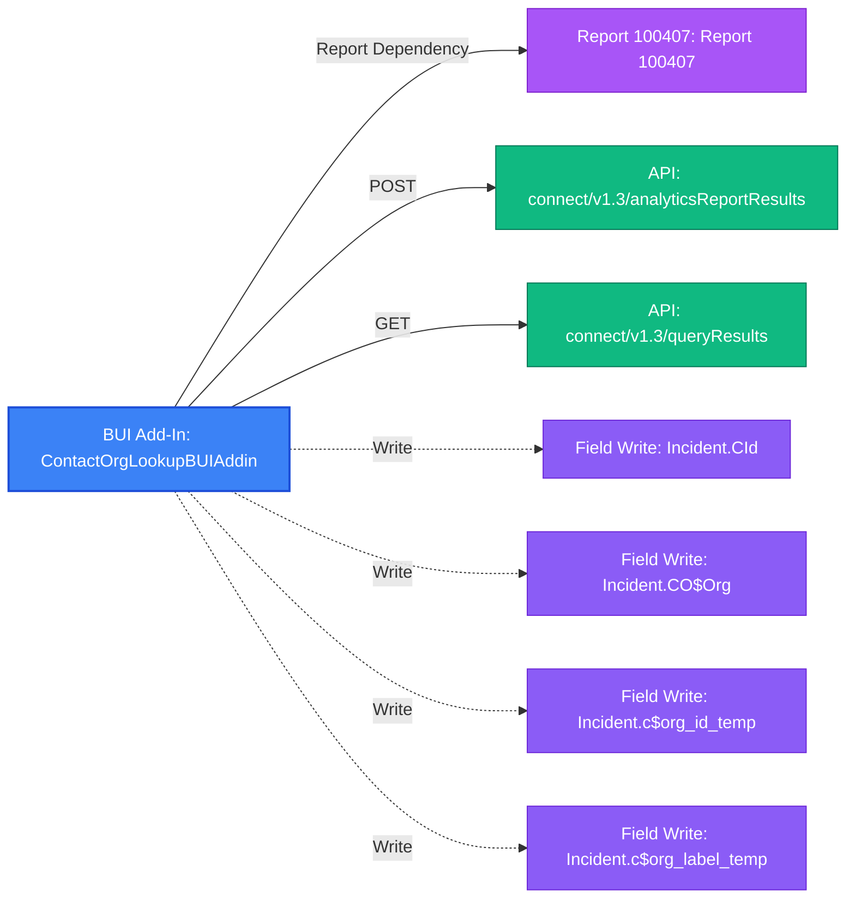

# BUI Add-In: `ContactOrgLookupBUIAddin`

- **Add-In Name**: `ContactOrgLookupBUIAddin`
- **Extension Type**: `BUIAddin`
- **Entry Point**: `init.html`
- **Total Package Files**: 4
- **Risk Findings Count**: 6

---

## Package Structure & Extracted Web Assets

| Asset Filename | Asset Type | Notes |
|---|---|---|
| `ContactOrgDetailsView.html` | `html` | HTML Modal View / UI Page |
| `displayContactOrgResults.js` | `js` | JavaScript Application Logic |
| `init.html` | `html` | Extension Entry Point |
| `logic.js` | `js` | JavaScript Application Logic |

### HTML Live Previews

#### HTML Asset: `init.html`

  

    

<!DOCTYPE html>
<html>
<head>
    
    
    
    
    
    
</head>
<body>
    

    

    

    

    <button id="search_btn">Search Contact/Account</button>
</body>
</html>
    

  

#### HTML Asset: `ContactOrgDetailsView.html`

  

    

<!DOCTYPE html>
<html>
<head>
    
</head>
<body>
    <table id="results"></table>
</body>
</html>
    

  

### External Script & Library Dependencies

- **External Add-In Dependencies**: `../../AuthLibraryExtn/AuthLibraryExtn.js`
- **External Libraries (CDNs/Frameworks)**: `jquery-3.5.1.min.js`, `jquery-3.6.0.min.js`, `jspdf.min.js`, `jspdf.plugin.autotable.min.js`

---

## OSVC Workspace Interactions

- **Fields Read**: `Contact.OrgId`, `Contact.first_name`, `Contact.last_name`, `Incident.CId`, `Incident.CO$Org`, `Incident.IId`, `Incident.c$org_id_temp`, `Incident.c$org_label_temp`, `Incident.c_id`, `Incident.source`
- **Fields Written**: `Incident.CId`, `Incident.CO$Org`, `Incident.c$org_id_temp`, `Incident.c$org_label_temp`
- **Field Listeners Registered**: `Incident.CO$Org`, `Incident.c_id`

---

## Report Dependencies & REST API Endpoints

- **Report Dependencies**: `100407`
### API Call & Web Service Endpoints Table

| HTTP Method | Endpoint URL / Path | Operation Type | Target Object / Table | Report ID | Source Asset |
|---|---|---|---|---|---|
| `POST` | `connect/v1.3/analyticsReportResults` | `REST API` | — | `100407` | `displayContactOrgResults.js` |
| `GET` | `connect/v1.3/queryResults` | `REST API` | `Organizations` | — | `logic.js` |

---

## Static Risk Audit Findings

| Severity | Risk Type | Detail |
|---|---|---|
| Medium | `Synchronous AJAX` | Synchronous AJAX (async: false) detected in logic.js — blocks browser UI thread |
| Medium | `Custom Field Schema Dependency` | Direct CustomFields.c ROQL LookupName query in logic.js — vulnerable to schema alterations |
| **High** | `Duplicate Library Load` | Duplicate jQuery versions loaded in init.html: https://code.jquery.com/jquery-3.5.1.min.js, https://code.jquery.com/jquery-3.6.0.min.js |
| **High** | `Relative Path Dependency` | Relative path script reference '../../AuthLibraryExtn/AuthLibraryExtn.js' in init.html — will fail if add-in path changes |
| Medium | `Hardcoded Report ID` | Hardcoded Report ID 100407 in BUI Add-In code — risks silent failure if report ID changes |
| Low | `Unused Library Import` | jsPDF / jsPDF-AutoTable loaded in HTML headers but unreferenced in JavaScript |

---

## Dependency Flow Diagram

