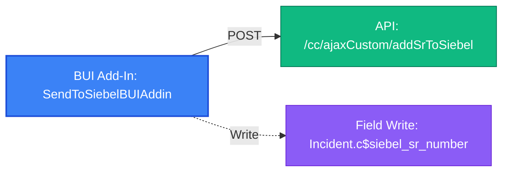

# BUI Add-In: `SendToSiebelBUIAddin`

- **Add-In Name**: `SendToSiebelBUIAddin`
- **Extension Type**: `BUIAddin`
- **Entry Point**: `init.html`
- **Total Package Files**: 5
- **Risk Findings Count**: 6

---

## Package Structure & Extracted Web Assets

| Asset Filename | Asset Type | Notes |
|---|---|---|
| `askForSiebelNumber.html` | `html` | HTML Modal View / UI Page |
| `askForSiebelNumber.js` | `js` | JavaScript Application Logic |
| `init.html` | `html` | Extension Entry Point |
| `logic.js` | `js` | JavaScript Application Logic |
| `successMessage.html` | `html` | HTML Modal View / UI Page |

### HTML Live Previews

#### HTML Asset: `init.html`

  

    

<!DOCTYPE html>
<html lang="en">

<head>
  <meta charset="UTF-8">
  <meta name="viewport" content="width=device-width, initial-scale=1.0">
  <title>Send to Siebel</title>
  
</head>

<body>
  

    <button id="new_siebel_button" class="custom-button">Add New Siebel SR</button>
    <button id="existing_siebel_button" class="custom-button">Add to Existing Siebel SR</button>
  

  <!-- Add your scripts below this line -->
  
  
  
  
  
  <link rel="stylesheet" href="//code.jquery.com/ui/1.12.1/themes/base/jquery-ui.css">

  
  <!--This is library add-in used to fetch session and other application details-->
  
  <!--This has logic to send Incident details to Siebel for creating a New SR or associating with an existing SR-->
</body>

</html>
    

  

#### HTML Asset: `successMessage.html`

  

    

<!DOCTYPE html>
<html>

<head>
    
</head>

<body>
    

        

        <button id="ok_btn">OK</button>
    

    
</body>

</html>
    

  

#### HTML Asset: `askForSiebelNumber.html`

  

    

<!DOCTYPE html>
<html>

<head>
    
    
    
    
    
</head>

<body>
    

        <label for="siebel_number">Enter Siebel SR Number</label>
        <input type="text" id="siebel_number">
        <button id="submit_btn" disabled>Ok</button>
        <button id="cancel_btn">Cancel</button>
        

    

    
    
    
</body>

</html>
    

  

### External Script & Library Dependencies

- **External Add-In Dependencies**: `../../AuthLibraryExtn/AuthLibraryExtn.js`
- **External Libraries (CDNs/Frameworks)**: `jquery-3.6.0.min.js`, `jquery-ui.js`, `jquery.min.js`, `jspdf.min.js`, `jspdf.plugin.autotable.min.js`

---

## OSVC Workspace Interactions

- **Fields Read**: `Incident.Created`, `Incident.IId`, `Incident.c$siebel_sr_number`
- **Fields Written**: `Incident.c$siebel_sr_number`
- **Field Listeners Registered**: `Incident.c$siebel_sr_number`
- **Workspace Lifecycle Hooks**: `RecordSaved`
- **Programmatic Editor Commands**: `Save`
- **Modal View Windows**: `askForSiebelNumber.html` (300x150px in `logic.js`), `successMessage.html?siebel_num=` (250x100px in `logic.js`)

---

## Report Dependencies & REST API Endpoints

- **Report Dependencies**: None
### API Call & Web Service Endpoints Table

| HTTP Method | Endpoint URL / Path | Operation Type | Target Object / Table | Report ID | Source Asset |
|---|---|---|---|---|---|
| `POST` | `/cc/ajaxCustom/addSrToSiebel` | `CP Controller Endpoint` | — | — | `logic.js` |

---

## Static Risk Audit Findings

| Severity | Risk Type | Detail |
|---|---|---|
| Medium | `Synchronous AJAX` | Synchronous AJAX (async: false) detected in logic.js — blocks browser UI thread |
| Medium | `Synchronous AJAX` | Synchronous AJAX (async: false) detected in askForSiebelNumber.js — blocks browser UI thread |
| **High** | `Duplicate Library Load` | Duplicate jQuery versions loaded in init.html: https://ajax.googleapis.com/ajax/libs/jquery/3.5.1/jquery.min.js, https://code.jquery.com/jquery-3.6.0.min.js |
| **High** | `Relative Path Dependency` | Relative path script reference '../../AuthLibraryExtn/AuthLibraryExtn.js' in init.html — will fail if add-in path changes |
| **High** | `Relative Path Dependency` | Relative path script reference '../../AuthLibraryExtn/AuthLibraryExtn.js' in askForSiebelNumber.html — will fail if add-in path changes |
| Low | `Unused Library Import` | jsPDF / jsPDF-AutoTable loaded in HTML headers but unreferenced in JavaScript |

---

## Dependency Flow Diagram

