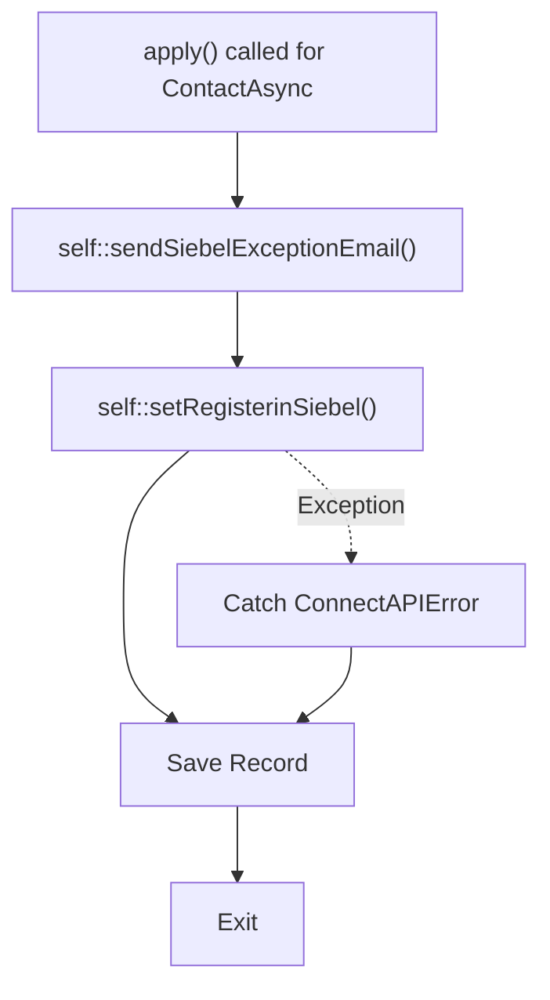
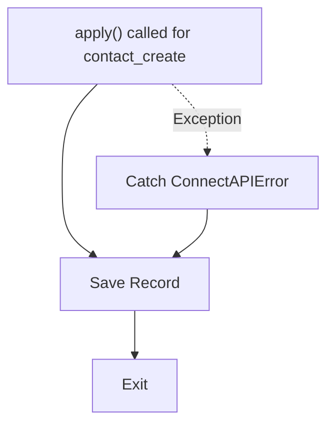
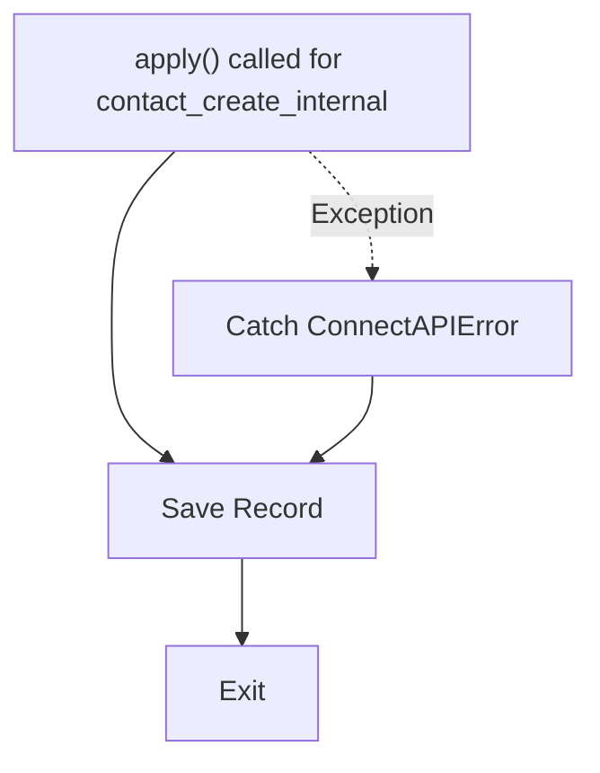
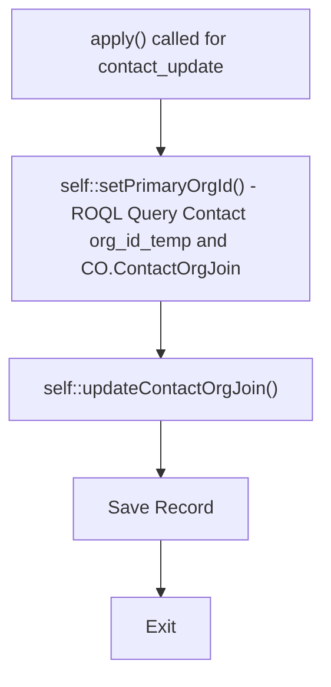
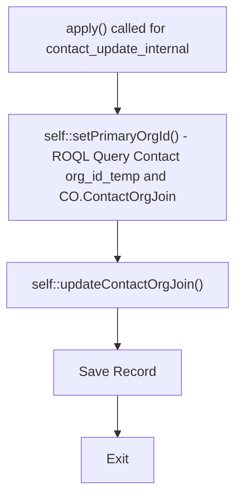
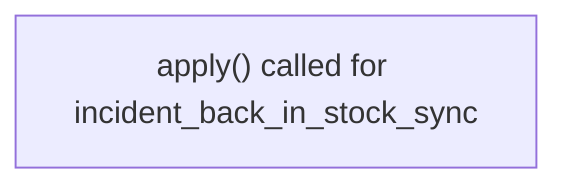
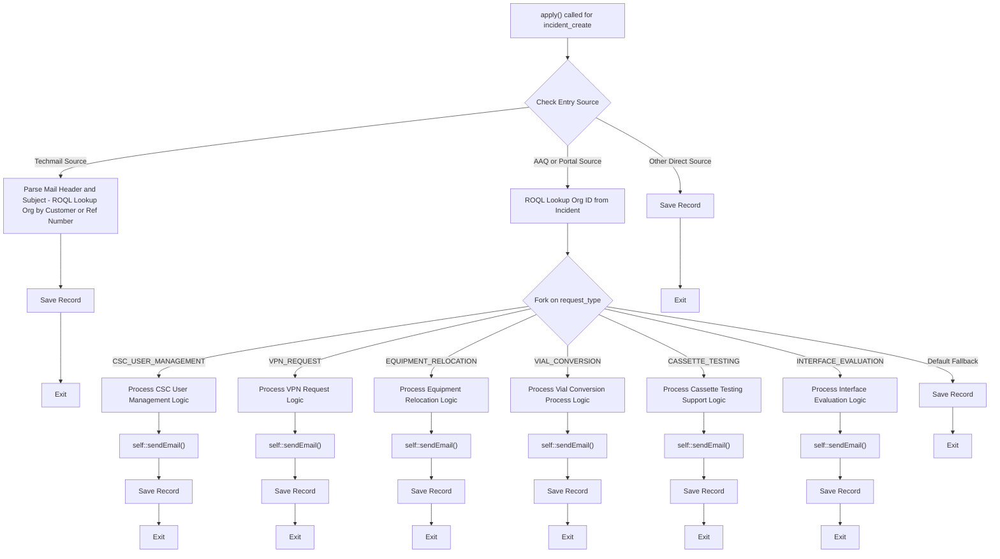
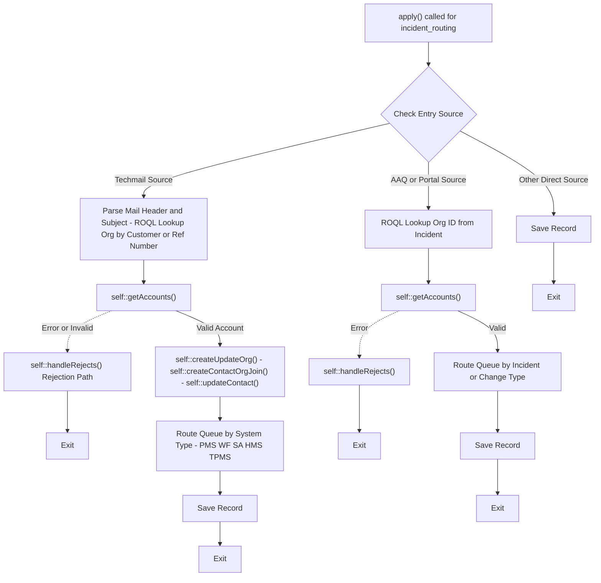
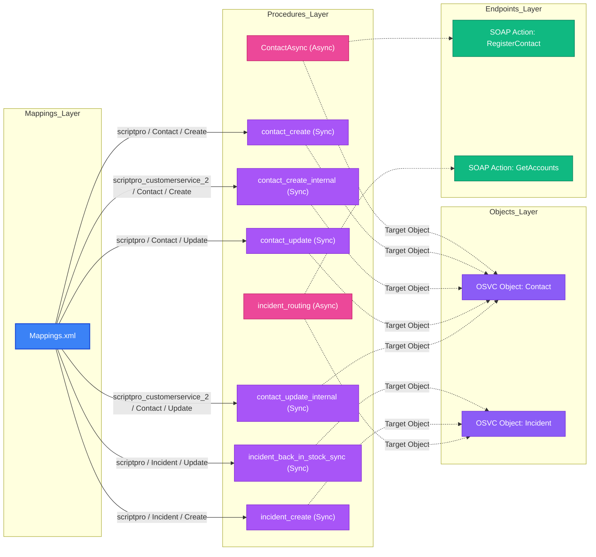

# CPM (Custom Process Model) Summary Report

- **Total Procedures Analyzed**: 8
- **Objects Covered**: `Contact`, `Incident`
- **Execution Breakdown**: 6 Synchronous, 2 Asynchronous
- **Orphan Procedures**: 0 unmapped

---

## Mappings Routing Table (`Mappings.xml`)

| Interface | Object | Event | Procedure | Execution Mode | Mapped Status | Suppress Flag |
|---|---|---|---|---|---|---|
| `scriptpro` | `Contact` | `Create` | `contact_create` | Sync | Active | Yes |
| `scriptpro` | `Contact` | `Update` | `contact_update` | Sync | Active | Yes |
| `scriptpro_customerservice_2` | `Contact` | `Create` | `contact_create_internal` | Sync | Active | Yes |
| `scriptpro_customerservice_2` | `Contact` | `Update` | `contact_update_internal` | Sync | Active | Yes |
| `scriptpro` | `Incident` | `Create` | `incident_create` | Sync | Active | Yes |
| `scriptpro` | `Incident` | `Update` | `incident_back_in_stock_sync` | Sync | Active | Yes |

> **Note on Suppress Flag (`SuppressFlagMapping`)**: In OSVC CPM context, `SuppressFlagMapping` indicates whether recursive event handler execution is suppressed for this object/interface mapping when CPM operations make cascading updates to the same object type.

---

## Cross-Reference Table (CPM Custom Fields ↔ Workspace Fields)

## Object Procedures Breakdown

  
Asynchronous<b>Procedure: ContactAsync</b> (ID: 100007 | Bound: Contact)

  

### Procedure: `ContactAsync`

- **ID**: `100007` | **Version**: `100300 [internal version stamp]` | **PHP Version**: `5.6.0 (50600)`
- **Execution Mode**: `Asynchronous`
- **Operations Bitmask**: `Update (code: 2)`
- **Bound Classes**: `Contact`
- **Mapped Event**: *Unmapped (Orphan Procedure — not found in Mappings.xml)*
- **Key Logic Summary**: This Oracle Service Cloud CPM PHP custom procedure code primarily handles the registration of contacts in Siebel through a SOAP request, and it logs and handles any errors that occur during this process. The code uses the Connect PHP API to interact with the Oracle Service Cloud and implements an object event handler to update contacts, sending a SOAP request to Siebel to register the contact and handling any exceptions or errors that may arise.
- **SOAP Actions / Web Services**: `RegisterContact`
- **Config Settings / Variables**: `CUSTOM_CFG_SIEBEL_PASSWORD`, `CUSTOM_CFG_SIEBEL_URL`, `CUSTOM_CFG_SIEBEL_USERNAME`, `CUSTOM_CFG_WEB_SERVICE_ERROR_EMAIL`

#### Custom Field Workspace Mappings for `ContactAsync`

*No custom fields accessed by this procedure (operates via standard Connect API object properties).*

- **Extracted Functions**: `apply()`, `setRegisterinSiebel()`, `getSoapTop()`, `sendSoapRequest()`, `sendSiebelExceptionEmail()`
- **Message Templates**: `CUSTOM_MSG_WEB_SERVICE_ERROR_BODY`, `CUSTOM_MSG_WEB_SERVICE_ERROR_SUBJECT`

**Logic Flow Diagram**:

  

  
Synchronous<b>Procedure: contact_create</b> (ID: 100001 | Bound: Contact)

  

### Procedure: `contact_create`

- **ID**: `100001` | **Version**: `100300 [internal version stamp]` | **PHP Version**: `5.6.0 (50600)`
- **Execution Mode**: `Synchronous`
- **Operations Bitmask**: `Create (code: 1)`
- **Bound Classes**: `Contact`
- **Mapped Event**: `Contact` on `scriptpro` interface (Create)
- **Key Logic Summary**: This Oracle Service Cloud CPM PHP custom procedure code is designed to handle the creation of new contacts, setting the contact's login to their primary email address and creating a social user account with a display name based on the contact's first name or email address. The code includes error handling and a test harness to validate the functionality of the contact creation process.
- **SOAP Actions**: None

#### Custom Field Workspace Mappings for `contact_create`

*No custom fields accessed by this procedure (operates via standard Connect API object properties).*

- **Extracted Functions**: `apply()`

**Logic Flow Diagram**:

  

  
Synchronous<b>Procedure: contact_create_internal</b> (ID: 100004 | Bound: Contact)

  

### Procedure: `contact_create_internal`

- **ID**: `100004` | **Version**: `100300 [internal version stamp]` | **PHP Version**: `5.6.0 (50600)`
- **Execution Mode**: `Synchronous`
- **Operations Bitmask**: `Create (code: 1)`
- **Bound Classes**: `Contact`
- **Mapped Event**: `Contact` on `scriptpro_customerservice_2` interface (Create)
- **Key Logic Summary**: Instantiates and updates OSVC Connect API objects (`Contact`, `PersonName`, `SocialUser`).
- **SOAP Actions**: None

#### Custom Field Workspace Mappings for `contact_create_internal`

*No custom fields accessed by this procedure (operates via standard Connect API object properties).*

- **Extracted Functions**: `apply()`

**Logic Flow Diagram**:

  

  
Synchronous<b>Procedure: contact_update</b> (ID: 100002 | Bound: Contact)

  

### Procedure: `contact_update`

- **ID**: `100002` | **Version**: `100300 [internal version stamp]` | **PHP Version**: `5.6.0 (50600)`
- **Execution Mode**: `Synchronous`
- **Operations Bitmask**: `Update (code: 2)`
- **Bound Classes**: `Contact`
- **Mapped Event**: `Contact` on `scriptpro` interface (Update)
- **Key Logic Summary**: Executes ROQL queries against OSVC tables (`CO.ContactOrgJoin`, `Contact`). Instantiates and updates OSVC Connect API objects (`CO\ContactOrgJoin`, `Contact`, `Organization`, `PersonName`, ...).
- **SOAP Actions**: None

#### Custom Field Workspace Mappings for `contact_update`

| CPM Custom Field | Access Mode | Target Workspace | Location / Tab | Grid Position | Field Label | Audit / Relationship Note |
|---|---|---|---|---|---|---|
| `c$org_id_temp` | **Write** | **Contact test** | Top Form Layout | Row 5, Col 0 | OrgId (Account Lookup) | Temporary Org ID used to populate Contact Organization linkage |

- **Extracted Functions**: `apply()`, `setPrimaryOrgId()`, `updateContactOrgJoin()`

**Logic Flow Diagram**:

  

  
Synchronous<b>Procedure: contact_update_internal</b> (ID: 100005 | Bound: Contact)

  

### Procedure: `contact_update_internal`

- **ID**: `100005` | **Version**: `100300 [internal version stamp]` | **PHP Version**: `5.6.0 (50600)`
- **Execution Mode**: `Synchronous`
- **Operations Bitmask**: `Update (code: 2)`
- **Bound Classes**: `Contact`
- **Mapped Event**: `Contact` on `scriptpro_customerservice_2` interface (Update)
- **Key Logic Summary**: Executes ROQL queries against OSVC tables (`CO.ContactOrgJoin`, `Contact`). Instantiates and updates OSVC Connect API objects (`CO\ContactOrgJoin`, `Contact`, `Organization`, `PersonName`, ...).
- **SOAP Actions**: None

#### Custom Field Workspace Mappings for `contact_update_internal`

| CPM Custom Field | Access Mode | Target Workspace | Location / Tab | Grid Position | Field Label | Audit / Relationship Note |
|---|---|---|---|---|---|---|
| `c$org_id_temp` | **Read** | **Contact test** | Top Form Layout | Row 5, Col 0 | OrgId (Account Lookup) | Temporary Org ID used to populate Contact Organization linkage |

- **Extracted Functions**: `apply()`, `setPrimaryOrgId()`, `updateContactOrgJoin()`

**Logic Flow Diagram**:

  

  
Synchronous<b>Procedure: incident_back_in_stock_sync</b> (ID: 100099 | Bound: Incident)

  

### Procedure: `incident_back_in_stock_sync`

- **ID**: `100099` | **Version**: `100400 [internal version stamp]` | **PHP Version**: `5.6.0 (50600)`
- **Execution Mode**: `Synchronous`
- **Operations Bitmask**: `Create (code: 1)`
- **Bound Classes**: `Incident`
- **Mapped Event**: `Incident` on `scriptpro` interface (Update)
- **Key Logic Summary**: Executes static custom handler logic for `incident_back_in_stock_sync`.
- **SOAP Actions**: None

#### Custom Field Workspace Mappings for `incident_back_in_stock_sync`

| CPM Custom Field | Access Mode | Target Workspace | Location / Tab | Grid Position | Field Label | Audit / Relationship Note |
|---|---|---|---|---|---|---|
| `c$oos_status` | **Write** | ***(Background Logic)*** | — | — | — | Operated purely via Connect API / CPM script logic |

- **Extracted Functions**: `apply()`

**Logic Flow Diagram**:

  

  
Synchronous<b>Procedure: incident_create</b> (ID: 100003 | Bound: Incident)

  

### Procedure: `incident_create`

- **ID**: `100003` | **Version**: `100400 [internal version stamp]` | **PHP Version**: `5.6.0 (50600)`
- **Execution Mode**: `Synchronous`
- **Operations Bitmask**: `Create (code: 1)`
- **Bound Classes**: `Incident`
- **Mapped Event**: `Incident` on `scriptpro` interface (Create)
- **Key Logic Summary**: Processes Techmail-originated incoming records. Parses email headers and subject lines for reference numbers and customer identifiers via regex. Executes ROQL queries against OSVC tables (`Incident`). Instantiates and updates OSVC Connect API objects (`Incident`, `MailMessage`, `MessageBase`, `NamedIDOptList`, ...).
- **SOAP Actions**: None

#### Custom Field Workspace Mappings for `incident_create`

| CPM Custom Field | Access Mode | Target Workspace | Location / Tab | Grid Position | Field Label | Audit / Relationship Note |
|---|---|---|---|---|---|---|
| `c$change_request_type` | **Read** | ***(Background Logic)*** | — | — | — | Operated purely via Connect API / CPM script logic |
| `c$customer_email_address` | **Read** | ***(Background Logic)*** | — | — | — | Operated purely via Connect API / CPM script logic |
| `c$customer_name` | **Read** | ***(Background Logic)*** | — | — | — | Operated purely via Connect API / CPM script logic |
| `c$customer_phone` | **Read** | ***(Background Logic)*** | — | — | — | Operated purely via Connect API / CPM script logic |
| `c$drug_code` | **Read** | ***(Background Logic)*** | — | — | — | Operated purely via Connect API / CPM script logic |
| `c$drug_distributor` | **Read** | ***(Background Logic)*** | — | — | — | Operated purely via Connect API / CPM script logic |
| `c$drug_dosage` | **Read** | ***(Background Logic)*** | — | — | — | Operated purely via Connect API / CPM script logic |
| `c$drug_name` | **Read** | ***(Background Logic)*** | — | — | — | Operated purely via Connect API / CPM script logic |
| `c$drug_part_number` | **Read** | ***(Background Logic)*** | — | — | — | Operated purely via Connect API / CPM script logic |
| `c$incident_type` | **Read** | ***(Background Logic)*** | — | — | — | Operated purely via Connect API / CPM script logic |
| `c$move_type` | **Read** | ***(Background Logic)*** | — | — | — | Operated purely via Connect API / CPM script logic |
| `c$mp_type` | **Read** | ***(Background Logic)*** | — | — | — | Operated purely via Connect API / CPM script logic |
| `c$new_vpn_setup` | **Read** | ***(Background Logic)*** | — | — | — | Operated purely via Connect API / CPM script logic |
| `c$org_id_temp` | **Read** | **Contact test** | Top Form Layout | Row 5, Col 0 | OrgId (Account Lookup) | Temporary Org ID used to populate Contact Organization linkage |
| `c$testing_type` | **Read** | ***(Background Logic)*** | — | — | — | Operated purely via Connect API / CPM script logic |
| `c$token` | **Write** | **Incident** | Tab: Details | *(Custom Field)* | c$token | [Audit Flag: verify security/session token written on incident create] |
| `c$user_profile` | **Read** | ***(Background Logic)*** | — | — | — | Operated purely via Connect API / CPM script logic |
| `c$user_request_type` | **Read** | ***(Background Logic)*** | — | — | — | Operated purely via Connect API / CPM script logic |

- **Extracted Functions**: `apply()`, `getRandomString()`, `sendEmail()`
- **Constants Defined**: `CSC_USER_MANAGMENT:53`, `VPN_REQUEST:74`, `EQUIPMENT_RELOCATION_REQUEST:54`, `VIAL_CONVERSION_PROCESS_REQUEST:55`, `CASSETTE_TESTING_SUPPORT:76`, `INTERFACE_EVALUATION:79`, `THREAD_ENTRY_TYPE_PRIVATE_NOTE:1`, `THREAD_ENTRY_TYPE_CUSTOMER:3`, `THREAD_CONTENT_TYPE_HTML:2`
- **Message Templates**: `CUSTOM_MSG_ACCOUNT_QUESTIONS_LBL`, `CUSTOM_MSG_ADDITIONAL_DETAILS_LBL`, `CUSTOM_MSG_CC_EMAIL`, `CUSTOM_MSG_CC_SUBJECT`, `CUSTOM_MSG_CURRENT_MANUFACTURER_LBL`, `CUSTOM_MSG_EQUIPMENT_LBL`, `CUSTOM_MSG_NEW_MANUFACTURER_LBL`, `CUSTOM_MSG_PARTY_RESPONSIBLE_LBL`, `CUSTOM_MSG_TESTING_DETAILS_LBL`

**Logic Flow Diagram**:

  

  
Asynchronous<b>Procedure: incident_routing</b> (ID: 100006 | Bound: Incident)

  

### Procedure: `incident_routing`

- **ID**: `100006` | **Version**: `100400 [internal version stamp]` | **PHP Version**: `5.6.0 (50600)`
- **Execution Mode**: `Asynchronous`
- **Operations Bitmask**: `Create, Update (code: 3)`
- **Bound Classes**: `Incident`
- **Mapped Event**: *Unmapped (Orphan Procedure — not found in Mappings.xml)*
- **Key Logic Summary**: Processes Techmail-originated incoming records. Parses email headers and subject lines for reference numbers and customer identifiers via regex. Queries external Siebel SOAP web services (`GetAccounts`). Executes ROQL queries against OSVC tables (`Incident`, `Organization`). Instantiates and updates OSVC Connect API objects (`CO\ContactOrgJoin`, `Configuration`, `Contact`, `GroupAccount`, ...). Evaluates customer eligibility and dispatches rejection notification emails for unregistered or invalid accounts.
- **SOAP Actions / Web Services**: `GetAccounts`
- **Config Settings / Variables**: `CUSTOM_CFG_MAILBOX_ACCOUNT_MANAGEMENT`, `CUSTOM_CFG_MAILBOX_TECH_SUPPORT`, `CUSTOM_CFG_SIEBEL_PASSWORD`, `CUSTOM_CFG_SIEBEL_URL`, `CUSTOM_CFG_SIEBEL_USERNAME`

#### Custom Field Workspace Mappings for `incident_routing`

| CPM Custom Field | Access Mode | Target Workspace | Location / Tab | Grid Position | Field Label | Audit / Relationship Note |
|---|---|---|---|---|---|---|
| `c$change_request_type` | **Read** | ***(Background Logic)*** | — | — | — | Operated purely via Connect API / CPM script logic |
| `c$customer_number` | **Write** | **Contact test** | Top Form Layout | Row 7, Col 0 | C$CustomerId | Matches customer number / ID field |
| `c$customer_number` | **Write** | **New Workspace** | Tab: Customer 360 | Row 0, Col 0 | C$AccountNumber | Matches customer account identifier |
| `c$force_update` | **Write** | ***(Background Logic)*** | — | — | — | Operated purely via Connect API / CPM script logic |
| `c$incident_routing_outcome` | **Write** | ***(Background Logic)*** | — | — | — | Operated purely via Connect API / CPM script logic |
| `c$incident_type` | **Read** | ***(Background Logic)*** | — | — | — | Operated purely via Connect API / CPM script logic |
| `c$is_admin` | **Write** | **Contact test** | Tab: Contact Fields | Row 10, Col 0 | c$is_admin | Updated by incident_routing handler |
| `c$is_manual` | **Write** | **Contact test** | Tab: Contact Fields | Row 9, Col 0 (Col 9) | c$is_manual | Expected write from contact_create_internal — not detected in exported Content |
| `c$no_chat` | **Write** | ***(Background Logic)*** | — | — | — | Operated purely via Connect API / CPM script logic |
| `c$org_id_temp` | **Write** | **Contact test** | Top Form Layout | Row 5, Col 0 | OrgId (Account Lookup) | Temporary Org ID used to populate Contact Organization linkage |
| `c$org_label_temp` | **Write** | ***(Background Logic)*** | — | — | — | Operated purely via Connect API / CPM script logic |
| `c$siebel_status` | **Read** | ***(Background Logic)*** | — | — | — | Operated purely via Connect API / CPM script logic |
| `c$sp_system_type` | **Read** | ***(Background Logic)*** | — | — | — | Operated purely via Connect API / CPM script logic |
| `c$type_name` | **Read** | ***(Background Logic)*** | — | — | — | Operated purely via Connect API / CPM script logic |

- **Extracted Functions**: `apply()`, `handleRejects()`, `sendEmail()`, `getAccounts()`, `getSoapTop()`, `sendSoapRequest()`, `createUpdateOrg()`, `getOrgId()`, `updateContact()`, `createContactOrgJoin()`
- **Message Templates**: `CUSTOM_MSG_REJECT_BOTH`, `CUSTOM_MSG_REJECT_CUSTOMER_NUMBER`, `CUSTOM_MSG_REJECT_EMAIL`, `CUSTOM_MSG_REJECT_MISMATCH`, `CUSTOM_MSG_REJECT_SIEBEL_300`, `CUSTOM_MSG_REJECT_SP_TYPE`, `CUSTOM_MSG_REJECT_SUBJECT`, `CUSTOM_MSG_REJECT_SUPPORT_HOLD`, `CUSTOM_MSG_REJECT_TEMPLATE`

**Logic Flow Diagram**:

  

---

## Flow Diagram

