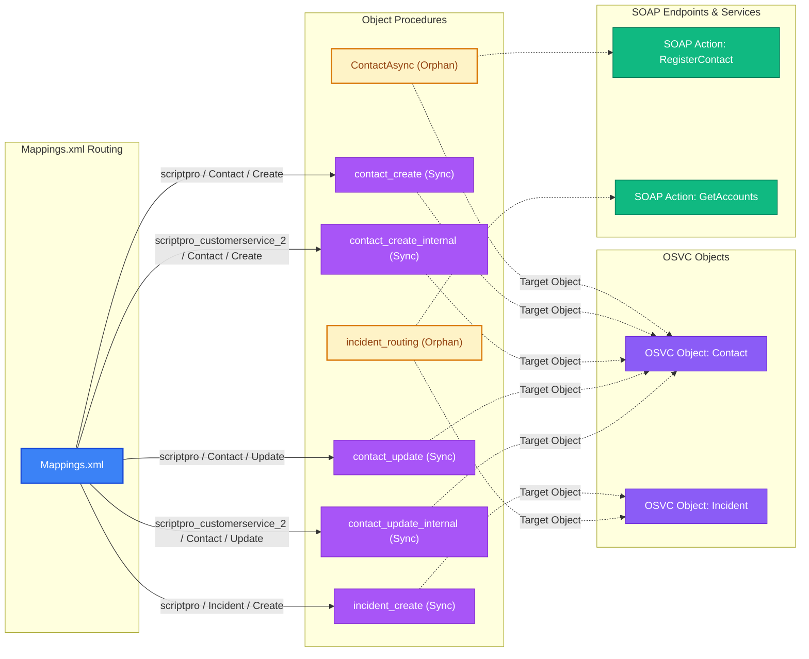

# CPM (Custom Process Model) Summary Report

- **Total Procedures Analyzed**: 7
- **Objects Covered**: `Contact`, `Incident`
- **Execution Breakdown**: 5 Synchronous, 2 Asynchronous
- **Orphan Procedures**: 2 unmapped

---

## Mappings Routing Table (`Mappings.xml`)

| Interface | Object | Event | Procedure | Execution Mode | Mapped Status | Suppress Flag |
|---|---|---|---|---|---|---|
| `scriptpro` | `Contact` | `Create` | `contact_create` | Sync | Active | Yes |
| `scriptpro` | `Contact` | `Update` | `contact_update` | Sync | Active | Yes |
| `scriptpro_customerservice_2` | `Contact` | `Create` | `contact_create_internal` | Sync | Active | Yes |
| `scriptpro_customerservice_2` | `Contact` | `Update` | `contact_update_internal` | Sync | Active | Yes |
| `scriptpro` | `Incident` | `Create` | `incident_create` | Sync | Active | Yes |

> **Note on Suppress Flag (`SuppressFlagMapping`)**: In OSVC CPM context, `SuppressFlagMapping` indicates whether recursive event handler execution is suppressed for this object/interface mapping when CPM operations make cascading updates to the same object type.

---

## Cross-Reference Table (CPM Custom Fields ↔ Workspace Fields)

| CPM Custom Field | CPM Usage (Per Procedure) | Workspace Link / Location | Grid Position | Field Label | Audit / Relationship Note |
|---|---|---|---|---|---|
| `c$change_request_type` | `incident_create` (Read), `incident_routing` (Read) | *(No direct workspace form layout field match)* | — | — | — |
| `c$customer_email_address` | `incident_create` (Read) | *(No direct workspace form layout field match)* | — | — | — |
| `c$customer_name` | `incident_create` (Read) | *(No direct workspace form layout field match)* | — | — | — |
| `c$customer_number` | `incident_routing` (Write) | **Contact test** (Top Form Layout) | Row 7, Col 0 | C$CustomerId | Matches customer number / ID field |
| `c$customer_number` | `incident_routing` (Write) | **New Workspace** (Tab: Customer 360) | Row 0, Col 0 | C$AccountNumber | Matches customer account identifier |
| `c$customer_phone` | `incident_create` (Read) | *(No direct workspace form layout field match)* | — | — | — |
| `c$drug_code` | `incident_create` (Read) | *(No direct workspace form layout field match)* | — | — | — |
| `c$drug_distributor` | `incident_create` (Read) | *(No direct workspace form layout field match)* | — | — | — |
| `c$drug_dosage` | `incident_create` (Read) | *(No direct workspace form layout field match)* | — | — | — |
| `c$drug_name` | `incident_create` (Read) | *(No direct workspace form layout field match)* | — | — | — |
| `c$drug_part_number` | `incident_create` (Read) | *(No direct workspace form layout field match)* | — | — | — |
| `c$force_update` | `incident_routing` (Write) | *(No direct workspace form layout field match)* | — | — | — |
| `c$incident_routing_outcome` | `incident_routing` (Write) | *(No direct workspace form layout field match)* | — | — | — |
| `c$incident_type` | `incident_create` (Read), `incident_routing` (Read) | *(No direct workspace form layout field match)* | — | — | — |
| `c$is_admin` | `incident_routing` (Write) | **Contact test** (Tab: Contact Fields) | Row 10, Col 0 | c$is_admin | Updated by incident_routing handler |
| `c$is_manual` | `incident_routing` (Write) | **Contact test** (Tab: Contact Fields) | Row 9, Col 0 (Col 9) | c$is_manual | Expected write from contact_create_internal — not detected in exported Content |
| `c$move_type` | `incident_create` (Read) | *(No direct workspace form layout field match)* | — | — | — |
| `c$mp_type` | `incident_create` (Read) | *(No direct workspace form layout field match)* | — | — | — |
| `c$new_vpn_setup` | `incident_create` (Read) | *(No direct workspace form layout field match)* | — | — | — |
| `c$no_chat` | `incident_routing` (Write) | *(No direct workspace form layout field match)* | — | — | — |
| `c$org_id_temp` | `contact_update` (Write), `contact_update_internal` (Read), `incident_create` (Read), `incident_routing` (Write) | **Contact test** (Top Form Layout) | Row 5, Col 0 | OrgId (Account Lookup) | Temporary Org ID used to populate Contact Organization linkage |
| `c$org_label_temp` | `incident_routing` (Write) | *(No direct workspace form layout field match)* | — | — | — |
| `c$siebel_status` | `incident_routing` (Read) | *(No direct workspace form layout field match)* | — | — | — |
| `c$sp_system_type` | `incident_routing` (Read) | *(No direct workspace form layout field match)* | — | — | — |
| `c$testing_type` | `incident_create` (Read) | *(No direct workspace form layout field match)* | — | — | — |
| `c$token` | `incident_create` (Write) | **Incident** (Tab: Details) | *(Custom Field)* | c$token | [Audit Flag: verify security/session token written on incident create] |
| `c$type_name` | `incident_routing` (Read) | *(No direct workspace form layout field match)* | — | — | — |
| `c$user_profile` | `incident_create` (Read) | *(No direct workspace form layout field match)* | — | — | — |
| `c$user_request_type` | `incident_create` (Read) | *(No direct workspace form layout field match)* | — | — | — |

---

## Object Procedures Breakdown

### Procedure: `ContactAsync` `[Orphan Procedure]`

- **ID**: `100007` | **Version**: `100300 [internal version stamp]` | **PHP Version**: `5.6.0 (50600)`
- **Execution Mode**: `Asynchronous`
- **Operations Bitmask**: `Update (code: 2)`
- **Bound Classes**: `Contact`
- **Mapped Event**: *Unmapped (Orphan Procedure — not found in Mappings.xml)*
- **Key Logic Summary**: Parses email headers and subject lines for reference numbers and customer identifiers via regex. Queries external Siebel SOAP web services (`RegisterContact`). Instantiates and updates OSVC Connect API objects (`Configuration`, `Contact`, `MailMessage`, `MessageBase`, ...).
- **SOAP Actions / Web Services**: `RegisterContact`
- **Config Settings / Variables**: `CUSTOM_CFG_SIEBEL_PASSWORD`, `CUSTOM_CFG_SIEBEL_URL`, `CUSTOM_CFG_SIEBEL_USERNAME`, `CUSTOM_CFG_WEB_SERVICE_ERROR_EMAIL`
- **Custom Fields Read**: None *(operates via standard Connect API object properties)*
- **Custom Fields Written**: None *(operates via standard Connect API object properties)*

### Procedure: `contact_create`

- **ID**: `100001` | **Version**: `100300 [internal version stamp]` | **PHP Version**: `5.6.0 (50600)`
- **Execution Mode**: `Synchronous`
- **Operations Bitmask**: `Create (code: 1)`
- **Bound Classes**: `Contact`
- **Mapped Event**: `Contact` on `scriptpro` interface (Create)
- **Key Logic Summary**: Processes Techmail-originated incoming records. Instantiates and updates OSVC Connect API objects (`Contact`, `PersonName`, `SocialUser`).
- **SOAP Actions**: None
- **Custom Fields Read**: None *(operates via standard Connect API object properties)*
- **Custom Fields Written**: None *(operates via standard Connect API object properties)*

### Procedure: `contact_create_internal`

- **ID**: `100004` | **Version**: `100300 [internal version stamp]` | **PHP Version**: `5.6.0 (50600)`
- **Execution Mode**: `Synchronous`
- **Operations Bitmask**: `Create (code: 1)`
- **Bound Classes**: `Contact`
- **Mapped Event**: `Contact` on `scriptpro_customerservice_2` interface (Create)
- **Key Logic Summary**: Instantiates and updates OSVC Connect API objects (`Contact`, `PersonName`, `SocialUser`).
- **SOAP Actions**: None
- **Custom Fields Read**: None *(operates via standard Connect API object properties)*
- **Custom Fields Written**: None *(operates via standard Connect API object properties)*

### Procedure: `contact_update`

- **ID**: `100002` | **Version**: `100300 [internal version stamp]` | **PHP Version**: `5.6.0 (50600)`
- **Execution Mode**: `Synchronous`
- **Operations Bitmask**: `Update (code: 2)`
- **Bound Classes**: `Contact`
- **Mapped Event**: `Contact` on `scriptpro` interface (Update)
- **Key Logic Summary**: Executes ROQL queries against OSVC tables (`CO.ContactOrgJoin`, `Contact`). Instantiates and updates OSVC Connect API objects (`CO\ContactOrgJoin`, `Contact`, `Organization`, `PersonName`, ...).
- **SOAP Actions**: None
- **Custom Fields Read**: None *(operates via standard Connect API object properties)*
- **Custom Fields Written**: `c$org_id_temp`

### Procedure: `contact_update_internal`

- **ID**: `100005` | **Version**: `100300 [internal version stamp]` | **PHP Version**: `5.6.0 (50600)`
- **Execution Mode**: `Synchronous`
- **Operations Bitmask**: `Update (code: 2)`
- **Bound Classes**: `Contact`
- **Mapped Event**: `Contact` on `scriptpro_customerservice_2` interface (Update)
- **Key Logic Summary**: Executes ROQL queries against OSVC tables (`CO.ContactOrgJoin`, `Contact`). Instantiates and updates OSVC Connect API objects (`CO\ContactOrgJoin`, `Contact`, `Organization`, `PersonName`, ...).
- **SOAP Actions**: None
- **Custom Fields Read**: `c$org_id_temp`
- **Custom Fields Written**: None *(operates via standard Connect API object properties)*

### Procedure: `incident_create`

- **ID**: `100003` | **Version**: `100400 [internal version stamp]` | **PHP Version**: `5.6.0 (50600)`
- **Execution Mode**: `Synchronous`
- **Operations Bitmask**: `Create (code: 1)`
- **Bound Classes**: `Incident`
- **Mapped Event**: `Incident` on `scriptpro` interface (Create)
- **Key Logic Summary**: Processes Techmail-originated incoming records. Parses email headers and subject lines for reference numbers and customer identifiers via regex. Executes ROQL queries against OSVC tables (`Incident`). Instantiates and updates OSVC Connect API objects (`Incident`, `MailMessage`, `MessageBase`, `NamedIDOptList`, ...).
- **SOAP Actions**: None
- **Custom Fields Read**: `c$change_request_type`, `c$customer_email_address`, `c$customer_name`, `c$customer_phone`, `c$drug_code`, `c$drug_distributor`, `c$drug_dosage`, `c$drug_name`, `c$drug_part_number`, `c$incident_type`, `c$move_type`, `c$mp_type`, `c$new_vpn_setup`, `c$org_id_temp`, `c$testing_type`, `c$user_profile`, `c$user_request_type`
- **Custom Fields Written**: `c$token` `[Audit Flag: verify security/session token written on incident create]`

### Procedure: `incident_routing` `[Orphan Procedure]`

- **ID**: `100006` | **Version**: `100400 [internal version stamp]` | **PHP Version**: `5.6.0 (50600)`
- **Execution Mode**: `Asynchronous`
- **Operations Bitmask**: `Create, Update (code: 3)`
- **Bound Classes**: `Incident`
- **Mapped Event**: *Unmapped (Orphan Procedure — not found in Mappings.xml)*
- **Key Logic Summary**: Processes Techmail-originated incoming records. Parses email headers and subject lines for reference numbers and customer identifiers via regex. Queries external Siebel SOAP web services (`GetAccounts`). Executes ROQL queries against OSVC tables (`Incident`, `Organization`). Instantiates and updates OSVC Connect API objects (`CO\ContactOrgJoin`, `Configuration`, `Contact`, `GroupAccount`, ...). Evaluates customer eligibility and dispatches rejection notification emails for unregistered or invalid accounts.
- **SOAP Actions / Web Services**: `GetAccounts`
- **Config Settings / Variables**: `CUSTOM_CFG_MAILBOX_ACCOUNT_MANAGEMENT`, `CUSTOM_CFG_MAILBOX_TECH_SUPPORT`, `CUSTOM_CFG_SIEBEL_PASSWORD`, `CUSTOM_CFG_SIEBEL_URL`, `CUSTOM_CFG_SIEBEL_USERNAME`
- **Custom Fields Read**: `c$change_request_type`, `c$incident_type`, `c$siebel_status`, `c$sp_system_type`, `c$type_name`
- **Custom Fields Written**: `c$customer_number`, `c$force_update`, `c$incident_routing_outcome`, `c$is_admin`, `c$is_manual`, `c$no_chat`, `c$org_id_temp`, `c$org_label_temp`

---

## Flow Diagram

