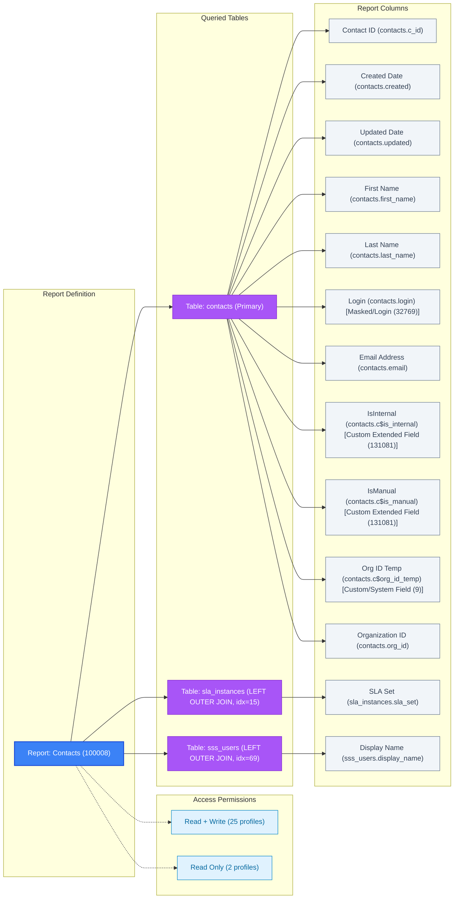

# Report: Contacts (ID: 100008)

- Type: **Grid Report** (ac_type=1, public)
- Primary Table: `contacts`
- Created: `2015-12-08T22:59:56Z` | Last Updated: `2016-02-26T04:18:42Z`
- Folder ID: `100692` | Owner Account ID: 4 `[unresolved account ID]` | Interface ID: `1` | Image Icon: `6`
- Nodes (1): `Node #1 (style_id=12, row_limit=None)`
- Display Layout: `ShowDataAreaAsGrid` | Hidden Sections: `Charts`, `Exceptions`, `ReportFooter`, `ReportHeader`, `SearchCriteria`
- Options & Aux: `opts=4 `[unresolved bitmask]``, `time_zone=0` | `aux=1.0.2,1.31.2,1.0.43,1.0.3,1.32.3`
- Export Signature: `Version: 26.2.0.326 | 2.JJfk3KZO5EXP+QKvd7LS0RNgyb/cDHjJTmcYJKAF+zBkAjT1`
- Sort: `contacts.updated — Descending (primary)`
- Filters: None configured (empty `<filters/>` in source XML)

---

### Columns (13)

| # | Source Field | Table | Label | Data Type | Column Attrs | Sort |
|---|---|---|---|---|---|---|
| 1 | `contacts.c_id` | `contacts` | Contact ID | Integer/ID (3) | Standard (1) | — |
| 2 | `contacts.created` | `contacts` | Created Date | DateTime (4) | Standard (1) | — |
| 3 | `contacts.updated` | `contacts` | Updated Date | DateTime (4) | Standard (1) | Sort #1 ↓ (primary) |
| 4 | `contacts.first_name` | `contacts` | First Name | String (5) | Standard (1) | — |
| 5 | `contacts.last_name` | `contacts` | Last Name | String (5) | Standard (1) | — |
| 6 | `contacts.login` | `contacts` | Login | String (5) | Masked/Login (32769) | — |
| 7 | `contacts.email` | `contacts` | Email Address | String (5) | Standard (1) | — |
| 8 | `contacts.c$is_internal` | `contacts` | IsInternal | Integer (1) | Custom Extended Field (131081) | — |
| 9 | `contacts.c$is_manual` | `contacts` | IsManual | Integer (1) | Custom Extended Field (131081) | — |
| 10 | `sla_instances.sla_set` | `sla_instances` | SLA Set | Integer/ID (3) | Standard (1) | — |
| 11 | `contacts.c$org_id_temp` | `contacts` | Org ID Temp | Integer/ID (3) | Custom/System Field (9) | — |
| 12 | `contacts.org_id` | `contacts` | Organization ID | Integer/ID (3) | Standard (1) | — |
| 13 | `sss_users.display_name` | `sss_users` | Display Name | String (5) | Standard (1) | — |

*Column sequence is ordered by `display_order` from XML.*

> **Attribute Footnote**: `Masked/Login (32769)` indicates column value represents user credential or login identity (partially masked/hashed in UI). `Custom/System Field (9)` indicates custom field or primary system identifier.

> **Column Validation Note**: All 13 columns verified against internal table references (`val_col_refs`).

---

### Table Joins (3)

| Table | Alias | Join Type | Join Def Index | Join Condition |
|---|---|---|---|---|
| `contacts (tbl 2)` | `contacts` | Primary | `—` | `—` |
| `sla_instances (tbl 43)` | `sla_instances` | LEFT OUTER JOIN | `15` | `contacts.c_id = sla_instances.owner_id` |
| `sss_users (tbl 623)` | `sss_users` | LEFT OUTER JOIN | `69` | `contacts.common_user_id = sss_users.common_user_id` |

---

### Permissions (27 profiles)

- **Read + Write:** profiles `2`, `4`, `7`, `8`, `9`, `10`, `11`, `14`, `15`, `16`, `27`, `28`, `30`, `31`, `32`, `33`, `34`, `35`, `37`, `39`, `40`, `41`, `42`, `43`, `44`
- **Read Only:** profiles `22`, `36`

---

## Flow Diagram

