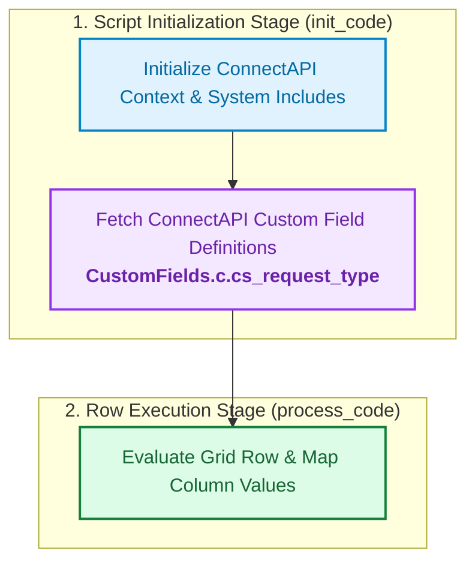
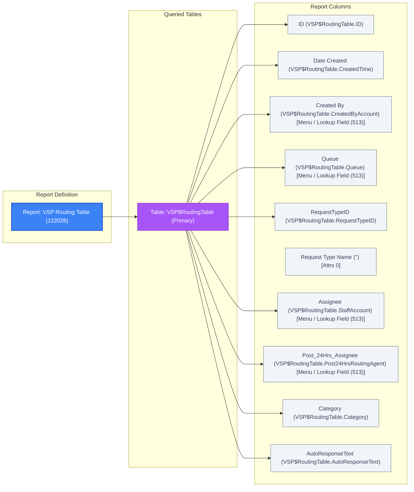

# Report: VSP Routing Table (ID: 122026)

- Type: **Grid Report** (ac_type=1, private)
- Primary Table: `VSP$RoutingTable`
- Created: `0001-01-01T00:00:00` | Last Updated: `2024-08-22T14:22:06Z`
- Folder ID: `200614` | Owner Account ID: 0 `[unresolved account ID]` | Interface ID: `1` | Image Icon: `8`
- Nodes (1): `Node #1 (style_id=12, row_limit=None)`
- Display Layout: `ShowDataAreaAsGrid` | Hidden Sections: `Charts`, `Exceptions`, `ReportFooter`, `ReportHeader`, `SearchCriteria`
- Options & Aux: `opts=1028 `[unresolved bitmask]``, `time_zone=0` | `aux=1.0.10169,1.0.24,1.0.237`
- Export Signature: `Version: 26.5.0.293 | 2.X9+aSUuL0hTSrjG9QKGASr8wnGi4UQVLJw2+jzQeBzeUkJY0`
- Sort: `VSP$RoutingTable.RequestTypeID — Ascending (primary)`
- Filters: 1 configured

---

### Columns (10)

| # | Source Field | Table | Label | Data Type | Column Attrs | Sort |
|---|---|---|---|---|---|---|
| 1 | `VSP$RoutingTable.ID` | `VSP$RoutingTable` | ID | Integer/ID (3) | Standard (1) | — |
| 2 | `VSP$RoutingTable.CreatedTime` | `VSP$RoutingTable` | Date Created | DateTime (4) | Standard (1) | — |
| 3 | `VSP$RoutingTable.CreatedByAccount` | `VSP$RoutingTable` | Created By | Integer (1) | Menu / Lookup Field (513) | — |
| 4 | `VSP$RoutingTable.Queue` | `VSP$RoutingTable` | Queue | Integer (1) | Menu / Lookup Field (513) | Sort #2 ↑ (secondary) |
| 5 | `VSP$RoutingTable.RequestTypeID` | `VSP$RoutingTable` | RequestTypeID | Integer/ID (3) | Standard (1) | Sort #1 ↑ (primary) |
| 6 | `''` | `—` | Request Type Name | String (5) | Attrs 0 | — |
| 7 | `VSP$RoutingTable.StaffAccount` | `VSP$RoutingTable` | Assignee | Integer (1) | Menu / Lookup Field (513) | — |
| 8 | `VSP$RoutingTable.Post24HrsRoutingAgent` | `VSP$RoutingTable` | Post_24Hrs_Assignee | Integer (1) | Menu / Lookup Field (513) | — |
| 9 | `VSP$RoutingTable.Category` | `VSP$RoutingTable` | Category | Integer (1) | Standard (1) | — |
| 10 | `VSP$RoutingTable.AutoResponseText` | `VSP$RoutingTable` | AutoResponseText | Boolean (6) | Standard (1) | — |

*Column sequence is ordered by `display_order` from XML.*

> **Attribute Footnote**: `Masked/Login (32769)` indicates column value represents user credential or login identity (partially masked/hashed in UI). `Custom/System Field (9)` indicates custom field or primary system identifier.

> **Column Validation Note**: All 10 columns verified against internal table references (`val_col_refs`).

---

### Table Joins (1)

| Table | Alias | Join Type | Join Def Index | Join Condition |
|---|---|---|---|---|
| `VSP$RoutingTable (tbl 10169)` | `VSP$RoutingTable` | Primary | `—` | `—` |

---

### Filters & Variable Parameters (1)

| Filter ID | Prompt / Filter Name | Target Field / Expression | Table Ref | Notes |
|---|---|---|---|---|
| `1` | **Request Type ID** | `VSP$RoutingTable.RequestTypeID` | `VSP$RoutingTable.RequestTypeID;10169` | User prompt filter |

---

### Permissions (0 profiles)

*No permissions configured.*

---

### Embedded Custom PHP Scripts (1)

#### Custom Script #1 (PHP Version: `50600`)
- **Referenced Custom Fields**: `CustomFields.c.cs_request_type`
- **Included System Libraries**: `require_once (get_cfg_var('doc_root')`

**Visual Execution Flow Preview**:



<details>
<summary><b>[Code Toggle] Click to View Raw PHP Script Code</b></summary>

##### Initialization Code (`init_code`):
```php
/* ----------------------------- Initialization ----------------------------- */
require_once (get_cfg_var('doc_root') . "/include/ConnectPHP/Connect_init.phph");
require_once (get_cfg_var('doc_root') . "/include/config/config.phph");
initConnectAPI();

$context = RightNow\Connect\v1_4\ConnectAPI::getCurrentContext();
$context->ApplicationContext = "SurveyAgentNotify";

global $menuItems ;
$menuItems = array();

global $requestTypeMenu;
$requestTypeMenu = RightNow\Connect\v1_3\ConnectAPI::getNamedValues('RightNow\Connect\v1_3\Incident','CustomFields.c.cs_request_type' );
foreach ($requestTypeMenu as $item) {
    		$menuItems[$item->ID] = $item->LookupName;
    	}
```

##### Process Code (`process_code`):
```php
global $menuItems ;
global $requestTypeMenu;
$rows[0][5]->val = $menuItems[$rows[0][4]->val] ;
```

</details>


---

## Flow Diagram


