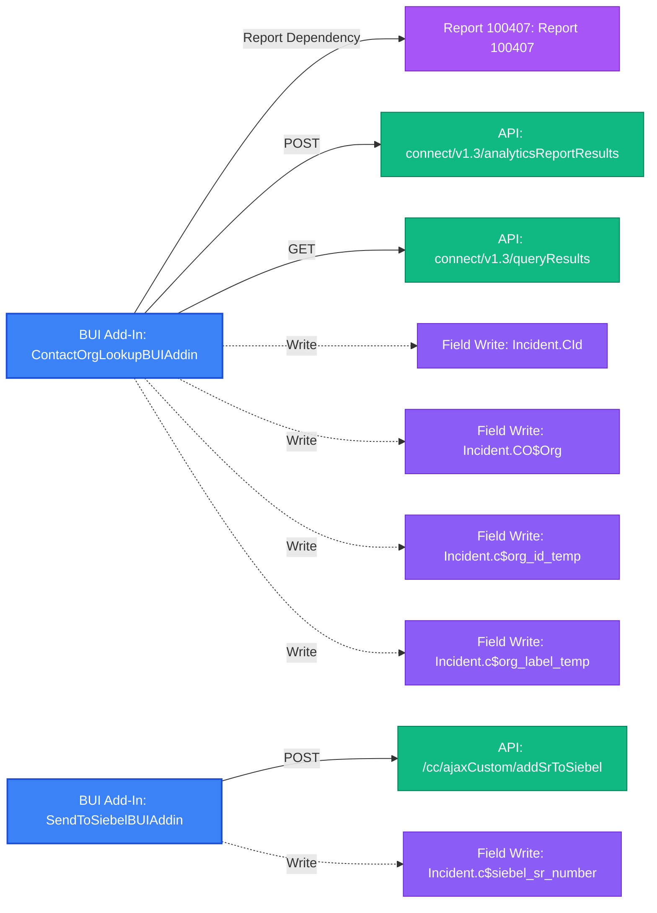

# BUI (Browser UI) Add-In Summary Report

- **Total BUI Add-Ins Analyzed**: 2

---

## Overview Table

| Add-In Name | Extension Type | Entry Point | File Count | External Libraries | Risk Audit Count |
|---|---|---|---|---|---|
| **ContactOrgLookupBUIAddin** | `BUIAddin` | `init.html` | 4 | `jquery-3.5.1.min.js`, `jquery-3.6.0.min.js`, `jspdf.min.js`, `jspdf.plugin.autotable.min.js` | 6 |
| **SendToSiebelBUIAddin** | `BUIAddin` | `init.html` | 5 | `jquery-3.6.0.min.js`, `jquery-ui.js`, `jquery.min.js`, `jspdf.min.js`, `jspdf.plugin.autotable.min.js` | 6 |

---

## Detailed Add-In Breakdowns

### Add-In: `ContactOrgLookupBUIAddin`

- **Entry Point**: `init.html`
- **Package Files**: `ContactOrgDetailsView.html`, `displayContactOrgResults.js`, `init.html`, `logic.js`
- **External Script Dependencies**: `../../AuthLibraryExtn/AuthLibraryExtn.js`
- **External Libraries**: `jquery-3.5.1.min.js`, `jquery-3.6.0.min.js`, `jspdf.min.js`, `jspdf.plugin.autotable.min.js`

#### OSVC Workspace Interaction

- **Fields Read**: `Contact.OrgId`, `Contact.first_name`, `Contact.last_name`, `Incident.CId`, `Incident.CO$Org`, `Incident.IId`, `Incident.c$org_id_temp`, `Incident.c$org_label_temp`, `Incident.c_id`, `Incident.source`
- **Fields Written**: `Incident.CId`, `Incident.CO$Org`, `Incident.c$org_id_temp`, `Incident.c$org_label_temp`
- **Field Listeners Registered**: `Incident.CO$Org`, `Incident.c_id`

#### Report Dependencies & API Endpoints

- **Report Dependencies**: `100407`
- **API Call & Web Service Endpoints**:
  - `POST` `connect/v1.3/analyticsReportResults` [REST API] (Report ID: `100407`) *(from `displayContactOrgResults.js`)*
  - `GET` `connect/v1.3/queryResults` [REST API] (Table: `Organizations`) *(from `logic.js`)*

#### Risk Audit Findings

| Severity | Risk Type | Detail |
|---|---|---|
| Medium | `Synchronous AJAX` | Synchronous AJAX (async: false) detected in logic.js — blocks browser UI thread |
| Medium | `Custom Field Schema Dependency` | Direct CustomFields.c ROQL LookupName query in logic.js — vulnerable to schema alterations |
| **High** | `Duplicate Library Load` | Duplicate jQuery versions loaded in init.html: https://code.jquery.com/jquery-3.5.1.min.js, https://code.jquery.com/jquery-3.6.0.min.js |
| **High** | `Relative Path Dependency` | Relative path script reference '../../AuthLibraryExtn/AuthLibraryExtn.js' in init.html — will fail if add-in path changes |
| Medium | `Hardcoded Report ID` | Hardcoded Report ID 100407 in BUI Add-In code — risks silent failure if report ID changes |
| Low | `Unused Library Import` | jsPDF / jsPDF-AutoTable loaded in HTML headers but unreferenced in JavaScript |

---

### Add-In: `SendToSiebelBUIAddin`

- **Entry Point**: `init.html`
- **Package Files**: `askForSiebelNumber.html`, `askForSiebelNumber.js`, `init.html`, `logic.js`, `successMessage.html`
- **External Script Dependencies**: `../../AuthLibraryExtn/AuthLibraryExtn.js`
- **External Libraries**: `jquery-3.6.0.min.js`, `jquery-ui.js`, `jquery.min.js`, `jspdf.min.js`, `jspdf.plugin.autotable.min.js`

#### OSVC Workspace Interaction

- **Fields Read**: `Incident.Created`, `Incident.IId`, `Incident.c$siebel_sr_number`
- **Fields Written**: `Incident.c$siebel_sr_number`
- **Field Listeners Registered**: `Incident.c$siebel_sr_number`
- **Workspace Lifecycle Hooks**: `RecordSaved`
- **Programmatic Editor Commands**: `Save`

#### Report Dependencies & API Endpoints

- **Report Dependencies**: None
- **API Call & Web Service Endpoints**:
  - `POST` `/cc/ajaxCustom/addSrToSiebel` [CP Controller Endpoint] *(from `logic.js`)*

#### Risk Audit Findings

| Severity | Risk Type | Detail |
|---|---|---|
| Medium | `Synchronous AJAX` | Synchronous AJAX (async: false) detected in logic.js — blocks browser UI thread |
| Medium | `Synchronous AJAX` | Synchronous AJAX (async: false) detected in askForSiebelNumber.js — blocks browser UI thread |
| **High** | `Duplicate Library Load` | Duplicate jQuery versions loaded in init.html: https://ajax.googleapis.com/ajax/libs/jquery/3.5.1/jquery.min.js, https://code.jquery.com/jquery-3.6.0.min.js |
| **High** | `Relative Path Dependency` | Relative path script reference '../../AuthLibraryExtn/AuthLibraryExtn.js' in init.html — will fail if add-in path changes |
| **High** | `Relative Path Dependency` | Relative path script reference '../../AuthLibraryExtn/AuthLibraryExtn.js' in askForSiebelNumber.html — will fail if add-in path changes |
| Low | `Unused Library Import` | jsPDF / jsPDF-AutoTable loaded in HTML headers but unreferenced in JavaScript |

---

## BUI Add-In Flow Diagram

