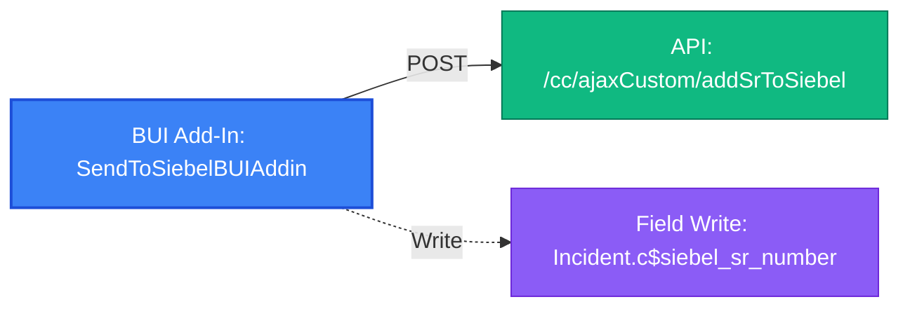

# BUI Add-In Report: `SendToSiebelBUIAddin`

- **Add-In Name**: `SendToSiebelBUIAddin`
- **Extension Type**: `BUIAddin`
- **Entry Point**: `init.html`
- **Total Package Files**: 5
- **Risk Findings Count**: 6

---

## Package Structure & Extracted Web Assets

| Asset Filename | Asset Type | Notes |
|---|---|---|
| `askForSiebelNumber.html` | `html` | HTML Modal View / UI Page |
| `askForSiebelNumber.js` | `js` | JavaScript Application Logic |
| `init.html` | `html` | Extension Entry Point |
| `logic.js` | `js` | JavaScript Application Logic |
| `successMessage.html` | `html` | HTML Modal View / UI Page |

### External Script & Library Dependencies

- **External Add-In Dependencies**: `../../AuthLibraryExtn/AuthLibraryExtn.js`
- **External Libraries (CDNs/Frameworks)**: `jquery-3.6.0.min.js`, `jquery-ui.js`, `jquery.min.js`, `jspdf.min.js`, `jspdf.plugin.autotable.min.js`

---

## OSVC Workspace Interactions

- **Fields Read**: `Incident.Created`, `Incident.IId`, `Incident.c$siebel_sr_number`
- **Fields Written**: `Incident.c$siebel_sr_number`
- **Field Listeners Registered**: `Incident.c$siebel_sr_number`
- **Workspace Lifecycle Hooks**: `RecordSaved`
- **Programmatic Editor Commands**: `Save`

---

## Report Dependencies & REST API Endpoints

- **Report Dependencies**: None
- **API Calls & Web Service Operations**:
  - `POST` `/cc/ajaxCustom/addSrToSiebel` [CP Controller Endpoint] *(from `logic.js`)*

---

## Static Risk Audit Findings

| Severity | Risk Type | Detail |
|---|---|---|
| Medium | `Synchronous AJAX` | Synchronous AJAX (async: false) detected in logic.js — blocks browser UI thread |
| Medium | `Synchronous AJAX` | Synchronous AJAX (async: false) detected in askForSiebelNumber.js — blocks browser UI thread |
| **High** | `Duplicate Library Load` | Duplicate jQuery versions loaded in init.html: https://ajax.googleapis.com/ajax/libs/jquery/3.5.1/jquery.min.js, https://code.jquery.com/jquery-3.6.0.min.js |
| **High** | `Relative Path Dependency` | Relative path script reference '../../AuthLibraryExtn/AuthLibraryExtn.js' in init.html — will fail if add-in path changes |
| **High** | `Relative Path Dependency` | Relative path script reference '../../AuthLibraryExtn/AuthLibraryExtn.js' in askForSiebelNumber.html — will fail if add-in path changes |
| Low | `Unused Library Import` | jsPDF / jsPDF-AutoTable loaded in HTML headers but unreferenced in JavaScript |

---

## Dependency Flow Diagram

