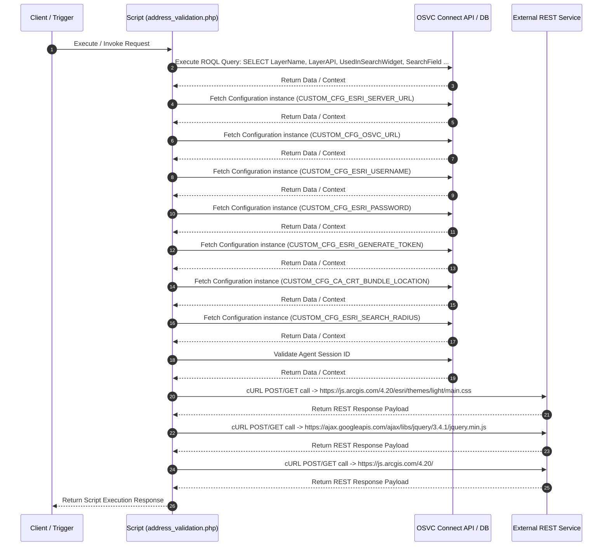

# Custom Script Analysis: `address_validation.php`
## Executive Functional Summary

> [!NOTE]
> This script provides **Address Validation & Geocoding Service**. It interacts with external REST APIs (ArcGIS / CityWorks Geocoding Service), queries OSVC Configuration settings, and validates customer street address inputs.

## Script Overview & Attributes

| Attribute | Value |
| --- | --- |
| **File Name** | `address_validation.php` |
| **Script Type** | Server-side Utility |
| **Contains JavaScript Code** | Yes |
| **Contains HTML UI Markup** | Yes |
| **Code Imports** | 0 |
| **OSVC Data Objects** | 3 |
| **Internal APIs (ROQL / Connect)** | 9 |
| **External SOAP APIs** | 0 |
| **External REST APIs** | 3 |
| **Risk Flags** | 1 |

## Cross-Component System Linkages

| Source Component | Linkage Direction | Target Component | Details / Context |
| :--- | :---: | :--- | :--- |
| **Workspace: Contact** | `->` | **CustomScript: address_validation.php** | Tab 'Address Validation' → Browser → Custom PHP Script (https://gcb.custhelp.com/cgi-bin/gcb.cfg/php/custom/address_validation.php) |
| **CustomScript: address_validation.php** | `->` | **OSVCObject: Configuration** | Custom Script 'address_validation.php' operates on entity 'Configuration' |
| **CustomScript: address_validation.php** | `->` | **OSVCObject: ConnectAPIErrorBase** | Custom Script 'address_validation.php' operates on entity 'ConnectAPIErrorBase' |
| **CustomScript: duplicate_contacts.php** | `->` | **CustomScript: address_validation.php** | import/require: 'address_validation.php' |
| **CPM: contact_update** | `->` | **CustomScript: address_validation.php** | CPM Procedure 'contact_update' requires Custom Script 'address_validation.php' |

## OSVC Data Objects Referenced

- `Configuration`
- `ConnectAPIErrorBase`
- `ROQL`

## Categorized API Breakdown

### 1. Internal APIs (ROQL & Native OSVC Objects)

| API Type | Operation | Details |
| --- | --- | --- |
| `ROQL Query` | SELECT Query | `SELECT LayerName, LayerAPI, UsedInSearchWidget, SearchField FROM Config.FeatureLayer WHERE LayerName =` |
| `Connect PHP Fetch` | Fetch Configuration | `RNCPHP\Configuration::fetch(CUSTOM_CFG_ESRI_SERVER_URL)` |
| `Connect PHP Fetch` | Fetch Configuration | `RNCPHP\Configuration::fetch(CUSTOM_CFG_OSVC_URL)` |
| `Connect PHP Fetch` | Fetch Configuration | `RNCPHP\Configuration::fetch(CUSTOM_CFG_ESRI_USERNAME)` |
| `Connect PHP Fetch` | Fetch Configuration | `RNCPHP\Configuration::fetch(CUSTOM_CFG_ESRI_PASSWORD)` |
| `Connect PHP Fetch` | Fetch Configuration | `RNCPHP\Configuration::fetch(CUSTOM_CFG_ESRI_GENERATE_TOKEN)` |
| `Connect PHP Fetch` | Fetch Configuration | `RNCPHP\Configuration::fetch(CUSTOM_CFG_CA_CRT_BUNDLE_LOCATION)` |
| `Connect PHP Fetch` | Fetch Configuration | `RNCPHP\Configuration::fetch(CUSTOM_CFG_ESRI_SEARCH_RADIUS)` |
| `Agent Authenticator` | Validate Agent Session | `AgentAuthenticator::authenticateSessionID($session_id)` |

### 2. External APIs (SOAP)

*No External SOAP Web Service integrations detected.*

### 3. External APIs (REST)

| Protocol | HTTP Method | Endpoint URL | Details |
| --- | --- | --- | --- |
| REST / HTTP | `POST/GET` | `https://js.arcgis.com/4.20/esri/themes/light/main.css` | cURL POST/GET request |
| REST / HTTP | `POST/GET` | `https://ajax.googleapis.com/ajax/libs/jquery/3.4.1/jquery.min.js` | cURL POST/GET request |
| REST / HTTP | `POST/GET` | `https://js.arcgis.com/4.20/` | cURL POST/GET request |

## Security & Risk Analysis

- **[WARNING] Hardcoded Credential:** Potential credentials found in variable assignments (count: 1)

## Execution Flow Diagram

## Client-Side JavaScript Logic & UI Behavior Summary

The script incorporates client-side JavaScript execution logic with the following UI behaviors and event handlers:

- Registers BUI Extension Loader hooks (`ORACLE_SERVICE_CLOUD.extension_loader`) and binds workspace record events.
- Loads ArcGIS JavaScript API components for map rendering and geocoding coordinate selection.

## Live Interactive HTML UI Component Preview

The script defines embedded HTML UI markup. Below is the live rendered interactive component preview:

<div class="html-preview-pending" data-html="77u/Cgo8aHRtbD4KPGhlYWQ+CiAgPG1ldGEgY2hhcnNldD0idXRmLTgiPgogIDxtZXRhIGh0dHAtZXF1aXY9IlgtVUEtQ29tcGF0aWJsZSIgY29udGVudD0iSUU9RWRnZSIgPgogIDxtZXRhIG5hbWU9InZpZXdwb3J0IiBjb250ZW50PSJpbml0aWFsLXNjYWxlPTEsIG1heGltdW0tc2NhbGU9MSwgdXNlci1zY2FsYWJsZT1ubyI+CgogIDxzdHlsZT4KICAgIGh0bWwsIGJvZHkgewogICAgICBwYWRkaW5nOiAwOwogICAgICBtYXJnaW46IDA7CiAgICAgIGhlaWdodDogMTAwJTsKICAgICAgd2lkdGg6IDEwMCU7CiAgICAgIG92ZXJmbG93LXg6aGlkZGVuOwogICAgICAKICAgIH0KCS5lc3JpLXNlYXJjaAoJewoJCXdpZHRoOiA5NSUgIWltcG9ydGFudDsKCX0KCS5lc3JpLXNlYXJjaC0tc2hvdy1zdWdnZXN0aW9ucyAuZXNyaS1zZWFyY2hfX3N1Z2dlc3Rpb25zLW1lbnUsIC5lc3JpLXNlYXJjaC0tc291cmNlcyAuZXNyaS1zZWFyY2hfX3NvdXJjZXMtbWVudSB7CgkgICAgb3ZlcmZsb3c6IHNjcm9sbCAhaW1wb3J0YW50OwoJICAgIHZpc2liaWxpdHk6IHZpc2libGU7CgkgICAgbWF4LWhlaWdodDogOTBweCAhaW1wb3J0YW50OwoJICAgIGFuaW1hdGlvbjogZXNyaS1mYWRlLWluIDI1MG1zIGVhc2Utb3V0OwoJfQkKCS5lc3JpX21hcF9vbmx5Cgl7CgkJaGVpZ2h0Ojk4JTsKCQlib3JkZXI6IDFweCBzb2xpZCBibGFjazsKCX0KCS5lc3JpX21hcAoJewoJCWhlaWdodDo1OCU7CgkJYm9yZGVyOiAxcHggc29saWQgYmxhY2s7Cgl9CgkKCS5ybl9QYWdlQ29udGVudCB7CgkJcGFkZGluZy10b3A6IDJlbTsKCX0KICAgIC5lc3JpLXNlYXJjaF9faW5wdXR7CgkJbWFyZ2luLWJvdHRvbTowICFpbXBvcnRhbnQ7Cgl9CgkuZXNyaS1tZW51X19oZWFkZXJ7CgkJZGlzcGxheTogbm9uZSAhaW1wb3J0YW50OwoJfQoJLmVzcmktc2VhcmNoX19zb3VyY2VzLWJ1dHRvbnsKCQlkaXNwbGF5OiBub25lICFpbXBvcnRhbnQ7Cgl9CgkuZXNyaS1zZWFyY2hfX3N1Z2dlc3Rpb25zLWxpc3R7CQoJCWJvcmRlci10b3A6IHNvbGlkIDFweCByZ2JhKDExMCwxMTAsMTEwLDAuMyk7CgkgICAgYm9yZGVyLXRvcC13aWR0aDogMXB4OwoJICAgIGJvcmRlci10b3Atc3R5bGU6IHNvbGlkOwoJICAgIGJvcmRlci10b3AtY29sb3I6IHJnYmEoMTEwLCAxMTAsIDExMCwgMC4zKTsKCSAgICBib3JkZXItdG9wLXdpZHRoOiAxcHg7CgkgICAgYm9yZGVyLXRvcC1zdHlsZTogc29saWQ7CgkgICAgYm9yZGVyLXRvcC1jb2xvcjogcmdiYSgxMTAsIDExMCwgMTEwLCAwLjMpOwoJfQoJLmVzcmktdmlldy1oZWlnaHQtbGVzcy10aGFuLW1lZGl1bSAuZXNyaS1wb3B1cF9fbWFpbi1jb250YWluZXIgewoJCW1heC1oZWlnaHQ6IDE1MHB4ICFpbXBvcnRhbnQ7Cgl9CiAgPC9zdHlsZT4KICA8bGluayByZWw9InN0eWxlc2hlZXQiIGhyZWY9Imh0dHBzOi8vanMuYXJjZ2lzLmNvbS80LjIwL2VzcmkvdGhlbWVzL2xpZ2h0L21haW4uY3NzIj4KICA8c2NyaXB0IHNyYz0iaHR0cHM6Ly9qcy5hcmNnaXMuY29tLzQuMjAvIj48L3NjcmlwdD4KICA8c2NyaXB0IHR5cGU9InRleHQvamF2YXNjcmlwdCIgc3JjPSJodHRwczovL2FqYXguZ29vZ2xlYXBpcy5jb20vYWpheC9saWJzL2pxdWVyeS8zLjQuMS9qcXVlcnkubWluLmpzIj48L3NjcmlwdD4KCiAgPHNjcmlwdD4gIAoJLy9HSVNQQVJBTUVURVIgLSBHZW9jb2RlIFNlcnZlcgkmIEN1c3RvbSBTZWFyY2ggT3B0aW9ucwkKICAgIHJlcXVpcmUoWwogICAgICAiZXNyaS93aWRnZXRzL1NlYXJjaC9Mb2NhdG9yU2VhcmNoU291cmNlIiwKICAgICAgImVzcmkvdGFza3MvTG9jYXRvciIsCiAgICAgICJlc3JpL3dpZGdldHMvU2VhcmNoIiwKICAgICAgImVzcmkvcmVxdWVzdCIsCgkgICJlc3JpL2lkZW50aXR5L0lkZW50aXR5TWFuYWdlciIKICAgIF0sIGZ1bmN0aW9uKExvY2F0b3JTZWFyY2hTb3VyY2UsIExvY2F0b3IsIFNlYXJjaCwgZXNyaVJlcXVlc3QsIElkZW50aXR5TWFuYWdlcikgCiAgICB7ICAgICAKCQkvL0dJU1BBUkFNRVRFUiAtIFJFU1QvU0VSVklDRVMKICAgIAlsZXQgc2VydmVyVVJMID0iIjsKICAgIAlsZXQgdG9rZW4gPSAiIjsKCgkJCQkvKioqKioqIEFkZCBBdXRoZW50aWNhdGlvbiAqKioqKiovCgkJSWRlbnRpdHlNYW5hZ2VyLnJlZ2lzdGVyVG9rZW4oewoJCQkJJ3NlcnZlcic6IHNlcnZlclVSTCwKCQkJCSd0b2tlbic6IHRva2VuCgkJCX0pOwoJCS8qKioqKiogRW5kIG9mIEFkZCBBdXRoZW50aWNhdGlvbiAqKioqKiovCgoJCXZhciBmZWF0dXJlTGF5ZXJzID0gOwogICAgCWxldCBsb2NhdG9yVVJMID0gZmVhdHVyZUxheWVycy5sb2NhdG9yLkFQSTsKCgkJCQkKCQkvKioqKioqIEFkZCBDdXN0b20gU2VhcmNoICoqKioqKi8KCQkJdmFyIGN1c3RvbVNlYXJjaFNvdXJjZSA9IG5ldyBMb2NhdG9yU2VhcmNoU291cmNlKHsKCQkJCWxvY2F0b3I6IG5ldyBMb2NhdG9yKHsgdXJsOiBsb2NhdG9yVVJMIH0pLAoJCQkJZ2V0U3VnZ2VzdGlvbnM6IGZ1bmN0aW9uIChwYXJhbXMpIHsKCQkJCQkvLyBZb3UgY2FuIHJlcXVlc3QgZGF0YSBmcm9tIGEKCQkJCQkvLyB0aGlyZC1wYXJ0eSBzb3VyY2UgdG8gZmluZCBzb21lCgkJCQkJLy8gc3VnZ2VzdGlvbnMgd2l0aCBwcm92aWRlZCBzdWdnZXN0VGVybQoJCQkJCS8vIHRoZSB1c2VyIHR5cGVzIGluIHRoZSBTZWFyY2ggd2lkZ2V0CgkJCQkJcmV0dXJuIGVzcmlSZXF1ZXN0KGxvY2F0b3JVUkwgKyAiL2ZpbmRBZGRyZXNzQ2FuZGlkYXRlcyIsIHsKCQkJCQkJcXVlcnk6IHsKCQkJCQkJCVNpbmdsZUxpbmU6IHBhcmFtcy5zdWdnZXN0VGVybS5yZXBsYWNlKC8gL2csICIgIiksCgkJCQkJCQlsaW1pdDogNiwKCQkJCQkJCWY6J3Bqc29uJwoJCQkJCQl9LAoJCQkJCQlyZXNwb25zZVR5cGU6ICJqc29uIgoJCQkJCX0pLnRoZW4oZnVuY3Rpb24gKHJlc3VsdHMpIHsKCQkJCQkJLy8gUmV0dXJuIFN1Z2dlc3Rpb24gcmVzdWx0cyB0byBkaXNwbGF5CgkJCQkJCS8vIGluIHRoZSBTZWFyY2ggd2lkZ2V0CgkJCQkJCXJldHVybiByZXN1bHRzLmRhdGEuY2FuZGlkYXRlcy5tYXAoZnVuY3Rpb24gKGNhbmRpZGF0ZSkgewoJCQkJCQkJcmV0dXJuIHsKCQkJCQkJCQlrZXk6ICJuYW1lIiwKCQkJCQkJCQl0ZXh0OiBjYW5kaWRhdGUuYWRkcmVzcywKCQkJCQkJCQlzb3VyY2VJbmRleDogcGFyYW1zLnNvdXJjZUluZGV4CgkJCQkJCQl9OwoJCQkJCQl9KTsKCQkJCQl9KTsKCQkJCX0sCgkJCQlnZXRSZXN1bHRzOiAocGFyYW1zKSA9PiB7CgkJCQkJc2V0V3NGaWVsZHMocGFyYW1zLnN1Z2dlc3RSZXN1bHQudGV4dCk7CgkJCQl9LAoJCQkJc2luZ2xlTGluZUZpZWxkTmFtZTogIlNpbmdsZUxpbmUiLAoJCQkJbmFtZTogIkN1c3RvbSBHZW9jb2RpbmcgU2VydmljZSIsCgkJCQlwbGFjZWhvbGRlcjogIlNlYXJjaCBHZW9jb2RlciIsCgkJCQltYXhSZXN1bHRzOiAzLAoJCQkJbWF4U3VnZ2VzdGlvbnM6IDYsCgkJCQlzdWdnZXN0aW9uc0VuYWJsZWQ6IHRydWUsCgkJCQltaW5TdWdnZXN0Q2hhcmFjdGVyczogMC8vLAoJCQkJLy93aXRoaW5WaWV3RW5hYmxlZDp0cnVlCgkJCX0pOwoJCQoJCQoJCQl2YXIgc2VhcmNoID0gbmV3IFNlYXJjaCh7CgkJCQljb250YWluZXI6InNlYXJjaERpdiIsCgkJCQlzb3VyY2VzOiBbY3VzdG9tU2VhcmNoU291cmNlXSwKCQkJCWluY2x1ZGVEZWZhdWx0U291cmNlczogZmFsc2UJCQkJCQkJCgkJCX0pOwoJCQkKCQkvKioqKioqIEVuZCBvZiBBZGQgQ3VzdG9tIFNlYXJjaCAqKioqKiovCQoJCQkJCiAgCQkKICAgIH0pOwogICAgCiAgICB2YXIgYyA9IHdpbmRvdy5leHRlcm5hbC5Db250YWN0OwogICAgdmFyIGFkZHJlc3NNb2RpZmllZCA9IGZhbHNlOyAvLyBGbGFnIHRvIHN0b3JlIGlmIE1hcCB3YXMgdXNlZCB0byBmZXRjaCB0aGUgYWRkcmVzcy4KCS8vSWYgb3BlbmVkIHRocm91Z2ggRGVzdG9wIENvbnNvbGUgdGhlbiB1c2UgSmF2YXNjcmlwdCBFeHRlbnNpb24KCWlmKGMgIT09IHVuZGVmaW5lZCkKCXsKCX0KCWVsc2UKCXsKCQl2YXIgdGhlV29ya3NwYWNlUmVjb3JkOwoJCXZhciBzY3JpcHQgPSBkb2N1bWVudC5jcmVhdGVFbGVtZW50KCdzY3JpcHQnKTsgICAgICAgICAgICAgICAgCgkJc2NyaXB0LnR5cGUgPSAndGV4dC9qYXZhc2NyaXB0JzsKCQlzY3JpcHQuYXN5bmMgPSB0cnVlOwoJCXNjcmlwdC5zcmMgPSAnL0FnZW50V2ViL21vZHVsZS9leHRlbnNpYmlsaXR5L2pzL2NsaWVudC9jb3JlL2V4dGVuc2lvbl9sb2FkZXIuanMnOwkKCQlzY3JpcHQub25sb2FkID0gZnVuY3Rpb24oKSB7CQkJCgkJCU9SQUNMRV9TRVJWSUNFX0NMT1VELmV4dGVuc2lvbl9sb2FkZXIubG9hZCgiQWRkcmVzc1ZhbGlkYXRpb25FeHRpb25zaW9uIiwgIjEiKQoJCQkudGhlbihmdW5jdGlvbihleHRlbnNpb25Qcm92aWRlcikKCQkJewoJCSAgICAJZXh0ZW5zaW9uUHJvdmlkZXIucmVnaXN0ZXJXb3Jrc3BhY2VFeHRlbnNpb24oZnVuY3Rpb24od29ya3NwYWNlUmVjb3JkKQoJCSAgICAJewoJICAgIAkJCXRoZVdvcmtzcGFjZVJlY29yZCA9IHdvcmtzcGFjZVJlY29yZDsgICAgCQkJICAgCgkJICAgIAl9KTsKCQkJfSk7CgkJfTsJCgkJZG9jdW1lbnQuaGVhZC5hcHBlbmRDaGlsZChzY3JpcHQpOwkJCQkKCQkJCgkJZnVuY3Rpb24gc2V0V3NGaWVsZHMoYWRkcmVzcykKCQl7CgkJCWxldCBhZHJJbmZvID0gYWRkcmVzcy50cmltKCkuc3BsaXQoIiwiKTsKCQkJbGV0IHBvc3RhbENvZGUgPScgJzsKCQkJbGV0IGNpdHkgPSAnJzsKCQkJbGV0IHVuaXROdW0gPSAnJzsKCQkJCgkJCWlmKGFkckluZm8ubGVuZ3RoID09IDIpCgkJCXsJCgkJCQljaXR5ID0gYWRySW5mb1sxXS50cmltKCk7Ly9leDogU3VkYnVyeQoJCQl9CgkJCWVsc2UgaWYoYWRySW5mby5sZW5ndGggPT0gMykKCQkJewoJCQkJcG9zdGFsQ29kZSA9IGFkckluZm9bMl0udHJpbSgpOwkJCQoJCQkJY2l0eSA9IGFkckluZm9bMV0udHJpbSgpOy8vZXg6IFN1ZGJ1cnkKCQkJfQoJCQllbHNlIGlmKGFkckluZm8ubGVuZ3RoID09IDQpCgkJCXsKCQkJCXBvc3RhbENvZGUgPSBhZHJJbmZvWzNdLnRyaW0oKTsJCQkKCQkJCWNpdHkgPSBhZHJJbmZvWzJdLnRyaW0oKTsvL2V4OiBTdWRidXJ5CQkKCQkJCXVuaXROdW0gPSBhZHJJbmZvWzFdLnRyaW0oKS5zcGxpdCgnICcpWzFdLnRyaW0oKTsvL1VuaXQgMy4uZ2V0ICMJCgkJCX0KCQkJCgkJCWxldCBzdHJlZXRJbmZvID0gYWRySW5mb1swXS50cmltKCkuc3BsaXQoIiAiKTsJCQkKCQkJbGV0IGhvdXNlTnVtYmVyID0gc3RyZWV0SW5mb1swXS50cmltKCk7Ly8gZXg6ICIyMyIKCQkJbGV0IHN0cmVldE5hbWUgPSAiIjsJCQkKCgkJCWlmKHR5cGVvZiBzdHJlZXRJbmZvWzFdID09PSAnbnVtYmVyJyB8fCBzdHJlZXRJbmZvWzFdLmxlbmd0aCA9PSAxKS8vQ2hlY2sgaWYgdW5pdCBudW1iZXIgaWYgcHJvdmlkZWQsIGl0IHdpbGwgZWl0aGVyIGluIGludGVyZ2VyIG9yIEEtWgoJCQl7CgkJCQlob3VzZU51bWJlciA9IGhvdXNlTnVtYmVyICsnICcrc3RyZWV0SW5mb1sxXS50cmltKCk7CgkJCQlzdHJlZXROYW1lID0gc3RyZWV0SW5mby5zbGljZSgyLCBzdHJlZXRJbmZvLmxlbmd0aCkuam9pbigiICIpOwkJCQoJCQl9CgkJCWVsc2UKCQkJewoJCQkJc3RyZWV0TmFtZSA9IHN0cmVldEluZm8uc2xpY2UoMSwgc3RyZWV0SW5mby5sZW5ndGgpLmpvaW4oIiAiKTsKCQkJfQoJICAgICAgICBsZXQgcmVjb3JkVHlwZSA9IHRoZVdvcmtzcGFjZVJlY29yZC5nZXRXb3Jrc3BhY2VSZWNvcmRUeXBlKCk7CgkJCWlmKHJlY29yZFR5cGUgPT0gJ0NvbnRhY3QnKQoJCQl7CgkJCQlyZWNvcmRUeXBlID0gcmVjb3JkVHlwZSArICcuQ08kJzsJCQkJCgkJCQl0aGVXb3Jrc3BhY2VSZWNvcmQudXBkYXRlRmllbGRCeUxhYmVsKHJlY29yZFR5cGUrJ1N0YXRlJywgJ09udGFyaW8nKTsKCQkJCXRoZVdvcmtzcGFjZVJlY29yZC51cGRhdGVGaWVsZEJ5TGFiZWwocmVjb3JkVHlwZSsnQ291bnRyeScsICdDQScpOwkKCQkJCQoJCQl9CgkJCWVsc2UvL2Nhc2Ugb2YgY3VzdG9tIG9iamVjdCBDTyRBZGRyZXNzCgkJCQlyZWNvcmRUeXBlID0gcmVjb3JkVHlwZSArICcuJzsKCQkJCQoJCQkvLyBTZXQgdGg=" data-title="address_validation.php">
  

    



<html>
<head>
  <meta charset="utf-8">
  <meta http-equiv="X-UA-Compatible" content="IE=Edge" >
  <meta name="viewport" content="initial-scale=1, maximum-scale=1, user-scalable=no">

  
  <link rel="stylesheet" href="https://js.arcgis.com/4.20/esri/themes/light/main.css">
  
  

  <script>  
	//GISPARAMETER - Geocode Server	& Custom Search Options	
    require([
      "esri/widgets/Search/LocatorSearchSource",
      "esri/tasks/Locator",
      "esri/widgets/Search",
      "esri/request",
	  "esri/identity/IdentityManager"
    ], function(LocatorSearchSource, Locator, Search, esriRequest, IdentityManager) 
    {     
		//GISPARAMETER - REST/SERVICES
    	let serverURL ="";
    	let token = "";

				/****** Add Authentication ******/
		IdentityManager.registerToken({
				'server': serverURL,
				'token': token
			});
		/****** End of Add Authentication ******/

		var featureLayers = ;
    	let locatorURL = featureLayers.locator.API;

				
		/****** Add Custom Search ******/
			var customSearchSource = new LocatorSearchSource({
				locator: new Locator({ url: locatorURL }),
				getSuggestions: function (params) {
					// You can request data from a
					// third-party source to find some
					// suggestions with provided suggestTerm
					// the user types in the Search widget
					return esriRequest(locatorURL + "/findAddressCandidates", {
						query: {
							SingleLine: params.suggestTerm.replace(/ /g, " "),
							limit: 6,
							f:'pjson'
						},
						responseType: "json"
					}).then(function (results) {
						// Return Suggestion results to display
						// in the Search widget
						return results.data.candidates.map(function (candidate) {
							return {
								key: "name",
								text: candidate.address,
								sourceIndex: params.sourceIndex
							};
						});
					});
				},
				getResults: (params) => {
					setWsFields(params.suggestResult.text);
				},
				singleLineFieldName: "SingleLine",
				name: "Custom Geocoding Service",
				placeholder: "Search Geocoder",
				maxResults: 3,
				maxSuggestions: 6,
				suggestionsEnabled: true,
				minSuggestCharacters: 0//,
				//withinViewEnabled:true
			});
		
		
			var search = new Search({
				container:"searchDiv",
				sources: [customSearchSource],
				includeDefaultSources: false							
			});
			
		/****** End of Add Custom Search ******/	
				
  		
    });
    
    var c = window.external.Contact;
    var addressModified = false; // Flag to store if Map was used to fetch the address.
	//If opened through Destop Console then use Javascript Extension
	if(c !== undefined)
	{
	}
	else
	{
		var theWorkspaceRecord;
		var script = document.createElement('script');                
		script.type = 'text/javascript';
		script.async = true;
		script.src = '/AgentWeb/module/extensibility/js/client/core/extension_loader.js';	
		script.onload = function() {			
			ORACLE_SERVICE_CLOUD.extension_loader.load("AddressValidationExtionsion", "1")
			.then(function(extensionProvider)
			{
		    	extensionProvider.registerWorkspaceExtension(function(workspaceRecord)
		    	{
	    			theWorkspaceRecord = workspaceRecord;    			   
		    	});
			});
		};	
		document.head.appendChild(script);				
			
		function setWsFields(address)
		{
			let adrInfo = address.trim().split(",");
			let postalCode =' ';
			let city = '';
			let unitNum = '';
			
			if(adrInfo.length == 2)
			{	
				city = adrInfo[1].trim();//ex: Sudbury
			}
			else if(adrInfo.length == 3)
			{
				postalCode = adrInfo[2].trim();			
				city = adrInfo[1].trim();//ex: Sudbury
			}
			else if(adrInfo.length == 4)
			{
				postalCode = adrInfo[3].trim();			
				city = adrInfo[2].trim();//ex: Sudbury		
				unitNum = adrInfo[1].trim().split(' ')[1].trim();//Unit 3..get #	
			}
			
			let streetInfo = adrInfo[0].trim().split(" ");			
			let houseNumber = streetInfo[0].trim();// ex: "23"
			let streetName = "";			

			if(typeof streetInfo[1] === 'number' || streetInfo[1].length == 1)//Check if unit number if provided, it will either in interger or A-Z
			{
				houseNumber = houseNumber +' '+streetInfo[1].trim();
				streetName = streetInfo.slice(2, streetInfo.length).join(" ");			
			}
			else
			{
				streetName = streetInfo.slice(1, streetInfo.length).join(" ");
			}
	        let recordType = theWorkspaceRecord.getWorkspaceRecordType();
			if(recordType == 'Contact')
			{
				recordType = recordType + '.CO$';				
				theWorkspaceRecord.updateFieldByLabel(recordType+'State', 'Ontario');
				theWorkspaceRecord.updateFieldByLabel(recordType+'Country', 'CA');	
				
			}
			else//case of custom object CO$Address
				recordType = recordType + '.';
				
			// Set th
    

  

