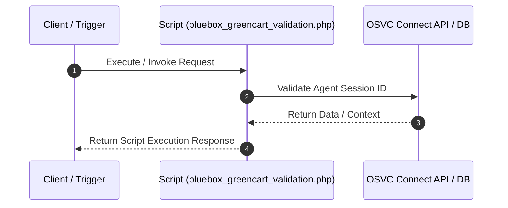

# Custom Script Analysis: `bluebox_greencart_validation.php`
## Executive Functional Summary

> [!NOTE]
> Server-side PHP script (`bluebox_greencart_validation.php`) that executes 1 internal OSVC database/Connect PHP operation(s). Primary entity target(s): ConnectAPIErrorBase.

## Script Overview & Attributes

| Attribute | Value |
| --- | --- |
| **File Name** | `bluebox_greencart_validation.php` |
| **Script Type** | Server-side Utility |
| **Contains JavaScript Code** | Yes |
| **Contains HTML UI Markup** | No |
| **Code Imports** | 0 |
| **OSVC Data Objects** | 1 |
| **Internal APIs (ROQL / Connect)** | 1 |
| **External SOAP APIs** | 0 |
| **External REST APIs** | 0 |
| **Risk Flags** | 0 |

## Cross-Component System Linkages

| Source Component | Linkage Direction | Target Component | Details / Context |
| :--- | :---: | :--- | :--- |
| **CustomScript: bluebox_greencart_validation.php** | `->` | **OSVCObject: ConnectAPIErrorBase** | Custom Script 'bluebox_greencart_validation.php' operates on entity 'ConnectAPIErrorBase' |

## OSVC Data Objects Referenced

- `ConnectAPIErrorBase`

## Categorized API Breakdown

### 1. Internal APIs (ROQL & Native OSVC Objects)

| API Type | Operation | Details |
| --- | --- | --- |
| `Agent Authenticator` | Validate Agent Session | `AgentAuthenticator::authenticateSessionID($session_id)` |

### 2. External APIs (SOAP)

*No External SOAP Web Service integrations detected.*

### 3. External APIs (REST)

*No External REST HTTP API integrations detected.*

## Execution Flow Diagram

## Client-Side JavaScript Logic & UI Behavior Summary

The script incorporates client-side JavaScript execution logic with the following UI behaviors and event handlers:

- Registers BUI Extension Loader hooks (`ORACLE_SERVICE_CLOUD.extension_loader`) and binds workspace record events.
- Attaches dynamic workspace field value change listeners to trigger real-time search and validation as fields are edited.
- Loads ArcGIS JavaScript API components for map rendering and geocoding coordinate selection.
