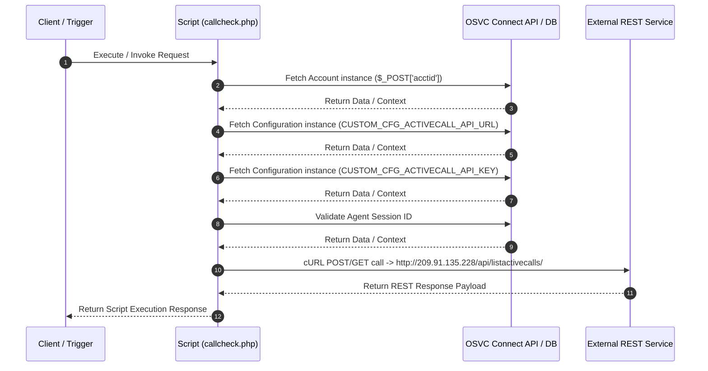

# Custom Script Analysis: `callcheck.php`
## Executive Functional Summary

> [!NOTE]
> Server-side PHP script (`callcheck.php`) that executes 4 internal OSVC database/Connect PHP operation(s), integrates with 1 external REST HTTP service(s). Primary entity target(s): Account, Configuration.

## Script Overview & Attributes

| Attribute | Value |
| --- | --- |
| **File Name** | `callcheck.php` |
| **Script Type** | Server-side Utility |
| **Contains JavaScript Code** | No |
| **Contains HTML UI Markup** | No |
| **Code Imports** | 0 |
| **OSVC Data Objects** | 2 |
| **Internal APIs (ROQL / Connect)** | 4 |
| **External SOAP APIs** | 0 |
| **External REST APIs** | 1 |
| **Risk Flags** | 0 |

## Cross-Component System Linkages

| Source Component | Linkage Direction | Target Component | Details / Context |
| :--- | :---: | :--- | :--- |
| **CustomScript: callcheck.php** | `->` | **OSVCObject: Account** | Custom Script 'callcheck.php' operates on entity 'Account' |
| **CustomScript: callcheck.php** | `->` | **OSVCObject: Configuration** | Custom Script 'callcheck.php' operates on entity 'Configuration' |

## OSVC Data Objects Referenced

- `Account`
- `Configuration`

## Categorized API Breakdown

### 1. Internal APIs (ROQL & Native OSVC Objects)

| API Type | Operation | Details |
| --- | --- | --- |
| `Connect PHP Fetch` | Fetch Account | `RNCPHP\Account::fetch($_POST['acctid'])` |
| `Connect PHP Fetch` | Fetch Configuration | `RNCPHP\Configuration::fetch(CUSTOM_CFG_ACTIVECALL_API_URL)` |
| `Connect PHP Fetch` | Fetch Configuration | `RNCPHP\Configuration::fetch(CUSTOM_CFG_ACTIVECALL_API_KEY)` |
| `Agent Authenticator` | Validate Agent Session | `AgentAuthenticator::authenticateSessionID($session_id)` |

### 2. External APIs (SOAP)

*No External SOAP Web Service integrations detected.*

### 3. External APIs (REST)

| Protocol | HTTP Method | Endpoint URL | Details |
| --- | --- | --- | --- |
| REST / HTTP | `POST/GET` | `http://209.91.135.228/api/listactivecalls/` | cURL POST/GET request |

## Execution Flow Diagram

