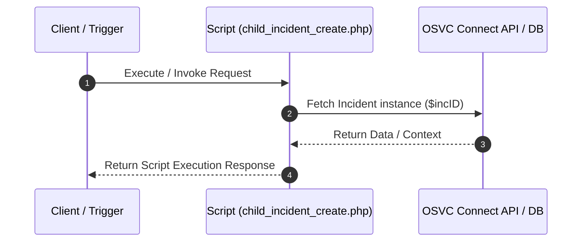

# Custom Script Analysis: `child_incident_create.php`
## Executive Functional Summary

> [!NOTE]
> Server-side PHP script (`child_incident_create.php`) that executes 1 internal OSVC database/Connect PHP operation(s). Primary entity target(s): Banner, GroupAccount, Incident.

## Script Overview & Attributes

| Attribute | Value |
| --- | --- |
| **File Name** | `child_incident_create.php` |
| **Script Type** | Server-side Utility |
| **Contains JavaScript Code** | No |
| **Contains HTML UI Markup** | No |
| **Code Imports** | 1 |
| **OSVC Data Objects** | 8 |
| **Internal APIs (ROQL / Connect)** | 1 |
| **External SOAP APIs** | 0 |
| **External REST APIs** | 0 |
| **Risk Flags** | 0 |

## Cross-Component System Linkages

| Source Component | Linkage Direction | Target Component | Details / Context |
| :--- | :---: | :--- | :--- |
| **CustomScript: child_incident_create.php** | `->` | **CustomScript: include/init.phph** | import/require: 'include/init.phph' |
| **CustomScript: child_incident_create.php** | `->` | **OSVCObject: Banner** | Custom Script 'child_incident_create.php' operates on entity 'Banner' |
| **CustomScript: child_incident_create.php** | `->` | **OSVCObject: ConnectAPI** | Custom Script 'child_incident_create.php' operates on entity 'ConnectAPI' |
| **CustomScript: child_incident_create.php** | `->` | **OSVCObject: GroupAccount** | Custom Script 'child_incident_create.php' operates on entity 'GroupAccount' |
| **CustomScript: child_incident_create.php** | `->` | **OSVCObject: Incident** | Custom Script 'child_incident_create.php' operates on entity 'Incident' |
| **CustomScript: child_incident_create.php** | `->` | **OSVCObject: NamedIDLabel** | Custom Script 'child_incident_create.php' operates on entity 'NamedIDLabel' |
| **CustomScript: child_incident_create.php** | `->` | **OSVCObject: NamedIDOptList** | Custom Script 'child_incident_create.php' operates on entity 'NamedIDOptList' |
| **CustomScript: child_incident_create.php** | `->` | **OSVCObject: RNObject** | Custom Script 'child_incident_create.php' operates on entity 'RNObject' |
| **CustomScript: child_incident_create.php** | `->` | **OSVCObject: StatusWithType** | Custom Script 'child_incident_create.php' operates on entity 'StatusWithType' |

## Code Imports

- `include/init.phph`

## OSVC Data Objects Referenced

- `Banner`
- `ConnectAPI`
- `GroupAccount`
- `Incident`
- `NamedIDLabel`
- `NamedIDOptList`
- `RNObject`
- `StatusWithType`

## Categorized API Breakdown

### 1. Internal APIs (ROQL & Native OSVC Objects)

| API Type | Operation | Details |
| --- | --- | --- |
| `Connect PHP Fetch` | Fetch Incident | `RNCPHP\Incident::fetch($incID)` |

### 2. External APIs (SOAP)

*No External SOAP Web Service integrations detected.*

### 3. External APIs (REST)

*No External REST HTTP API integrations detected.*

## Execution Flow Diagram

