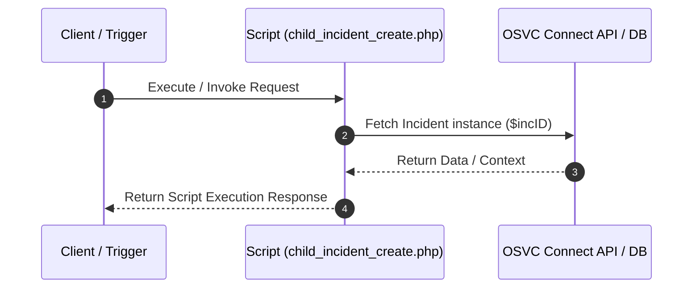

# Custom Script Analysis: `child_incident_create.php`
## Executive Functional Summary

> [!NOTE]
> This script automates **Child Incident Creation & Linking**. It instantiates new `RNCPHP\Incident` records, copies parent incident parameters, establishes parent-child relationships, and commits new records to the database.

## Script Overview & Attributes

| Attribute | Value |
| --- | --- |
| **File Name** | `child_incident_create.php` |
| **Script Type** | Server-side Utility |
| **Contains JavaScript Code** | No |
| **Contains HTML UI Markup** | No |
| **Code Imports** | 1 |
| **OSVC Data Objects** | 8 |
| **Internal APIs (ROQL / Connect)** | 1 |
| **External SOAP APIs** | 0 |
| **External REST APIs** | 0 |
| **Risk Flags** | 0 |

## Code Imports

- `include/init.phph`

## OSVC Data Objects Referenced

- `Banner`
- `ConnectAPI`
- `GroupAccount`
- `Incident`
- `NamedIDLabel`
- `NamedIDOptList`
- `RNObject`
- `StatusWithType`

## Categorized API Breakdown

### 1. Internal APIs (ROQL & Native OSVC Objects)

| API Type | Operation | Details |
| --- | --- | --- |
| `Connect PHP Fetch` | Fetch Incident | `RNCPHP\Incident::fetch($incID)` |

### 2. External APIs (SOAP)

*No External SOAP Web Service integrations detected.*

### 3. External APIs (REST)

*No External REST HTTP API integrations detected.*

## Execution Flow Diagram

