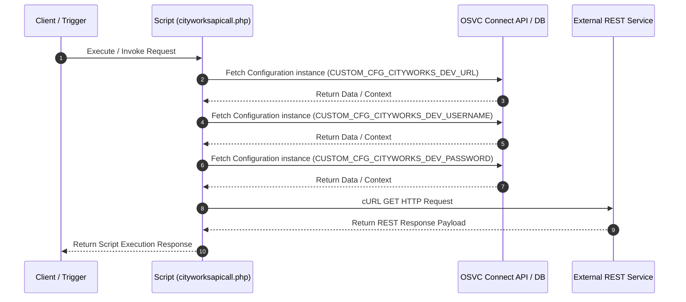

# Custom Script Analysis: `cityworksapicall.php`
## Executive Functional Summary

> [!NOTE]
> This script acts as the **CityWorks Integration Authenticator & Dispatcher**. It fetches CityWorks credentials (`CUSTOM_CFG_CITYWORKS_DEV_URL`, `USERNAME`, `PASSWORD`) from OSVC Configuration, performs an HTTP REST authentication cURL request to generate an access token, and triggers automated work order dispatch via `IncidentToCityWorksSR`.

## Script Overview & Attributes

| Attribute | Value |
| --- | --- |
| **File Name** | `cityworksapicall.php` |
| **Script Type** | Server-side Utility |
| **Contains JavaScript Code** | No |
| **Contains HTML UI Markup** | No |
| **Code Imports** | 1 |
| **OSVC Data Objects** | 2 |
| **Internal APIs (ROQL / Connect)** | 3 |
| **External SOAP APIs** | 0 |
| **External REST APIs** | 1 |
| **Risk Flags** | 0 |

## Cross-Component System Linkages

| Source Component | Linkage Direction | Target Component | Details / Context |
| :--- | :---: | :--- | :--- |
| **CustomScript: cityworksapicall.php** | `->` | **CustomScript: include/init.phph** | import/require: 'include/init.phph' |
| **CustomScript: cityworksapicall.php** | `->` | **OSVCObject: Configuration** | Custom Script 'cityworksapicall.php' operates on entity 'Configuration' |
| **CustomScript: cityworksapicall.php** | `->` | **OSVCObject: ConnectAPI** | Custom Script 'cityworksapicall.php' operates on entity 'ConnectAPI' |

## Code Imports

- `include/init.phph`

## OSVC Data Objects Referenced

- `Configuration`
- `ConnectAPI`

## Categorized API Breakdown

### 1. Internal APIs (ROQL & Native OSVC Objects)

| API Type | Operation | Details |
| --- | --- | --- |
| `Connect PHP Fetch` | Fetch Configuration | `RNCPHP\Configuration::fetch(CUSTOM_CFG_CITYWORKS_DEV_URL)` |
| `Connect PHP Fetch` | Fetch Configuration | `RNCPHP\Configuration::fetch(CUSTOM_CFG_CITYWORKS_DEV_USERNAME)` |
| `Connect PHP Fetch` | Fetch Configuration | `RNCPHP\Configuration::fetch(CUSTOM_CFG_CITYWORKS_DEV_PASSWORD)` |

### 2. External APIs (SOAP)

*No External SOAP Web Service integrations detected.*

### 3. External APIs (REST)

| Protocol | HTTP Method | Endpoint URL | Details |
| --- | --- | --- | --- |
| REST / HTTP | `GET` | `Dynamic / Configured REST Endpoint` | cURL GET request via Configuration |

## Execution Flow Diagram

