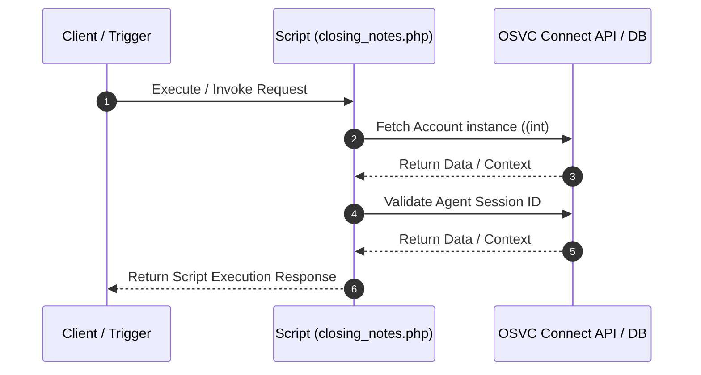

# Custom Script Analysis: `closing_notes.php`
## Executive Functional Summary

> [!NOTE]
> This script performs **Incident Closing Notes Management**. It retrieves Incident records via Connect PHP API, instantiates `RNCPHP\Note` objects, appends resolution notes, and updates incident statuses upon closure.

## Script Overview & Attributes

| Attribute | Value |
| --- | --- |
| **File Name** | `closing_notes.php` |
| **Script Type** | Server-side Utility |
| **Contains JavaScript Code** | Yes |
| **Contains HTML UI Markup** | No |
| **Code Imports** | 0 |
| **OSVC Data Objects** | 3 |
| **Internal APIs (ROQL / Connect)** | 2 |
| **External SOAP APIs** | 0 |
| **External REST APIs** | 0 |
| **Risk Flags** | 0 |

## OSVC Data Objects Referenced

- `Account`
- `ConnectAPI`
- `ConnectAPIErrorBase`

## Categorized API Breakdown

### 1. Internal APIs (ROQL & Native OSVC Objects)

| API Type | Operation | Details |
| --- | --- | --- |
| `Connect PHP Fetch` | Fetch Account | `RNCPHP\Account::fetch((int)` |
| `Agent Authenticator` | Validate Agent Session | `AgentAuthenticator::authenticateSessionID($session_id)` |

### 2. External APIs (SOAP)

*No External SOAP Web Service integrations detected.*

### 3. External APIs (REST)

*No External REST HTTP API integrations detected.*

## Execution Flow Diagram

## Client-Side JavaScript Logic & UI Behavior Summary

The script incorporates client-side JavaScript execution logic with the following UI behaviors and event handlers:

- Registers BUI Extension Loader hooks (`ORACLE_SERVICE_CLOUD.extension_loader`) and binds workspace record events.
