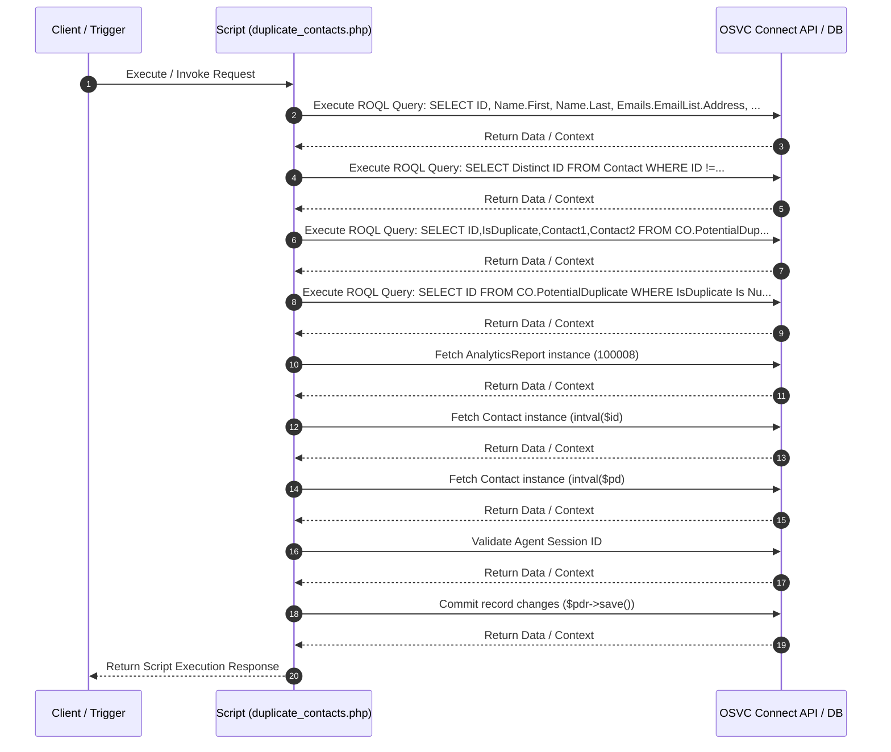

# Custom Script Analysis: `duplicate_contacts.php`
## Executive Functional Summary

> [!NOTE]
> This script performs **Duplicate Contact Detection** for OSVC Agent Console. It parses incoming search parameters (`f_name`, `l_name`, `email`, `h_phone`, `m_phone`, `house_num`, `street_name`, `city`), validates the agent session via `AgentAuthenticator::authenticateSessionID()`, and executes 4 ROQL queries against `Contact` and `CO.PotentialDuplicate` custom object tables to return candidate duplicate contact matches for agent review.

## Script Overview & Attributes

| Attribute | Value |
| --- | --- |
| **File Name** | `duplicate_contacts.php` |
| **Script Type** | Server-side Utility |
| **Contains JavaScript Code** | Yes |
| **Contains HTML UI Markup** | Yes |
| **Code Imports** | 1 |
| **OSVC Data Objects** | 5 |
| **Internal APIs (ROQL / Connect)** | 9 |
| **External SOAP APIs** | 0 |
| **External REST APIs** | 0 |
| **Risk Flags** | 0 |

## Code Imports

- `address_validation.php`

## OSVC Data Objects Referenced

- `AnalyticsReport`
- `CO`
- `ConnectAPIErrorBase`
- `Contact`
- `ROQL`

## Categorized API Breakdown

### 1. Internal APIs (ROQL & Native OSVC Objects)

| API Type | Operation | Details |
| --- | --- | --- |
| `ROQL Query` | SELECT Query | `SELECT ID, Name.First, Name.Last, Emails.EmailList.Address, Phones.RawNumber, Phones.PhoneType.LookupName AS PhoneType, CustomFields.CO.HouseNumber,CustomFields.CO.StreetName, CustomFields.CO.City FROM Contact WHERE` |
| `ROQL Query` | SELECT Query | `SELECT Distinct ID FROM Contact WHERE ID !=` |
| `ROQL Query` | SELECT Query | `SELECT ID,IsDuplicate,Contact1,Contact2 FROM CO.PotentialDuplicate WHERE Contact1 =` |
| `ROQL Query` | SELECT Query | `SELECT ID FROM CO.PotentialDuplicate WHERE IsDuplicate Is Null And (Contact1 =` |
| `Connect PHP Fetch` | Fetch AnalyticsReport | `RNCPHP\AnalyticsReport::fetch(100008)` |
| `Connect PHP Fetch` | Fetch Contact | `RNCPHP\Contact::fetch(intval($id)` |
| `Connect PHP Fetch` | Fetch Contact | `RNCPHP\Contact::fetch(intval($pd)` |
| `Agent Authenticator` | Validate Agent Session | `AgentAuthenticator::authenticateSessionID($session_id)` |
| `Connect PHP Save` | Commit changes to pdr | `$pdr->save()` |

### 2. External APIs (SOAP)

*No External SOAP Web Service integrations detected.*

### 3. External APIs (REST)

*No External REST HTTP API integrations detected.*

## Execution Flow Diagram

## Client-Side JavaScript Logic & UI Behavior Summary

The script incorporates client-side JavaScript execution logic with the following UI behaviors and event handlers:

- Initializes interactive DataTables grid formatting for thumbnail & search results display.
- Registers BUI Extension Loader hooks (`ORACLE_SERVICE_CLOUD.extension_loader`) and binds workspace record events.
- Attaches dynamic workspace field value change listeners to trigger real-time search and validation as fields are edited.
- Fires custom workspace named events (`focusDuplicateTab` / `hideDuplicateTab`) to dynamically toggle console tab visibility.
- Dynamically constructs HTML table rows and inserts clickable contact selection links into DOM container elements.

## Live Interactive HTML UI Component Preview

The script defines embedded HTML UI markup. Below is the live rendered interactive component preview:

<div class="html-preview-pending" data-html="PHByZT4KCjwhRE9DVFlQRSBodG1sPiA8bWV0YSBodHRwLWVxdWl2PSJYLVVBLUNvbXBhdGlibGUiIGNvbnRlbnQ9IklFPUVkZ2UiID48IS0tW2lmIGx0ZSBJRSA4XT4KPHNjcmlwdCBzcmM9Imh0bWw1LmpzIiB0eXBlPSJ0ZXh0L2phdmFzY3JpcHQiPjwvc2NyaXB0Pgo8IVtlbmRpZl0tLT4KIDxoZWFkPgogICAgICAgIDxzY3JpcHQgdHlwZT0idGV4dC9qYXZhc2NyaXB0IiBzcmM9Ii8vYWpheC5nb29nbGVhcGlzLmNvbS9hamF4L2xpYnMvanF1ZXJ5LzMuMy4xL2pxdWVyeS5taW4uanMiPjwvc2NyaXB0PgoKICAgICAgICA8IS0tIERhdGF0YWJsZSBsaWJyYXJ5IC0tPgoJCTxsaW5rIHJlbD0ic3R5bGVzaGVldCIgdHlwZT0idGV4dC9jc3MiIGhyZWY9Imh0dHBzOi8vY2RuLmRhdGF0YWJsZXMubmV0LzEuMTAuMjAvY3NzL2pxdWVyeS5kYXRhVGFibGVzLmNzcyI+ICAKCQk8c2NyaXB0IHR5cGU9InRleHQvamF2YXNjcmlwdCIgY2hhcnNldD0idXRmOCIgc3JjPSJodHRwczovL2Nkbi5kYXRhdGFibGVzLm5ldC8xLjEwLjIwL2pzL2pxdWVyeS5kYXRhVGFibGVzLmpzIj48L3NjcmlwdD4KCiAgICAgICAgPCEtLSBGb250QXdlc29tZSBmb3Igbm90aWZpY2F0aW9uIGFuZCBkYXRhdGFibGUgaWNvbnMgLS0+CiAgICAgICAgPGxpbmsgcmVsPSJzdHlsZXNoZWV0IiBocmVmPSJodHRwczovL3VzZS5mb250YXdlc29tZS5jb20vcmVsZWFzZXMvdjUuMS4xL2Nzcy9hbGwuY3NzIiBpbnRlZ3JpdHk9InNoYTM4NC1POHdoUzNmaEcyT25BNUthczBZOWwzY2ZwbVlqYXBqSTBFNHRoZUg0aXVNRCtwTGhiZjZKSTBqSU1mWWNLM3laIiBjcm9zc29yaWdpbj0iYW5vbnltb3VzIj4KICAgIDwvaGVhZD4KICAgIDxib2R5PgoKCQk8ZGl2IGlkPSJ0aHVtYm5haWxfc3Jfc2FfZmlsZXMiPgkJCgkJPHAgc3R5bGU9ImNvbG9yOiByZWQ7Zm9udC1zaXplOiAyNHB4O3dpZHRoOiAyNTBweDttYXJnaW46IGF1dG87LyogbWFyZ2luLWxlZnQ6IDQwJTsgKi8iPiBEdXBsaWNhdGUgQ29udGFjdHMgZm91bmQgPC9wPgoJCQk8dGFibGUgaWQ9InRodW1ibmFpbF9pZCI+CgkJCQk8dGhlYWQ+CgkJCQkJPHRyPgoJCQkJCQk8dGg+Rmlyc3QgTmFtZTwvdGg+CgkJCQkJCTx0aD5MYXN0IE5hbWU8L3RoPgoJCQkJCQk8dGg+RW1haWw8L3RoPgoJCQkJCQk8dGg+SG9tZSAjPC90aD4KCQkJCQkJPHRoPk1vYmlsZSAjPC90aD4KCQkJCQkJPHRoPkhvdXNlIE51bTwvdGg+CgkJCQkJCTx0aD5TdHJlZXQgTmFtZTwvdGg+CgkJCQkJCTx0aD5DaXR5PC90aD4KCQkJCQkJPHRoPkFjdGlvbjwvdGg+CgkJCQkJPC90cj4KCQkJCTwvdGhlYWQ+CgkJCQk8dGJvZHkgaWQ9InRodW1ibmFpbF9pZF9ib2R5Ij4KCQkJCTwvdGJvZHk+CgkJCTwvdGFibGU+CQkJCgkJPC9kaXY+CgogICAgPC9ib2R5Pgo8c2NyaXB0PgoJdmFyIGR1cGxpY2F0ZUNvbnRhY3RzID0gOwoKCWlmKCAhQXJyYXkuaXNBcnJheShkdXBsaWNhdGVDb250YWN0cykgJiYgZHVwbGljYXRlQ29udGFjdHMgIT0gbnVsbCkKCXsKCQlhbGVydCgiUG90ZW50aWFsIER1cGxpY2F0ZSBDb250YWN0IERldGVjdGVkIik7CQoJCXZhciB0YWJsZSA9IGRvY3VtZW50LmdldEVsZW1lbnRCeUlkKCJ0aHVtYm5haWxfaWQiKTsKCQkKCQlmb3IgKHZhciBrZXkgaW4gZHVwbGljYXRlQ29udGFjdHMpIHsKCQkJdmFyIHRhYmxlTGVuZ3RoID0gdGFibGUubGVuZ3RoOwoJCQl2YXIgcm93ID0gdGFibGUuZ2V0RWxlbWVudHNCeVRhZ05hbWUoJ3Rib2R5JylbMF0uaW5zZXJ0Um93KHRhYmxlTGVuZ3RoKTsJCQkJCQoJCQkKCQkJdmFyIGNlbGwxID0gcm93Lmluc2VydENlbGwoMCk7CgkJCXZhciBjZWxsMiA9IHJvdy5pbnNlcnRDZWxsKDEpOwoJCQl2YXIgY2VsbDMgPSByb3cuaW5zZXJ0Q2VsbCgyKTsKCQkJdmFyIGNlbGw0ID0gcm93Lmluc2VydENlbGwoMyk7CgkJCXZhciBjZWxsNSA9IHJvdy5pbnNlcnRDZWxsKDQpOwoJCQl2YXIgY2VsbDYgPSByb3cuaW5zZXJ0Q2VsbCg1KTsKCQkJdmFyIGNlbGw3ID0gcm93Lmluc2VydENlbGwoNik7CgkJCXZhciBjZWxsOCA9IHJvdy5pbnNlcnRDZWxsKDcpOwkKCQkJdmFyIGNlbGw5ID0gcm93Lmluc2VydENlbGwoOCk7CQkJCgkJCS8vY29uc29sZS5sb2coZHVwbGljYXRlQ29udGFjdHNba2V5XSk7CgkJCWNlbGwxLmlubmVySFRNTCA9IGR1cGxpY2F0ZUNvbnRhY3RzW2tleV0uRmlyc3Q7CgkJCWNlbGwyLmlubmVySFRNTCA9IGR1cGxpY2F0ZUNvbnRhY3RzW2tleV0uTGFzdDsKCQkJY2VsbDMuaW5uZXJIVE1MID0gZHVwbGljYXRlQ29udGFjdHNba2V5XS5BZGRyZXNzOwoJCQljZWxsNC5pbm5lckhUTUwgPSBkdXBsaWNhdGVDb250YWN0c1trZXldLkhvbWVOdW07CgkJCWNlbGw1LmlubmVySFRNTCA9IGR1cGxpY2F0ZUNvbnRhY3RzW2tleV0uTW9iaWxlTnVtOwoJCQljZWxsNi5pbm5lckhUTUwgPSBkdXBsaWNhdGVDb250YWN0c1trZXldLkhvdXNlTnVtYmVyOwoJCQljZWxsNy5pbm5lckhUTUwgPSBkdXBsaWNhdGVDb250YWN0c1trZXldLlN0cmVldE5hbWU7CgkJCWNlbGw4LmlubmVySFRNTCA9IGR1cGxpY2F0ZUNvbnRhY3RzW2tleV0uQ2l0eTsJCgkJCWNlbGw5LmlubmVySFRNTCA9ICI8YSBocmVmPScjJyBvbmNsaWNrPSdvcGVuQ29udGFjdCgiK2R1cGxpY2F0ZUNvbnRhY3RzW2tleV0uSUQrIik7JyBpZD0nIitkdXBsaWNhdGVDb250YWN0c1trZXldLklEKyInID5TZWxlY3Q8L2E+IjsJCQkKCQl9Cgl9CgkkKCcjdGh1bWJuYWlsX2lkJykuRGF0YVRhYmxlKCB7CgkJInBhZ2luZyI6ICAgZmFsc2UsCgkJIm9yZGVyaW5nIjogZmFsc2UsCgkJImluZm8iOiAgICAgZmFsc2UsCgkJImJGaWx0ZXIiOiBmYWxzZSwKCQkiY29sdW1uRGVmcyI6IFt7ImNsYXNzTmFtZSI6ICJkdC1jZW50ZXIiLCAidGFyZ2V0cyI6ICJfYWxsIn1dCgl9ICk7CgoJdmFyIGkgPSB3aW5kb3cuZXh0ZXJuYWwuSW5jaWRlbnQ7CgkvL0lmIG9wZW5lZCB0aHJvdWdoIERlc3RvcCBDb25zb2xlIHRoZW4gdXNlIEphdmFzY3JpcHQgRXh0ZW5zaW9uCglpZihpICE9PSB1bmRlZmluZWQpCgl7CgkKCgl9CgllbHNlCgl7CgkJdmFyIGNzcyA9ICdsYWJlbCB7Zm9udC1mYW1pbHk6IC1hcHBsZS1zeXN0ZW0sIEJsaW5rTWFjU3lzdGVtRm9udCwgIlNlZ29lIFVJIiwgIkhlbHZldGljYSBOZXVlIiwgQXJpYWwsIHNhbnMtc2VyaWYgIWltcG9ydGFudDtkaXNwbGF5OiBibG9jayAhaW1wb3J0YW50O2ZvbnQtc2l6ZTogMTJweCAhaW1wb3J0YW50O2ZvbnQtd2VpZ2h0OiBub3JtYWwgIWltcG9ydGFudDsgbWFyZ2luLWJvdHRvbTogMC4yNWVtICFpbXBvcnRhbnQ7fS5jb2wtbWQtNiB7bWFyZ2luLWJvdHRvbTogMC41ZW0gIWltcG9ydGFudDt9LmZvcm0tY29udHJvbCB7aGVpZ2h0OiAzMHB4ICFpbXBvcnRhbnQ7Zm9udC1mYW1pbHk6IC1hcHBsZS1zeXN0ZW0sIEJsaW5rTWFjU3lzdGVtRm9udCwgIlNlZ29lIFVJIiwgIkhlbHZldGljYSBOZXVlIiwgQXJpYWwsIHNhbnMtc2VyaWYgIWltcG9ydGFudDsgICAgZm9udC1zaXplOiAxMnB4ICFpbXBvcnRhbnQ7ICAgIGZvbnQtd2VpZ2h0OiBub3JtYWwgIWltcG9ydGFudDt9JywKCSAgICBoZWFkID0gZG9jdW1lbnQuaGVhZCB8fCBkb2N1bWVudC5nZXRFbGVtZW50c0J5VGFnTmFtZSgnaGVhZCcpWzBdLAoJICAgIHN0eWxlID0gZG9jdW1lbnQuY3JlYXRlRWxlbWVudCgnc3R5bGUnKTsKCQloZWFkLmFwcGVuZENoaWxkKHN0eWxlKTsJCgkJc3R5bGUudHlwZSA9ICd0ZXh0L2Nzcyc7CgkJc3R5bGUuYXBwZW5kQ2hpbGQoZG9jdW1lbnQuY3JlYXRlVGV4dE5vZGUoY3NzKSk7CgkKCQl2YXIgd3NSZWNvcmQ7CgkJdmFyIHNjcmlwdCA9IGRvY3VtZW50LmNyZWF0ZUVsZW1lbnQoJ3NjcmlwdCcpOyAgICAgICAgICAgICAgICAKCQlzY3JpcHQudHlwZSA9ICd0ZXh0L2phdmFzY3JpcHQnOwoJCXNjcmlwdC5hc3luYyA9IHRydWU7CgkJc2NyaXB0LnNyYyA9ICcvQWdlbnRXZWIvbW9kdWxlL2V4dGVuc2liaWxpdHkvanMvY2xpZW50L2NvcmUvZXh0ZW5zaW9uX2xvYWRlci5qcyc7CQoJCXNjcmlwdC5vbmxvYWQgPSBmdW5jdGlvbigpIHsKCQkJCgkJCU9SQUNMRV9TRVJWSUNFX0NMT1VELmV4dGVuc2lvbl9sb2FkZXIubG9hZCgiY3VzdG9tRm9ybUV4dGlvbnNpb24iLCAiMSIpCgkJCS50aGVuKGZ1bmN0aW9uKGV4dGVuc2lvblByb3ZpZGVyKQoJCQl7CQkJCQoJCSAgICAgICAgbmFtZWRMb2dnZXIgPSBleHRlbnNpb25Qcm92aWRlci5nZXRMb2dnZXIoJ0NHUyBMb2dnZXInKTsKCQkgICAgICAgIG5hbWVkTG9nZ2VyLnRyYWNlKCdMb2FkIENHUyBjdXN0b20gRm9ybSBFeHRpb25zaW9uJyk7CgkJCgkJICAgIAlleHRlbnNpb25Qcm92aWRlci5yZWdpc3RlcldvcmtzcGFjZUV4dGVuc2lvbihmdW5jdGlvbih3b3Jrc3BhY2VSZWNvcmQpCgkJICAgIAl7CgkgICAgCQkJd3NSZWNvcmQgPSB3b3Jrc3BhY2VSZWNvcmQ7CgkJCQkJLy9MaXN0IG9mIGZpZWxkcyB0byBiZSBwcmVmZXRjaAoJCQkJCXdzUmVjb3JkLnByZWZldGNoV29ya3NwYWNlRmllbGRzKFsnQ29udGFjdC5OYW1lLkZpcnN0JywnQ29udGFjdC5OYW1lLkxhc3QnLCdDb250YWN0LkVtYWlsLkFkZHInLCdDb250YWN0LlBoSG9tZScsJ0NvbnRhY3QuUGhNb2JpbGUnLCdDb250YWN0LkNPJEhvdXNlTnVtYmVyJywnQ29udGFjdC5DTyRTdHJlZXROYW1lJywnQ29udGFjdC5DTyRDaXR5J10pOwoJICAgIAkJCQoJCQkJCS8vT09UQiBXb3Jrc3BhY2UgRXZlbnQKCQkJCQkvL3dvcmtzcGFjZVJlY29yZC5hZGRSZWNvcmRTYXZpbmdMaXN0ZW5lcihkYXRhU2F2aW5nTGlzdGVuZXJGb3JTUik7CgkJCQkJd3NSZWNvcmQuYWRkRmllbGRWYWx1ZUxpc3RlbmVyKCdDb250YWN0Lk5hbWUuRmlyc3QnLCBmaWVsZFZhbHVlTGlzdGVuZXIpOwoJCQkJCXdzUmVjb3JkLmFkZEZpZWxkVmFsdWVMaXN0ZW5lcignQ29udGFjdC5OYW1lLkxhc3QnLCBmaWVsZFZhbHVlTGlzdGVuZXIpOwoJCQkJCXdzUmVjb3JkLmFkZEZpZWxkVmFsdWVMaXN0ZW5lcignQ29udGFjdC5FbWFpbC5BZGRyJywgZmllbGRWYWx1ZUxpc3RlbmVyKTsKCQkJCQl3c1JlY29yZC5hZGRGaWVsZFZhbHVlTGlzdGVuZXIoJ0NvbnRhY3QuUGhIb21lJywgZmllbGRWYWx1ZUxpc3RlbmVyKTsKCQkJCQl3c1JlY29yZC5hZGRGaWVsZFZhbHVlTGlzdGVuZXIoJ0NvbnRhY3QuUGhNb2JpbGUnLCBmaWVsZFZhbHVlTGlzdGVuZXIpOwoJCQkJCXdzUmVjb3JkLmFkZEZpZWxkVmFsdWVMaXN0ZW5lcignQ29udGFjdC5DTyRIb3VzZU51bWJlcicsIGZpZWxkVmFsdWVMaXN0ZW5lcik7d3NSZWNvcmQuYWRkRmllbGRWYWx1ZUxpc3RlbmVyKCdDb250YWN0LkNPJFN0cmVldE5hbWUnLCBmaWVsZFZhbHVlTGlzdGVuZXIpOwoJCQkJCXdzUmVjb3JkLmFkZEZpZWxkVmFsdWVMaXN0ZW5lcignQ29udGFjdC5DTyRDaXR5JywgZmllbGRWYWx1ZUxpc3RlbmVyKTsKCQkJCQkKCQkJCQlpZiggIUFycmF5LmlzQXJyYXkoZHVwbGljYXRlQ29udGFjdHMpICYmIGR1cGxpY2F0ZUNvbnRhY3RzICE9IG51bGwpCgkJCQkJewoJCQkJCQl3c1JlY29yZC50cmlnZ2VyTmFtZWRFdmVudCgiZm9jdXNEdXBsaWNhdGVUYWIiKTsKCQkJCQl9CgkJCQkJZWxzZQoJCQkJCXsKCQkJCQkJd3NSZWNvcmQudHJpZ2dlck5hbWVkRXZlbnQoImhpZGVEdXBsaWNhdGVUYWIiKTsKCQkJCQl9CgoJCSAgICAJfSk7CgkJCX0pOwoJCX07CQoJCWRvY3VtZW50LmhlYWQuYXBwZW5kQ2hpbGQoc2NyaXB0KTsJCQkKCQkKCQkvL0Z1bmN0aW9uIHRvIGNhcHR1cmUgZmllbGQgY2hhbmdlLCBpZiBDYXRlZ29yeSBpcyBjaGFuZ2VkIHRoZW4gcmVmZXNoIHRoZSBwYWdlIGJ5IHBhc3NpbmcgbmV3IGNhdGVnb3J5IElECgkJZnVuY3Rpb24gZmllbGRWYWx1ZUxpc3RlbmVyKGV2ZW50UGFyYW1ldGVyKQoJCXsKCQkJbGV0IGZOYW1lLCBsTmFtZSwgZW1haWwsIGhQaG9uZSwgbVBob25lLCBoTnVtLCBzdHJlZXQsIGNpdHk7CgoJCQlpZihldmVudFBhcmFtZXRlci5ldmVudC5maWVsZE9iamVjdHNbIkNvbnRhY3QuTmFtZS5GaXJzdCJdLnZhbHVlICE9IG51bGwpCgkJCQlmTmFtZSA9IGV2ZW50UGFyYW1ldGVyLmV2ZW50LmZpZWxkT2JqZWN0c1siQ29u" data-title="duplicate_contacts.php">
  

    

<pre>

<!DOCTYPE html> <meta http-equiv="X-UA-Compatible" content="IE=Edge" ><!--[if lte IE 8]>

<![endif]-->
 <head>
        

        <!-- Datatable library -->
		<link rel="stylesheet" type="text/css" href="https://cdn.datatables.net/1.10.20/css/jquery.dataTables.css">  
		

        <!-- FontAwesome for notification and datatable icons -->
        <link rel="stylesheet" href="https://use.fontawesome.com/releases/v5.1.1/css/all.css" integrity="sha384-O8whS3fhG2OnA5Kas0Y9l3cfpmYjapjI0E4theH4iuMD+pLhbf6JI0jIMfYcK3yZ" crossorigin="anonymous">
    </head>
    <body>

		
		
		
 Duplicate Contacts found 

			<table id="thumbnail_id">
				<thead>
					<tr>
						<th>First Name</th>
						<th>Last Name</th>
						<th>Email</th>
						<th>Home #</th>
						<th>Mobile #</th>
						<th>House Num</th>
						<th>Street Name</th>
						<th>City</th>
						<th>Action</th>
					</tr>
				</thead>
				<tbody id="thumbnail_id_body">
				</tbody>
			</table>			
		

    </body>
<script>
	var duplicateContacts = ;

	if( !Array.isArray(duplicateContacts) && duplicateContacts != null)
	{
		alert("Potential Duplicate Contact Detected");	
		var table = document.getElementById("thumbnail_id");
		
		for (var key in duplicateContacts) {
			var tableLength = table.length;
			var row = table.getElementsByTagName('tbody')[0].insertRow(tableLength);					
			
			var cell1 = row.insertCell(0);
			var cell2 = row.insertCell(1);
			var cell3 = row.insertCell(2);
			var cell4 = row.insertCell(3);
			var cell5 = row.insertCell(4);
			var cell6 = row.insertCell(5);
			var cell7 = row.insertCell(6);
			var cell8 = row.insertCell(7);	
			var cell9 = row.insertCell(8);			
			//console.log(duplicateContacts[key]);
			cell1.innerHTML = duplicateContacts[key].First;
			cell2.innerHTML = duplicateContacts[key].Last;
			cell3.innerHTML = duplicateContacts[key].Address;
			cell4.innerHTML = duplicateContacts[key].HomeNum;
			cell5.innerHTML = duplicateContacts[key].MobileNum;
			cell6.innerHTML = duplicateContacts[key].HouseNumber;
			cell7.innerHTML = duplicateContacts[key].StreetName;
			cell8.innerHTML = duplicateContacts[key].City;	
			cell9.innerHTML = "<a href='#' onclick='openContact("+duplicateContacts[key].ID+");' id='"+duplicateContacts[key].ID+"' >Select</a>";			
		}
	}
	$('#thumbnail_id').DataTable( {
		"paging":   false,
		"ordering": false,
		"info":     false,
		"bFilter": false,
		"columnDefs": [{"className": "dt-center", "targets": "_all"}]
	} );

	var i = window.external.Incident;
	//If opened through Destop Console then use Javascript Extension
	if(i !== undefined)
	{
	

	}
	else
	{
		var css = 'label {font-family: -apple-system, BlinkMacSystemFont, "Segoe UI", "Helvetica Neue", Arial, sans-serif !important;display: block !important;font-size: 12px !important;font-weight: normal !important; margin-bottom: 0.25em !important;}.col-md-6 {margin-bottom: 0.5em !important;}.form-control {height: 30px !important;font-family: -apple-system, BlinkMacSystemFont, "Segoe UI", "Helvetica Neue", Arial, sans-serif !important;    font-size: 12px !important;    font-weight: normal !important;}',
	    head = document.head || document.getElementsByTagName('head')[0],
	    style = document.createElement('style');
		head.appendChild(style);	
		style.type = 'text/css';
		style.appendChild(document.createTextNode(css));
	
		var wsRecord;
		var script = document.createElement('script');                
		script.type = 'text/javascript';
		script.async = true;
		script.src = '/AgentWeb/module/extensibility/js/client/core/extension_loader.js';	
		script.onload = function() {
			
			ORACLE_SERVICE_CLOUD.extension_loader.load("customFormExtionsion", "1")
			.then(function(extensionProvider)
			{				
		        namedLogger = extensionProvider.getLogger('CGS Logger');
		        namedLogger.trace('Load CGS custom Form Extionsion');
		
		    	extensionProvider.registerWorkspaceExtension(function(workspaceRecord)
		    	{
	    			wsRecord = workspaceRecord;
					//List of fields to be prefetch
					wsRecord.prefetchWorkspaceFields(['Contact.Name.First','Contact.Name.Last','Contact.Email.Addr','Contact.PhHome','Contact.PhMobile','Contact.CO$HouseNumber','Contact.CO$StreetName','Contact.CO$City']);
	    			
					//OOTB Workspace Event
					//workspaceRecord.addRecordSavingListener(dataSavingListenerForSR);
					wsRecord.addFieldValueListener('Contact.Name.First', fieldValueListener);
					wsRecord.addFieldValueListener('Contact.Name.Last', fieldValueListener);
					wsRecord.addFieldValueListener('Contact.Email.Addr', fieldValueListener);
					wsRecord.addFieldValueListener('Contact.PhHome', fieldValueListener);
					wsRecord.addFieldValueListener('Contact.PhMobile', fieldValueListener);
					wsRecord.addFieldValueListener('Contact.CO$HouseNumber', fieldValueListener);wsRecord.addFieldValueListener('Contact.CO$StreetName', fieldValueListener);
					wsRecord.addFieldValueListener('Contact.CO$City', fieldValueListener);
					
					if( !Array.isArray(duplicateContacts) && duplicateContacts != null)
					{
						wsRecord.triggerNamedEvent("focusDuplicateTab");
					}
					else
					{
						wsRecord.triggerNamedEvent("hideDuplicateTab");
					}

		    	});
			});
		};	
		document.head.appendChild(script);			
		
		//Function to capture field change, if Category is changed then refesh the page by passing new category ID
		function fieldValueListener(eventParameter)
		{
			let fName, lName, email, hPhone, mPhone, hNum, street, city;

			if(eventParameter.event.fieldObjects["Contact.Name.First"].value != null)
				fName = eventParameter.event.fieldObjects["Con
    

  

