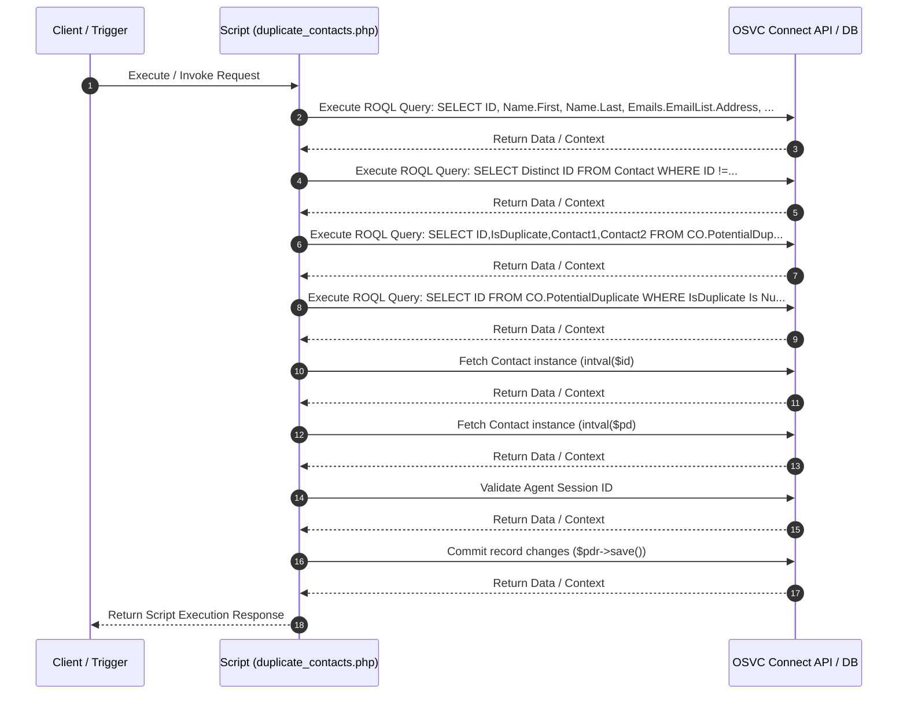

# Custom Script Analysis: `duplicate_contacts.php`
## Executive Functional Summary

> [!NOTE]
> This script performs **Duplicate Contact Detection** for OSVC Agent Console. It parses incoming search parameters (`f_name`, `l_name`, `email`, `h_phone`, `m_phone`, `house_num`, `street_name`, `city`), validates the agent session via `AgentAuthenticator::authenticateSessionID()`, and executes 4 ROQL queries against `Contact` and `CO.PotentialDuplicate` custom object tables to return candidate duplicate contact matches for agent review.

## Script Overview & Attributes

| Attribute | Value |
| --- | --- |
| **File Name** | `duplicate_contacts.php` |
| **Script Type** | Server-side Utility |
| **Contains JavaScript Code** | Yes |
| **Contains HTML UI Markup** | Yes |
| **Code Imports** | 0 |
| **OSVC Data Objects** | 4 |
| **Internal APIs (ROQL / Connect)** | 8 |
| **External SOAP APIs** | 0 |
| **External REST APIs** | 0 |
| **Risk Flags** | 0 |

## OSVC Data Objects Referenced

- `CO`
- `ConnectAPIErrorBase`
- `Contact`
- `ROQL`

## Categorized API Breakdown

### 1. Internal APIs (ROQL & Native OSVC Objects)

| API Type | Operation | Details |
| --- | --- | --- |
| `ROQL Query` | SELECT Query | `SELECT ID, Name.First, Name.Last, Emails.EmailList.Address, Phones.RawNumber, Phones.PhoneType.LookupName AS PhoneType, CustomFields.CO.HouseNumber,CustomFields.CO.StreetName, CustomFields.CO.City FROM Contact WHERE` |
| `ROQL Query` | SELECT Query | `SELECT Distinct ID FROM Contact WHERE ID !=` |
| `ROQL Query` | SELECT Query | `SELECT ID,IsDuplicate,Contact1,Contact2 FROM CO.PotentialDuplicate WHERE Contact1 =` |
| `ROQL Query` | SELECT Query | `SELECT ID FROM CO.PotentialDuplicate WHERE IsDuplicate Is Null And (Contact1 =` |
| `Connect PHP Fetch` | Fetch Contact | `RNCPHP\Contact::fetch(intval($id)` |
| `Connect PHP Fetch` | Fetch Contact | `RNCPHP\Contact::fetch(intval($pd)` |
| `Agent Authenticator` | Validate Agent Session | `AgentAuthenticator::authenticateSessionID($session_id)` |
| `Connect PHP Save` | Commit changes to pdr | `$pdr->save()` |

### 2. External APIs (SOAP)

*No External SOAP Web Service integrations detected.*

### 3. External APIs (REST)

*No External REST HTTP API integrations detected.*

## Execution Flow Diagram

## Client-Side JavaScript Logic & UI Behavior Summary

The script incorporates client-side JavaScript execution logic with the following UI behaviors and event handlers:

- Initializes interactive DataTables grid formatting for thumbnail & search results display.
- Registers BUI Extension Loader hooks (`ORACLE_SERVICE_CLOUD.extension_loader`) and binds workspace record events.
- Attaches dynamic workspace field value change listeners to trigger real-time search and validation as fields are edited.
- Fires custom workspace named events (`focusDuplicateTab` / `hideDuplicateTab`) to dynamically toggle console tab visibility.
- Dynamically constructs HTML table rows and inserts clickable contact selection links into DOM container elements.

## Live Interactive HTML UI Component Preview

The script defines embedded HTML UI markup. Below is the live rendered interactive component preview:

<div class="html-preview-pending" data-html="PHByZT4KCu+7vwo8IURPQ1RZUEUgaHRtbD4gPG1ldGEgaHR0cC1lcXVpdj0iWC1VQS1Db21wYXRpYmxlIiBjb250ZW50PSJJRT1FZGdlIiA+PCEtLVtpZiBsdGUgSUUgOF0+CjxzY3JpcHQgc3JjPSJodG1sNS5qcyIgdHlwZT0idGV4dC9qYXZhc2NyaXB0Ij48L3NjcmlwdD4KPCFbZW5kaWZdLS0+CiA8aGVhZD4KICAgICAgICA8c2NyaXB0IHR5cGU9InRleHQvamF2YXNjcmlwdCIgc3JjPSIvL2FqYXguZ29vZ2xlYXBpcy5jb20vYWpheC9saWJzL2pxdWVyeS8zLjMuMS9qcXVlcnkubWluLmpzIj48L3NjcmlwdD4KCiAgICAgICAgPCEtLSBEYXRhdGFibGUgbGlicmFyeSAtLT4KCQk8bGluayByZWw9InN0eWxlc2hlZXQiIHR5cGU9InRleHQvY3NzIiBocmVmPSJodHRwczovL2Nkbi5kYXRhdGFibGVzLm5ldC8xLjEwLjIwL2Nzcy9qcXVlcnkuZGF0YVRhYmxlcy5jc3MiPiAgCgkJPHNjcmlwdCB0eXBlPSJ0ZXh0L2phdmFzY3JpcHQiIGNoYXJzZXQ9InV0ZjgiIHNyYz0iaHR0cHM6Ly9jZG4uZGF0YXRhYmxlcy5uZXQvMS4xMC4yMC9qcy9qcXVlcnkuZGF0YVRhYmxlcy5qcyI+PC9zY3JpcHQ+CgogICAgICAgIDwhLS0gRm9udEF3ZXNvbWUgZm9yIG5vdGlmaWNhdGlvbiBhbmQgZGF0YXRhYmxlIGljb25zIC0tPgogICAgICAgIDxsaW5rIHJlbD0ic3R5bGVzaGVldCIgaHJlZj0iaHR0cHM6Ly91c2UuZm9udGF3ZXNvbWUuY29tL3JlbGVhc2VzL3Y1LjEuMS9jc3MvYWxsLmNzcyIgaW50ZWdyaXR5PSJzaGEzODQtTzh3aFMzZmhHMk9uQTVLYXMwWTlsM2NmcG1ZamFwakkwRTR0aGVINGl1TUQrcExoYmY2SkkwaklNZlljSzN5WiIgY3Jvc3NvcmlnaW49ImFub255bW91cyI+CiAgICA8L2hlYWQ+CiAgICA8Ym9keT4KCgkJPGRpdiBpZD0idGh1bWJuYWlsX3NyX3NhX2ZpbGVzIj4JCQoJCTxwIHN0eWxlPSJjb2xvcjogcmVkO2ZvbnQtc2l6ZTogMjRweDt3aWR0aDogMjUwcHg7bWFyZ2luOiBhdXRvOy8qIG1hcmdpbi1sZWZ0OiA0MCU7ICovIj4gRHVwbGljYXRlIENvbnRhY3RzIGZvdW5kIDwvcD4KCQkJPHRhYmxlIGlkPSJ0aHVtYm5haWxfaWQiPgoJCQkJPHRoZWFkPgoJCQkJCTx0cj4KCQkJCQkJPHRoPkZpcnN0IE5hbWU8L3RoPgoJCQkJCQk8dGg+TGFzdCBOYW1lPC90aD4KCQkJCQkJPHRoPkVtYWlsPC90aD4KCQkJCQkJPHRoPkhvbWUgIzwvdGg+CgkJCQkJCTx0aD5Nb2JpbGUgIzwvdGg+CgkJCQkJCTx0aD5Ib3VzZSBOdW08L3RoPgoJCQkJCQk8dGg+U3RyZWV0IE5hbWU8L3RoPgoJCQkJCQk8dGg+Q2l0eTwvdGg+CgkJCQkJCTx0aD5BY3Rpb248L3RoPgoJCQkJCTwvdHI+CgkJCQk8L3RoZWFkPgoJCQkJPHRib2R5IGlkPSJ0aHVtYm5haWxfaWRfYm9keSI+CgkJCQk8L3Rib2R5PgoJCQk8L3RhYmxlPgkJCQoJCTwvZGl2PgoKICAgIDwvYm9keT4KPHNjcmlwdD4KCXZhciBkdXBsaWNhdGVDb250YWN0cyA9IDsKCglpZiggIUFycmF5LmlzQXJyYXkoZHVwbGljYXRlQ29udGFjdHMpICYmIGR1cGxpY2F0ZUNvbnRhY3RzICE9IG51bGwpCgl7CgkJYWxlcnQoIlBvdGVudGlhbCBEdXBsaWNhdGUgQ29udGFjdCBEZXRlY3RlZCIpOwkKCQl2YXIgdGFibGUgPSBkb2N1bWVudC5nZXRFbGVtZW50QnlJZCgidGh1bWJuYWlsX2lkIik7CgkJCgkJZm9yICh2YXIga2V5IGluIGR1cGxpY2F0ZUNvbnRhY3RzKSB7CgkJCXZhciB0YWJsZUxlbmd0aCA9IHRhYmxlLmxlbmd0aDsKCQkJdmFyIHJvdyA9IHRhYmxlLmdldEVsZW1lbnRzQnlUYWdOYW1lKCd0Ym9keScpWzBdLmluc2VydFJvdyh0YWJsZUxlbmd0aCk7CQkJCQkKCQkJCgkJCXZhciBjZWxsMSA9IHJvdy5pbnNlcnRDZWxsKDApOwoJCQl2YXIgY2VsbDIgPSByb3cuaW5zZXJ0Q2VsbCgxKTsKCQkJdmFyIGNlbGwzID0gcm93Lmluc2VydENlbGwoMik7CgkJCXZhciBjZWxsNCA9IHJvdy5pbnNlcnRDZWxsKDMpOwoJCQl2YXIgY2VsbDUgPSByb3cuaW5zZXJ0Q2VsbCg0KTsKCQkJdmFyIGNlbGw2ID0gcm93Lmluc2VydENlbGwoNSk7CgkJCXZhciBjZWxsNyA9IHJvdy5pbnNlcnRDZWxsKDYpOwoJCQl2YXIgY2VsbDggPSByb3cuaW5zZXJ0Q2VsbCg3KTsJCgkJCXZhciBjZWxsOSA9IHJvdy5pbnNlcnRDZWxsKDgpOwkJCQoJCQkvL2NvbnNvbGUubG9nKGR1cGxpY2F0ZUNvbnRhY3RzW2tleV0pOwoJCQljZWxsMS5pbm5lckhUTUwgPSBkdXBsaWNhdGVDb250YWN0c1trZXldLkZpcnN0OwoJCQljZWxsMi5pbm5lckhUTUwgPSBkdXBsaWNhdGVDb250YWN0c1trZXldLkxhc3Q7CgkJCWNlbGwzLmlubmVySFRNTCA9IGR1cGxpY2F0ZUNvbnRhY3RzW2tleV0uQWRkcmVzczsKCQkJY2VsbDQuaW5uZXJIVE1MID0gZHVwbGljYXRlQ29udGFjdHNba2V5XS5Ib21lTnVtOwoJCQljZWxsNS5pbm5lckhUTUwgPSBkdXBsaWNhdGVDb250YWN0c1trZXldLk1vYmlsZU51bTsKCQkJY2VsbDYuaW5uZXJIVE1MID0gZHVwbGljYXRlQ29udGFjdHNba2V5XS5Ib3VzZU51bWJlcjsKCQkJY2VsbDcuaW5uZXJIVE1MID0gZHVwbGljYXRlQ29udGFjdHNba2V5XS5TdHJlZXROYW1lOwoJCQljZWxsOC5pbm5lckhUTUwgPSBkdXBsaWNhdGVDb250YWN0c1trZXldLkNpdHk7CQoJCQljZWxsOS5pbm5lckhUTUwgPSAiPGEgaHJlZj0nIycgb25jbGljaz0nb3BlbkNvbnRhY3QoIitkdXBsaWNhdGVDb250YWN0c1trZXldLklEKyIpOycgaWQ9JyIrZHVwbGljYXRlQ29udGFjdHNba2V5XS5JRCsiJyA+U2VsZWN0PC9hPiI7CQkJCgkJfQoJfQoJJCgnI3RodW1ibmFpbF9pZCcpLkRhdGFUYWJsZSggewoJCSJwYWdpbmciOiAgIGZhbHNlLAoJCSJvcmRlcmluZyI6IGZhbHNlLAoJCSJpbmZvIjogICAgIGZhbHNlLAoJCSJiRmlsdGVyIjogZmFsc2UsCgkJImNvbHVtbkRlZnMiOiBbeyJjbGFzc05hbWUiOiAiZHQtY2VudGVyIiwgInRhcmdldHMiOiAiX2FsbCJ9XQoJfSApOwoKCXZhciBpID0gd2luZG93LmV4dGVybmFsLkluY2lkZW50OwoJLy9JZiBvcGVuZWQgdGhyb3VnaCBEZXN0b3AgQ29uc29sZSB0aGVuIHVzZSBKYXZhc2NyaXB0IEV4dGVuc2lvbgoJaWYoaSAhPT0gdW5kZWZpbmVkKQoJewoJCgoJfQoJZWxzZQoJewoJCXZhciBjc3MgPSAnbGFiZWwge2ZvbnQtZmFtaWx5OiAtYXBwbGUtc3lzdGVtLCBCbGlua01hY1N5c3RlbUZvbnQsICJTZWdvZSBVSSIsICJIZWx2ZXRpY2EgTmV1ZSIsIEFyaWFsLCBzYW5zLXNlcmlmICFpbXBvcnRhbnQ7ZGlzcGxheTogYmxvY2sgIWltcG9ydGFudDtmb250LXNpemU6IDEycHggIWltcG9ydGFudDtmb250LXdlaWdodDogbm9ybWFsICFpbXBvcnRhbnQ7IG1hcmdpbi1ib3R0b206IDAuMjVlbSAhaW1wb3J0YW50O30uY29sLW1kLTYge21hcmdpbi1ib3R0b206IDAuNWVtICFpbXBvcnRhbnQ7fS5mb3JtLWNvbnRyb2wge2hlaWdodDogMzBweCAhaW1wb3J0YW50O2ZvbnQtZmFtaWx5OiAtYXBwbGUtc3lzdGVtLCBCbGlua01hY1N5c3RlbUZvbnQsICJTZWdvZSBVSSIsICJIZWx2ZXRpY2EgTmV1ZSIsIEFyaWFsLCBzYW5zLXNlcmlmICFpbXBvcnRhbnQ7ICAgIGZvbnQtc2l6ZTogMTJweCAhaW1wb3J0YW50OyAgICBmb250LXdlaWdodDogbm9ybWFsICFpbXBvcnRhbnQ7fScsCgkgICAgaGVhZCA9IGRvY3VtZW50LmhlYWQgfHwgZG9jdW1lbnQuZ2V0RWxlbWVudHNCeVRhZ05hbWUoJ2hlYWQnKVswXSwKCSAgICBzdHlsZSA9IGRvY3VtZW50LmNyZWF0ZUVsZW1lbnQoJ3N0eWxlJyk7CgkJaGVhZC5hcHBlbmRDaGlsZChzdHlsZSk7CQoJCXN0eWxlLnR5cGUgPSAndGV4dC9jc3MnOwoJCXN0eWxlLmFwcGVuZENoaWxkKGRvY3VtZW50LmNyZWF0ZVRleHROb2RlKGNzcykpOwoJCgkJdmFyIHdzUmVjb3JkOwoJCXZhciBzY3JpcHQgPSBkb2N1bWVudC5jcmVhdGVFbGVtZW50KCdzY3JpcHQnKTsgICAgICAgICAgICAgICAgCgkJc2NyaXB0LnR5cGUgPSAndGV4dC9qYXZhc2NyaXB0JzsKCQlzY3JpcHQuYXN5bmMgPSB0cnVlOwoJCXNjcmlwdC5zcmMgPSAnL0FnZW50V2ViL21vZHVsZS9leHRlbnNpYmlsaXR5L2pzL2NsaWVudC9jb3JlL2V4dGVuc2lvbl9sb2FkZXIuanMnOwkKCQlzY3JpcHQub25sb2FkID0gZnVuY3Rpb24oKSB7CgkJCQoJCQlPUkFDTEVfU0VSVklDRV9DTE9VRC5leHRlbnNpb25fbG9hZGVyLmxvYWQoImN1c3RvbUZvcm1FeHRpb25zaW9uIiwgIjEiKQoJCQkudGhlbihmdW5jdGlvbihleHRlbnNpb25Qcm92aWRlcikKCQkJewkJCQkKCQkgICAgICAgIG5hbWVkTG9nZ2VyID0gZXh0ZW5zaW9uUHJvdmlkZXIuZ2V0TG9nZ2VyKCdDR1MgTG9nZ2VyJyk7CgkJICAgICAgICBuYW1lZExvZ2dlci50cmFjZSgnTG9hZCBDR1MgY3VzdG9tIEZvcm0gRXh0aW9uc2lvbicpOwoJCQoJCSAgICAJZXh0ZW5zaW9uUHJvdmlkZXIucmVnaXN0ZXJXb3Jrc3BhY2VFeHRlbnNpb24oZnVuY3Rpb24od29ya3NwYWNlUmVjb3JkKQoJCSAgICAJewoJICAgIAkJCXdzUmVjb3JkID0gd29ya3NwYWNlUmVjb3JkOwoJCQkJCS8vTGlzdCBvZiBmaWVsZHMgdG8gYmUgcHJlZmV0Y2gKCQkJCQl3c1JlY29yZC5wcmVmZXRjaFdvcmtzcGFjZUZpZWxkcyhbJ0NvbnRhY3QuTmFtZS5GaXJzdCcsJ0NvbnRhY3QuTmFtZS5MYXN0JywnQ29udGFjdC5FbWFpbC5BZGRyJywnQ29udGFjdC5QaEhvbWUnLCdDb250YWN0LlBoTW9iaWxlJywnQ29udGFjdC5DTyRIb3VzZU51bWJlcicsJ0NvbnRhY3QuQ08kU3RyZWV0TmFtZScsJ0NvbnRhY3QuQ08kQ2l0eSddKTsKCSAgICAJCQkKCQkJCQkvL09PVEIgV29ya3NwYWNlIEV2ZW50CgkJCQkJLy93b3Jrc3BhY2VSZWNvcmQuYWRkUmVjb3JkU2F2aW5nTGlzdGVuZXIoZGF0YVNhdmluZ0xpc3RlbmVyRm9yU1IpOwoJCQkJCXdzUmVjb3JkLmFkZEZpZWxkVmFsdWVMaXN0ZW5lcignQ29udGFjdC5OYW1lLkZpcnN0JywgZmllbGRWYWx1ZUxpc3RlbmVyKTsKCQkJCQl3c1JlY29yZC5hZGRGaWVsZFZhbHVlTGlzdGVuZXIoJ0NvbnRhY3QuTmFtZS5MYXN0JywgZmllbGRWYWx1ZUxpc3RlbmVyKTsKCQkJCQl3c1JlY29yZC5hZGRGaWVsZFZhbHVlTGlzdGVuZXIoJ0NvbnRhY3QuRW1haWwuQWRkcicsIGZpZWxkVmFsdWVMaXN0ZW5lcik7CgkJCQkJd3NSZWNvcmQuYWRkRmllbGRWYWx1ZUxpc3RlbmVyKCdDb250YWN0LlBoSG9tZScsIGZpZWxkVmFsdWVMaXN0ZW5lcik7CgkJCQkJd3NSZWNvcmQuYWRkRmllbGRWYWx1ZUxpc3RlbmVyKCdDb250YWN0LlBoTW9iaWxlJywgZmllbGRWYWx1ZUxpc3RlbmVyKTsKCQkJCQl3c1JlY29yZC5hZGRGaWVsZFZhbHVlTGlzdGVuZXIoJ0NvbnRhY3QuQ08kSG91c2VOdW1iZXInLCBmaWVsZFZhbHVlTGlzdGVuZXIpO3dzUmVjb3JkLmFkZEZpZWxkVmFsdWVMaXN0ZW5lcignQ29udGFjdC5DTyRTdHJlZXROYW1lJywgZmllbGRWYWx1ZUxpc3RlbmVyKTsKCQkJCQl3c1JlY29yZC5hZGRGaWVsZFZhbHVlTGlzdGVuZXIoJ0NvbnRhY3QuQ08kQ2l0eScsIGZpZWxkVmFsdWVMaXN0ZW5lcik7CgkJCQkJCgkJCQkJaWYoICFBcnJheS5pc0FycmF5KGR1cGxpY2F0ZUNvbnRhY3RzKSAmJiBkdXBsaWNhdGVDb250YWN0cyAhPSBudWxsKQoJCQkJCXsKCQkJCQkJd3NSZWNvcmQudHJpZ2dlck5hbWVkRXZlbnQoImZvY3VzRHVwbGljYXRlVGFiIik7CgkJCQkJfQoJCQkJCWVsc2UKCQkJCQl7CgkJCQkJCXdzUmVjb3JkLnRyaWdnZXJOYW1lZEV2ZW50KCJoaWRlRHVwbGljYXRlVGFiIik7CgkJCQkJfQoKCQkgICAgCX0pOwoJCQl9KTsKCQl9OwkKCQlkb2N1bWVudC5oZWFkLmFwcGVuZENoaWxkKHNjcmlwdCk7CQkJCgkJCgkJLy9GdW5jdGlvbiB0byBjYXB0dXJlIGZpZWxkIGNoYW5nZSwgaWYgQ2F0ZWdvcnkgaXMgY2hhbmdlZCB0aGVuIHJlZmVzaCB0aGUgcGFnZSBieSBwYXNzaW5nIG5ldyBjYXRlZ29yeSBJRAoJCWZ1bmN0aW9uIGZpZWxkVmFsdWVMaXN0ZW5lcihldmVudFBhcmFtZXRlcikKCQl7CgkJCWxldCBmTmFtZSwgbE5hbWUsIGVtYWlsLCBoUGhvbmUsIG1QaG9uZSwgaE51bSwgc3RyZWV0LCBjaXR5OwoKCQkJaWYoZXZlbnRQYXJhbWV0ZXIuZXZlbnQuZmllbGRPYmplY3RzWyJDb250YWN0Lk5hbWUuRmlyc3QiXS52YWx1ZSAhPSBudWxsKQoJCQkJZk5hbWUgPSBldmVudFBhcmFtZXRlci5ldmVudC5maWVsZE9iamVjdHNbIkM=" data-title="duplicate_contacts.php">
  

    

<pre>


<!DOCTYPE html> <meta http-equiv="X-UA-Compatible" content="IE=Edge" ><!--[if lte IE 8]>

<![endif]-->
 <head>
        

        <!-- Datatable library -->
		<link rel="stylesheet" type="text/css" href="https://cdn.datatables.net/1.10.20/css/jquery.dataTables.css">  
		

        <!-- FontAwesome for notification and datatable icons -->
        <link rel="stylesheet" href="https://use.fontawesome.com/releases/v5.1.1/css/all.css" integrity="sha384-O8whS3fhG2OnA5Kas0Y9l3cfpmYjapjI0E4theH4iuMD+pLhbf6JI0jIMfYcK3yZ" crossorigin="anonymous">
    </head>
    <body>

		
		
		
 Duplicate Contacts found 

			<table id="thumbnail_id">
				<thead>
					<tr>
						<th>First Name</th>
						<th>Last Name</th>
						<th>Email</th>
						<th>Home #</th>
						<th>Mobile #</th>
						<th>House Num</th>
						<th>Street Name</th>
						<th>City</th>
						<th>Action</th>
					</tr>
				</thead>
				<tbody id="thumbnail_id_body">
				</tbody>
			</table>			
		

    </body>
<script>
	var duplicateContacts = ;

	if( !Array.isArray(duplicateContacts) && duplicateContacts != null)
	{
		alert("Potential Duplicate Contact Detected");	
		var table = document.getElementById("thumbnail_id");
		
		for (var key in duplicateContacts) {
			var tableLength = table.length;
			var row = table.getElementsByTagName('tbody')[0].insertRow(tableLength);					
			
			var cell1 = row.insertCell(0);
			var cell2 = row.insertCell(1);
			var cell3 = row.insertCell(2);
			var cell4 = row.insertCell(3);
			var cell5 = row.insertCell(4);
			var cell6 = row.insertCell(5);
			var cell7 = row.insertCell(6);
			var cell8 = row.insertCell(7);	
			var cell9 = row.insertCell(8);			
			//console.log(duplicateContacts[key]);
			cell1.innerHTML = duplicateContacts[key].First;
			cell2.innerHTML = duplicateContacts[key].Last;
			cell3.innerHTML = duplicateContacts[key].Address;
			cell4.innerHTML = duplicateContacts[key].HomeNum;
			cell5.innerHTML = duplicateContacts[key].MobileNum;
			cell6.innerHTML = duplicateContacts[key].HouseNumber;
			cell7.innerHTML = duplicateContacts[key].StreetName;
			cell8.innerHTML = duplicateContacts[key].City;	
			cell9.innerHTML = "<a href='#' onclick='openContact("+duplicateContacts[key].ID+");' id='"+duplicateContacts[key].ID+"' >Select</a>";			
		}
	}
	$('#thumbnail_id').DataTable( {
		"paging":   false,
		"ordering": false,
		"info":     false,
		"bFilter": false,
		"columnDefs": [{"className": "dt-center", "targets": "_all"}]
	} );

	var i = window.external.Incident;
	//If opened through Destop Console then use Javascript Extension
	if(i !== undefined)
	{
	

	}
	else
	{
		var css = 'label {font-family: -apple-system, BlinkMacSystemFont, "Segoe UI", "Helvetica Neue", Arial, sans-serif !important;display: block !important;font-size: 12px !important;font-weight: normal !important; margin-bottom: 0.25em !important;}.col-md-6 {margin-bottom: 0.5em !important;}.form-control {height: 30px !important;font-family: -apple-system, BlinkMacSystemFont, "Segoe UI", "Helvetica Neue", Arial, sans-serif !important;    font-size: 12px !important;    font-weight: normal !important;}',
	    head = document.head || document.getElementsByTagName('head')[0],
	    style = document.createElement('style');
		head.appendChild(style);	
		style.type = 'text/css';
		style.appendChild(document.createTextNode(css));
	
		var wsRecord;
		var script = document.createElement('script');                
		script.type = 'text/javascript';
		script.async = true;
		script.src = '/AgentWeb/module/extensibility/js/client/core/extension_loader.js';	
		script.onload = function() {
			
			ORACLE_SERVICE_CLOUD.extension_loader.load("customFormExtionsion", "1")
			.then(function(extensionProvider)
			{				
		        namedLogger = extensionProvider.getLogger('CGS Logger');
		        namedLogger.trace('Load CGS custom Form Extionsion');
		
		    	extensionProvider.registerWorkspaceExtension(function(workspaceRecord)
		    	{
	    			wsRecord = workspaceRecord;
					//List of fields to be prefetch
					wsRecord.prefetchWorkspaceFields(['Contact.Name.First','Contact.Name.Last','Contact.Email.Addr','Contact.PhHome','Contact.PhMobile','Contact.CO$HouseNumber','Contact.CO$StreetName','Contact.CO$City']);
	    			
					//OOTB Workspace Event
					//workspaceRecord.addRecordSavingListener(dataSavingListenerForSR);
					wsRecord.addFieldValueListener('Contact.Name.First', fieldValueListener);
					wsRecord.addFieldValueListener('Contact.Name.Last', fieldValueListener);
					wsRecord.addFieldValueListener('Contact.Email.Addr', fieldValueListener);
					wsRecord.addFieldValueListener('Contact.PhHome', fieldValueListener);
					wsRecord.addFieldValueListener('Contact.PhMobile', fieldValueListener);
					wsRecord.addFieldValueListener('Contact.CO$HouseNumber', fieldValueListener);wsRecord.addFieldValueListener('Contact.CO$StreetName', fieldValueListener);
					wsRecord.addFieldValueListener('Contact.CO$City', fieldValueListener);
					
					if( !Array.isArray(duplicateContacts) && duplicateContacts != null)
					{
						wsRecord.triggerNamedEvent("focusDuplicateTab");
					}
					else
					{
						wsRecord.triggerNamedEvent("hideDuplicateTab");
					}

		    	});
			});
		};	
		document.head.appendChild(script);			
		
		//Function to capture field change, if Category is changed then refesh the page by passing new category ID
		function fieldValueListener(eventParameter)
		{
			let fName, lName, email, hPhone, mPhone, hNum, street, city;

			if(eventParameter.event.fieldObjects["Contact.Name.First"].value != null)
				fName = eventParameter.event.fieldObjects["C
    

  

