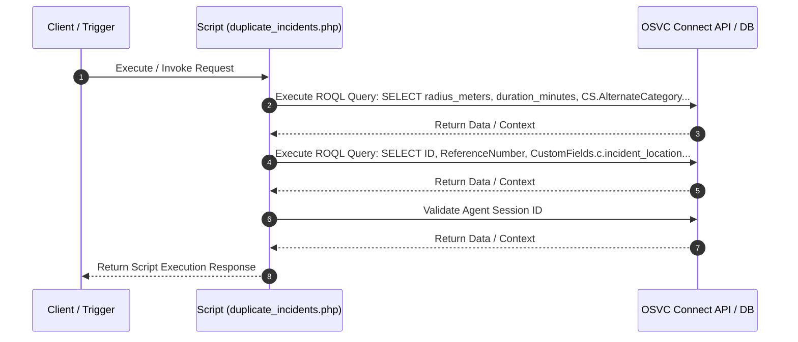

# Custom Script Analysis: `duplicate_incidents.php`
## Executive Functional Summary

> [!NOTE]
> This script handles **Duplicate Incident Detection**. It validates agent session ID, parses support ticket parameters (`subject`, `contact_id`, `category`), and executes ROQL queries against `Incident` and `CO.PotentialDuplicate` tables to identify matching open or historical support tickets.

## Script Overview & Attributes

| Attribute | Value |
| --- | --- |
| **File Name** | `duplicate_incidents.php` |
| **Script Type** | Server-side Utility |
| **Contains JavaScript Code** | Yes |
| **Contains HTML UI Markup** | Yes |
| **Code Imports** | 0 |
| **OSVC Data Objects** | 2 |
| **Internal APIs (ROQL / Connect)** | 3 |
| **External SOAP APIs** | 0 |
| **External REST APIs** | 0 |
| **Risk Flags** | 0 |

## Cross-Component System Linkages

| Source Component | Linkage Direction | Target Component | Details / Context |
| :--- | :---: | :--- | :--- |
| **CustomScript: duplicate_incidents.php** | `->` | **OSVCObject: ConnectAPIErrorBase** | Custom Script 'duplicate_incidents.php' operates on entity 'ConnectAPIErrorBase' |

## OSVC Data Objects Referenced

- `ConnectAPIErrorBase`
- `ROQL`

## Categorized API Breakdown

### 1. Internal APIs (ROQL & Native OSVC Objects)

| API Type | Operation | Details |
| --- | --- | --- |
| `ROQL Query` | SELECT Query | `SELECT radius_meters, duration_minutes, CS.AlternateCategory.id as alternate_category FROM Config.SrDuplication CS WHERE CS.Category.id =` |
| `ROQL Query` | SELECT Query | `SELECT ID, ReferenceNumber, CustomFields.c.incident_location, StatusWithType.Status.Name as Status, CreatedTime , PrimaryContact.contact.Name as ContactName FROM Incident WHERE CustomFields.c.duplicate_incident_flag IS NULL AND StatusWithType.Status.Name !=` |
| `Agent Authenticator` | Validate Agent Session | `AgentAuthenticator::authenticateSessionID($session_id)` |

### 2. External APIs (SOAP)

*No External SOAP Web Service integrations detected.*

### 3. External APIs (REST)

*No External REST HTTP API integrations detected.*

## Execution Flow Diagram

## Client-Side JavaScript Logic & UI Behavior Summary

The script incorporates client-side JavaScript execution logic with the following UI behaviors and event handlers:

- Initializes interactive DataTables grid formatting for thumbnail & search results display.
- Registers BUI Extension Loader hooks (`ORACLE_SERVICE_CLOUD.extension_loader`) and binds workspace record events.
- Attaches dynamic workspace field value change listeners to trigger real-time search and validation as fields are edited.
- Fires custom workspace named events (`focusDuplicateTab` / `hideDuplicateTab`) to dynamically toggle console tab visibility.
- Dynamically constructs HTML table rows and inserts clickable contact selection links into DOM container elements.

## Live Interactive HTML UI Component Preview

The script defines embedded HTML UI markup. Below is the live rendered interactive component preview:

<div class="html-preview-pending" data-html="PHByZT4KCu+7vwo8IURPQ1RZUEUgaHRtbD4gPG1ldGEgaHR0cC1lcXVpdj0iWC1VQS1Db21wYXRpYmxlIiBjb250ZW50PSJJRT1FZGdlIiA+PCEtLVtpZiBsdGUgSUUgOF0+CjxzY3JpcHQgc3JjPSJodG1sNS5qcyIgdHlwZT0idGV4dC9qYXZhc2NyaXB0Ij48L3NjcmlwdD4KPCFbZW5kaWZdLS0+CiA8aGVhZD4KICAgICAgICA8c2NyaXB0IHR5cGU9InRleHQvamF2YXNjcmlwdCIgc3JjPSIvL2FqYXguZ29vZ2xlYXBpcy5jb20vYWpheC9saWJzL2pxdWVyeS8zLjMuMS9qcXVlcnkubWluLmpzIj48L3NjcmlwdD4KCiAgICAgICAgPCEtLSBEYXRhdGFibGUgbGlicmFyeSAtLT4KCQk8bGluayByZWw9InN0eWxlc2hlZXQiIHR5cGU9InRleHQvY3NzIiBocmVmPSJodHRwczovL2Nkbi5kYXRhdGFibGVzLm5ldC8xLjEwLjIwL2Nzcy9qcXVlcnkuZGF0YVRhYmxlcy5jc3MiPiAgCgkJPHNjcmlwdCB0eXBlPSJ0ZXh0L2phdmFzY3JpcHQiIGNoYXJzZXQ9InV0ZjgiIHNyYz0iaHR0cHM6Ly9jZG4uZGF0YXRhYmxlcy5uZXQvMS4xMC4yMC9qcy9qcXVlcnkuZGF0YVRhYmxlcy5qcyI+PC9zY3JpcHQ+CgogICAgICAgIDwhLS0gRm9udEF3ZXNvbWUgZm9yIG5vdGlmaWNhdGlvbiBhbmQgZGF0YXRhYmxlIGljb25zIC0tPgogICAgICAgIDxsaW5rIHJlbD0ic3R5bGVzaGVldCIgaHJlZj0iaHR0cHM6Ly91c2UuZm9udGF3ZXNvbWUuY29tL3JlbGVhc2VzL3Y1LjEuMS9jc3MvYWxsLmNzcyIgaW50ZWdyaXR5PSJzaGEzODQtTzh3aFMzZmhHMk9uQTVLYXMwWTlsM2NmcG1ZamFwakkwRTR0aGVINGl1TUQrcExoYmY2SkkwaklNZlljSzN5WiIgY3Jvc3NvcmlnaW49ImFub255bW91cyI+CiAgICA8L2hlYWQ+CiAgICA8Ym9keT4KCgkJPGRpdiBpZD0idGh1bWJuYWlsX3NyX3NhX2ZpbGVzIj4JCQoJCQk8dGFibGUgaWQ9InRodW1ibmFpbF9pZCI+CgkJCQk8dGhlYWQ+CgkJCQkJPHRyPgoJCQkJCQk8dGg+UmVmIE51bTwvdGg+CgkJCQkJCTx0aD5Db250YWN0PC90aD4KCQkJCQkJPHRoPlN0YXR1czwvdGg+CgkJCQkJCTx0aD5Mb2NhdGlvbjwvdGg+CgkJCQkJCTx0aD5DcmVhdGVkIERhdGU8L3RoPgoJCQkJCQk8dGg+QXR0YWNoIER1cGxpY2F0ZSBDYXNlPC90aD4KCQkJCQk8L3RyPgoJCQkJPC90aGVhZD4KCQkJCTx0Ym9keSBpZD0idGh1bWJuYWlsX2lkX2JvZHkiPgoJCQkJPC90Ym9keT4KCQkJPC90YWJsZT4JCQkKCQk8L2Rpdj4KCiAgICA8L2JvZHk+CjxzY3JpcHQ+Cgl2YXIgZHVwbGljYXRlSW5jaWRlbnRzID0gOwoJdmFyIGNhdF9pZCA9IDsKCXZhciB4ID0gOwoJdmFyIHkgPSA7Cgl2YXIgdHMgPSA7CgkJCgoJaWYoZHVwbGljYXRlSW5jaWRlbnRzICE9IG51bGwgJiYgZHVwbGljYXRlSW5jaWRlbnRzLmxlbmd0aCA+IDApCgl7CgkJaWYodHMgIT0gbnVsbCkKCQkJYWxlcnQoIkR1cGxpY2F0ZSBJbmNpZGVudHMgZXhpc3QgZm9yIHRoZSBzYW1lIGNhdGVnb3J5IGF0IHRoZSBzYW1lIGxvY2F0aW9uLiIpOwkKCQl2YXIgdGFibGUgPSBkb2N1bWVudC5nZXRFbGVtZW50QnlJZCgidGh1bWJuYWlsX2lkIik7CgkJZHVwbGljYXRlSW5jaWRlbnRzLmZvckVhY2goZnVuY3Rpb24oZHVwbGljYXRlSW5jaWRlbnQpewoJCQkvL2NyZWF0ZSBuZXcgcm93CgkJCXZhciB0YWJsZUxlbmd0aCA9IHRhYmxlLmxlbmd0aDsKCQkJdmFyIHJvdyA9IHRhYmxlLmdldEVsZW1lbnRzQnlUYWdOYW1lKCd0Ym9keScpWzBdLmluc2VydFJvdyh0YWJsZUxlbmd0aCk7CQkJCQkKCQkJCgkJCXZhciBjZWxsMSA9IHJvdy5pbnNlcnRDZWxsKDApOwoJCQl2YXIgY2VsbDIgPSByb3cuaW5zZXJ0Q2VsbCgxKTsKCQkJdmFyIGNlbGwzID0gcm93Lmluc2VydENlbGwoMik7CgkJCXZhciBjZWxsNCA9IHJvdy5pbnNlcnRDZWxsKDMpOwoJCQl2YXIgY2VsbDUgPSByb3cuaW5zZXJ0Q2VsbCg0KTsKCQkJdmFyIGNlbGw2ID0gcm93Lmluc2VydENlbGwoNSk7CgoJCQljZWxsMS5pbm5lckhUTUwgPSAiPGEgaHJlZj0nIycgb25jbGljaz0nb3BlbkluY2lkZW50KCIrZHVwbGljYXRlSW5jaWRlbnQuSUQrIiknPiIrZHVwbGljYXRlSW5jaWRlbnQuUmVmZXJlbmNlTnVtYmVyKyI8L2E+IjsKCQkJY2VsbDIuaW5uZXJIVE1MID0gZHVwbGljYXRlSW5jaWRlbnQuQ29udGFjdE5hbWU7CgkJCWNlbGwzLmlubmVySFRNTCA9IGR1cGxpY2F0ZUluY2lkZW50LlN0YXR1czsKCQkJY2VsbDQuaW5uZXJIVE1MID0gZHVwbGljYXRlSW5jaWRlbnQuaW5jaWRlbnRfbG9jYXRpb247CgkJCWNlbGw1LmlubmVySFRNTCA9IGR1cGxpY2F0ZUluY2lkZW50LkNyZWF0ZWRUaW1lOwoJCQljZWxsNi5pbm5lckhUTUwgPSAiPGlucHV0IHR5cGU9J2NoZWNrYm94JyBjbGFzcyA9J2luY0lEcycgaWQ9JyIrZHVwbGljYXRlSW5jaWRlbnQuSUQrIicgLz4iOwoJCQkKCQkJCgkJfSk7Cgl9CgkkKCcjdGh1bWJuYWlsX2lkJykuRGF0YVRhYmxlKCB7CgkJInBhZ2luZyI6ICAgZmFsc2UsCgkJIm9yZGVyaW5nIjogZmFsc2UsCgkJImluZm8iOiAgICAgZmFsc2UsCgkJImJGaWx0ZXIiOiBmYWxzZSwKCQkiY29sdW1uRGVmcyI6IFt7ImNsYXNzTmFtZSI6ICJkdC1jZW50ZXIiLCAidGFyZ2V0cyI6ICJfYWxsIn1dCgl9ICk7CgoJLy9CaW5mIGNsaWNrIGV2ZW50IG9uIGNoZWNrYm94CgkkKCcuaW5jSURzJykuY2xpY2soZnVuY3Rpb24oKSB7CgkJdmFyIGNoZWNrZWQgPSB0aGlzLmNoZWNrZWQ7CQkKCQlpZiAoY2hlY2tlZCkgewoJCQkkKCJpbnB1dFt0eXBlPWNoZWNrYm94XSIpLnByb3AoImNoZWNrZWQiLCBmYWxzZSk7Ly9jbGVhciBhbGwgb3RoZXIgY2hlY2tib3gKCQkJdGhpcy5jaGVja2VkID0gdHJ1ZTsgCgkJCXNldFNSKHRoaXMuaWQpOwoJCX0KCQllbHNlIHsKCQkJcmVzZXRTUigpOwoJCX0KCX0pOwoJCgl2YXIgaSA9IHdpbmRvdy5leHRlcm5hbC5JbmNpZGVudDsKCS8vSWYgb3BlbmVkIHRocm91Z2ggRGVzdG9wIENvbnNvbGUgdGhlbiB1c2UgSmF2YXNjcmlwdCBFeHRlbnNpb24KCWlmKGkgIT09IHVuZGVmaW5lZCkKCXsKCQl2YXIgY3NzID0gJ2xhYmVsIHtmb250LWZhbWlseTogLWFwcGxlLXN5c3RlbSwgQmxpbmtNYWNTeXN0ZW1Gb250LCAiU2Vnb2UgVUkiLCAiSGVsdmV0aWNhIE5ldWUiLCBBcmlhbCwgc2Fucy1zZXJpZiAhaW1wb3J0YW50O2Rpc3BsYXk6IGJsb2NrICFpbXBvcnRhbnQ7Zm9udC1zaXplOiAxOHB4ICFpbXBvcnRhbnQ7Zm9udC13ZWlnaHQ6IG5vcm1hbCAhaW1wb3J0YW50OyBtYXJnaW4tYm90dG9tOiAwLjI1ZW0gIWltcG9ydGFudDt9LmNvbC1tZC02IHttYXJnaW4tYm90dG9tOiAwLjJlbSAhaW1wb3J0YW50O30uZm9ybS1jb250cm9sIHtoZWlnaHQ6IDQycHggIWltcG9ydGFudDtmb250LWZhbWlseTogLWFwcGxlLXN5c3RlbSwgQmxpbmtNYWNTeXN0ZW1Gb250LCAiU2Vnb2UgVUkiLCAiSGVsdmV0aWNhIE5ldWUiLCBBcmlhbCwgc2Fucy1zZXJpZiAhaW1wb3J0YW50O2ZvbnQtc2l6ZTogMThweCAhaW1wb3J0YW50O2ZvbnQtd2VpZ2h0OiBub3JtYWwgIWltcG9ydGFudDt9JywKCSAgICBoZWFkID0gZG9jdW1lbnQuaGVhZCB8fCBkb2N1bWVudC5nZXRFbGVtZW50c0J5VGFnTmFtZSgnaGVhZCcpWzBdLAoJICAgIHN0eWxlID0gZG9jdW1lbnQuY3JlYXRlRWxlbWVudCgnc3R5bGUnKTsKCQloZWFkLmFwcGVuZENoaWxkKHN0eWxlKTsJCgkJc3R5bGUudHlwZSA9ICd0ZXh0L2Nzcyc7CgkJc3R5bGUuYXBwZW5kQ2hpbGQoZG9jdW1lbnQuY3JlYXRlVGV4dE5vZGUoY3NzKSk7CQkKCQkKCQlpZihkdXBsaWNhdGVJbmNpZGVudHMgIT0gbnVsbCAmJiBkdXBsaWNhdGVJbmNpZGVudHMubGVuZ3RoID4gMCkKCQl7CgkJCWkuU2V0Q3VzdG9tRmllbGRCeU5hbWUoJ2MkZHVwbGljYXRlX2luY2lkZW50X2ZsYWcnLCAxKTsKCQl9CgoJCS8vRnVuY3Rpb24gdG8gY2FwdHVyZSBmaWVsZCBjaGFuZ2UsIGlmIENhdGVnb3J5IGlzIGNoYW5nZWQgdGhlbiByZWZlc2ggdGhlIHBhZ2UgYnkgcGFzc2luZyBuZXcgY2F0ZWdvcnkgSUQKCQlmdW5jdGlvbiBvbmRhdGF1cGRhdGVkKGNoYW5nZWRfb2JqZWN0KQoJCXsKCQkJdmFyIHJlbG9hZCA9IGZhbHNlOwkJCQoJCQkKCQkJaWYoY2F0X2lkICE9IGkuQ2F0ZWdvcnkuc3BsaXQoIiwiKVsxXSkKCQkJewoJCQkJcmVsb2FkID0gdHJ1ZTsKCQkJCWNhdF9pZCA9IGkuQ2F0ZWdvcnkuc3BsaXQoIiwiKVsxXTsKCQkJfQoJCQlpZih4ICE9IGkuR2V0Q3VzdG9tRmllbGRCeU5hbWUoImMkeF9jb29yZGluYXRlX2V4dGVybmFsIikpCgkJCXsKCQkJCXJlbG9hZCA9IHRydWU7CgkJCQl4ID0gaS5HZXRDdXN0b21GaWVsZEJ5TmFtZSgiYyR4X2Nvb3JkaW5hdGVfZXh0ZXJuYWwiKTsKCQkJfQoJCQlpZih5ICE9IGkuR2V0Q3VzdG9tRmllbGRCeU5hbWUoImMkeV9jb29yZGluYXRlX2V4dGVybmFsIikpCgkJCXsKCQkJCXJlbG9hZCA9IHRydWU7CgkJCQl5ID0gaS5HZXRDdXN0b21GaWVsZEJ5TmFtZSgiYyR5X2Nvb3JkaW5hdGVfZXh0ZXJuYWwiKTsJCgkJCX0JCQkKCQkJCgkJCWlmKHJlbG9hZCkKCQkJewoJCQkJaS5TZXRDdXN0b21GaWVsZEJ5TmFtZSgnYyRkdXBsaWNhdGVfaW5jaWRlbnRfZmxhZycsIDApOy8vdW5zZXQgdGhlIGZsYWcKCgkJCQl2YXIgZCA9IG5ldyBEYXRlKCk7CgkJCQl2YXIgdGltZU1zID0gZC5nZXRUaW1lKCk7CgkJCQl2YXIgdGhlVXJsID0gd2luZG93LmxvY2F0aW9uLmhyZWY7CgkJCQl0aGVVcmwgPSB0aGVVcmwuc3BsaXQoIiZ4PSIpWzBdKyImeD0iK3grIiZ5PSIreSsiJmNhdF9pZD0iK2NhdF9pZCsiJnRzPSIgKyB0aW1lTXM7CgkJCQl3aW5kb3cubG9jYXRpb24uaHJlZiA9IHRoZVVybDsKCQkJfQkJCQoJCX0JCgkJCgkJZnVuY3Rpb24gb3BlblNSKGlkKQoJCXsKCQkJYWxlcnQoIlBsZWFzZSB1c2UgcXVpY2sgc2VhcmNoIHRvIG9wZW4gdGhlIFNSIik7CgkJfQoKCX0KCWVsc2UKCXsKCQl2YXIgY3NzID0gJ2xhYmVsIHtmb250LWZhbWlseTogLWFwcGxlLXN5c3RlbSwgQmxpbmtNYWNTeXN0ZW1Gb250LCAiU2Vnb2UgVUkiLCAiSGVsdmV0aWNhIE5ldWUiLCBBcmlhbCwgc2Fucy1zZXJpZiAhaW1wb3J0YW50O2Rpc3BsYXk6IGJsb2NrICFpbXBvcnRhbnQ7Zm9udC1zaXplOiAxMnB4ICFpbXBvcnRhbnQ7Zm9udC13ZWlnaHQ6IG5vcm1hbCAhaW1wb3J0YW50OyBtYXJnaW4tYm90dG9tOiAwLjI1ZW0gIWltcG9ydGFudDt9LmNvbC1tZC02IHttYXJnaW4tYm90dG9tOiAwLjVlbSAhaW1wb3J0YW50O30uZm9ybS1jb250cm9sIHtoZWlnaHQ6IDMwcHggIWltcG9ydGFudDtmb250LWZhbWlseTogLWFwcGxlLXN5c3RlbSwgQmxpbmtNYWNTeXN0ZW1Gb250LCAiU2Vnb2UgVUkiLCAiSGVsdmV0aWNhIE5ldWUiLCBBcmlhbCwgc2Fucy1zZXJpZiAhaW1wb3J0YW50OyAgICBmb250LXNpemU6IDEycHggIWltcG9ydGFudDsgICAgZm9udC13ZWlnaHQ6IG5vcm1hbCAhaW1wb3J0YW50O30nLAoJICAgIGhlYWQgPSBkb2N1bWVudC5oZWFkIHx8IGRvY3VtZW50LmdldEVsZW1lbnRzQnlUYWdOYW1lKCdoZWFkJylbMF0sCgkgICAgc3R5bGUgPSBkb2N1bWVudC5jcmVhdGVFbGVtZW50KCdzdHlsZScpOwoJCWhlYWQuYXBwZW5kQ2hpbGQoc3R5bGUpOwkKCQlzdHlsZS50eXBlID0gJ3RleHQvY3NzJzsKCQlzdHlsZS5hcHBlbmRDaGlsZChkb2N1bWVudC5jcmVhdGVUZXh0Tm9kZShjc3MpKTsKCQoJCXZhciB0aGVXb3Jrc3BhY2VSZWNvcmQ7CgkJdmFyIHNjcmlwdCA9IGRvY3VtZW50LmNyZWF0ZUVsZW1lbnQoJ3NjcmlwdCcpOyAgICAgICAgICAgICAgICAKCQlzY3JpcHQudHlwZSA9ICd0ZXh0L2phdmFzY3JpcHQnOwoJCXNjcmlwdC5hc3luYyA9IHRydWU7CgkJc2NyaXB0LnNyYyA9ICcvQWdlbnRXZWIvbW9kdWxlL2V4dGVuc2liaWxpdHkvanMvY2xpZW50L2NvcmUvZXh0ZW5zaW9uX2xvYWRlci5qcyc7CQoJCXNjcmlwdC5vbmxvYWQgPSBmdW5jdGlvbigpIHsKCQkJCgkJCU9SQUNMRV9TRVJWSUNFX0NMT1VELmV4dGVuc2lvbl9sb2FkZXIubG9hZCgiY3VzdG9tRm9ybUV4dGlvbnNpb24iLCAiMSIpCgkJCS50aGVuKGZ1bmN0aW9uKGV4dGVuc2lvblByb3ZpZGVyKQoJCQl7CgkJCQkKCQkgICAgICAgIG5hbWVkTG9nZ2VyID0gZXh0ZW5zaW8=" data-title="duplicate_incidents.php">
  

    

<pre>


<!DOCTYPE html> <meta http-equiv="X-UA-Compatible" content="IE=Edge" ><!--[if lte IE 8]>

<![endif]-->
 <head>
        

        <!-- Datatable library -->
		<link rel="stylesheet" type="text/css" href="https://cdn.datatables.net/1.10.20/css/jquery.dataTables.css">  
		

        <!-- FontAwesome for notification and datatable icons -->
        <link rel="stylesheet" href="https://use.fontawesome.com/releases/v5.1.1/css/all.css" integrity="sha384-O8whS3fhG2OnA5Kas0Y9l3cfpmYjapjI0E4theH4iuMD+pLhbf6JI0jIMfYcK3yZ" crossorigin="anonymous">
    </head>
    <body>

		
		
			<table id="thumbnail_id">
				<thead>
					<tr>
						<th>Ref Num</th>
						<th>Contact</th>
						<th>Status</th>
						<th>Location</th>
						<th>Created Date</th>
						<th>Attach Duplicate Case</th>
					</tr>
				</thead>
				<tbody id="thumbnail_id_body">
				</tbody>
			</table>			
		

    </body>
<script>
	var duplicateIncidents = ;
	var cat_id = ;
	var x = ;
	var y = ;
	var ts = ;
		

	if(duplicateIncidents != null && duplicateIncidents.length > 0)
	{
		if(ts != null)
			alert("Duplicate Incidents exist for the same category at the same location.");	
		var table = document.getElementById("thumbnail_id");
		duplicateIncidents.forEach(function(duplicateIncident){
			//create new row
			var tableLength = table.length;
			var row = table.getElementsByTagName('tbody')[0].insertRow(tableLength);					
			
			var cell1 = row.insertCell(0);
			var cell2 = row.insertCell(1);
			var cell3 = row.insertCell(2);
			var cell4 = row.insertCell(3);
			var cell5 = row.insertCell(4);
			var cell6 = row.insertCell(5);

			cell1.innerHTML = "<a href='#' onclick='openIncident("+duplicateIncident.ID+")'>"+duplicateIncident.ReferenceNumber+"</a>";
			cell2.innerHTML = duplicateIncident.ContactName;
			cell3.innerHTML = duplicateIncident.Status;
			cell4.innerHTML = duplicateIncident.incident_location;
			cell5.innerHTML = duplicateIncident.CreatedTime;
			cell6.innerHTML = "<input type='checkbox' class ='incIDs' id='"+duplicateIncident.ID+"' />";
			
			
		});
	}
	$('#thumbnail_id').DataTable( {
		"paging":   false,
		"ordering": false,
		"info":     false,
		"bFilter": false,
		"columnDefs": [{"className": "dt-center", "targets": "_all"}]
	} );

	//Binf click event on checkbox
	$('.incIDs').click(function() {
		var checked = this.checked;		
		if (checked) {
			$("input[type=checkbox]").prop("checked", false);//clear all other checkbox
			this.checked = true; 
			setSR(this.id);
		}
		else {
			resetSR();
		}
	});
	
	var i = window.external.Incident;
	//If opened through Destop Console then use Javascript Extension
	if(i !== undefined)
	{
		var css = 'label {font-family: -apple-system, BlinkMacSystemFont, "Segoe UI", "Helvetica Neue", Arial, sans-serif !important;display: block !important;font-size: 18px !important;font-weight: normal !important; margin-bottom: 0.25em !important;}.col-md-6 {margin-bottom: 0.2em !important;}.form-control {height: 42px !important;font-family: -apple-system, BlinkMacSystemFont, "Segoe UI", "Helvetica Neue", Arial, sans-serif !important;font-size: 18px !important;font-weight: normal !important;}',
	    head = document.head || document.getElementsByTagName('head')[0],
	    style = document.createElement('style');
		head.appendChild(style);	
		style.type = 'text/css';
		style.appendChild(document.createTextNode(css));		
		
		if(duplicateIncidents != null && duplicateIncidents.length > 0)
		{
			i.SetCustomFieldByName('c$duplicate_incident_flag', 1);
		}

		//Function to capture field change, if Category is changed then refesh the page by passing new category ID
		function ondataupdated(changed_object)
		{
			var reload = false;			
			
			if(cat_id != i.Category.split(",")[1])
			{
				reload = true;
				cat_id = i.Category.split(",")[1];
			}
			if(x != i.GetCustomFieldByName("c$x_coordinate_external"))
			{
				reload = true;
				x = i.GetCustomFieldByName("c$x_coordinate_external");
			}
			if(y != i.GetCustomFieldByName("c$y_coordinate_external"))
			{
				reload = true;
				y = i.GetCustomFieldByName("c$y_coordinate_external");	
			}			
			
			if(reload)
			{
				i.SetCustomFieldByName('c$duplicate_incident_flag', 0);//unset the flag

				var d = new Date();
				var timeMs = d.getTime();
				var theUrl = window.location.href;
				theUrl = theUrl.split("&x=")[0]+"&x="+x+"&y="+y+"&cat_id="+cat_id+"&ts=" + timeMs;
				window.location.href = theUrl;
			}			
		}	
		
		function openSR(id)
		{
			alert("Please use quick search to open the SR");
		}

	}
	else
	{
		var css = 'label {font-family: -apple-system, BlinkMacSystemFont, "Segoe UI", "Helvetica Neue", Arial, sans-serif !important;display: block !important;font-size: 12px !important;font-weight: normal !important; margin-bottom: 0.25em !important;}.col-md-6 {margin-bottom: 0.5em !important;}.form-control {height: 30px !important;font-family: -apple-system, BlinkMacSystemFont, "Segoe UI", "Helvetica Neue", Arial, sans-serif !important;    font-size: 12px !important;    font-weight: normal !important;}',
	    head = document.head || document.getElementsByTagName('head')[0],
	    style = document.createElement('style');
		head.appendChild(style);	
		style.type = 'text/css';
		style.appendChild(document.createTextNode(css));
	
		var theWorkspaceRecord;
		var script = document.createElement('script');                
		script.type = 'text/javascript';
		script.async = true;
		script.src = '/AgentWeb/module/extensibility/js/client/core/extension_loader.js';	
		script.onload = function() {
			
			ORACLE_SERVICE_CLOUD.extension_loader.load("customFormExtionsion", "1")
			.then(function(extensionProvider)
			{
				
		        namedLogger = extensio
    

  

