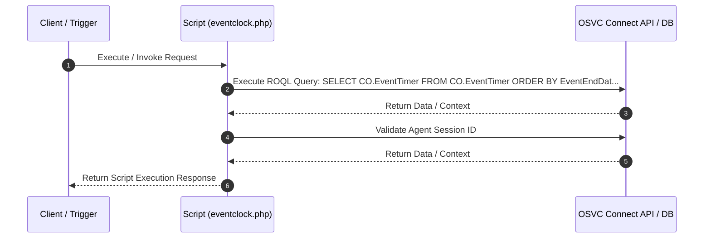

# Custom Script Analysis: `eventclock.php`
## Executive Functional Summary

> [!NOTE]
> This script calculates **Incident SLA Clocks & Response Timers**. It calculates elapsed handling times, monitors response deadlines, and updates SLA milestone tracking fields.

## Script Overview & Attributes

| Attribute | Value |
| --- | --- |
| **File Name** | `eventclock.php` |
| **Script Type** | Server-side Utility |
| **Contains JavaScript Code** | Yes |
| **Contains HTML UI Markup** | No |
| **Code Imports** | 0 |
| **OSVC Data Objects** | 2 |
| **Internal APIs (ROQL / Connect)** | 2 |
| **External SOAP APIs** | 0 |
| **External REST APIs** | 0 |
| **Risk Flags** | 0 |

## Cross-Component System Linkages

| Source Component | Linkage Direction | Target Component | Details / Context |
| :--- | :---: | :--- | :--- |
| **CustomScript: eventclock.php** | `->` | **OSVCObject: ConnectAPIErrorBase** | Custom Script 'eventclock.php' operates on entity 'ConnectAPIErrorBase' |

## OSVC Data Objects Referenced

- `ConnectAPIErrorBase`
- `ROQL`

## Categorized API Breakdown

### 1. Internal APIs (ROQL & Native OSVC Objects)

| API Type | Operation | Details |
| --- | --- | --- |
| `ROQL Query` | SELECT Query | `SELECT CO.EventTimer FROM CO.EventTimer ORDER BY EventEndDate DESC LIMIT 1` |
| `Agent Authenticator` | Validate Agent Session | `AgentAuthenticator::authenticateSessionID($session_id)` |

### 2. External APIs (SOAP)

*No External SOAP Web Service integrations detected.*

### 3. External APIs (REST)

*No External REST HTTP API integrations detected.*

## Execution Flow Diagram

## Client-Side JavaScript Logic & UI Behavior Summary

The script incorporates client-side JavaScript execution logic with the following UI behaviors and event handlers:

- Executes client-side UI manipulation and DOM event handling logic.
