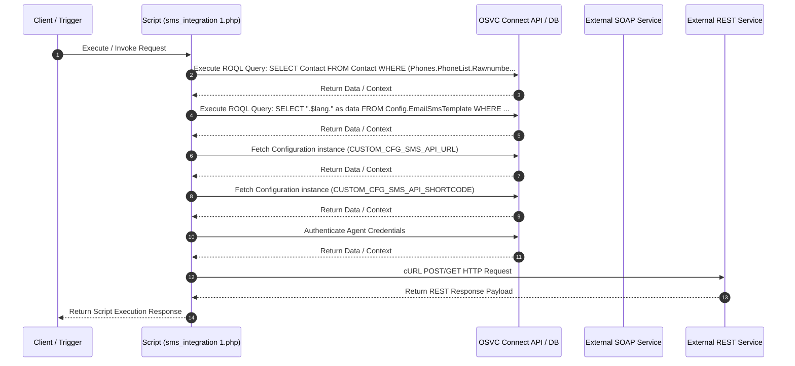

# Custom Script Analysis: `sms_integration 1.php`
## Executive Functional Summary

> [!NOTE]
> This script handles **SMS Webhook Integration**. It receives XML POST payloads (`php://input`), authenticates integration agent credentials via `AgentAuthenticator::authenticateCredentials()`, parses customer response keywords (`YES` / `OUI`), updates Contact preferred language custom fields, and dispatches SMS subscription confirmations.

## Script Overview & Attributes

| Attribute | Value |
| --- | --- |
| **File Name** | `sms_integration 1.php` |
| **Script Type** | Server-side Utility |
| **Contains JavaScript Code** | No |
| **Contains HTML UI Markup** | No |
| **Code Imports** | 0 |
| **OSVC Data Objects** | 7 |
| **Internal APIs (ROQL / Connect)** | 5 |
| **External SOAP APIs** | 1 |
| **External REST APIs** | 1 |
| **Risk Flags** | 1 |

## OSVC Data Objects Referenced

- `Configuration`
- `ConnectAPIErrorBase`
- `NamedIDLabel`
- `Note`
- `NoteArray`
- `RNObject`
- `ROQL`

## Categorized API Breakdown

### 1. Internal APIs (ROQL & Native OSVC Objects)

| API Type | Operation | Details |
| --- | --- | --- |
| `ROQL Query` | SELECT Query | `SELECT Contact FROM Contact WHERE (Phones.PhoneList.Rawnumber =` |
| `ROQL Query` | SELECT Query | `SELECT ".$lang." as data FROM Config.EmailSmsTemplate WHERE TemplateLabel =` |
| `Connect PHP Fetch` | Fetch Configuration | `RNCPHP\Configuration::fetch(CUSTOM_CFG_SMS_API_URL)` |
| `Connect PHP Fetch` | Fetch Configuration | `RNCPHP\Configuration::fetch(CUSTOM_CFG_SMS_API_SHORTCODE)` |
| `Agent Authenticator` | Validate Agent Credentials | `AgentAuthenticator::authenticateCredentials($username, $password)` |

### 2. External APIs (SOAP)

| Protocol | Endpoint / WSDL | Action / Operation |
| --- | --- | --- |
| XML Payload Ingestion | `php://input` | Parse Incoming XML Payload |

### 3. External APIs (REST)

| Protocol | HTTP Method | Endpoint URL | Details |
| --- | --- | --- | --- |
| REST / HTTP | `POST/GET` | `Dynamic / Configured REST Endpoint` | cURL POST/GET request via Configuration |

## Security & Risk Analysis

- **[WARNING] Hardcoded Credential:** Potential credentials found in variable assignments (count: 1)

## Execution Flow Diagram

