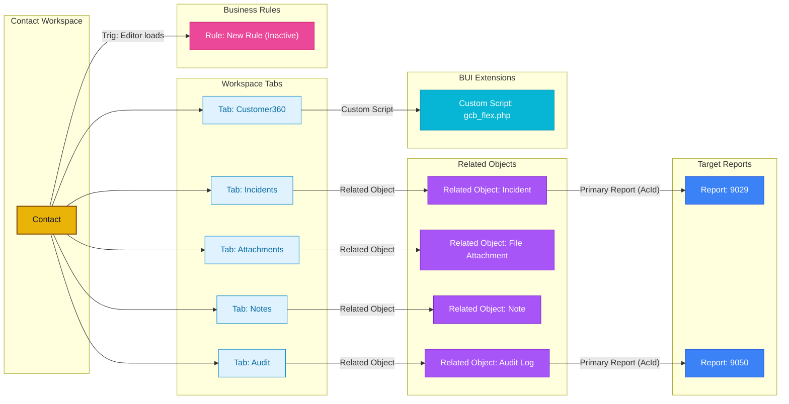

## System Info

- Platform: **Oracle Service Cloud 26A SP2** (Build 326, June 2026)
- Client Version: `26.2.0.326`
- Workspace Type: **Contact** (single record, not multi-edit)

---

## Layout Structure

The workspace has a **5-column table layout** (11 rows × 5 columns):

**Left column** — Form fields:

| Field | Notes |
|---|---|
| `Title` | Salutation/title |
| `Name.First` | First name |
| `Name.Last` | Last name |
| `Addr` | Address |
| `PhOffice` | Relabeled as **"Mobile Phone"**, default type 1 |
| `C$CustomerId` | Custom field — customer id |
| `Email` | Email address |
| `CtypeId` | Contact type |
| `C$Gender` | Custom field — gender |

---

## Layout & Tab Details

Below is the detailed content breakdown of each tab:

  
Tab: <b>Incidents</b> (1 Controls)

  

### Tab: `Incidents`

> **Single Component Tab**

- **Control Type:** Related Object (`Incident`)
  - **Primary Report (AcId):** `9029`
  - **Behavior:** Skips execution on unsaved new records

  

  
Tab: <b>Customer360</b> (1 Controls)

  

### Tab: `Customer360`

> **Single Component Tab**

- **Control Type:** Embedded Browser
  - **Target URL:** `https://gcb.custhelp.com/cgi-bin/gcb.cfg/php/custom/gcb_flex.php?mobile=$contact.phmobile`

  

  
Tab: <b>Attachments</b> (1 Controls)

  

### Tab: `Attachments`

> **Single Component Tab**

- **Control Type:** Related Object (`File Attachment`)

  

  
Tab: <b>Notes</b> (1 Controls)

  

### Tab: `Notes`

> **Single Component Tab**

- **Control Type:** Related Object (`Note`)

  

  
Tab: <b>Audit</b> (1 Controls)

  

### Tab: `Audit`

> **Single Component Tab**

- **Control Type:** Related Object (`Audit Log`)
  - **Primary Report (AcId):** `9050`
  - **Behavior:** Skips execution on unsaved new records

  

---

## Workspace Fields Inventory

Total Fields Used in Workspace: **9** (Standard Schema Fields: **7** | Custom Fields (`c$`): **2**)

| Field ID / Reference | Field Label | Field Type | Location / Tab | Options & Constraints |
|---|---|---|---|---|
| `Title` | — | Standard Schema | Top-level Layout | — |
| `Name.First` | — | Standard Schema | Top-level Layout | — |
| `Name.Last` | — | Standard Schema | Top-level Layout | — |
| `Addr` | — | Standard Schema | Top-level Layout | — |
| `PhOffice` | &Mobile Phone | Standard Schema | Top-level Layout | Default: `1` |
| `C$CustomerId` | — | Custom (`c$`) | Top-level Layout | — |
| `Email` | — | Standard Schema | Top-level Layout | — |
| `CtypeId` | — | Standard Schema | Top-level Layout | — |
| `C$Gender` | — | Custom (`c$`) | Top-level Layout | — |

---
## Workspace Rules

### Event: Editor Initialized (On Load)

  
InactiveRule: <b>New Rule</b> (Event: Editor Initialized (On Load))

  

#### Rule: `New Rule` (Inactive)
- **Condition:** `Field: Contact.CtypeId == 3` (a specific contact type, likely "Email" or similar)
- **Then:**
  - Show a message box — *"This contact is created through email and may not hold sufficient information in the system"*

  

---

## Ribbon / Toolbar

Standard actions: Appointment, Copy, Delete, Info, New, Print, Refresh, Save, Save & Close, Spell Check.

---

## Key Observations

- The `PhOffice` field is **mislabeled as "Mobile Phone"** — that's either intentional repurposing or a bug worth flagging.
- The **Customer360** tab embeds an internal **custom PHP script**: `gcb_flex.php` (`/cgi-bin/gcb.cfg/php/custom/gcb_flex.php`) — passes URL params: `mobile`. Errors are suppressed.
- `C$` prefix fields are **custom fields** added on top of the standard schema.
- The inactive rule suggests there was a workflow for email-originated contacts that's either been deprecated or temporarily disabled.

---

## Flow Diagram

---

## Parser Coverage Gaps

The following elements were found in this workspace XML but are not fully parsed by the current accelerator. Raw data is preserved in `master.json` under `unknowns`.

*No parser coverage gaps identified for this workspace.*
