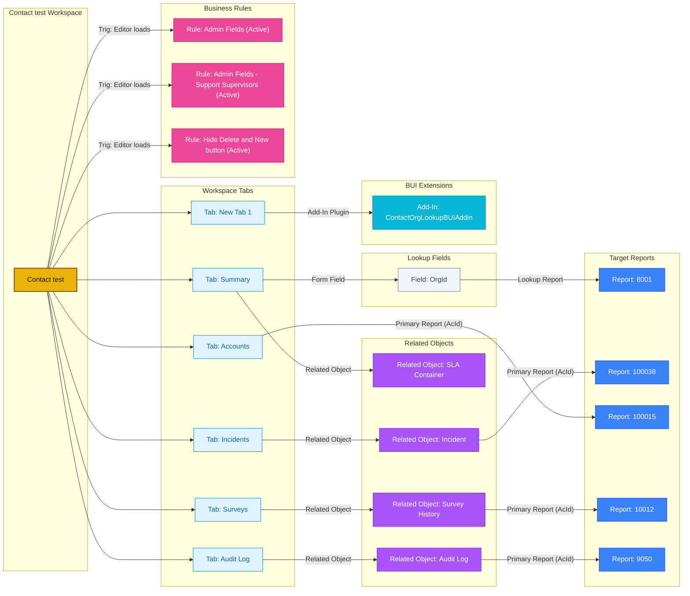

## System Info

- Platform: **Oracle Service Cloud 26A SP2** (Build 326, June 2026)
- Client Version: `26.2.0.326`
- Workspace Type: **Contact** (single record, not multi-edit)

> [!WARNING] Unhandled Schema Elements Detected in Source Export
> The following 10 raw XML element(s)/attribute(s) were present in the export and captured via fallback handling:
> - Element `<Triggers>`: `<Triggers xmlns:dbaudit="http://www.rightnow.com/schemas/dbaudit"><Trigger Type="EditorLoaded"/></Triggers>`
> - Element `<Triggers>`: `<Triggers xmlns:dbaudit="http://www.rightnow.com/schemas/dbaudit"><Trigger Type="EditorLoaded"/></Triggers>`
> - Element `<Triggers>`: `<Triggers xmlns:dbaudit="http://www.rightnow.com/schemas/dbaudit"><Trigger Type="EditorLoaded"/></Triggers>`
> - Attribute `LayoutLabelAlignment`: `Right`
> - Attribute `LayoutLabelPosition`: `Left`
> - Attribute `ReadOnlyOption`: `OnNew:~any~;OnEdit:~any~`
> - Attribute `DisableEmailIcon`: `True`
> - Attribute `HideReportCommands`: `True`
> - Attribute `Anchor`: `Top, Left`
> - Attribute `AutoSize`: `False`

---

## Layout Structure

The workspace layout is structured as a root **TabSet** containing 6 tabs.

---

## Layout & Tab Details

Below is the detailed content breakdown of each tab:

  
Tab: <b>Summary</b> (8 Controls)

  

### Tab: `Summary`

> **Multi-Component Tab** — 8 controls across 2 types: 7 Form Fields, 1 Related Object/Report

**1. Form Fields & Menus**

| Position (Row, Col) | Field / Control | Details |
|---|---|---|
| Row 0, Col 0 | `Name.First` | First name — *ReadOnly: OnNew (All Profiles), OnEdit (All Profiles)* |
| Row 0, Col 1 | `Name.Last` | Last name — *ReadOnly: OnNew (All Profiles), OnEdit (All Profiles)* |
| Row 1, Col 0 | `Email` | Email address — *ReadOnly: OnNew (All Profiles), OnEdit (All Profiles)* |
| Row 1, Col 1 | `OrgId` | Account (Lookup → Report **8001**) |
| Row 2, Col 0 | `C$IsRegistered` | Custom field — is registered — *ReadOnly: OnNew (27 profiles), OnEdit (27 profiles)* |
| Row 3, Col 0 | `Disabled` | Form field — *ReadOnly: OnNew (29 profiles), OnEdit (29 profiles); Hidden: OnNew (29 profiles), OnEdit (29 profiles)* |
| Row 3, Col 1 | `CId` | Form field |

**2. Related Objects & Direct Reports**

| Position (Row, Col) | Type | Object / Report | Report IDs | Behavior / Config |
|---|---|---|---|---|
| Row 2, Col 1 | Related Object | `SLA Container` | Primary: **—** | Runs on all records |

  

  
Tab: <b>Incidents</b> (1 Controls)

  

### Tab: `Incidents`

> **Single Component Tab**

- **Control Type:** Related Object (`Incident`)
  - **Primary Report (AcId):** `100038`
  - **Behavior:** Skips execution on unsaved new records

  

  
Tab: <b>Accounts</b> (1 Controls)

  

### Tab: `Accounts`

> **Single Component Tab**

- **Control Type:** Direct Report
  - **Primary Report (AcId):** `100015`
  - **Behavior:** Skips execution on unsaved new records

  

  
Tab: <b>Surveys</b> (1 Controls)

  

### Tab: `Surveys`

> **Single Component Tab**

- **Control Type:** Related Object (`Survey History`)
  - **Primary Report (AcId):** `10012`
  - **Behavior:** Skips execution on unsaved new records

  

  
Tab: <b>Audit Log</b> (1 Controls)

  

### Tab: `Audit Log`

> **Single Component Tab**

- **Control Type:** Related Object (`Audit Log`)
  - **Primary Report (AcId):** `9050`
  - **Behavior:** Skips execution on unsaved new records

  

  
Tab: <b>New Tab 1</b> (1 Controls)

  

### Tab: `New Tab 1`

> **Single Component Tab**

- **Control Type:** BUI Extension (`ContactOrgLookupBUIAddin`)
  - **File ID:** `7`

  

---

## Workspace Fields Inventory

Total Fields Used in Workspace: **7** (Standard Schema Fields: **6** | Custom Fields (`c$`): **1**)

| Field ID / Reference | Field Label | Field Type | Location / Tab | Options & Constraints |
|---|---|---|---|---|
| `Name.First` | — | Standard Schema | Tab: Summary | ReadOnly: OnNew (All Profiles), OnEdit (All Profiles) |
| `Name.Last` | — | Standard Schema | Tab: Summary | ReadOnly: OnNew (All Profiles), OnEdit (All Profiles) |
| `Email` | — | Standard Schema | Tab: Summary | ReadOnly: OnNew (All Profiles), OnEdit (All Profiles) |
| `OrgId` | &Account | Standard Schema | Tab: Summary | — |
| `C$IsRegistered` | — | Custom (`c$`) | Tab: Summary | ReadOnly: OnNew (27 profiles), OnEdit (27 profiles) |
| `Disabled` | — | Standard Schema | Tab: Summary | ReadOnly: OnNew (29 profiles), OnEdit (29 profiles); Hidden: OnNew (29 profiles), OnEdit (29 profiles) |
| `CId` | — | Standard Schema | Tab: Summary | — |

---
## Workspace Rules

### Event: Editor Initialized (On Load)

  
ActiveRule: <b>Admin Fields</b> (Event: Editor Initialized (On Load))

  

#### Rule: `Admin Fields` (Active)
- **Condition:** `Profile: Current LIST 11;14;2`
- **Then:**
  - Standard: ReadOnly Contact.Name.First (False)
  - Standard: ReadOnly Contact.Name.Last (False)
  - Standard: ReadOnly Contact.Email (False)
  - Standard: ReadOnly Contact.OrgId (False)
  - Standard: Required Contact.Name.First (True)
  - Standard: Required Contact.Name.Last (True)

  

  
ActiveRule: <b>Admin Fields - Support Supervisors</b> (Event: Editor Initialized (On Load))

  

#### Rule: `Admin Fields - Support Supervisors` (Active)
- **Condition:** `Profile: Current LIST 33;7;15;37;16;44`
- **Then:**
  - Standard: ReadOnly Contact.Name.First (False)
  - Standard: ReadOnly Contact.Name.Last (False)
  - Standard: ReadOnly Contact.Email (False)
  - Standard: Required Contact.Name.First (True)
  - Standard: Required Contact.Name.Last (True)
  - Standard: Hidden RibbonButton[Delete] → True

  

  
ActiveRule: <b>Hide Delete and New button</b> (Event: Editor Initialized (On Load))

  

#### Rule: `Hide Delete and New button` (Active)
- **Condition:** `Profile: Current LIST 11;14;2`
- **Then:**
  - Standard: Hidden RibbonButton[Delete] → True
  - Standard: Hidden RibbonButton[New] → True

  

---

## Ribbon / Toolbar

Standard actions: Delete, Info, New, Print, Refresh, Save, Save & Close, Spell Check.

**Embedded Links:**
- [Oracle Service Cloud](http://cloud.oracle.com/service)

---

## Key Observations

- The workspace defines **3 active business rules** triggered by editor loading events, enforcing profile-based field locking and toolbar UI visibility.
- The **workspace flag indicator** is explicitly hidden (`Visible="False"`), suppressing visual cues for users/agents.
- Layout tabset has **`CanReorderTabs="True"`** enabled, which allows agents to dynamically rearrange workspace tabs at runtime.
- The workspace includes an **external BUI Extension plugin dependency**: `ContactOrgLookupBUIAddin` (FileId: `7`).

---

## Flow Diagram

---

## Parser Coverage Gaps

The following elements were found in this workspace XML but are not fully parsed by the current accelerator. Raw data is preserved in `master.json` under `unknowns`.

| Location | Element / Attribute | Raw Value / XML |
|---|---|---|
| Tab: SUMMARY_LBL RelationshipItem: SlaContainer | Attribute: `LayoutLabelAlignment` | `Right` |
| Tab: SUMMARY_LBL RelationshipItem: SlaContainer | Attribute: `LayoutLabelPosition` | `Left` |
| Tab: SUMMARY_LBL RelationshipItem: SlaContainer | Attribute: `ReadOnlyOption` | `OnNew:~any~;OnEdit:~any~` |
| Tab: SUMMARY_LBL Field: Email | Attribute: `DisableEmailIcon` | `True` |
| Tab: Surveys RelationshipItem: SurveyHistoryView | Attribute: `HideReportCommands` | `True` |
| Tab: New Tab 1 AddIn: ContactOrgLookupBUIAddin | Attribute: `Anchor` | `Top, Left` |
| Tab: New Tab 1 AddIn: ContactOrgLookupBUIAddin | Attribute: `AutoSize` | `False` |
| Rule: Admin Fields | Element: `<Triggers>` | `<Triggers xmlns:dbaudit="http://www.rightnow.com/schemas/dbaudit"><Trigger Type="EditorLoaded"/></Triggers>` |
| Rule: Admin Fields - Support Supervisors | Element: `<Triggers>` | `<Triggers xmlns:dbaudit="http://www.rightnow.com/schemas/dbaudit"><Trigger Type="EditorLoaded"/></Triggers>` |
| Rule: Hide Delete and New button | Element: `<Triggers>` | `<Triggers xmlns:dbaudit="http://www.rightnow.com/schemas/dbaudit"><Trigger Type="EditorLoaded"/></Triggers>` |
