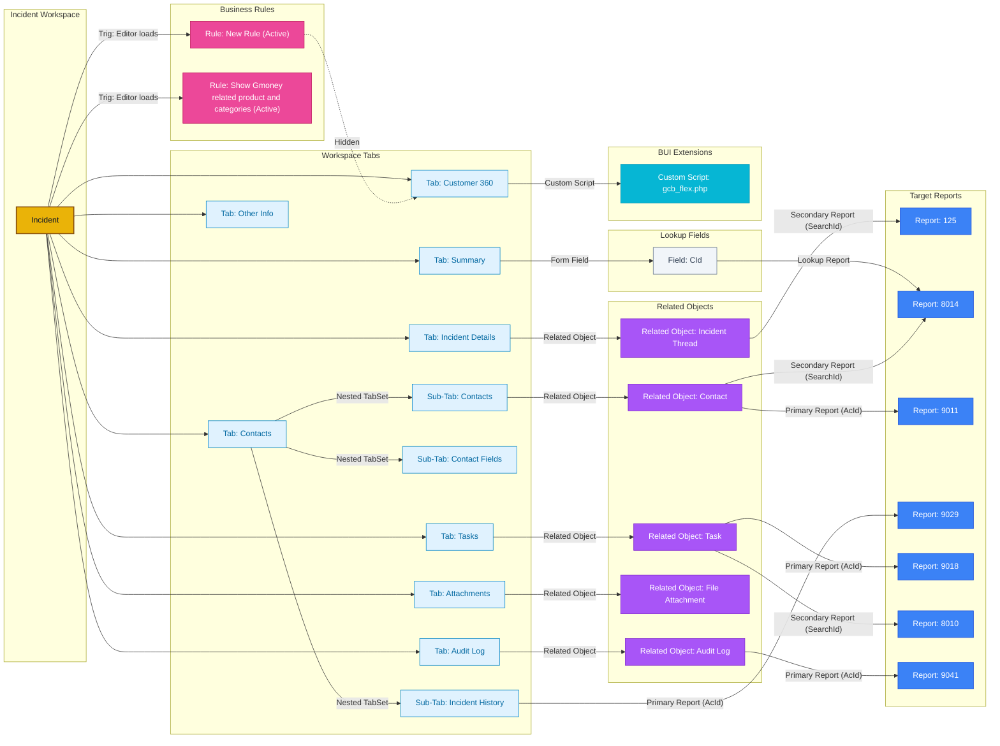

## System Info

- Platform: **Oracle Service Cloud 26A SP2** (Build 326, June 2026)
- Client Version: `26.2.0.326`
- Workspace Type: **Incident** (single record, not multi-edit)

---

## Layout Structure

The workspace layout is structured as a root **TabSet** containing 8 tabs.

---

## Layout & Tab Details

Below is the detailed content breakdown of each tab:

### Tab: Incident Details

> **Single Component Tab**

- **Control Type:** Related Object (`Incident Thread`)
  - **Secondary Report (SearchId):** `125`
  - **CanSendOnSave:** Enabled
  - **Default Customer Channel:** `Phone`

### Tab: Customer 360

> **Single Component Tab**

- **Control Type:** Embedded Browser
  - **Target URL:** `https://gcb.custhelp.com/cgi-bin/gcb.cfg/php/custom/gcb_flex.php?mobile=$contact.phmobile`

### Tab: Summary

> **Multi-Component Tab** — 11 controls across 1 types: 11 Form Fields

**1. Form Fields & Menus**

| Position (Row, Col) | Field / Control | Details |
|---|---|---|
| Row 0, Col 1 | Header: "Details" | Section TitleBar banner |
| Row 0, Col 2 | Header: "Contact Details" | Section TitleBar banner |
| Row 0, Col 3 | Header: "Categorization" | Section TitleBar banner |
| Row 1, Col 1 | `ProdId` | Product — *Required: OnNew (All Profiles), OnEdit (All Profiles)* |
| Row 1, Col 2 | `CId` | Form field (Lookup → Report **8014**) |
| Row 1, Col 3 | `Status.Id` | Status |
| Row 2, Col 1 | `Subject` | Incident Subject |
| Row 2, Col 2 | `ChanId` | Channel |
| Row 2, Col 3 | `CatId` | Category — *Required: OnNew (All Profiles), OnEdit (All Profiles)* |
| Row 3, Col 0 | `RefNo` | Form field |
| Row 3, Col 1 | `Assigned` | Assigned Agent/Group |
| Row 3, Col 2 | `PhOffice` | Relabeled as **"Mobile Phone"**, default type 1 |
| Row 3, Col 3 | `QueueId` | Queue |
| Row 4, Col 2 | `C$Gender` | Custom field — gender — *Required: OnNew (All Profiles), OnEdit (All Profiles)* |

### Tab: Contacts

> **Multi-Component Tab** — 5 controls across 1 types: 5 Form Fields

**1. Form Fields & Menus**

| Position (Row, Col) | Field / Control | Details |
|---|---|---|
| Row 0, Col 0 | Header: "Primary Contact Information" | Section TitleBar banner |
| Row 1, Col 0 | `Name.First` | First name |
| Row 1, Col 1 | `Name.Last` | Last name |
| Row 2, Col 0 | `Email` | Email address |
| Row 2, Col 1 | `Addr` | Address |
| Row 3, Col 0 | `PhOffice` | Office phone |

> **Nested TabSet** (Row 4, Col 0) — 3 Sub-Tabs: **Contacts**, **Contact Fields**, **Incident History**

#### Sub-Tab: Contacts

> **Single Component Tab**

- **Control Type:** Related Object (`Contact`)
  - **Primary Report (AcId):** `9011`
  - **Secondary Report (SearchId):** `8014`
  - **Behavior:** Skips execution on unsaved new records

#### Sub-Tab: Contact Fields

**Layout Grid Structure (Fields & Nested Controls):**

| Position (Row, Col) | Control Type | Control Name / Field | Target / Action Details |
|---|---|---|---|
| Row 0, Col 0 | Form Field | `Login` | Form field |
| Row 0, Col 1 | Form Field | `MaOptIn` | Form field |
| Row 0, Col 2 | Form Field | `State` | Form field |
| Row 1, Col 1 | Form Field | `MaMailType` | Form field |
| Row 1, Col 2 | Form Field | `Source` | Form field |

#### Sub-Tab: Incident History

> **Single Component Tab**

- **Control Type:** Direct Report
  - **Primary Report (AcId):** `9029`
  - **Behavior:** Skips execution on unsaved new records

### Tab: Other Info

> **Multi-Component Tab** — 5 controls across 1 types: 5 Form Fields

**1. Form Fields & Menus**

| Position (Row, Col) | Field / Control | Details |
|---|---|---|
| Row 0, Col 0 | `Spacer` | Visual layout spacing (26px height) |
| Row 1, Col 0 | `MailboxId` | Form field |
| Row 1, Col 1 | `InterfaceId` | Form field |
| Row 1, Col 2 | `SlaiId` | Form field |
| Row 2, Col 0 | `Source` | Form field |
| Row 2, Col 1 | `LangId` | Form field |

### Tab: Tasks

> **Single Component Tab**

- **Control Type:** Related Object (`Task`)
  - **Primary Report (AcId):** `9018`
  - **Secondary Report (SearchId):** `8010`
  - **Behavior:** Skips execution on unsaved new records

### Tab: Attachments

> **Single Component Tab**

- **Control Type:** Related Object (`File Attachment`)

### Tab: Audit Log

> **Single Component Tab**

- **Control Type:** Related Object (`Audit Log`)
  - **Primary Report (AcId):** `9041`
  - **Behavior:** Skips execution on unsaved new records

---
## Workspace Rules

### Event: Editor Initialized (On Load)

#### Rule: New Rule (Active)
- **Condition:** `Field: Contact.CtypeId == 3` (a specific contact type, likely "Email" or similar)
- **Then:**
  - Standard: Hidden Tab: **Customer 360** → True
  - Show a message box — *"This contact is created through email and may not hold sufficient information in the system"*

#### Rule: Show Gmoney related product and categories (Active)
- **Condition:** `Profile: Current LIST 7;8;2;6`
- **Then:**
  - Standard: ConfigureMenuItems Incident.ProdId (EQ u0;383)
  - Standard: ConfigureMenuItems Incident.CatId (EQ 384;385)

---

## Ribbon / Toolbar

Standard actions: Save, Save & Close, SaveAndSend, New, Refresh, Forward, Print, Copy, Delete, Spell Check, Propose, BestAnswer, Appointment, Info.

---

## Key Observations

- The **Customer 360** tab embeds an internal **custom PHP script**: `gcb_flex.php` (`/cgi-bin/gcb.cfg/php/custom/gcb_flex.php`) — passes URL params: `mobile`. Errors are suppressed.
- The workspace defines **2 active business rules** triggered by editor loading events, enforcing profile-based field locking and toolbar UI visibility.
- The **workspace flag indicator** is explicitly hidden (`Visible="False"`), suppressing visual cues for users/agents.

---

## Flow Diagram

