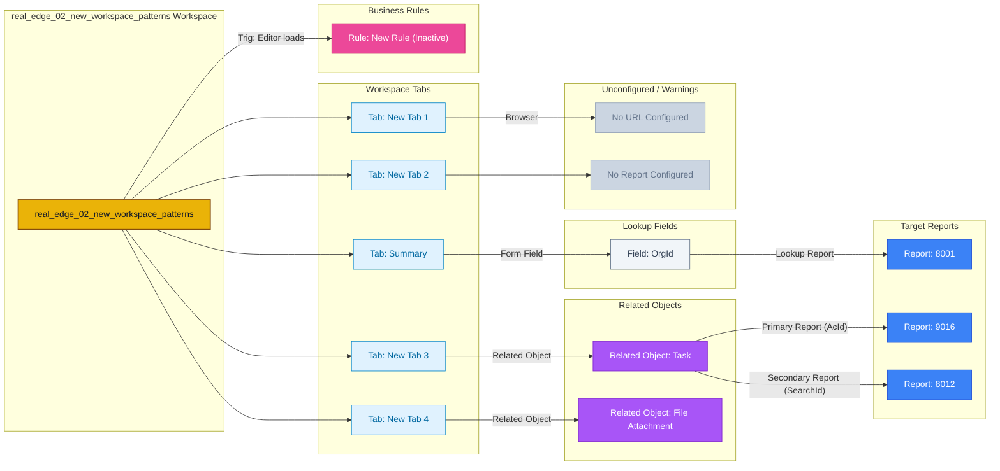

## System Info

- Platform: **Oracle Service Cloud 26A SP2** (Build 326, June 2026)
- Client Version: `26.2.0.326`
- Workspace Type: **Contact** (single record, not multi-edit)

---

## Layout Structure

The workspace layout is structured as a root **TabSet** containing 5 tabs.

---

## Layout & Tab Details

Below is the detailed content breakdown of each tab:

### Tab: Summary

> **Multi-Component Tab** — 7 controls across 2 types: 6 Form Fields, 1 Menu

**1. Form Fields & Menus**

| Position (Row, Col) | Field / Control | Details |
|---|---|---|
| Row 0, Col 0 | `C$AccountNumber` | Custom field — account number |
| Row 1, Col 0 | `PhOffice` | Office phone |
| Row 2, Col 0 | `Menu (639203177532626906)` | Dropdown options: **Menu Item #1**, **Menu Item #2**, **Menu Item #3**, **Anurag**, **Monish** |
| Row 3, Col 0 | `OrgId` | Account (Lookup → Report **8001**) |
| Row 4, Col 0 | `Addr` | Address |
| Row 5, Col 0 | `C$Gender` | Custom field — gender |
| Row 6, Col 0 | `Email` | Email address |

### Tab: New Tab 1

> **Single Component Tab**

- **Control Type:** Embedded Browser
  - **Target URL:** *(Unconfigured / No URL)*

### Tab: New Tab 2

> **Single Component Tab**

- **Control Type:** Direct Report
  - **Behavior:** Skips execution on unsaved new records

### Tab: New Tab 3

> **Single Component Tab**

- **Control Type:** Related Object (`Task`)
  - **Primary Report (AcId):** `9016`
  - **Secondary Report (SearchId):** `8012`
  - **Behavior:** Skips execution on unsaved new records

### Tab: New Tab 4

> **Single Component Tab**

- **Control Type:** Related Object (`File Attachment`)

---
## Workspace Rules

### Event: Editor Initialized (On Load)

#### Rule: New Rule (Inactive)
- **Condition:** `Field: Contact.CtypeId == 3` (a specific contact type, likely "Email" or similar)
- **Then:**
  - Show a message box — *"This contact is created through email and may not hold sufficient information in the system"*

---

## Ribbon / Toolbar

Standard actions: Save, Save & Close, New, Refresh, Appointment, Print, Copy, Delete, Reset Password, Spell Check, Info.

**Embedded Links:**
- [Oracle Service Cloud](http://cloud.oracle.com/service)

---

## Key Observations

- The inactive rule suggests there was a workflow for email-originated contacts that's either been deprecated or temporarily disabled.
- Layout tabset has **`CanReorderTabs="True"`** enabled, which allows agents to dynamically rearrange workspace tabs at runtime.

---

## Flow Diagram

